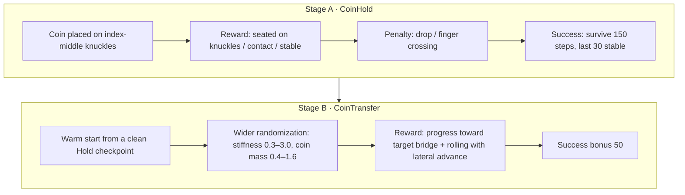

# ① From the Official URDF to a First Policy: the Isaac Lab Stack and the Coin Knuckle-Roll

> Part 1 of the series · [Overview](./index.md) · Next: [② First contact with the real hand SDK](./02-real-hand-sdk.md)

Two days before the hackathon we had no physical hand. The only useful thing to do was to build the simulation stack first, so that the moment the hand arrived the policy, the joint table and the export format would all be ready. This part is the post-mortem of those two days and a tutorial you can follow from zero. The task is the **coin knuckle-roll**: a coin lies flat on the back of the fingers and rolls from the index to the middle finger — an in-hand manipulation that looks cool and is small enough to finish.


---

## 0. What You Need

| Item | Our setup | Notes |
| --- | --- | --- |
| GPU | RTX 4080 Laptop, **12 GB** | 2048 parallel envs take about 4.5 GB; never run two training processes |
| OS | Ubuntu 22.04 | |
| Isaac Sim | 6.0.1 in `~/isaacsim-env` | ships its own Python 3.12 venv |
| Isaac Lab | v3.0.0-beta2.patch1 | cloned into `IsaacLab/` next to the repo, not vendored |
| RL | RSL-RL (`rsl-rl-lib` ≥ 5.0.1) | PPO |
| Hand model | [Rysen official URDF](https://github.com/RysenRobotics/apex-hand-urdf) (v0.2.0, BSD-3) | goes in `assets/apex-hand-urdf/` |
| Code | [peterpanstechland/apexhand](https://github.com/peterpanstechland/apexhand) | all paths in this article are relative to it |

The official URDF ships coordinate-frame drawings; every later discussion of "palm normal" and "finger direction" refers to them:


---

## 1. Environment: Isolate Python First

Isaac Sim's Kit is extremely sensitive to `libstdc++` and `PYTHONPATH`. This machine also has ROS Humble and conda, and the first Kit launch died with `GLIBCXX_3.4.30 not found`. The fix is an `env.sh` sourced once per terminal:

```bash
cd ~/Documents/apexhand
source env.sh
```

`env.sh` does four things:

1. scrubs the `PYTHONPATH` and `LD_LIBRARY_PATH` polluted by ROS / conda;
2. forces the system `libstdc++`;
3. activates `~/isaacsim-env`;
4. sets `ISAACLAB_PATH`, `PIP_CONSTRAINT=constraints.txt`, `PYTHONPATH=.../source`.

Then install this repository's extension **without** letting pip resolve dependencies:

```bash
pip install -e . --no-deps
```

`pyproject.toml` has an empty dependency list; everything for simulation and RL comes from the Isaac Sim / Isaac Lab environment. `constraints.txt` pins `torch==2.11.0+cu128`, `warp-lang==1.13.0` and friends. In Isaac Lab 3.0 beta, `packaging` fights between `isaacsim-core` and `isaaclab-rl`; keep the isaacsim side's version.

**Gate 1: Isaac Lab itself runs**

```bash
python IsaacLab/scripts/environments/list_envs.py | grep -iE "cartpole|allegro|repose"
python IsaacLab/scripts/reinforcement_learning/rsl_rl/train.py \
  --task Isaac-Cartpole-v0 --headless --max_iterations 20
python IsaacLab/scripts/reinforcement_learning/rsl_rl/train.py \
  --task Isaac-Repose-Cube-Allegro-v0 --headless --num_envs 1024 --max_iterations 20
```

If Allegro at 1024 envs OOMs, drop `num_envs` to 512 — this step also tells you how much VRAM headroom the machine has.

---

## 2. Assets: URDF → USD, and a Flag That Eats Your Fingertips

```bash
bash scripts/convert_apex_urdf.sh      # once per side -> assets/apex/usd/{right,left}/
python scripts/inspect_apex.py --headless
python scripts/generate_coin_stl.py    # PΛN coin, radius 16 mm, thickness 4 mm
```

**Hard rule: never pass `--merge-joints` to the URDF converter.** Merging fixed joints also merges away the `*_pad` and `*_tip` frames, and everything downstream — pad observations, fingertip positions, real-hand alignment — breaks. We did it once; the symptom was `inspect_apex.py` counting half the pads and tips.

**Gate 2: USD complete** — both sides must resolve 21 joints, 5 pads and 5 tips.

### 2.1 PhysX does not execute mimic joints

The Apex URDF binds its 5 passive joints (finger DIPs `*_j3`, thumb's last joint `thumb_j4`) 1:1 to source joints with `<mimic>`. Isaac Sim 6 writes that as `newton:mimic*` attributes, which **PhysX ignores**. Train straight from the conversion and those 5 joints are free joints: the fingertips go limp and droop.

Our fix is a custom action term, `ApexCoupledEMAAction` (`source/pan_dexterous_lab/tasks/coin_roll/mdp/actions.py`): the policy outputs 16 values; when applied, the term copies each source joint's target to its coupled joint and also writes the passive joint's position straight into the sim:

```python
def apply_actions(self):
    super().apply_actions()
    coupled_targets = self.processed_actions[:, self._src_slot]
    self._asset.set_joint_position_target_index(target=coupled_targets, joint_ids=self._cpl_ids_t)
    src_q = self._asset.data.joint_pos.torch[:, self._src_ids_t]
    self._asset.write_joint_position_to_sim_index(position=src_q, joint_ids=self._cpl_ids_t)
```

On the real hand those 5 joints are coupled by firmware and must **not** be commanded independently either — sim and hardware agree on this.

### 2.2 The action origin is the default pose, not the mid-range

Isaac Lab's stock `EMAJointPositionToLimitsAction` maps action=0 to the **midpoint** of every joint's range. For a dexterous hand that is a tight curl; the knuckle bridge comes out sloped and the coin rolls off the moment it is placed. We changed it to a bounded delta about the default pose:

```text
target = default_joint_pos + action * scale   →  EMA(α=0.6)  →  clamp to soft limits
```

Now the policy's initial zero-mean Gaussian output corresponds to the calibrated palm-down pose, the coin stays put, and training has somewhere to start.

**Gate 3: coupled actions**

```bash
python scripts/check_action.py --headless
```

It applies 0 / +1 / −1 across the action space and checks that the action has 16 dimensions and the 5 passive joints follow their sources 1:1 with near-zero error.

### 2.3 There is exactly one joint table

`source/pan_dexterous_lab/assets/joints.py` is the **single source of truth** for joint names. Policy output dimension `i` is always `ACTUATED_LOGICAL[i]`, the real-hand mapping goes through the same list, and a raw integer index is not allowed anywhere:

```python
ACTUATED_LOGICAL = [
    "thumb_j0", "thumb_j1", "thumb_j2", "thumb_j3",
    "index_j0", "index_j1", "index_j2",
    "middle_j0", "middle_j1", "middle_j2",
    "ring_j0", "ring_j1", "ring_j2",
    "pinky_j0", "pinky_j1", "pinky_j2",
]
COUPLED_LOGICAL        = ["thumb_j4", "index_j3", "middle_j3", "ring_j3", "pinky_j3"]
COUPLED_SOURCE_LOGICAL = ["thumb_j3", "index_j2", "middle_j2", "ring_j2", "pinky_j2"]
```

Part ② shows how the hardware side loads this same file by path.

---

## 3. Task Geometry: Palm Down, Coin on the Knuckles

Our first version had the task backwards: palm up, coin on the fingertip pads. One training run later we realised the reference move ([Coin knuckle roll](https://www.instructables.com/Coin-knuckle-roll/)) is **palm down, coin flipping over the knuckles**. The corrected geometry (`assets/apex_cfg.py`):

- palm-down root quaternion `(0.7071068, 0.0, -0.7071068, 0.0)` — Isaac Lab 3.0 quaternions are **(x, y, z, w)**, do not read them as wxyz;
- coin seat: midpoint of knuckle `link1` / `link2` plus a **world +Z** offset of 13 mm (a body-local offset drifts into the finger gap);
- `enabled_self_collisions=False`: the Apex's tactile shells already overlap at the zero pose; with self-collision on, PhysX diverges outright;
- so finger crossing has to be prevented some other way: the abduction joints `*_j0` get an action scale clamped to **0.04**, plus a `finger_crossing` penalty (weight −20).


---

## 4. Curriculum: Stage A Holds, Stage B Transfers



Gym ids: `PAN-CoinHold-Apex-v0` / `PAN-CoinTransfer-Apex-v0`, each with a `-Play-v0` variant (few envs, noise off, no timeout).

### 4.1 Observations and actions

| Term | Meaning |
| --- | --- |
| `joint_pos` / `joint_vel` | 16 actuated joints, limit-normalised |
| `object_*` | coin pose and linear / angular velocity |
| `fingertip_pos` | fingertip world positions |
| `coin_to_knuckle` | coin relative to the knuckle contact point |
| `last_action` | previous action |

Gaussian noise is added during training (`enable_corruption=True`) and off in Play. The action space is `[-1, 1]^16` through the default-pose offset and EMA above. PPO: actor and critic are `[512, 256, 128]` + ELU, `num_steps_per_env=24`, adaptive learning rate, `entropy_coef=0.002`.

### 4.2 Domain randomization

| Randomised | Stage A | Stage B |
| --- | --- | --- |
| Hand friction | 0.7–1.3 | same |
| Hand mass scale | 0.95–1.05 | same |
| Joint stiffness / damping | 0.8–1.25 | **stiffness 0.3–3.0** |
| Coin friction | 0.55–0.90 | same |
| Coin mass scale | 0.85–1.15 | **0.4–1.6** |

Episodes: Hold about 3 s, Transfer about 5 s. Control runs at `dt=1/240`, `decimation=4` → **60 Hz**, the same rate the real-hand playback uses later.

### 4.3 Two Stage A pitfalls

1. **Success stuck at 0.** The original success criterion could never fire. It became "survive ≥150 control steps and stay stable for the last 30", with a standalone evaluation script `scripts/eval_hold.py`.
2. **Finger crossing.** With self-collision off, the policy's first instinct was to push two fingers through each other to pinch the coin — high score, cheating motion. That is where the abduction clamp and `finger_crossing` came from.


Commands:

```bash
python scripts/train.py --task PAN-CoinHold-Apex-v0 --headless \
  --num_envs 2048 --max_iterations 1500 --seed 42
python scripts/eval_hold.py --num_envs 64 --episodes 2 \
  --checkpoint logs/rsl_rl/pan_coin_hold/2026-09-04_04-20-40/model_100.pt
```

Result: offline eval success **100%**. Interestingly the checkpoint we warm-started from is `model_100`, not the fully trained `model_1499` — the latter still succeeds, but its action std has climbed and the finger gap keeps tightening, so it is a dirtier starting point. **Training longer is not the same as more usable.**

### 4.4 Stage B: one round hacked, one round rebalanced

The first transfer run had `success≈0`. Playback showed the policy **spinning the coin in place** to farm reward. The cause was clear: `hold_ok≈0.95` paid every step, and an uncapped `roll_rotation≈6` on top crushed the `progress` term — the policy could score highly without ever moving the coin.

The rebalanced `TransferRewardsCfg` (`coin_roll_env_cfg.py` + `mdp/rewards.py`):

| Term | Old | New | Why |
| --- | --- | --- | --- |
| `hold_ok` | positive per step | **0** | holding is a prerequisite, not the goal |
| `progress` | small | **8** | forward Δφ plus a dense term toward target phase ≈0.55 |
| `roll_rotation` | uncapped | **0.5**, ω capped and **only paid with lateral advance** | closes the spin-in-place exploit |
| `slip` | — | −2 | |
| `success` | — | 50 | |
| Seat distance | single bridge | `coin_bridge_distance`: min over index-middle / middle-ring bridges | |

```bash
python scripts/train.py --task PAN-CoinTransfer-Apex-v0 --headless \
  --num_envs 2048 --max_iterations 2000 --seed 42 --resume \
  --checkpoint /ABS/PATH/pan_coin_hold/2026-09-04_04-20-40/model_100.pt
```

Resuming needs an **absolute path** plus `--resume`; rsl_rl adds `max_iterations` on top of the checkpoint's recorded iteration. Three resumed segments (`rebalance_v2` → `_cont` → `_fin`) reached `model_2099`.

**Offline evaluation** (`scripts/eval_transfer.py`, 128 envs × 4 episodes = 512):

| Metric | Value |
| --- | --- |
| transfer_success | **61.5%** (315/512); gate >50% passed |
| phase_at_success | mean 0.544 (p10 0.521 / p90 0.572) |
| drop | 0.4% (2/512) |
| minimum finger gap | 0.4 mm (squeeze risk) |
| max abduction | 0.44 rad |

<video controls width="100%" preload="metadata" poster="/img/hackathons/2026/apex-hand/sim-coin-transfer-15s-poster.jpg" style={{maxWidth: '720px', display: 'block', margin: '1.5rem auto'}}>
  <source src="/video/hackathons/2026/apex-hand/sim-coin-transfer-15s.mp4" type="video/mp4" />
</video>

*15-second playback of `model_2099`. The finger motion is a bit large and the gap occasionally tightens, but the coin really does travel over the knuckles from the index to the middle finger.*

---

## 5. Playback, Evaluation, Export

Log layout:

```text
logs/rsl_rl/<experiment_name>/<YYYY-MM-DD_HH-MM-SS>[_run_name]/
├── model_*.pt
├── params/            # env.yaml / agent.yaml: the full config at the time
├── videos/{train,play}/
└── exported/          # policy.onnx / policy.pt / joint_map.json
```

```bash
# playback with video (5 s ≈ 300 steps, 15 s ≈ 900 steps)
python scripts/play.py --task PAN-CoinTransfer-Apex-Play-v0 --num_envs 1 \
  --checkpoint /ABS/PATH/model_2099.pt --video --video_length 900 --headless

# export for the real hand
python scripts/export_onnx.py --task PAN-CoinTransfer-Apex-v0 --headless \
  --checkpoint /ABS/PATH/model_2099.pt
```

`export_onnx.py` produces two things: `policy.onnx`, and `joint_map.json` — task name, checkpoint, **the order of the 16 actuated joints**, coupling, action scale, EMA α, the 60 Hz annotation, and later the **term-by-term observation layout**. **Never reorder the indices in joint_map after the fact.** This file is the foundation of all the sim-to-real work in part ⑤.

On a machine where `DISPLAY` is usually empty, `--video --headless` is enough; with a desktop, `--viz kit` needs `pip install --no-deps -e IsaacLab/source/isaaclab_visualizers` first or it fails with `visualizer(s) ['kit'] could not be configured`.

---

## 6. For People Who Do Not Know RL: the WebUI

Not everyone on a hackathon team has read PPO. We built a local web page exposing 200-plus parameters together with "what happens if you raise / lower it, and what a beginner should do":

```bash
source env.sh
python -m webui        # http://127.0.0.1:8090  the front page is the launcher, /console the training console
```


What the console does:

1. On the left, pick the task, physics engine (PhysX / Newton), hand pose, object preset (`pan_coin_32mm`, `baoding_38/45/50mm`, `cube_60mm`, …) and cameras;
2. **Parameter check-up**: red is a hard error (e.g. minibatch does not divide), yellow is "you may not have noticed";
3. **Scene preview** spawns for a few steps and writes a `scene.png`; **Play with the hand** opens a single-env interactive sim where sliders move joints;
4. **Reward probe** runs 100 random-action steps and lists each term's mean / variance / whether it is dead — the hacked Stage B reward shows up instantly as a wrong order of magnitude on `roll_rotation`;
5. **Natural-language reward**: plug in any OpenAI-compatible API, describe the behaviour in plain language → it generates `user_rewards.py` → static checks → a 1-env headless self-test → you approve before it is written, default weight 0;
6. Recipes live in `configs/recipes/*.yaml`; a Hold run that ends cleanly can chain into Transfer with `--resume` automatically.

**Only one job at a time** — the real hand, the camera and the 12 GB of VRAM are all mutually exclusive, and the launcher refuses a second "start".

---

## 7. Pitfall List

1. Hold success stuck at 0 → criterion "survive ≥150 steps + last 30 stable".
2. action=0 mapped to mid-range → offset from `default_joint_pos`.
3. Finger crossing with self-collision necessarily off → abduction clamp 0.04 + `finger_crossing` −20.
4. Coin spawning inside geometry / flying off → `max_depenetration_velocity=1.0`, `reset_coin_on_knuckles`, joint jitter 0.05.
5. Body-local seat offset drifts into the finger gap → use world +Z.
6. Resume needs an absolute `--checkpoint` plus `--resume`.
7. Never run two `train.py` on 12 GB (we launched two by mistake; both crawled as if hung).
8. `--merge-joints` eats pads and tips.
9. Isaac Lab 3.0 quaternions are `(x, y, z, w)`.
10. `scripts/train.py` must not import `pan_dexterous_lab...mdp` at module level (it pulls USD up before Kit → `free(): invalid pointer`); import inside functions, and AppLauncher must come before the Hydra env registration.

## 8. File Map

| Module | Path |
| --- | --- |
| Hand / coin assets | `source/pan_dexterous_lab/assets/apex_cfg.py`, `joints.py`, `token_cfg.py` |
| Environment and reward weights | `source/pan_dexterous_lab/tasks/coin_roll/coin_roll_env_cfg.py` |
| MDP (observations / rewards / events / actions) | `source/pan_dexterous_lab/tasks/coin_roll/mdp/` |
| PPO config | `.../config/apex_hand/agents/rsl_rl_ppo_cfg.py` |
| Train / play / eval / export | `scripts/train.py`, `play.py`, `eval_hold.py`, `eval_transfer.py`, `export_onnx.py` |
| Self-checks | `scripts/check_action.py`, `inspect_apex.py` |
| WebUI | `webui/` |

Next: [② First contact with the real hand SDK](./02-real-hand-sdk.md) — the hand is here, and the first job is not to make it move but to make it not move.
