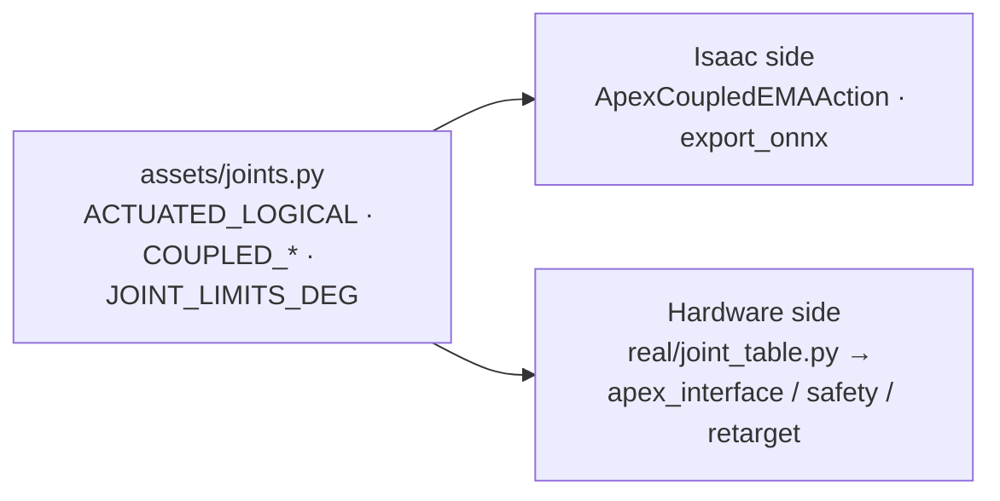

# ② The Hand Is Here — First, Make It Not Move: SDK First Contact and the Safety Layer

> Part 2 of the series · [Previous ①](./01-isaac-lab-sim-stack.md) · [Overview](./index.md) · Next: [③ Webcam teleoperation and Kapandji](./03-teleop-kapandji.md)

September 5, 13:39: the physical hand goes on Ethernet. 15:01: it is following the human hand in the webcam. The 80 minutes in between are this article — how to connect, how to isolate the environment, and which layers of insurance to wrap around the hand before letting it move. The unit is a **left hand**, firmware 3.2.5, SDK 1.5.2.


---

## 0. What You Need

- An Apex Hand, an Ethernet cable, a gigabit port (forget Wi-Fi; RTT must stay ≤5 ms).
- Ubuntu 22.04 with Python **3.10** (the official SDK's `.so` is built for 3.10; the Isaac side is 3.12, and the two must not mix).
- The official SDK source: [RysenRobotics/Rysen_SDK](https://github.com/RysenRobotics/Rysen_SDK), kept in `third_party/Rysen_SDK/` (not committed). Official docs: [Apex Hand getting started](https://docs.rysenbot.com/apex-hand/get-started).
- Rysen also ships [Rysen Explorer](https://github.com/RysenRobotics/rysen-explorer) (a Docker-packaged ROS2 backend plus web front end). If you only want to see the hand move, use that; we needed to attach policies, so we went straight to the Python SDK.

---

## 1. Subnet and IP

The factory default lives on `192.168.0.x`:

| | Address | TCP |
| --- | --- | --- |
| Factory · right hand | `192.168.0.103` | 5856 / 5857 |
| Factory · left hand | `192.168.0.102` | same |
| **Our left hand (changed)** | `192.168.88.200` | same |

The fastest way to reach a factory-fresh hand for the first time is to add a temporary alias to the wired NIC, without touching system network settings:

```bash
sudo ip addr add 192.168.0.50/24 dev enp109s0
ping -c 2 192.168.0.102
```

Ours arrived at `192.168.0.2`, which did not match the venue subnet. The SDK has an API to change the device IP; we pinned it to `192.168.88.200` on the local subnet. Every script then reads the `APEX_HAND_IP` environment variable by default, with `--ip` as the override.

---

## 2. A Completely Separate venv

```bash
cd ~/Documents/apexhand
source env_real.sh          # NOT env.sh
```

`env_real.sh` does only three things: activates `.venv-apex-real/` (Python 3.10), prepends `third_party/Rysen_SDK/rysen_sdk/lib/x86_64` to `LD_LIBRARY_PATH`, and sets `APEX_HAND_IP`.

Two rules:

- **never** `pip install rysen-sdk` inside `isaacsim-env`;
- **never** install anything Isaac inside `.venv-apex-real`.

The system-level dependencies spdlog / fmt / boost were already on our machine, so `import rysen_apexhand_sdk` just worked; if a library is missing, run the vendor's `install_rysen_deps.sh`.

---

## 3. Read-Only Smoke Test: Connect, Read Joints, Move Nothing

```bash
python scripts/real_sdk_smoke.py        # IP defaults to APEX_HAND_IP
```

In order it does: `ping` → probe TCP 5856 / 5857 → `Rysen().connect(ip, ETHERNET)` → read `get_joint_states()` five times → disconnect. **By default it produces no motion at all**; moving anything requires an explicit `--wiggle --i-know-what-im-doing`, and even that branch in v1 only points you to the vendor's `example.py`.

You should see:

```text
=== network ===
ping 192.168.88.200: OK
tcp 192.168.88.200:5856: OK
tcp 192.168.88.200:5857: OK
=== connect ===
CONNECT_OK
=== read joints ===
[0] JointStates(...)
```

`sdk.get_hand_dir()` tells you whether this is a left or a right hand — every later script uses it to pick `--side` automatically instead of relying on someone's memory.

---

## 4. One Joint Table Shared With the Simulator

Part ① established `source/pan_dexterous_lab/assets/joints.py` as the single source of truth for joint names. The hardware venv cannot install the Isaac package, so `real/joint_table.py` loads that one `joints.py` **by file path** instead of copying it:



Policy output dimension `i` is therefore the same joint in simulation and on hardware, forever. The day a second joint ordering appears is the day something quietly misaligns — part ⑤ tells the story of one such incident.

`real/apex_interface.py` is a thin wrapper:

| Method | What it does |
| --- | --- |
| `connect()` | connects, reads `get_hand_dir()` and remembers the side |
| `configure_motion(max_speed, max_accel, finger_torque_pct)` | speed and acceleration caps for 21 joints, torque cap (percent) for 5 fingers |
| `enable()` / `disable()` | power all fingers on / off |
| `get_actuated_pv()` | position / velocity / torque of the 16 actuated joints in `ACTUATED_LOGICAL` order |
| `get_finger_currents()` | maximum motor current (A) per finger |
| `set_joint_positions(q16)` | sends position targets; **coupled joints are copied 1:1 here**, never commanded on their own |

---

## 5. The Safety Layer: `real/safety.py`

Every target from a policy or from teleoperation passes through `SafetyFilter` before the SDK. It does four things.

### 5.1 Limits with a margin

The firmware's internal cap for 100° is **1.7453 rad**, and `deg2rad(100)` evaluates to 1.74533…, which is **larger** — an instant out-of-range fault. Every limit keeps a 1 mrad margin.

### 5.2 The firmware envelope is smaller than the URDF

The URDF gives `thumb_j1` an upper limit of 60° (1.047 rad); firmware 3.2.5 **rejects it around 0.66 rad**. Worse: **one joint out of range drops the whole 21-joint packet**, so the hand looks like it "randomly freezes". The send path therefore uses the firmware envelope (`thumb_j1` ≤ 0.60 rad) while IK still reads the URDF limits; when `set_joint_positions` gets `OUT_OF_RANGE` it pulls every command 2° toward zero and sends once more, so the other fifteen joints keep moving.

### 5.3 Per-tick Δq cap

Teleoperation defaults to `--max-step 0.10 rad`; policy playback has its own `--gain`. Vision runs ahead of the motors every frame; without the cap the fingers chase the target at full motor speed — jittery, loud and hot.

### 5.4 Current relief, not a freeze

This unit has no tactile array; "I hit something" can only be inferred from each finger's motor current. Two lessons:

- The reported current gets stuck at a **449–453 mA** fake full-scale rail; unfiltered, the safety layer would believe a finger is in permanent collision — `get_finger_currents()` simply drops the 440–460 mA band.
- Do not "freeze" a finger on contact (fine for policy playback, wrong for teleoperation — the operator just sees a stuck finger). Instead, **current relief**: above a finger's contact threshold, its flex joints open by up to `backoff_rad` (default 0.04) in proportion to how far over threshold the current is, and close again as it drops; fast attack (0.35), slow release (0.08) so a borderline contact cannot chatter on the ball. Abduction is excluded — it sweeps, it does not squeeze.
- But **a deliberate pinch and a collision have identical current signatures**. The fix is for the layer above to feed forward "how much I intend to pinch right now" and exempt the thumb and index while pinching — current alone cannot tell them apart; part ③ covers it.

---

## 6. Making It Move for the First Time: Teleoperation and No-Load Playback

```bash
# webcam teleoperation (motors only enabled after Space, Esc quits) — see part ③
python scripts/landmark_teleop.py --side left

# no-load ONNX policy playback: it WILL move; clear the surroundings and start with a small gain
python -m real.policy_runner --gain 0.30 --seconds 12
```

`policy_runner` runs the ONNX policy at 60 Hz with the safety layer in the loop the whole time. What we saw on the first no-load run was "the hand twitches slightly and barely moves" — not a sim-to-real gap but a misaligned observation vector; that story is in part ⑤.

The teleoperation on the afternoon of September 5 ran **19 minutes** continuously from 15:01 without a drop, which is why we dared to put it on the booth the next day.


---

## 7. Day-One Safety Checklist

1. E-stop within reach; the `SafetyFilter` fault → open-hand branch is wired.
2. Check every dimension against the SDK joint names using `joint_map.json` (part ⑤).
3. Sweep each joint open-loop with a small sinusoid to confirm direction and limits — on our first run "open" and "fist" were reversed.
4. No load → light load → object.
5. Watch currents; stop immediately on any motion that looks like interpenetration.
6. Start `configure_motion` conservative: `--torque-pct 30`, `--max-speed 3.5 rad/s`, `--max-accel 40`.

## 8. Acceptance Checklist (Our Actual State)

- [x] Cable in, `ping` OK
- [x] TCP 5856 / 5857 probe OK
- [x] `CONNECT_OK` and joint state printing
- [x] Webcam teleoperation driving the real hand (19 minutes continuous)
- [x] ONNX policy no-load playback (60 Hz, safety layer in the loop)
- [ ] Palm calibration + closed loop with balls (part ⑤)

## 9. File Map

| File | Responsibility |
| --- | --- |
| `env_real.sh` | hardware venv entry point |
| `scripts/real_sdk_smoke.py` | read-only smoke test |
| `real/joint_table.py` | loads `assets/joints.py` by path |
| `real/apex_interface.py` | SDK wrapper, coupled joints copied 1:1 |
| `real/safety.py` | limit margins, firmware envelope, Δq cap, current relief |
| `real/policy_runner.py` | ONNX playback loop |
| `docs/REAL_SDK.zh.md` | bench notes for this machine |

Next: [③ Track 1: webcam teleoperation and Kapandji](./03-teleop-kapandji.md).
