# ③ Track 1: Teleoperating a Dexterous Hand With One Webcam — and Passing a Clinical Thumb Test

> Part 3 of the series · [Previous ②](./02-real-hand-sdk.md) · [Overview](./index.md) · Next: [④ Baoding balls in RL simulation](./04-baoding-rl-sim.md)

Track 1's brief: capture a human hand with a camera and teleoperate the dexterous hand, with motions that cover a **clinical hand examination**, under a **response-speed** requirement. We made "clinical examination" concrete as the **Kapandji thumb opposition test** — the 0–10 scale clinicians use for thumb function: the thumb tip touches, in order, the side of the index proximal phalanx, the side of its middle phalanx, the index tip, middle tip, ring tip, pinky tip, then walks down the pinky over the DIP crease, PIP crease and MCP crease, and finally reaches the distal palmar crease. Full marks come from **running the opposition axis all the way**, not from pinching hard.

The organisers' **Track 1 reference** looks like this: RGB-D hand tracking on a monitor, a human hand in front of the camera, and an Apex hand following finger-by-finger. That is the bar we were shooting for; our stack is MediaPipe (optionally fused with D435 depth) → DexPilot IK → Kapandji HUD, not their closed-source UI.

<video controls width="100%" preload="metadata" poster="/img/hackathons/2026/apex-hand/official-teleop-reference-poster.jpg" style={{maxWidth: '720px', display: 'block', margin: '1.5rem auto'}}>
  <source src="/video/hackathons/2026/apex-hand/official-teleop-reference.mp4" type="video/mp4" />
</video>

*Official Track 1 reference (organiser-provided): skeleton overlay on the operator hand, Apex hand mirroring on the desk.*


---

## 0. Camera Choices: What We Tried

| Camera | Connection | How we used it | Verdict |
| --- | --- | --- | --- |
| **Logitech C920** | USB, clipped to the laptop lid | The workhorse. Pointed at the operator's hand for MediaPipe; 33–39 fps on the HUD | RGB is enough when the palm faces the camera in normal light. Cheap, easy to place |
| Laptop built-in webcam | Built-in UVC | Pointed at the operator when the C920 was busy looking down at the robot (part ⑤) | Works; image quality and angle worse than the C920. The script prefers an external camera; pass `--camera N` to pick it |
| **RealSense D435** | USB 3 | `--realsense`: colour aligned with depth; measured z replaces MediaPipe's relative depth | Noticeably steadier for thumb opposition and mutually occluding fingertips. Must be on USB 3 (blue port / Type-C), never on the same hub as the T265; one oversize stream start wedges it until a hardware reset |
| RealSense T265 | USB | Wanted it as a second viewpoint | It is a tracking camera (dual fisheye + IMU) with **no colour + depth**, and its librealsense version conflicts with the D435's. Never entered the loop |
| Insta360 X5 | On top of the chassis | The 360° crowd-pulling camera on the cocktail machine; rock-paper-scissors was planned | Never entered the teleoperation chain |

The conclusion up front: **RGB hand tracking does not need a depth camera**. MediaPipe's `world_landmarks` already give a 3D structure relative to the palm frame that is good enough; a depth camera helps with two things — "thumb Z / opposition / abduction" and drift when the hand is sideways to the camera.

`discover_camera()` uses `v4l2-ctl --list-devices`, skips built-in nodes whose names contain `USB2.0 HD UVC`, `Integrated` or `IR Camera`, and prefers an external USB camera. When another process holds the C920 it fails silently — that is what happened on our first run; check `fuser /dev/video*` and kill the holder.

---

## 1. Five Ways to Run It

```bash
source env_real.sh
python scripts/landmark_teleop.py --side left                 # real hand (motors enabled only after Space, Esc quits)
python scripts/landmark_teleop.py --dry-run                   # camera only, watch the HUD
python scripts/landmark_teleop.py --sim --side left           # drive the hand in the Isaac sandbox, no motors
python scripts/landmark_teleop.py --realsense --side left     # D435 depth replaces MediaPipe z
python scripts/landmark_teleop.py --side left --calib configs/palm_calib.json --record logs/gait/demo.npz
```

`--sim` needs a second terminal running the Isaac sandbox (note: `env.sh`, not `env_real.sh`):

```bash
source env.sh
python scripts/sandbox_hand.py --task PAN-BaodingRotate-Apex-Left-Play-v0 --hand-pose palm_up_cradle
```

This is what the first HUD looked like at the booth at 14:16 on September 5 (still a green skeleton, no Kapandji score yet):


The two processes exchange target and measured angles through files under `logs/webui/sandbox/`. On the night of September 5 the organisers took the hand back, and this mode is how we spent the whole night on the thumb mapping.


How to read the HUD:

| Field | Meaning |
| --- | --- |
| `ARMED` / `SAFE` | motors enabled or not; Space toggles |
| `robot=left` / `dry-run` / `sim` | which real hand / not connected / sandbox |
| `fps` | actual rate of the whole chain (target `--hz 45`) |
| `Right 0.98` | MediaPipe handedness and confidence; below `--min-score 0.65` the last pose is held |
| `Kapandji=9` | current opposition score |
| `pinch=0.00` | thumb-tip to index-tip pinch amount 0–1, fed forward to the safety layer |
| `SENT` / `HOLD` | whether this frame was sent |
| `CAL37%` | bone-length calibration progress (first 90 frames, about 3 s) |
| `depth=17/21` | how many landmarks got a measured depth from the D435 |
| `t:0.23A i:0.04A …` | per-finger motor current; `CONTACT thumb` means that finger is in current relief |
| `t0:+28 t1:+13 …` | the 16 actuated joint targets in degrees; t=thumb, i=index, m=middle, r=ring, p=pinky |

---

## 2. The Pipeline

```mermaid
flowchart LR
  Cam["Camera frame<br/>C920 / built-in / D435"] --> MP["MediaPipe Hands<br/>image landmarks + world landmarks"]
  MP --> Fuse["fuse()<br/>picture plane from the image head, depth from both<br/>(measured z when a D435 is present)"]
  Fuse --> Euro["1€ filter<br/>min_cutoff 1.2 Hz, beta 10"]
  Euro --> Rebuild["Rebuild at the operator's bone lengths<br/>90-frame median"]
  Rebuild --> Chir["Chirality canonicalised<br/>side × forward points at the palm"]
  Chir --> Seed["retarget.py<br/>analytic seed: finger abd/heading/fold, thumb j0-j3"]
  Seed --> IK["apex_fk.ik_hand<br/>DexPilot vector matching + analytic Jacobian<br/>10 Kapandji sites"]
  IK --> EMA["EMA 0.28 + 0.5° deadzone"]
  EMA --> SF["SafetyFilter<br/>limits / Δq 0.10 rad / current relief / pinch exemption"]
  SF --> SDK["SDK move_j_position_follow<br/>coupled joints copied 1:1"]
```



### 2.1 MediaPipe has two outputs, each with its own flaws

- **image landmarks**: sharp in the picture plane, but each axis is normalised separately and depth is only a loose relative value.
- **world landmarks**: metric 3D, and they do resolve finger curl, but their in-plane placement is a regression with a strong shape prior — a straight thumb's IP reads about 30° bent, a real thumb–index pinch never closes below 0.17 palm widths, and bone lengths swing 20–30% from frame to frame.

`HandModel` (`tracking/hand_model.py`) turns the two into one trustworthy skeleton:

1. **Fuse**: in-plane coordinates from the image head (multiplied by the frame aspect to get one unit, then least-squares scaled onto the world head's picture plane); depth is the mean of both heads — and depth **must not be mixed per digit**, because the two heads disagree on offset, and a thumb on one scale and fingers on the other would never know when they touch. With a D435, measured metric points replace MediaPipe's guess, and the landmarks the depth camera missed keep MediaPipe's direction in the same metres.
2. **1€ filter**: cutoff = `min_cutoff + beta × |speed|`. A pinching fingertip moves at 0.3–0.5 m/s, so `beta` has to be of order ten for the filter to open up during motion; the 0.04 that suited normalised image coordinates became, in metres, a fixed 1.2 Hz low-pass that reached a closed pinch seven frames late.
3. **Rebuild at calibrated bone lengths**: the first 90 frames (about 3 s) take the median length of every bone as this operator's; afterwards every frame keeps the measured directions and replaces the lengths. **Filtering must come before the rebuild** — the other way round destroys the length constraint just established.
4. **Canonicalise chirality**: make `side × forward` always point at the palm. Whether the operator raises the left or the right hand, either drives this left robot hand with no handedness switch beyond `--mirror`.

Before all of that, `world_ok()` rejects collapsed or occluded skeletons (palm width outside 2–20 cm, finger length outside 0.25–2.2 palm widths); bad frames hold the previous pose, and only 12 consecutive misses reset the filter.

### 2.2 Why joint-angle-to-joint-angle mapping cannot do Kapandji

The most direct retarget measures each joint angle of the human hand and writes it to the matching robot joint. For the four fingers that mostly works (open, fist, scissors, one finger up all line up). **Not for the thumb.** The Apex thumb has four actuated joints:

| Joint | Meaning | Range | Human counterpart |
| --- | --- | --- | --- |
| `thumb_j0` | opposition | 0–90° | CMC opposition |
| `thumb_j1` | abduction | −10–60° (firmware really allows about ≤34°) | CMC abduction |
| `thumb_j2` | proximal flexion | 0–80° | MCP flexion |
| `thumb_j3` | distal flexion | −20–80° (`j4` follows 1:1) | IP flexion |

The open robot thumb sits 14 cm sideways in the palm; reaching the pinky's MCP needs opposition, a roll of the fold plane and almost all of `j2` together. A human thumb laid across the palm is nearly **straight** — copy its hinge angles and the robot tip ends up 15 cm in front of the pad. Kapandji scores 6–10 all live in that region, so angle mapping gives the thumb "some motion" but never "the motion your hand is making".

### 2.3 DexPilot vector matching with ten Kapandji sites

`tracking/apex_fk.py` follows DexPilot (Handa et al., ICRA 2020): instead of matching angles, match **site-to-site vectors in the palm frame**, and when the operator brings two sites together, project that pair onto contact. DexPilot's sites are four fingertips; we replaced the opposition set with the **ten Kapandji sites** — six of which are not fingertips but phalanx sides and palmar creases, each needing its own landmark combination (`hand_model.KAPANDJI_SITES`):

| Score | Site | MediaPipe landmark combination |
| --- | --- | --- |
| 1 | side of index proximal phalanx | 0.5·(5) + 0.5·(6) |
| 2 | side of index middle phalanx | 0.5·(6) + 0.5·(7) |
| 3 | index tip | 8 |
| 4 | middle tip | 12 |
| 5 | ring tip | 16 |
| 6 | pinky tip | 20 |
| 7 | pinky DIP crease | 19 |
| 8 | pinky PIP crease | 18 |
| 9 | pinky MCP crease | 17 |
| 10 | distal palmar crease | 0.30·(5) + 0.45·(17) + 0.25·(0) |

"Touching" means the thumb tip's **in-plane** distance to the site is ≤ 0.25 palm widths (about 1.5 cm) — which is how a clinician judges it, and it makes a frontal camera reading a thumb already on the palm as slightly in front of it harmless. `kapandji_score()` returns the **highest** site reached, not the nearest.

The IK uses an **analytic Jacobian**: every joint is revolute, so a column is simply `axis × (point − origin)`. One FK pass per iteration instead of seventeen finite-difference passes — and it stays correct when a joint sits on a limit, where a clipped probe step would otherwise produce a dead column. This is one of the main sources of the "response speed": the whole chain holds 33–39 fps on the C920.

### 2.4 Analytic seed, IK finish

`retarget.py` first computes a good initial guess from geometry:

- Fingers: abduction = yaw of the proximal bone in the palm plane relative to that finger's rest direction; heading = angle between the proximal bone and forward; fold = 0.65 × PIP fold + 0.35 × DIP fold (`_DIP_BLEND`), because the robot's `j3` follows `j2`, and splitting the human's two joints across the one actuated joint tracks the fingertip heading better.
- Thumb: solve from **where the thumb tip sits in the palm frame** — `j0` (out of the palm / ulnar), `j2` (how far the tip has left the radial rest toward the finger row), `j1` (how far the fold plane has rolled toward the pinky), and `j3 = max(hinge, 0.45·j2)` to keep a reachable IP once `j2` is up.

`ik_hand()` then solves the DexPilot objective around that seed, and the result is clipped to `JOINT_LIMITS_DEG`. Earlier revisions flattened the hand to the image plane and reconstructed the missing depth with tuned "angle floors" (magic numbers like 42°, 52°, 58°); with real 3D all of those are gone — keeping them would only fight the observation.

---

## 3. Keeping the Fingers From Fighting: How the Safety Layer Serves Teleoperation

One MediaPipe jitter and the index and middle `j0` can cross in the palm plane. The simulator has a `finger_crossing` penalty and a 0.04 abduction scale, but those are for the policy; teleoperation has neither. We use four layers:

| Layer | What it does | What the operator sees |
| --- | --- | --- |
| Command side | adjacent `j0` differences may not let the phalanges cross in the palm plane; if they would, only abduction is clamped, flexion still follows | almost invisible; scissors and fist still work |
| Hardware cap | `--torque-pct 30`: on a crossing, abduction cannot push through and nothing gets wrung | holds, does not spring back |
| Current relief | a finger over its current threshold opens its flex joints by up to 0.04 rad, closing again as current drops | the finger "gives" on contact instead of jamming |
| Pinch exemption | `pinch` is fed forward to `SafetyFilter`; during a deliberate pinch the thumb and index do not trigger relief | the pinch holds instead of letting go the moment it grips |

The last one is mandatory: a deliberate thumb–index pinch has **exactly** the current signature of hitting an obstacle; current cannot tell them apart, only the layer above can say "this one is on purpose". Without a tactile array, pad-on-pad (pinch) and side-on-side (crossing) can only be inferred: **landmarks approaching + joints keeping up = performing the motion; landmarks not approaching + abduction lagging = crossing.**

`SafetyFilter(hold_on_lag=False)` — "freeze a joint that lags its target" is right for policy playback (it means we hit something) and wrong for teleoperation, where vision runs ahead of the motors every frame and a freeze is exactly the "stuck finger" the operator complains about.

---

## 4. The Speed-Related Parameters

| Parameter | Default | Effect |
| --- | --- | --- |
| `--hz` | 45 | control-loop target rate; the SDK side runs 100 Hz |
| `--min-cutoff` / `--beta` | 1.2 Hz / 10 | 1€ filter: smooth at rest, responsive in motion |
| `--ema` | 0.28 | second-stage EMA on joint angles; lower is steadier and duller |
| `--deadzone` | 0.5° | joint changes smaller than this are ignored, killing rest jitter |
| `--hold-miss` | 12 frames | frames of lost track before the filter resets |
| `--max-step` | 0.10 rad | per-tick Δq cap |
| `--max-speed` / `--max-accel` | 3.5 rad/s / 40 rad/s² | joint speed and acceleration caps handed to the SDK |
| MediaPipe `model_complexity` | 1 | 0 is faster and rougher, 2 more accurate and slower |

We did not change the detection model. Late on September 5 we went back and forth on "a heavier hand model? buy a depth camera?" and landed on: **fix the thumb semantics of the retarget first, then finish with a 2 ms vector IK** — the detector was not the bottleneck.

---

## 5. That Night: How the Thumb Mapping Got Fixed

September 5, 21:16: a teleoperation video from another team appeared in the group chat, fingertips lining up cleanly. Our four fingers already tracked; the thumb merely "moved". The hand had been taken back for the night; all we had was the Isaac sandbox and `--sim`.


Almost every screenshot from the next five hours has a red circle on it:


In chronological order, the changes stacked up like this:

1. The palm-frame axes were re-bound (`palm_basis`: side = index MCP → pinky MCP, forward = wrist → midpoint of those two MCPs, normal = their cross product, re-orthogonalised); every heading had been computed in the wrong plane;
2. Finger fold went from "PIP only" to a PIP / DIP blend — the fact that the robot's `j3` follows `j2` has to be absorbed on the human side;
3. The thumb went from "copy the hinge angles" to "solve four axes from the tip position";
4. We found that world landmarks read a straight thumb's IP as 30° bent and never close a pinch below 0.17 palm widths — that is where the two-head fusion in `fuse()` came from;
5. The finite-difference Jacobian produced dead columns on limits; replaced by the analytic one;
6. In the morning the RealSense arrived, and the D435's measured depth went into `fuse()`'s `measured` argument; thumb Z settled.


September 6, 08:32: the real hand came back. 08:41: Kapandji = 9 (the image at the top). A stable 10 has not landed yet — for the thumb tip on the distal palmar crease, monocular plus world-landmark depth is still a little short, and the D435 does not add much with the palm facing the camera. That is where this track currently ends.


---

## 6. One-Click Launch at the Booth

The WebUI launcher (`python -m webui`, front page) has a "Teleop" group: **real-hand connectivity check**, **landmark teleoperation on the real hand** (with RealSense and camera-preview-only toggles), **play with the hand in simulation**. The card catalogue lives in `APPS` in `webui/launcher.py`; no command is hard-coded in the HTML. One job at a time — the real hand, the camera and VRAM are mutually exclusive.


---

## 7. Pitfall List

1. **Open / fist reversed**: on the first real-hand run the fold sign was opposite to the URDF's positive direction. Sweep every joint with an open-loop sinusoid first.
2. **`thumb_j1` out of range drops the whole packet**: the URDF says 60°, firmware 3.2.5 rejects around 0.66 rad, and one bad joint freezes all 21. The send path uses the firmware envelope.
3. **C920 held by another process**: `discover_camera()` fails silently → `fuser /dev/video*`.
4. **D435 on a USB 2 port**: `pyrealsense2` reports no usable profile; the error message tells you to move to a blue port and unplug the T265 from the same hub.
5. **Units of the 1€ `beta`**: once coordinates changed from normalised image space to metres, `beta` had to change by orders of magnitude (0.04 → 10) or pinches landed seven frames late.
6. **Never reorder joint indices after the fact**: `ACTUATED_LOGICAL` is the only order.
7. **Fake current**: 449–453 mA is the firmware's full-scale rail; unfiltered, the safety layer believes it is always in contact.

## 8. File Map

| File | Responsibility |
| --- | --- |
| `scripts/landmark_teleop.py` | main loop, HUD, keys, recording |
| `tracking/camera.py` | webcam / RealSense frame sources, depth sampling |
| `tracking/hand_tracker.py` | MediaPipe wrapper, both landmark heads |
| `tracking/hand_model.py` | fusion, 1€, bone rebuild, chirality, Kapandji sites and score |
| `tracking/retarget.py` | analytic seed → `ik_hand` → limits |
| `tracking/apex_fk.py` | left-hand palm-frame FK, DexPilot objective, analytic Jacobian |
| `tracking/filters.py` | 1€ / EMA |
| `real/safety.py` | limits, Δq, current relief, pinch exemption |
| `scripts/sandbox_hand.py` | the Isaac sandbox (the other half of `--sim`) |

Next: [④ Track 2: baoding balls in RL simulation](./04-baoding-rl-sim.md) — a completely different route: instead of a human teaching the hand, the simulator does.
