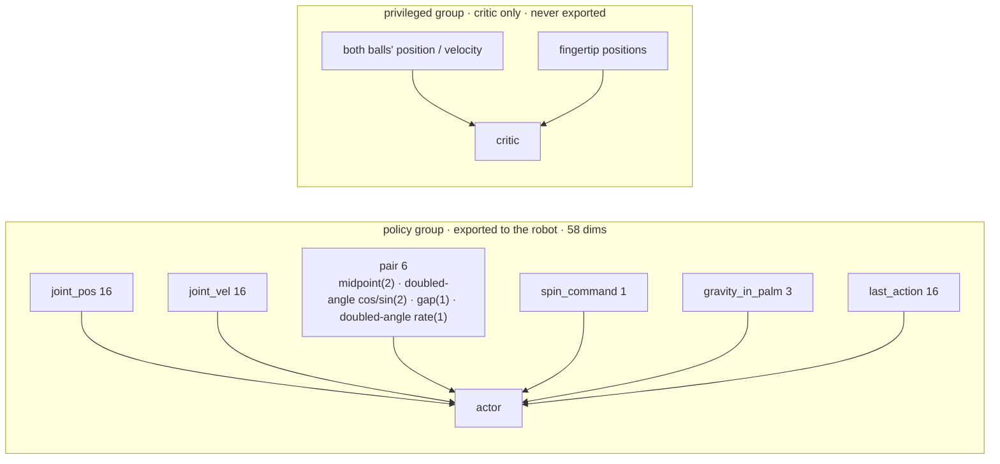

# ④ Track 2: Letting the Simulator Teach the Hand to Roll Walnuts

> Part 4 of the series · [Previous ③](./03-teleop-kapandji.md) · [Overview](./index.md) · Next: [⑤ Baoding sim-to-real and lessons](./05-baoding-sim2real.md)

Track 2's brief is "rolling walnuts": like baoding balls, make two small balls circle each other in the palm. We took it on at 15:08 on September 5, still riding the high of the teleoperation working — and from then on every training run learned to hold and almost none learned to rotate. This part writes down the nine experiments, why each was scrapped, and the September 8 realisation that "the hand was pointing the wrong way". **This is a tutorial in progress** — the mount-angle sweep at the end is still running.

<video controls width="100%" preload="metadata" poster="/img/hackathons/2026/apex-hand/human-baoding-reference-poster.jpg" style={{maxWidth: '360px', display: 'block', margin: '1.5rem auto'}}>
  <source src="/video/hackathons/2026/apex-hand/human-baoding-reference.mp4" type="video/mp4" />
</video>

*Our reference motion: my own hand, the two 30 mm wooden balls, five seconds. Every geometric number below was measured from this clip and these two balls.*

The organisers also handed us an **official Apex demo** — a left hand on an optical table, two mirror-finish steel baoding balls, rotating under a top-down camera. That is the motion we were aiming at; our wooden pair and hanging-hook mount are the cheap stand-in we could actually train against.

<video controls width="100%" preload="metadata" poster="/img/hackathons/2026/apex-hand/official-baoding-reference-poster.jpg" style={{maxWidth: '360px', display: 'block', margin: '1.5rem auto'}}>
  <source src="/video/hackathons/2026/apex-hand/official-baoding-reference.mp4" type="video/mp4" />
</video>

*Official Rysen Apex reference: steel baoding balls circling in the palm (organiser-provided clip).*


---

## 0. Define the Task First

- **Objects**: two turned wooden balls, 30 mm diameter, 9.55 g each as weighed → density 676 kg/m³, right in the beech / birch range. In simulation the ball radius, target gap and reset positions are all derived from that one radius; changing balls changes one number.
- **Hand**: **left** — the physical hand is a left hand, and training the left directly removes the mirror-the-policy step at deployment.
- **Motion**: the two balls circle each other about the palm normal. One "revolution" = each ball back where it started = the pair axis turning 2π. The metric is **revolutions per episode** (`baoding_revolutions`), not the reward value.
- **Episode**: 10 s (600 steps at 60 Hz); ends immediately when a ball leaves the cup.


Gym ids: `PAN-BaodingRotate-Apex-Left-v0` (train) / `PAN-BaodingRotate-Apex-Left-Play-v0` (playback: 16 envs, noise off, no timeout). Config in `source/pan_dexterous_lab/tasks/coin_roll/baoding_env_cfg.py`.

---

## 1. Observations: Only What the Real Hand Can Measure

The coin policy in part ① saw **privileged state** (coin pose, absolute fingertip positions). On hardware none of that is measurable; it had to be fed zeros and the policy saturated. The baoding task splits actor and critic from day one:



Those six `pair` numbers are the contract of the whole sim-to-real chain: `real/ball_tracker.py` must be able to compute the **same six numbers, same order, same units** from two blobs plus a one-time palm calibration (part ⑤). Two things are therefore deliberately **absent**:

- **Ball identity.** The two balls are identical; a camera cannot tell which is which. If the observation carried "ball 1 / ball 2", the policy would learn from information that does not exist on hardware. The fix is to report only the **pair**'s midpoint, gap and **doubled** axis angle: swapping the balls adds π to the axis angle and 2π to the doubled angle — no change.
- **Height above the palm.** One fixed camera cannot measure it; a 30 mm ball 30 cm away changes apparent radius by well under a pixel over a few millimetres of travel.

`gravity_in_palm` was added on September 8: the unit gravity vector in the hand frame — (0, 0, −1) for a level palm-up hand, (1, 0, 0) with the fingers hanging straight down at 90°. It tells the policy how the hand is mounted; on hardware the runner feeds the same constant from `--mount-pitch-deg`. **Adding it took the observation from 55 to 58 dims, so older baoding checkpoints can no longer be `--resume`d.**

---

## 2. Actions and Rewards

Actions are bounded deltas about the "cradle" pose (`_CRADLE_JOINT_POS`), scaled from the reference footage rather than from the joint ranges:

| Joints | scale (rad) | Why |
| --- | --- | --- |
| thumb `j0–j3` | 0.32 | thumb-tip Jacobian ≈ 85–105 mm/rad; 0.25 only fenced and never pushed a swap, 0.5 became a hammer, 0.32 ≈ one 28–33 mm stroke from the footage |
| finger `j0` (abduction) | 0.25 | |
| finger `j1 / j2` | 0.35 | the fingers dip / lift about 15–20 mm in the footage |

Target rate is slewed at `JOINT_MAX_SPEED_RAD_S = 2.0 rad/s`, matching the real SDK's `MaxJointSpeed`, so the policy cannot learn strokes the real hand will not perform.

Current rewards (`BaodingRewardsCfg`):

| Term | Weight | Meaning |
| --- | --- | --- |
| `target_pair` | +1 | RoTO-style two-slot swap: slots at ±16.5 mm in the palm plane and ±10 mm in height (one high, one low); when a ball arrives at a slot the two slots flip. **Progress only** — an absolute-distance tanh is exactly how a policy learns to sit still and collect |
| `spin` | +2 | pair-axis rotation in the commanded direction (capped at 0.12 rad per step, +1 bonus per revolution); also the sole bookkeeper of `baoding_revolutions` |
| `ball_gap` | −4 | centre distance away from "just touching" (2r + 3 mm): below contact is interpenetration or a crush; a 12 mm slack band above it is free |
| `pair_centering` | −3 | pair midpoint away from the cup centre (8 mm deadzone); measured to the cup, not to the palm origin — the origin is at the wrist, and penalising distance from it rewards dragging the pair backwards |
| `hold_pair` | **0** | the reference footage never "parks" the pair; a per-step hold bonus is exactly how the previous run learned to sit |
| `drop` | −12 | paid once, on the step a ball leaves; not per remaining step |
| `finger_crossing` | −20 | self-collision is off, so this is the only thing stopping fingers from passing through one another |
| `action_rate_l2` / `joint_vel_l2` / `action_l2` | −0.01 / −2.5e-5 / −1e-4 | no jitter |

Terminations: 10 s timeout, `balls_dropped`, ball farther than 0.45 m from the hand. Friction 0.60–0.95 (wood on rubber pads grips far better than the metal coin), mass ±8% (the balls were weighed; the uncertain quantities are friction and joint gains, not mass).

---

## 3. Nine Experiments: Why Every One Held and Never Rotated

Each run's directory carries `params/env.yaml` (the full config at the time), `code/` (a snapshot of the source files that determined the policy) and `RUN.md` (command, git, how to restore). This was the rule we set for ourselves on the evening of September 5 — "record the code and the operations behind every model, or we will never find the best one or sync the changes" — and it turned out to be the single most valuable discipline of the project.

| # | run | Idea | Outcome |
| --- | --- | --- | --- |
| 1 | `09-05_16-14-27` | HOLD: `hold_pair` +1 per step, balls seated in the palm cup; 4096 envs × 3000 iters | **Scrapped.** Holds, barely rotates |
| 2 | `09-05_19-13-22_orbit_reset` | inject an initial `orbit_omega=3.5` on the pair at reset | **Scrapped.** Learned a large-radius orbit, not an in-hand swap |
| 3 | `09-05_21-43-43_pair_mill` | four fingers form a symmetric deep cup and mill the pair in place | **The only one that rotates**: 18.2 rev / 578 steps, 93% timeouts. Large motions, division of labour unlike the footage. Kept as a real-hand candidate |
| 4 | `09-05_22-27-26_hook_walls` | pinky as a wall, thumb as the other wall plus the pusher, three fingers as a hook; centering penalises lateral only | **Scrapped.** Early stop at 600 iters, rev≈0.02 |
| 5 | `09-06_00-33-14_swap_targets` | RoTO two-point swap (radius 16.5 mm) plus light spin; pinky tucked into the cage | **Half-way**: 400 iters, 5.6 rev / 600 steps, rotates; but the thumb hammers vertically with far too much travel |
| 6 | `09-06_07-57-50_thumb_wall` | same reward; FK-solved rest pose with the thumb pad on the ball; thumb scale 0.25; `clip_actions=1` + 2 rad/s slew | **Scrapped.** Plateau at 600 iters, rev≈0. `target_pair`'s absolute-distance term was still paying for sitting |
| 7–9 | `09-06_08-43 / 09-32 / 09-43 / 09-51_over_under` | slots get a ±10 mm height split (one high, one low); 12 mm gap slack; 8 mm centering deadzone; spin weight 2; progress shaping | **Scrapped.** Three interrupted resumes to it=600 plateau, rev≈0.006, episode≈560: sitting no longer pays, and it still does not learn the swap |

Four playbacks tell it better than the table (all from the same camera):

<video controls width="100%" preload="metadata" poster="/img/hackathons/2026/apex-hand/sim-baoding-hold-model2999-poster.jpg" style={{maxWidth: '720px', display: 'block', margin: '1.5rem auto'}}>
  <source src="/video/hackathons/2026/apex-hand/sim-baoding-hold-model2999.mp4" type="video/mp4" />
</video>

*#1 HOLD, `model_2999`: rock-steady hold, no rotation. The reward curve looks beautiful — which is precisely the problem.*

<video controls width="100%" preload="metadata" poster="/img/hackathons/2026/apex-hand/sim-baoding-orbit-reset-poster.jpg" style={{maxWidth: '720px', display: 'block', margin: '1.5rem auto'}}>
  <source src="/video/hackathons/2026/apex-hand/sim-baoding-orbit-reset.mp4" type="video/mp4" />
</video>

*#2 orbit_reset: the balls do rotate — around a circle the size of the whole palm.*

<video controls width="100%" preload="metadata" poster="/img/hackathons/2026/apex-hand/sim-baoding-pair-mill-poster.jpg" style={{maxWidth: '720px', display: 'block', margin: '1.5rem auto'}}>
  <source src="/video/hackathons/2026/apex-hand/sim-baoding-pair-mill.mp4" type="video/mp4" />
</video>

*#3 pair_mill: 18.2 revolutions per episode. It rotates, but with very large finger motions and an almost idle thumb — not how a human divides the work.*

<video controls width="100%" preload="metadata" poster="/img/hackathons/2026/apex-hand/sim-baoding-swap-targets-poster.jpg" style={{maxWidth: '720px', display: 'block', margin: '1.5rem auto'}}>
  <source src="/video/hackathons/2026/apex-hand/sim-baoding-swap-targets.mp4" type="video/mp4" />
</video>

*#5 swap_targets: the thumb stands up and hammers the ball. Too much travel, but the right direction.*

<video controls width="100%" preload="metadata" poster="/img/hackathons/2026/apex-hand/sim-baoding-over-under-poster.jpg" style={{maxWidth: '720px', display: 'block', margin: '1.5rem auto'}}>
  <source src="/video/hackathons/2026/apex-hand/sim-baoding-over-under.mp4" type="video/mp4" />
</video>

*#7–9 over_under: slots one high, one low, no more reward for sitting — and it still chooses to hold.*

A note I wrote at 22:13 on September 5 became the design basis for runs 4–9: "the pinky is a wall, the thumb flicks the balls and is the other wall at the same time, and the remaining fingers are a hook / bowl that keeps the balls in the hollow."


### 3.1 What the failures have in common

- **Pay per step for "holding" and the policy will only hold.** We paid that tuition twice, in #1 and #6.
- **An absolute-distance reward can be farmed by sitting**: park the pair somewhere between the two slots and the tanh distance to both is fine, so do nothing. Only rewarding **progress** (the decrease in distance) closes it.
- **The thumb's travel is the hardest single number**: 0.25 rad cannot push a swap, 0.5 rad is a hammer, and at 0.32 rad it "dares not move".
- Every one of these experiments shared one premise — **palm up, level, balls lying on the flat palm, fingers reaching down from above**. Section 5 overturns it.

---

## 4. How to Read the Five Curves

The plots come from the long run #1 (4096 envs, cut at iteration 1450). It is the textbook "holds but does not rotate" case, which makes it the best material for learning to read TensorBoard.

```bash
source env.sh
tensorboard --logdir logs/rsl_rl/pan_baoding_rotate/2026-09-05_16-14-27 --port 6006
```

**1. Total reward and survival**


Both climb steeply over the first 100 iterations: the hand goes from "the ball flies the moment it is placed" to keeping the pair in the palm. After 100 the length hugs the 600-step ceiling while reward keeps creeping. **Length at the ceiling only says nothing dropped; it says nothing about rotation.**

**2. Why episodes end**


The three sum to about 1. `drop` falls from near 1.0 at the start (the policy flailing and flinging the balls) to about 2%, `time_out` rises to about 98%. Red down, green up = it learned to survive first.

**3. The task itself**


`hold_pair` quickly reaches 0.97 and saturates; `spin` creeps around 0.52. **Once `hold` is saturated, `spin` is the only curve worth watching** — a long plateau with a flat total reward is the signal to stop or change the reward. Here we knew before the plateau: in playback the balls simply did not move.

**4. Motion regularisers**


All small negatives. `finger_crossing` has weight −20 and still hugs 0 (about −0.001), so there is almost no crossing; if it dropped below −1 the fingers would fight on the real hand.

**5. PPO internals**


A wobbly surrogate is normal; value loss just must not diverge (the critic sees privileged ground truth, so it only reflects how stable the estimate is); entropy is still at 10.5 and has not collapsed. **Do not use these three to judge whether the balls rotate.**

Throughput: about 37–43k steps/s at 4096 envs, 3000 iterations in about 1 h 50 min; on 12 GB that is this machine's practical ceiling.

---

## 5. The September 8 Realisation: the Hand Was Mounted the Wrong Way

At 1:22 AM, re-watching the reference footage, it clicked: the hand in the video is **not held level**. It hangs, fingertips below the wrist, the two balls seated in the hook formed by the curled index / middle / ring fingers, with the pinky and thumb as side walls and the thumb pushing the ball **from below upward** to swap. All nine of our experiments were palm-up, level, fingers reaching down from above — a different task.

Which geometry is learnable is not something to guess. The approach is to run **several mount angles in one training**:

- `events.hand_tilt` (a startup event) rotates env `i`'s hand about its palm cup by `pitch_deg[i % buckets]`, fixed for the whole run — equivalent to bolting the hand to the bench at that angle. Rotating about the cup keeps the ball spawn points and the playback camera unchanged.
- Every geometric term (ball seats, RoTO slots, the drop test, centering, the `pair` observation) was moved into the **hand frame** `HandFrame` (`_geom.hand_frame`: forward / lateral / palm-normal axes derived from the root pose) instead of assuming palm normal = world +Z. The 0° bucket reproduces the old numbers exactly.
- The policy tells buckets apart through the new `gravity_in_palm` observation.
- The training log prints one line every 50 iterations: `[tilt] pitch+0: x.xx rev / drop 0.xx  pitch+30: …`; in TensorBoard it is `Train/baoding_revolutions/pitch+XX` and `Train/drop_rate/pitch+XX`. Watch which bucket's drop falls first and whose rev rises first, then narrow the buckets around that angle (`env.events.hand_tilt.params.pitch_deg=[60,75,90]`, `jitter_deg=5` turns them into a band).
- **Static check first**: zero action, default grip, 0 / 30 / 60 / 90° — 0% drops within 3 s at every angle. The existing cradle pose hooks the balls even vertical, so any difference between buckets is learnability, not spawning-and-falling.

```bash
# formal sweep: default buckets 0/30/60/90, 512 hands per bucket
python scripts/train.py --task PAN-BaodingRotate-Apex-Left-v0 --headless --num_envs 2048 --seed 42 \
  --run_name tilt_sweep
# watch an 8×8 grid of hands while training
python scripts/train.py --task PAN-BaodingRotate-Apex-Left-v0 --viz kit --grid_view \
  --max_visible_envs 64 --num_envs 64 --max_iterations 300
# pick an angle at playback
python scripts/play.py --task PAN-BaodingRotate-Apex-Left-Play-v0 --num_envs 1 --checkpoint ... \
  env.events.hand_tilt.params.pitch_deg=[60]
```


### 5.1 Result of the first windowed sweep (recorded as is)

512 envs with the window rendering, early-stopped at 600 iterations, `rev` plateaued at 0.13. Drop rate per bucket:

| Mount angle | 0° | 30° | 60° | 90° |
| --- | --- | --- | --- | --- |
| drop | 0.89 | **0.34** | 0.88 | 1.00 |

Only the 30° row learned to hold; **nobody rotates yet**. 512 envs plus window rendering is too small a run to conclude anything; the formal run is `--headless --num_envs 2048 --run_name tilt_sweep`, with `--video --video_interval 12000 --grid_view` to collect time-lapse footage on the way. The result will be folded in here.

<video controls width="100%" preload="metadata" poster="/img/hackathons/2026/apex-hand/tilt-sweep-grid-model-0-poster.jpg" style={{maxWidth: '720px', display: 'block', margin: '1.5rem auto'}}>
  <source src="/video/hackathons/2026/apex-hand/tilt-sweep-grid-model-0.mp4" type="video/mp4" />
</video>

*The random policy at iteration 0: 16 hands in a 4×4 grid, one mount angle per row (top to bottom 90° / 60° / 30° / 0°).*

<video controls width="100%" preload="metadata" poster="/img/hackathons/2026/apex-hand/tilt-sweep-grid-model-600-poster.jpg" style={{maxWidth: '720px', display: 'block', margin: '1.5rem auto'}}>
  <source src="/video/hackathons/2026/apex-hand/tilt-sweep-grid-model-600.mp4" type="video/mp4" />
</video>

*Same camera after 600 iterations: the 30° row is stable, the others still drop.*

<video controls width="100%" preload="metadata" poster="/img/hackathons/2026/apex-hand/tilt-sweep-live-kit-poster.jpg" style={{maxWidth: '720px', display: 'block', margin: '1.5rem auto'}}>
  <source src="/video/hackathons/2026/apex-hand/tilt-sweep-live-kit.mp4" type="video/mp4" />
</video>

*20 seconds recorded straight off the Kit window: the grid of hands mid-training.*

---

## 6. Recording Training as Video

Three methods, each with its use:

**1. Automatic recording during training (recommended for time-lapses)** — every N environment steps, render a clip off-screen from a fixed camera; no window needed:

```bash
python scripts/train.py --task PAN-BaodingRotate-Apex-Left-v0 --headless \
  --num_envs 256 --video --video_length 300 --video_interval 2400 --grid_view
# -> <run>/videos/train/rl-video-step-{0,2400,4800,...}.mp4   one 5 s clip every 100 iterations
```

**2. Re-record per checkpoint after training** (same camera, any checkpoint / angle):

```bash
for ck in model_0 model_300 model_600; do
  python scripts/play.py --task PAN-BaodingRotate-Apex-Left-Play-v0 --headless \
    --num_envs 16 --video --video_length 600 --grid_view \
    --checkpoint logs/rsl_rl/pan_baoding_rotate/<run>/$ck.pt
done
```

**3. Record the Kit window directly** (works even when other windows cover it):

```bash
ffmpeg -f x11grab -window_id <id from xwininfo> -framerate 15 -i :1 -t 20 out.mp4
```

Concatenate with `ffmpeg -f concat -safe 0 -i list.txt -c copy out.mp4` (`list.txt` has one `file '/abs/path.mp4'` per line). The WebUI console exposes the same three knobs — "record periodically during training / recording interval / clip length" — and plays the resulting mp4s in its "Videos" tab.

**The pitfall**: Isaac Lab 3.0's `--video` goes through `VideoRecorderCfg`, which copies `viewer.eye / lookat` as world coordinates when the env is constructed and has nothing to do with the Kit window's camera controller — **they are two separate cameras**. Our first version moved the window camera after building the env: the window looked right, the recording pointed at the empty floor between two hands, and the clips came out blank. The fix is for `--grid_view` to compute the grid extent from `num_envs × env_spacing` **before** the env is built and write it into `viewer` (`pan_dexterous_lab/viewer.py`, shared by train and play), so the window and the recorder use the same numbers.


---

## 7. Restoring Any Experiment

```bash
RUN=logs/rsl_rl/pan_baoding_rotate/<run>
cp "$RUN/code/apex_cfg.py"         source/pan_dexterous_lab/assets/apex_cfg.py
cp "$RUN/code/objects.py"          source/pan_dexterous_lab/assets/objects.py
cp "$RUN/code/baoding_env_cfg.py"  source/pan_dexterous_lab/tasks/coin_roll/baoding_env_cfg.py
cp "$RUN/code/rewards_baoding.py"  source/pan_dexterous_lab/tasks/coin_roll/mdp/rewards_baoding.py
cp "$RUN/code/events.py"           source/pan_dexterous_lab/tasks/coin_roll/mdp/events.py
cp "$RUN/code/_geom.py"            source/pan_dexterous_lab/tasks/coin_roll/mdp/_geom.py
cp "$RUN/code/rsl_rl_ppo_cfg.py"   source/pan_dexterous_lab/tasks/coin_roll/config/apex_hand/agents/rsl_rl_ppo_cfg.py
```

The initial pose `q0` the real hand needs lives in that run's `exported/joint_map.json`, independent of the repository's current `_CRADLE_JOINT_POS`.

## 8. Pitfall List

1. Paying per step for "holding" → it only holds. `hold_pair` weight zero.
2. Absolute-distance tanh → farmed by sitting. Reward progress only.
3. Ball identity in the observation → learning from information the hardware lacks. Doubled angle.
4. Thumb travel 0.25 / 0.5 / 0.32 rad: three numbers, three ways to fail.
5. A left hand is not a string replacement: `hand_side.apply_hand_side()` must move the USD, the joint list and the `side` injected into every reward term together, or the left-hand USD gets asked "where is `right_palm_link`" with the error far from the cause.
6. `--resume` of an old checkpoint into a new observation size fails on shape — adding an observation is a new experiment.
7. 4096 envs is the ceiling on 12 GB; drop to 64 envs when the window is open.
8. The recorder camera and the window camera are two different cameras (section 6).

## 9. File Map

| Module | Path |
| --- | --- |
| Task config | `source/pan_dexterous_lab/tasks/coin_roll/baoding_env_cfg.py` |
| Rewards | `.../mdp/rewards_baoding.py` |
| Observations (`pair`, `gravity_in_palm`) | `.../mdp/observations.py` |
| Hand frame and geometry | `.../mdp/_geom.py` |
| Events (`hand_tilt`, resets) | `.../mdp/events.py` |
| Left/right conversion | `.../hand_side.py` |
| Object presets | `source/pan_dexterous_lab/assets/objects.py` |
| Recording camera | `source/pan_dexterous_lab/viewer.py` |
| Evaluation | `scripts/eval_baoding.py` (revolutions per episode plus drop / fly-out / crossing cheat counts) |
| Experiment index | `docs/BAODING_RUNS.md`, `docs/BAODING_TRAINING.zh.md` |

Next: [⑤ Baoding sim-to-real and lessons](./05-baoding-sim2real.md) — everything the real-hand side has to do once the policy is exported.
