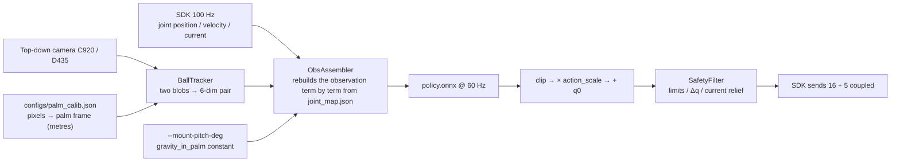

# ⑤ Baoding Sim-to-Real: the Observation Contract, Palm Calibration, Ball Tracking, a Phase Gait

> Part 5 of the series · [Previous ④](./04-baoding-rl-sim.md) · [Overview](./index.md)

Part ④ ended at `export_onnx.py`. This part is everything the real-hand side has to do — and the infrastructure most worth writing down from these two days, because all of it serves one goal: **turn a mismatch into a startup error instead of an inexplicable failed experiment**. The end of the article states the status honestly: no-load playback works, the real hand holds the balls, the closed loop with balls is not yet stable.


---

## 0. What the Real-Hand Loop Looks Like



```bash
source env_real.sh
python scripts/calibrate_palm.py --camera 2 --side left --out configs/palm_calib.json
python -m real.policy_runner --onnx logs/rsl_rl/pan_baoding_rotate/<run>/exported/policy.onnx \
  --camera 2 --calib configs/palm_calib.json --spin +1 --gain 0.3 --show
```

---

## 1. The Incident: Silent Observation Misalignment

The first time the coin policy went onto the real hand, the observation vector was an 88-element layout **hand-written** in the hardware script, padded at the end with a literal `np.zeros(15)`. Later the policy changed shape. **Nothing raised an error.** The vector shifted as a whole, and the hand just twitched slightly. This class of bug never crashes; it only makes you believe "the sim-to-real gap is too big" and tune in the wrong direction — which we genuinely did for a while.

The fix was to make the observation layout **an artefact exported by the training side**:

- `scripts/export_onnx.py` writes the actor's observation layout into `joint_map.json` **term by term**: each term's name and dimension, the actuated joint order, the action scale (regex → joint), EMA α, control rate, hand side, and the mount-angle buckets `hand_tilt` used in training.
- `real/obs_assembler.py` fills each term from a named provider according to that spec; **any term without a provider fails at startup**. It does not know the total dimension itself — everything comes from the spec.

```text
joint_map.json (excerpt)
  task, checkpoint, side
  actuated_joint_names[16]   # policy dim i ≡ this entry; never reorder after the fact
  coupled -> source
  action_scale (regex -> rad), ema_alpha, control_hz
  obs_terms: [{name: joint_pos, dim: 16}, {name: joint_vel, dim: 16},
              {name: pair, dim: 6}, {name: spin_command, dim: 1},
              {name: gravity_in_palm, dim: 3}, {name: last_action, dim: 16}]
  hand_tilt: {pitch_deg: [0, 30, 60, 90]}
```

When `policy_runner` receives a policy that asks for `pair` but no `--calib` was given, it **refuses to arm**. An observation mismatch is now a startup error.

A related lesson: **a left hand is not a string replacement**. The original left-hand conversion replaced `right_` with `left_` in joint names, but the reward / observation terms also resolve body names (palm, knuckles, pads, tips) through a `side` parameter that defaulted to `"right"`, so the left-hand USD got asked "where is `right_palm_link`", with the error far from the cause. Now `hand_side.apply_hand_side()` moves the USD, the joint list and the `side` injected into every term together, and the exporter records the side in `joint_map.json`.

---

## 2. Palm Calibration: Click Four Finger Roots

The policy's `pair` observation is **metres in the palm frame**, so the camera has to know where the palm frame sits in the image. The hand and the camera are both fixed, so a one-time similarity-transform calibration is enough.

```bash
python scripts/calibrate_palm.py --camera 2 --side left --out configs/palm_calib.json
# add --realsense to also store the palm depth palm_depth_m
```

Flow: Space freezes a frame → click the **index, middle, ring, pinky** metacarpal heads (MCPs) in order → Enter solves, Backspace undoes. Those four points' palm-frame positions were measured off the articulated model in simulation (`ball_tracker._LEFT_MCP_LANDMARKS_M`, read in the cradle pose with `debug_spawn.py`): on a palm-up hand they are the most recognisable points in the image, and abduction barely moves them, so they hold for any cradle-like pose. Two clicks are enough mathematically; four let the residuals catch a mis-click. On synthetic data the regression residual is under 0.01 mm.


The hand must be in the **cradle pose** during calibration — `policy_runner --warmup` holds exactly that pose, so run the two side by side.

---

## 3. Ball Tracking: Produce Exactly the Simulator's Six Numbers

`real/ball_tracker.py` has one job: produce the six numbers that part ④'s `baoding_pair_obs` defines, **same order, same units**:

| Index | Meaning |
| --- | --- |
| 0:2 | pair midpoint relative to the cup centre, in the palm plane (metres) |
| 2:4 | cos / sin of the doubled axis angle |
| 4 | centre-to-centre gap |
| 5 | doubled-angle rate (rad/s) |

Two facts drive the design:

- **The balls are indistinguishable** → no identity in the six features (doubled angle). Only the gait clock (section 5) keeps a nearest-neighbour identity so the "thumb-side seat" stays the thumb-side seat across a swap.
- **Hand and camera are both fixed** → one calibration maps pixels to palm-frame metres. Height is optional: with a D435, aligned depth plus the `palm_depth_m` from calibration gives the ball surface height; without it, the six features are unchanged.

Detection is "a bright-enough blob hunt plus a palm-frame gate": the wood is saturated brown, not pale, so saturation is left open; a box 10 cm around the cup and 8 cm deep (the same envelope as the simulator's drop test `DROP_RADIUS_M / DROP_DEPTH_M`) is what drops the grey floor tiles.


```bash
python scripts/calibrate_palm.py --camera 2 --side left --out configs/palm_calib.json --preview
# no clicking: load the calibration and show the live pair features
```

---

## 4. Policy Playback: `real/policy_runner.py`

```bash
# no load: verify the mapping and limits only, clear the surroundings
python -m real.policy_runner --gain 0.30 --seconds 12

# closed loop with balls (calibrated, camera at --camera 2)
python -m real.policy_runner --onnx <run>/exported/policy.onnx \
  --camera 2 --calib configs/palm_calib.json --spin +1 --gain 0.3 --show \
  --mount-pitch-deg 0
```

Every tick: read 16 joint positions / velocities from the SDK → `BallTracker.observe()` → `ObsAssembler` builds the observation → ONNX inference → clip the output to ±1 → multiply by the `action_scale` from `joint_map` (regexes matched against the real `left_*` joint names, last match wins, as in Isaac Lab) → add the initial pose `q0` → `SafetyFilter` → send. 60 Hz, matching the simulator's `decimation=4 @ 240 Hz`.

A few parameters:

| Parameter | Effect |
| --- | --- |
| `--gain` | action gain; start at 0.3 and open up gradually |
| `--mount-pitch-deg` | the hand's mount pitch on the bench, giving `gravity_in_palm` the same constant; warns if outside the trained buckets |
| `--warmup` | seconds to hold the cradle pose before arming, for placing balls / calibrating |
| `--realsense` | D435 through the same `tracking.camera.open_source` path |

Policy playback uses `SafetyFilter(hold_on_lag=True)`: a joint lagging its target by 0.18 rad (about 10°) is treated as having hit something and that finger freezes — right for a policy, wrong for teleoperation (part ③).

---

## 5. The Non-RL Fallback: a Phase-Indexed Gait

A hackathon needs a demo, and RL does not necessarily converge on schedule. On the morning of September 6 we built a parallel route that **trains no policy at all**: `real/gait.py` plus `scripts/baoding_gait.py`.

The core idea: the gait table `q_ref(φ)` is indexed not by time but by the **phase φ of the pair axis** — the angle the `BallTracker` reports. One revolution = φ advancing 2π. The two balls are identical, so after one swap (φ advancing π) the hand is back in the same physical situation; the table therefore repeats every π (`ORBIT_FOLD = 2`), the fit sees both swaps as one, and A/B labels become irrelevant.

Three sources, one fit / playback path:

```bash
# 1) geometric seed: no camera, hand only
python scripts/baoding_gait.py synthesize --out logs/gait/orbit_q_ref.npz
python scripts/baoding_gait.py play logs/gait/orbit_q_ref.npz --open-loop --seconds 8

# 2) human demonstration: record landmarks + q + φ + current during teleoperation
python scripts/landmark_teleop.py --realsense --calib configs/palm_calib.json \
    --record logs/gait/demo.npz --side left
python scripts/baoding_gait.py fit logs/gait/demo.npz --out logs/gait/q_ref.npz
python scripts/baoding_gait.py play logs/gait/q_ref.npz --calib configs/palm_calib.json --realsense

# 3) self-learning: the camera watches the cup, each episode is scored on how far the pair actually turned,
#    and the table is refit from the poses commanded at each ball phase
python scripts/baoding_gait.py learn --calib configs/palm_calib.json --realsense --iters 20 --episode-s 12
```

The seed amplitudes are not guesses; they come from part ③'s FK: in the cradle pose, 8° of finger PIP ≈ 9 mm of fingertip travel along the palm normal, 6° of abduction ≈ 10 mm sideways, 16° of thumb `j0` ≈ 12 mm across the palm and 6° of `j2` another 6 mm — one thumb stroke of about 35 mm, the footage's, not the 55 mm hammer. One revolution takes 2.0 s, a little slower than the footage's 1.3–1.8 s, to keep the thumb sweep under `JOINT_MAX_SPEED_RAD_S`.

Playback is closed-loop: look up the base pose from the table, then add a small residual from the live pair / height / current.

### 5.1 Do not crush the balls

A field note from 11:34 on September 6: "watch the current feedback or we will crush the balls." A position target that lands **inside** a ball stalls the motor at the torque cap and stays there; the ball gets pinned, and the camera loses it too (12:08: "the initial pose clamps the balls so hard they are not detected").

Two fixes:

- **Current relief** (part ②) applies to everyone: above a finger's contact threshold, its flex joints open in proportion and close again as current drops.
- **A re-seat pose** `_OPEN_OFF`: open the cradle further (index `j1` −15°, `j2` −25°, …) so the fingertips clear a 30 mm ball and the palm hollow is exposed; balls dropped in from above roll into the cup instead of landing on the finger arch, and the camera sees both whole disks.

<video controls width="100%" preload="metadata" poster="/img/hackathons/2026/apex-hand/real-hand-hanging-hook-poster.jpg" style={{maxWidth: '360px', display: 'block', margin: '1.5rem auto'}}>
  <source src="/video/hackathons/2026/apex-hand/real-hand-hanging-hook.mp4" type="video/mp4" />
</video>

*September 6, 11:30: the hand hung from the chassis fingertips-down, balls seated in the hook of three curled fingers, the tracker window on the laptop. Two days later we realised this is the geometry the reference footage actually shows.*

The same geometry shows up when we track the **official** steel-ball clip with `scripts/analyze_ref_motion.py`: the pair axis advances, but the angular rate is stick-slip rather than a rigid spin — useful as a kinematic target for the gait table, not as a claim that our wooden-ball policy already matches it.


---

## 6. Status (Honest)

| Item | Status |
| --- | --- |
| Network, SDK, read-only smoke test | done |
| Webcam teleoperation driving the real hand | done, 19 minutes continuous; Kapandji 9 |
| ONNX no-load playback | done, 60 Hz, safety layer in the loop |
| Observation contract `joint_map.json` + `ObsAssembler` | done |
| Palm calibration + ball tracking | done, `configs/palm_calib.json` |
| Real hand holding two balls | done (booth video) |
| Closed loop with balls rotating on the real hand | **not stable**. The simulated policy itself still "holds but does not rotate" (part ④); the phase gait moves but has no stable full revolution yet |
| Mount-angle sweep | in progress |

The risk and fallback were already written into Checkpoint 1: if the closed loop with balls is not stable, demonstrate in-hand capability with the teleoperation that already works and report the simulated revolution metric — two independent chains that cannot fail together. That is exactly what happened at the booth.

---

## 7. Lessons of the Two Days

1. **Silent observation misalignment is the most dangerous bug.** Make the layout an artefact exported by training; fail at startup on a missing term.
2. **A left hand is not a string replacement.** Move the USD, the joint list and the `side` parameter together.
3. **Two firmware pitfalls**: `deg2rad(100)` exceeds the firmware cap of 1.7453 rad; current gets stuck at a 449–453 mA fake rail.
4. **Over-current protection and a deliberate pinch cannot be distinguished by current.** The layer above feeds intent forward to the safety layer.
5. **Self-collision must be off, so finger crossing needs its own guard.** Abduction clamp 0.04 + `finger_crossing` −20.
6. **The two balls are identical.** No identity in the observation; use the doubled angle.
7. **Monocular cannot measure depth.** Ball height above the palm is the biggest uncertainty in the baoding task on hardware; a second viewpoint or a tactile array later.
8. **Rewards get hacked**, differently every time: spinning the coin in place, sitting with the balls, farming absolute distance. Reward progress only, and always watch the playback.
9. **12 GB of VRAM**: 2048 envs take about 4.5 GB, 4096 is the ceiling for the baoding task; never run two trainings.
10. **Pay per step for "holding" and the policy only holds.** The reference motion never contains a "parked" state.

## 8. Next Steps

- Run the mount-angle sweep properly (2048 envs, headless) and narrow the buckets to the angle band where drop falls first;
- Widen domain randomisation on joint gains and friction; the URDF dynamics were never identified, so a policy cannot be assumed to transfer directly;
- A second viewpoint (or the D435's depth) for ball height, or the tactile array;
- Switch between the phase gait and the RL policy inside the same `policy_runner`, and run whichever is stable at the booth.

## 9. File Map

| File | Responsibility |
| --- | --- |
| `scripts/export_onnx.py` | ONNX + `joint_map.json` (observation layout, mount-angle buckets) |
| `real/obs_assembler.py` | rebuilds the observation from the spec; fails on a missing term |
| `real/policy_runner.py` | 60 Hz playback loop |
| `scripts/calibrate_palm.py` | similarity-transform calibration by clicking four MCPs |
| `real/ball_tracker.py` | 6-dim `pair` features, palm-frame gate, gait clock |
| `real/gait.py`, `scripts/baoding_gait.py` | phase-indexed gait: synthesize / fit / play / learn |
| `real/safety.py` | limits, Δq, current relief, lag freeze |
| `docs/CHECKPOINT1.zh.md` | the Checkpoint 1 submission (original write-up of the technical difficulties) |

Back to the [overview](./index.md), or the [hackathon index](../../index.md).
