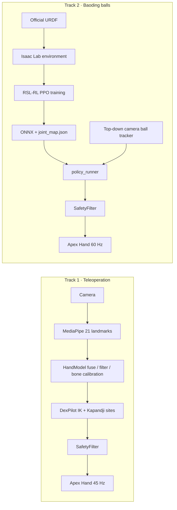

# AIx Origin Hackathon: Two Days From Simulation to a Real Apex Dexterous Hand

> AIx Origin Summit · Shenzhen · INNOAI Hackathon · September 2026 · Project: PΛN (rebartender V0.2) · Builder: PeterPan
>
> Insta360 Special Award · Demo Show 2026-09-06

---

## The One-Sentence Version

Late on September 3 we were still installing Isaac Lab. At noon on September 5 the physical Rysen Apex Hand arrived; by 3 PM it was following my hand. On September 6, at the Demo Show, it stood on top of our cocktail machine PΛN, pulling in a crowd while performing. Over the following two days we pushed both dexterous-hand challenges the hackathon set — **camera teleoperation plus a clinical thumb-opposition test**, and **baoding-ball rotation** — from simulation onto the real hand. Some of it works. Some of it is still on the way.

The hackathon itself was two days (September 5 and 6); the two days before were simulation prep, the two after were continued exploration. This series splits those six days into five tutorials you can follow from zero. This page is the guide.

---

## The Event and the Award

| Field | Details |
| --- | --- |
| Event | AIx Origin Summit · Shenzhen · INNOAI Hackathon |
| Dates | September 5–6, 2026, two days; Checkpoint 1 submitted September 5; Demo Show and awards September 6 |
| Project | **PΛN** = Personal Agent for Nightlife (rebartender V0.2), an **HDMI** (Human Drink Machine Interface) cocktail machine |
| Dexterous-hand part | Track 1: camera motion-capture teleoperation reproducing a clinical hand examination (the Kapandji opposition test), with a response-speed requirement. Track 2: "rolling walnuts" — baoding-ball rotation |
| Result | **Insta360 Special Award** |
| Code | [github.com/peterpanstechland/apexhand](https://github.com/peterpanstechland/apexhand) (MIT; training, real-hand and teleoperation code all open) |

The cocktail machine itself (ordering, pouring, the whole pick-up-the-phone conversation) gets its own write-up. This series is only about the **hand**.

As far as we know we were the first team at this hackathon to get the dexterous hand actually running: Ethernet plugged in at 13:39 on September 5, webcam teleoperation working at 15:01, then 19 minutes continuous without a drop.

---

## Two Tracks, Two Technical Routes

- **Track 1** is "a human teaches the hand": a plain RGB webcam watches the operator, MediaPipe emits 21 landmarks, we rebuild them into a 3D skeleton with real bone lengths, then a DexPilot-style vector matcher solves them onto the Apex's 16 actuated joints. To express the Kapandji opposition test (thumb tip touching the side of the index, each fingertip, down the pinky to the distal palmar crease, scored 0–10) the matching targets are the ten clinical sites, not four fingertips.
- **Track 2** is "the simulator teaches the hand": thousands of hands train PPO in parallel in Isaac Lab, the policy sees only quantities the real hand can measure (joint state plus ball-pair features a camera can recover), and after ONNX export the real-hand side rebuilds the observation vector from the same exported spec.

Both routes **share** one joint table, one safety layer and one WebUI launcher.

---

## Timeline

| Date | What happened |
| --- | --- |
| Sep 3, late night | Isaac Lab 3.0 beta on the existing Isaac Sim 6.0.1; official URDF converted to USD; discovered PhysX does not execute mimic joints |
| Sep 4 | Coin knuckle-roll in two stages: Hold 100%, index-to-middle transfer 61.5%; WebUI tuning console; repository open-sourced |
| Sep 5, 13:39 | Physical left hand on Ethernet; IP changed, SDK installed, safety layer wrapped |
| Sep 5, 15:01 | Webcam teleoperation tracking on the real hand; task switched to baoding balls in the afternoon; first long training run |
| Sep 5, night | A rival team's teleop video convinced us to build Kapandji in; hand recalled for the night, so a whole night of thumb-mapping work in the Isaac sandbox |
| Sep 6, morning | RealSense D435 / T265 arrived; hand back, Kapandji score 9; the real hand held two wooden balls at the booth |
| Sep 6, afternoon | Demo Show; Insta360 Special Award |
| Sep 7 → Sep 8 | Nine rounds of baoding reward iteration all "hold but don't rotate"; realised the hand's mount angle was wrong; started a mount-angle sweep; recorded training as video |

---

## The Series

| Part | What it covers | Who it is for |
| --- | --- | --- |
| [① Isaac Lab stack and the coin knuckle-roll](./01-isaac-lab-sim-stack.md) | Environment isolation, URDF→USD, coupled joints, three gates, two-stage curriculum, a hacked reward and its rebalance, the WebUI | Anyone who wants to train a dexterous hand in Isaac Lab |
| [② First contact with the real hand SDK](./02-real-hand-sdk.md) | Subnet and IP, an isolated Python 3.10 venv, one joint table as the single source of truth, the safety layer (limits / Δq / current), firmware pitfalls, day-one checklist | Anyone who just received an Apex Hand |
| [③ Track 1: webcam teleoperation and Kapandji](./03-teleop-kapandji.md) | Camera choices, fusing MediaPipe's two landmark heads, DexPilot with an analytic Jacobian, ten Kapandji sites, 45 Hz tracking, keeping the fingers from fighting | Anyone who wants to teleoperate a hand with one webcam |
| [④ Track 2: baoding balls in RL simulation](./04-baoding-rl-sim.md) | Balls modelled from the real ones, identity-free pair observation, actor/critic split, nine reward iterations, reading the curves, the mount-angle sweep, recording training as video | Anyone doing in-hand manipulation with RL |
| [⑤ Baoding sim-to-real and lessons](./05-baoding-sim2real.md) | The joint_map.json observation contract, palm calibration, top-down ball tracking, policy playback, a phase-indexed gait as the non-RL fallback, lessons | Anyone moving a simulated policy onto a real hand |

---

## Equipment List

Everything we actually used over those days (and what we tried but did not use), each with "how connected / used where / verdict".

### The hand

- **Rysen Apex Hand, left.** Firmware 3.2.5, SDK 1.5.2, Ethernet TCP 5856 / 5857, 100 Hz control. 21 joints: 16 actuated, 5 (finger DIPs and the thumb's last joint) coupled 1:1 in firmware. Policies and teleoperation both output 16 values.
- This is the tactile-glove shell version, but this unit has **no** tactile-array output (`get_hand_sensor_image` returns nothing), so contact can only be inferred from per-finger motor current. That single fact shaped the safety layer.

### Network

- Direct Ethernet, or through the small TP-Link switch on the booth.
- Factory IPs: left `192.168.0.102`, right `192.168.0.103`. We moved ours to the local subnet at `192.168.88.200`; `env_real.sh` exports it as `APEX_HAND_IP` and every script reads it by default.

### Host

- RTX 4080 Laptop (**12 GB**, not 16) · Ubuntu 22.04. Training and the real hand run on the same machine, isolated by two venvs: Python 3.12 on the Isaac side, Python 3.10 on the hand side.
- Isaac Sim 6.0.1 + Isaac Lab v3.0.0-beta2.patch1 + RSL-RL PPO.
- A second laptop at the booth did exactly one thing: open the WebUI launcher in a browser.

### Cameras (all tried)

| Camera | Connection | Used for | Verdict |
| --- | --- | --- | --- |
| Logitech C920 | USB, clipped to the laptop lid or a top-down bracket | Track 1: MediaPipe on the operator's hand (33–39 fps on the HUD). Track 2: fixed top-down camera for ball tracking | RGB is enough to track a hand facing the camera in normal light; cheap and easy to place |
| Laptop built-in webcam | Built-in UVC | Pointed at the operator when the C920 was busy watching the robot | Works; image quality and placement worse than the C920. The script prefers an external USB camera; pass `--camera N` to pick the built-in one |
| Intel RealSense D435 | USB 3 | `--realsense`: measured depth replaces MediaPipe's relative z; palm depth and ball height for ball tracking | Noticeably steadier for thumb opposition and mutually occluding fingertips. Must be on USB 3, never on the same hub as the T265; one oversize stream start wedges it until a hardware reset |
| Intel RealSense T265 | USB | Wanted it as a second viewpoint | It is a tracking camera (dual fisheye + IMU) with **no RGB-D**, and its librealsense version conflicts with the D435's. Never entered the loop |
| Insta360 X5 | On top of the chassis | 360° crowd-pulling and showcase camera on the cocktail machine; hand recognition (rock-paper-scissors) and post-mount gameplay were planned | Never entered the dexterous-hand control loop; belongs to the PΛN write-up |

### Objects

- Two 30 mm turned wooden balls, 9.55 g each as weighed (baoding task).
- One 32 × 4 mm PΛN coin, STL generated by script (coin-roll task).

---

## Software Stack

| Layer | Used |
| --- | --- |
| Simulation | Isaac Sim 6.0.1, Isaac Lab v3.0.0-beta2.patch1, PhysX (also exported MJCF for Newton / MuJoCo-Warp) |
| Reinforcement learning | RSL-RL PPO (actor / critic MLP 512-256-128) |
| Hand tracking | MediaPipe Hands (image + world landmark heads), 1€ filter, DexPilot-style vector matching with an analytic Jacobian IK |
| Real hand | Rysen Python SDK 1.5.2, ONNX Runtime, OpenCV, pyrealsense2 |
| Tooling | Our own WebUI (launcher + a training console exposing 200+ parameters with explanations), TensorBoard, ffmpeg |

---

## Outside This Series

- The PΛN cocktail machine itself, the HDMI interaction and the Insta360 X5's 360° crowd-pulling: a separate write-up.
- Closing the loop with balls on the real hand and the full-scale mount-angle sweep: still running; results will be folded into parts ④ and ⑤.

Next: [① Isaac Lab stack and the coin knuckle-roll](./01-isaac-lab-sim-stack.md). Back to the [hackathon index](../../index.md).
