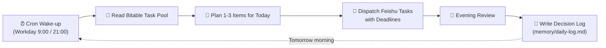
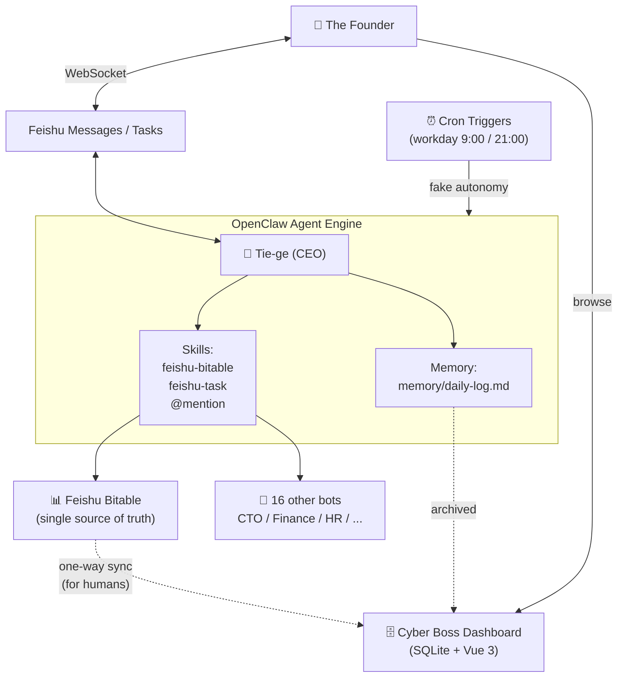

# 🦞 Cyber Boss: Let an AI Boss Run Your One-Person Company

> OpenClaw Builder Program · Lobster Frontier Experiment 2026 · Wild Card Track · Builder: PeterPan — publicly stress-testing OpenClaw's real boundaries


---

## 9:03 AM, Last Wednesday

It was last Wednesday, 9:03 AM. I just opened my laptop. A Feishu (Lark, China's enterprise messaging platform) notification popped up.


> **Tie-ge:** "Three things today. Don't be greedy.
> 1. Record and upload the OpenClaw demo video (P0, due today)
> 2. Finalize the project writeup and submit (P0, due today)
> 3. Sort out the ××× expense reimbursement (P0, due 2:00 PM)
> Alright. Get to work."

Not a colleague. Not a client. A bot I built myself. His name is **Tie-ge** (铁哥, literally "Iron Brother") — the CEO-level agent inside Cyber Boss whose entire job is to manage me.

He read all my project tables, scanned the task pool in Bitable, picked the three most important things for today, wrote down exactly *why* these three (and why everything else doesn't make the cut), then created Feishu tasks and set their deadlines.

Not "you might want to do this." This is **dispatching work**.

:::info Quick anchor
**OpenClaw** is an open-source AI agent execution framework built by Mydow. Its core capabilities:

- **TOOLS.md** — encode an agent's persona, tool-calling rules, and edge cases into a single Markdown file. Far more stable than raw prompts.
- **Skills** — orchestrate multi-step tool calls into reusable workflows.
- **WebSocket long connections** — connect directly to messaging platforms like Feishu without needing a public callback URL.

The entire Cyber Boss system runs on OpenClaw. Tie-ge is just the most visible agent in the cast.
:::

---

## The Role Flip: AI Manages You, Not the Other Way Around

This is the single most important sentence in the entire Cyber Boss project, and the reason I built it.

**Every AI assistant on the market is passive — if you don't ask, it doesn't move.**

ChatGPT, Cursor, Copilot — no matter how clever, they all wait for you to speak first. They don't walk up and say "these are the two things you should do today." And they certainly don't roast you when you don't do them.

I'm running 9 projects in parallel — client work, my own hardware product, the OpenClaw challenge, content channels — and every morning my first reaction isn't "what should I do today" but "which one do I tackle first." I have plenty of tools. The **decision still lands on me**.

So I flipped it:

> Don't manage AI — **let AI manage me**.
>
> It plans my day.
> It dispatches my tasks.
> It chases my deadlines.
> If I don't deliver — **it roasts me**.

I call him my Cyber Boss.

That idea, applied on top of OpenClaw, is what the rest of this post unpacks.

---

## Meet Tie-ge 🦞

Tie-ge is not ChatGPT with a skin. He's a role-defined agent with a personality, a job description, and a rulebook.

| | |
|---|---|
| **Name** | Tie-ge (铁哥) — "iron brother." Sharp-tongued but fair |
| **Role** | The CEO inside Cyber Boss. Owns task scheduling and dispatching across the whole org |
| **Personality** | Snarky boss. No flattery, no comfort — only "did you ship today?" |
| **Catchphrases** | "Three things today. Don't be greedy." / "Alright. Get to work." / "This one ships today." |
| **Things he won't say** | "Great job!" / "Hang in there!" / "What do you think?" |

Tie-ge's persona is not stitched together in a prompt. It's pinned down by OpenClaw's three-file pattern, version-controlled and deployable like an Ansible playbook:

- **`IDENTITY.md`** — who he is: name, role, the fact that he's facing a "super-individual founder," tone
- **`SOUL.md`** — his principles: read Bitable before speaking; no flattery, no comfort, no hedging; max 3 things per day; persist memory to `memory/daily-log.md`
- **`TOOLS.md`** — his operations manual: when to read Bitable, when to push a Feishu task, when to @-mention another agent, when to write a review log

That means I can fork Tie-ge's soul and spin up a totally different "boss" — gentle one, data-driven one, PUA-style one — in minutes. Personality changes; the behavioral skeleton stays.

---

## 📋 Event Info

| Field | Details |
|-------|---------|
| **Event** | OpenClaw Builder Program — Lobster Frontier Experiment (Independent Builder Challenge) |
| **Host** | Mydow (specializing in OPC super-individual AI infrastructure) |
| **Track** | Wild Card |
| **Builder** | PeterPan |
| **Experiment Period** | 15 days of real-world stress-testing across ~20 independent builders to publicly map OpenClaw's boundaries |
| **Showcase Day** | April 20, 2026 — Lobster Conference, live demos and the Builder Report release |
| **GitHub** | [github.com/peterpanstechland/cyber-boss](https://github.com/peterpanstechland/cyber-boss) |
| **Demo Video** | [bilibili.com/video/BV1RVdqBeEez](https://www.bilibili.com/video/BV1RVdqBeEez/) |
| **Event Page** | [openclaw.mydow.life](https://openclaw.mydow.life/) |

---

## What We Built: Cyber Boss

Cyber Boss is not a chatbot. It's an execution-rhythm management system aimed at **super-individuals and one-person companies**, built in three layers:

### Three Pillars

| Pillar | What It Does | Powered By |
|--------|-------------|------------|
| **AI Scheduler (Tie-ge)** | Plans the day, dispatches Feishu tasks, runs evening reviews, roasts procrastination | OpenClaw + TOOLS.md + Skills (feishu-bitable / feishu-task / @mention) |
| **Multi-Bot Matrix** | 17 role-based bots running in parallel; Tie-ge delegates by @-mentioning the right one | Feishu Open Platform + WebSocket long connection |
| **Dashboard** | A web UI for *humans*: project overview, OKR tracking, bot matrix, decision log | Vue 3 + Express + SQLite, one-way sync from Bitable |


Tie-ge sits at the top. Underneath him: CEO assistant, CTO, HR, Product Manager, Operations Director, CMO, Sales Lead, Hardware Engineering Lead, Software Engineering Lead, DevOps Engineer, Finance Lead, Operations/Delivery COO, Project Manager, Mystic Master… 17 role-based agents in total. Each one has its own `IDENTITY.md / SOUL.md / TOOLS.md`. They run independently — no cross-contamination.

When Tie-ge thinks something is a CTO call, he @-mentions the CTO bot. When something is a finance task, he hands it to the Finance Lead. Every delegation goes into the decision log.

> Side note: among the 17 bots there's also a **Mystic Master** that draws a tarot card for the boss every morning. Not a core feature, but it's actually running — a small example of how flexibly this multi-bot architecture stretches.

### Who Is This For?

- **Super-individual founders** — running multiple projects on willpower alone, already cracking
- **Boutique studio owners** — client projects, in-house products, content output all in parallel; need external discipline
- **Developers experimenting with role-based multi-agent matrices** — a real-world case of pushing OpenClaw's TOOLS.md to its limit
- **People who care about data privacy** — every task, decision log, and chat lives on your own server, not in some SaaS

---

## The Daily Loop

This is the spine of Cyber Boss:



:::info What is Bitable?
**Bitable** is Feishu's built-in Airtable-like multi-dimensional spreadsheet. Inside Cyber Boss it is the **single source of truth** for tasks: every project, task, priority, deadline, consecutive-procrastination counter lives in Bitable. Tie-ge reads it, writes it, and updates it directly. The SQLite on the Dashboard side is a one-way mirror for human consumption — Tie-ge himself never reads the Dashboard.
:::

### Morning Brief

Every workday at 9 AM, the cron trigger wakes Tie-ge up. The first thing he does: walk through every in-progress task in Bitable — priorities, deadlines, blocking relationships, consecutive procrastination days, OKR alignment — then pick at most **3** things for today.

Why these three? He spells out the reasoning.
Why not the others? Also documented.


The screenshot above is the harsh case — it's Friday, and three P0 tasks didn't move yesterday. Tie-ge's response isn't a soft nudge: "Slip the OpenClaw deliverable one more day and it becomes an integrity problem." That tone is the role being played correctly.

After dispatching, Feishu task cards auto-create with deadlines lit up. Tie-ge signs off: "Alright. Get to work."

### Evening Review

At 9 PM, cron wakes Tie-ge again. He runs the evening review: of the tasks dispatched this morning, how many shipped? Which didn't, and why? Which ones must be wedged into tomorrow?


> **Tie-ge:** "Two P0s due today, one with a 2 PM cutoff. Zero shipped. The OpenClaw video and the project writeup *are* your challenge deliverables. You did nothing today. Tomorrow is post-deadline day one."

Review conclusions and tomorrow's plan get written to `memory/daily-log.md`, and the relevant Bitable fields ("consecutive procrastination days", "must-do today") get updated. Next morning, Tie-ge replans with that context loaded — so procrastination compounds visibly. It does not quietly evaporate.

---

## Dashboard: A View for Humans

Let me pin down the role of the Dashboard upfront, because this is the part people most often misread:

> **The Dashboard is for humans, not for Tie-ge.** Data syncs one-way from Bitable into SQLite, giving the boss (me) a web-based, aggregated, cross-project view. **Tie-ge himself only reads Bitable.** He does not depend on the Dashboard.

The reasoning: Bitable is great as a transactional source (structured fields, multi-user editing, native to Feishu). SQLite + Vue is better for presentation (charts, aggregation, cross-project rollups). Splitting the responsibilities cleanly avoids the classic "dual-write inconsistency" trap.

### Global Overview


At a glance: 8 projects in motion, 17/17 bots online, a client-project countdown column showing how many days until each one ships. Below that: product distribution, focus-project progress. All synced live from Bitable.

### Project List


One row per project — status badge (active / critical / monitoring / queued), owner, last update, link in. This view is for me at night — Tie-ge only stares at today's three things, but as the "boss of the boss" I need the full picture.

### Decision Log


Every judgment call Tie-ge makes lands here. Current cycle, available time, selected tasks, why-not-the-others, user override, notes — all in plain text.

For me this column matters beyond review: it makes AI decisions auditable. When Tie-ge says "do these three today," I can trace exactly what evidence drove the call. That matters when you're a super-individual: you're both the managed and the product manager.

---

## TOOLS.md: The Underrated Killer

If I had to pick one OpenClaw capability that is most underrated, it'd be **TOOLS.md** without hesitation.

OpenClaw's persona and tool rules are described in a single Markdown file. Here's a sketch (illustrative, not the actual file):

```markdown
# Tie-ge · CEO Operations Manual

## Who You Are
You are the CEO of this one-person company. Your job is to keep
this founder shipping the most important work, every single day.

## Behavioral Principles (in priority order)
1. Read Bitable BEFORE you speak. Never plan from memory.
2. Maximum 3 items per day. Don't be greedy. More than 3 is bullshit.
3. No flattery. No comfort. No hedging. Just dispatch.
4. Delegate first: finance → @Finance Lead; tech → @CTO; ops → @Ops Director.

## Tool-Calling Rules
- 9:00 AM trigger: read_bitable() → plan_today() → create_feishu_task()
- 9:00 PM trigger: check_completion() → write_review() → update_bitable()
- Mid-day P0 alert: interrupt_replan() — re-evaluate today's plan

## Output Format
- Morning brief MUST include: today's 1-3 tasks / why these three / what was cut / execution requirements
- Evening review MUST include: completion status / commentary / tomorrow's plan adjustment / Bitable updates
```

Why is this the killer? Because it is **dramatically more stable than a raw prompt**.

I previously fed the same persona via prompt engineering, and across long sessions and context windows it drifted fast: snarky in the morning, "what do you think?" by evening. Once the rules were locked into TOOLS.md, Tie-ge's persona barely drifted across two weeks. That's the unlock that made OpenClaw work for me.

---

## System Architecture and Tech Stack



:::warning Data flow notes
- Tie-ge **only reads Bitable** — never the Dashboard
- The Dashboard's SQLite is a **read-only mirror of Bitable + an archive of decision logs**, used by humans
- Splitting responsibilities this way avoids dual-write conflicts and keeps Bitable as the canonical "truth"
:::

### Tech Stack

| Component | Technology | Role |
|-----------|-----------|------|
| Agent Framework | **OpenClaw** | Persona pinning (TOOLS.md), Skills orchestration, long-connection management |
| Messaging | Feishu Open Platform + WebSocket long connection | Receive messages, push tasks, @-mention, no public callback needed |
| Task Source | Feishu Bitable | 9 real projects · 12-field schema · 5 views |
| Backend DB | SQLite | Dashboard mirror + OKR + decision log archive |
| Backend API | Node.js + Express | Bitable sync, REST API, cron management |
| Frontend | Vue 3 | Overview / project list / bot matrix / decision log |
| "Autonomy" Trigger | Linux cron + Feishu API | Wake Tie-ge on workdays at 9:00 / 21:00 (faked autonomy) |
| Bot Matrix | 17 independent Feishu bots | Each with its own IDENTITY/SOUL/TOOLS triplet |
| IaC | **Ansible + Docker Compose** | Full-stack one-command deploy across 7 containers |
| Hosting | Self-hosted | Data stays on my own server, Feishu API over internal network |

---

## Self-Hosted by Design

The entire system runs on my own server. **Seven Docker containers**, brought up by a single Ansible command:

```bash
ansible-playbook playbooks/cyber-boss/site.yml
```

Container roster (illustrative):

- `openclaw` — the agent engine itself
- `cyber-boss-dashboard-api` — Express backend
- `cyber-boss-dashboard-web` — Vue 3 frontend
- `cyber-boss-cron` — autonomy trigger (cron container)
- `feishu-bitable-sync` — Bitable → SQLite sync worker
- Plus reverse proxy, log collection, etc.

Why insist on self-hosting? Three reasons:

1. **Data privacy.** Project names, client names, deadlines, revenue figures — these are trade secrets. None of this goes to a SaaS.
2. **Reproducibility + auditability.** The Ansible playbooks live in Git. From a blank server to the full stack running, every step is traceable.
3. **Zero subscription cost.** Feishu is free, OpenClaw is self-deployed, the server is already paid for. Adding another bot is a marginal cost of "one more container."

The data is mine. The decision log is mine. Tie-ge is mine.

---

## The Honest Part

A core requirement of this challenge is to **publicly stress-test OpenClaw's boundaries** — not just the wins, but the failures, openly. After two weeks of real-world running, here's the truth.

### ① Autonomy is faked

Tie-ge "proactively" finds me at 9 AM every morning — except he doesn't. **It's not actually proactive.** I have a cron container that fires a scheduled job and pushes a fake "wake up" message into Feishu via the Bot API every workday at 9:00 and 21:00.


OpenClaw's current architecture is **event-driven** — if you don't poke it, it doesn't appear. There's no native "wake up at this time" trigger, and no native "watch this external state for changes" capability.

This is not a bug. It's an architectural gap.

I patched the gap with cron + a fake message, and from the outside it looks like "Tie-ge greets me at 9 AM on his own initiative." But underneath, I'm just pressing the alarm clock for him. **A real AI boss is one proactive consciousness away.**

### ② Multi-step tool chains drop ~20% of the time

A single morning brief is a 4-step chain: `read Bitable → plan today → create Feishu task → write memory`. In my testing, the LLM **skips one of the middle steps about 20% of the time** — e.g. plans the day but doesn't push the Feishu cards, or pushes the cards but never updates memory.

I currently mitigate this with "post-hoc verification + retry on miss." It's a dirty patch, not a clean fix.

### ③ Cross-session state management is weak

OpenClaw's session-level memory is thin. I currently persist to `memory/daily-log.md` files and re-load that file at session start so the agent rebuilds context. Works, but inelegant.

### ④ No callback after delegation

When Tie-ge @-mentions the CTO bot to delegate, the CTO bot handles it on its end. There's no event-driven way for the CTO to *notify Tie-ge back* when it finishes. So the evening review has to infer completion from Bitable state changes — not real A2A collaboration.

---

## Lessons Learned

> This section is one of the core deliverables of the challenge — the entire OpenClaw Lobster Frontier Experiment exists to **publicly map OpenClaw's boundaries**. So this section matters more than the prize money. It must be honest.

1. **TOOLS.md is OpenClaw's most underrated capability.** Encoding persona + behavioral rules + tool-calling constraints into one Markdown file is more robust than any prompt-engineering approach. It's a lightweight stand-in for a rules engine. Every OpenClaw builder should master this first.
2. **Skills is a clean abstraction for multi-tool orchestration.** Stringing `feishu-bitable + feishu-task + @mention` together produces an end-to-end task management loop, with each Skill independently testable and replaceable.
3. **Role-based multi-bot matrices fit the Feishu ecosystem incredibly well.** 17 bots in parallel, stable long connections, @-mention delegation — this architecture is a near-perfect match for "personify-the-org" use cases.
4. **No native autonomy trigger is OpenClaw's architectural weak spot.** When you want an agent with "initiative," cron-as-an-external-poke is currently the only path. Hopefully a native Scheduler / Trigger abstraction lands in a future version.
5. **Multi-step tool chain reliability needs external safety nets.** Don't assume all 4 steps execute. Design for "post-hoc verification + retry on miss" from day one.
6. **Self-hosting + Ansible makes this whole project tractable.** Task data and decision logs are genuinely sensitive. Without self-hosting, I couldn't have run this on real projects at all.
7. **"AI manages you" affects execution rhythm far more than "you use AI."** The most striking takeaway from these two weeks isn't "look how smart the AI is." It's that **someone forces me to answer "what's the most important thing today" every morning.** Alone, I avoid that question. Tie-ge doesn't let me. This isn't a technical conclusion — but it might be the most valuable thing I learned.

**Where OpenClaw fits best:** vertical-domain agents with clear rules and a fixed toolchain; multi-bot matrices inside the Feishu ecosystem; private, self-hosted deployments where data privacy matters.

**Where OpenClaw doesn't fit:** anything requiring genuine autonomy; minute-level real-time collaboration; high-volume structured data processing; workflows demanding 100% determinism.

---

## Watch the Demo + Resources + What's Next

### 🎬 Demo Video

What this thing actually feels like inside Feishu — 3.5 minutes beats 10,000 words:

<iframe
  src="//player.bilibili.com/player.html?bvid=BV1RVdqBeEez&autoplay=0"
  scrolling="no"
  border="0"
  frameborder="no"
  framespacing="0"
  allowfullscreen="true"
  style={{width: '100%', aspectRatio: '16 / 9'}}>
</iframe>

### 🔗 Resources

| Resource | Link |
|----------|------|
| Cyber Boss repo | [github.com/peterpanstechland/cyber-boss](https://github.com/peterpanstechland/cyber-boss) |
| OpenClaw Lobster Frontier Experiment | [openclaw.mydow.life](https://openclaw.mydow.life/) |
| Demo video (Bilibili) | [bilibili.com/video/BV1RVdqBeEez](https://www.bilibili.com/video/BV1RVdqBeEez/) |
| Sister project: NemoClaw Travel OS | [DGX Spark Hackathon 2026](/docs/hackathons/2026/nvidia-dgx-spark) |
| 2026 Hackathon Index | [/docs/hackathons](/docs/hackathons) |

### 🧭 What's Next

- **Wait for native autonomy in OpenClaw.** Replace the cron crutch with a framework-native Scheduler so Tie-ge's "initiative" goes from faked to real.
- **Multi-bot collaboration callbacks.** When Tie-ge delegates to the CTO, the CTO should event-callback when done — moving from "infer-from-Bitable" to genuine A2A collaboration.
- **Push the 20% multi-step drop rate down to under 5%** — that's the gap between "usable" and "trustworthy" for this system.
- **April 20, 2026 · Lobster Conference live showcase.** Builders demo on stage, and the OpenClaw Builder Report is published.

---

If you're also a one-person operation juggling too many projects, and your first thought every morning is "which damn one first" —

maybe **you also need a snarky boss.**

> "Three things today. Don't be greedy."
>
> — Tie-ge 🦞
