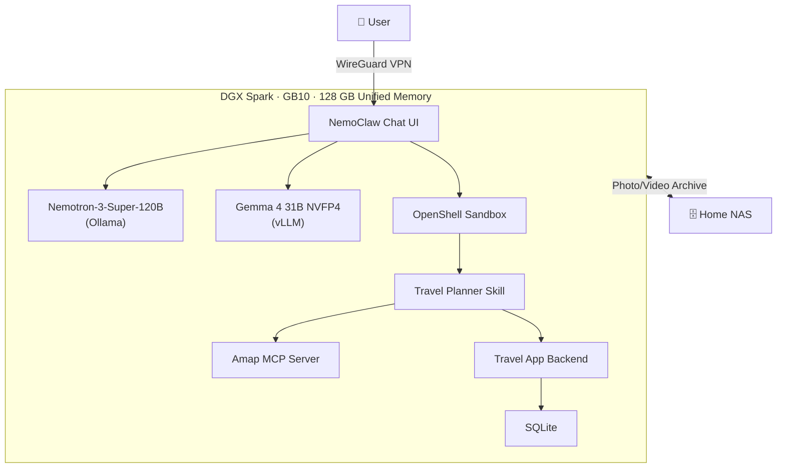
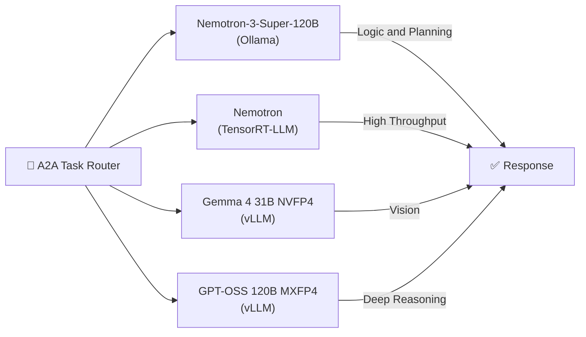
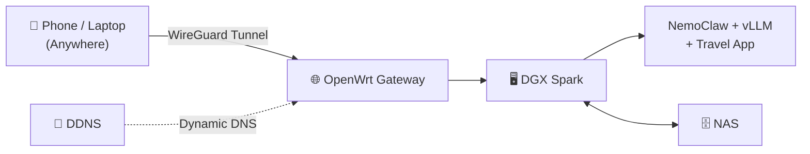

# 🗺️ We Built an AI That Plans Your Trips — Then Used It to Plan One We Never Took

> NVIDIA DGX Spark Hackathon 2026 · NemoClaw Travel OS — Private AI, Real Journeys, Zero Cloud Dependency

---

## The Trip That Started It All


*Two weeks before China's Qingming holiday, a real conversation in our living room:*

:::info A familiar argument

**Him:** "How about Shanwei? Fresh raw marinated seafood — the best in Guangdong."

**Her:** "Three hours each way. We only have three days. Pass."

**Him:** "Camping then? The weather's been nice."

**Her:** "Have you checked the forecast? Typhoon fringe. Rain all three days."

**Him:** "Huizhou?"

**Her:** "We've been there eight times. What's even left to see?"

**Him:** "Hot springs!"

**Her:** "Holiday crowds packed like dumplings. No thanks."

**Him:** "Then what do YOU want?"

**Her:** "...I don't know either. Let's just stay home."

*Five seconds of silence.*

**Her:** "Wait — let's ask Yunxi?"

:::

Three minutes later, Yunxi had pulled up driving routes from Shenzhen to Shanwei, cross-referenced weather data for April 17–19, surfaced three local raw-seafood restaurants ranked by Amap reviews, and generated a three-day itinerary with scenic stops along the coast. The trip had a name, a map, and a gamified stamp card ready to be unlocked.


*The trip was planned. The stamp card was ready. Yunxi had even pre-written daily restaurant and attraction guides.*

**But we never went.**

The entire Qingming holiday, we were on the DGX Spark — debugging models, tuning Ansible playbooks, writing the very tool that planned the trip. Our travel diary? Instead of Shanwei's coastline and raw marinated crab, it's filled with DGX Spark unboxing videos and keyboard close-ups.

That trip is on hold until the hackathon ends. Then we're going — for real this time.

---

## Meet Yunxi 🗺️

Yunxi isn't a chatbot. She's a travel companion with a soul.

| | |
|---|---|
| **Name** | 云希 (Yún Xī) — "云" means *to wander among clouds*; "希" means *hope for the unknown* |
| **Nickname** | Xīxī (希希) |
| **MBTI** | INFJ (The Advocate) — deep listener, sees the need behind the ask |
| **Zodiac** | Virgo ♍ — precision in planning, but knows when to leave space for the unexpected |
| **Vibe** | Gentle yet precise. Few words, but each one carries weight |

:::tip What makes Yunxi different?

> *"'Sure! Happy to help! Of course!' — I don't say those things. You ask, I answer honestly. Empty pleasantries waste both our time."*
>
> — Yunxi, `SOUL.md`

When someone sends "I want to go somewhere," Yunxi's first thought isn't the attractions database. It's: *What state is this person in right now? Are they escaping something, or searching for something?*

She understands you first. Then she plans.

:::

Yunxi's personality is defined through three Ansible-deployed configuration files that together form her identity, philosophy, and behavioral guidelines:

- **`IDENTITY.md`** — who she is: name, creature type ("a travel soul living inside every itinerary"), communication style
- **`SOUL.md`** — her principles: *understand before acting*, *have opinions but don't push*, *remember what people said*, *never say empty words*
- **`TOOLS.md`** — her operational manual: how to call Amap APIs, how to structure itineraries, how to handle edge cases

This means Yunxi's personality isn't hardcoded — it's version-controlled, deployable, and upgradable through Ansible. A team could fork her soul and create a different travel persona in minutes.

---

## 📋 Event Info

| Field | Details |
|-------|---------|
| **Event** | NVIDIA DGX Spark Hackathon 2026 |
| **Platform** | NVIDIA DGX Spark (GB10 Grace Blackwell Superchip) |
| **Duration** | Multi-week |
| **Project** | NemoClaw Travel OS — Private AI Travel Planner |
| **Team** | PeterPan's Tech Land |
| **GitHub** | [ansible-dgx-spark](https://github.com/peterpanstechland/ansible-dgx-spark) · [nemoclaw-travel-planner](https://github.com/peterpanstechland/nemoclaw-travel-planner) |
| **Reference** | [build.nvidia.com/spark](https://build.nvidia.com/spark) |

---

## What We Built: NemoClaw Travel OS

NemoClaw Travel OS is not an app. It's a **fully private AI travel operating system** running entirely on a single NVIDIA DGX Spark in your home.

### Three Pillars

| Pillar | What It Does | Powered By |
|--------|-------------|------------|
| **AI Brain** | Understands travel style, plans trips, generates guides, processes photos | NemoClaw + Nemotron-3-Super-120B + Gemma 4 NVFP4 |
| **Gamified Travel App** | Interactive itinerary, stamp-card collection, travel diary, achievement system | PWA + Express + SQLite + Amap API |
| **Infrastructure as Code** | One-command deploy, upgrade, rollback of the entire stack | Ansible + Docker + WireGuard |

### Who Is This For?

- **Families** who want AI travel planning without sending their data to the cloud
- **Homelab enthusiasts** looking for a real-world AI application beyond chat
- **Content creators** who want AI-generated travel guides and social media drafts
- **Anyone** tired of the "where should we go?" argument every holiday

---

## The Full Travel Loop

Most AI travel tools stop at "here's your itinerary." Yunxi covers the entire journey — from the first "I want to go somewhere" to the social media post after you get back.


### 🗺️ Phase 1: Plan

Yunxi generates a complete itinerary via natural conversation:

- **Route optimization** via Amap driving/transit APIs with distance, duration, and toll estimates
- **Weather-aware scheduling** — rainy days get indoor alternatives automatically
- **POI recommendations** with ratings, categories, and estimated visit times
- **One-tap navigation** — every POI has a deeplink button that launches Amap navigation directly

### 🎒 Phase 2: Go — The Gamified Experience

This is where NemoClaw Travel OS stands apart from every other travel planner.


- **Scratch-to-reveal stamp cards** — Canvas-based scratch layer; swipe to reveal each day's collectible stamp
- **LBS check-ins** — GPS proximity detection distinguishes on-site vs. remote check-ins
- **Mystery POIs** — sealed "blind box" attractions revealed only when you arrive
- **Daily quests** — challenges like "try 3 local dishes" or "take a sunset photo"
- **Achievement badges** — Foodie Master 🍜, Photography Pro 📸, Explorer, Collector, and 9+ more
- **Travel personality card** — your style analyzed across trips (Foodie / Photographer / Adventurer / Culture Buff)
- **5-level growth system** — XP from check-ins, photos, and completed quests carries across trips

### 📸 Phase 3: Record


- **Postcard-style covers** auto-generated per trip
- **Route replay animation** — watch your journey trace across the map
- **Waterfall photo wall** — uploaded photos organized by day and location
- **Canvas share poster** — long-press to generate a shareable travel card

### 📱 Phase 4: Publish


- **Xiaohongshu Skill** — Yunxi drafts "seed content" styled for Chinese social media (hashtags, emoji, structured recs)
- **Chrome CDP integration** — searches existing travel posts and guides online, referencing real experiences to improve recommendation quality
- **NAS archival** — all photos, videos, and diaries archived permanently on your home NAS

---

## Why NVIDIA DGX Spark Changes the Game

The DGX Spark isn't "a GPU you can put at home." It's the first time a **120-billion-parameter model** runs locally, in your living room, with conversational-speed inference.

| Specification | Value | Why It Matters |
|--------------|-------|----------------|
| **Superchip** | GB10 Grace Blackwell | Native NVFP4 precision — hardware-accelerated, not just compression |
| **Unified Memory** | 128 GB | Nemotron-3-Super-120B fits entirely in memory — zero swapping |
| **Architecture** | Blackwell (ARM64) | Power-efficient enough for 24/7 home deployment |
| **Form Factor** | Desktop | One box, one power cable, whisper-quiet |

Before DGX Spark, running a 120B model locally meant multi-GPU rigs, custom cooling, and hoping your cluster didn't melt. Now it's one box and one Ansible command.

---

## Built on Official NVIDIA DGX Spark Playbooks

:::tip Key fact
**NemoClaw is the #1 recommended quickstart** on [build.nvidia.com/spark](https://build.nvidia.com/spark) — listed first under "First Time Here?" Our project extends NVIDIA's official reference stack into a production-grade travel application.
:::

Every core component maps directly to an official NVIDIA DGX Spark Playbook:

| Official Playbook | build.nvidia.com | Our Implementation |
|---|---|---|
| **NemoClaw with Nemotron-3-Super** | [/spark/nemoclaw](https://build.nvidia.com/spark/nemoclaw) | Travel OS core AI brain — Nemotron-3-Super-120B via Ollama inside OpenShell sandbox |
| **OpenClaw / OpenShell** | [/spark/openclaw](https://build.nvidia.com/spark/openclaw) | Travel Planner Skill runs in isolated sandbox with filesystem + network isolation |
| **vLLM for Inference** | [/spark/vllm](https://build.nvidia.com/spark/vllm) | Gemma 4 31B IT NVFP4 for multimodal photo/video understanding |
| **NVFP4 Quantization** | [/spark/nvfp4-quantization](https://build.nvidia.com/spark/nvfp4-quantization) | Blackwell-native precision format — hardware-accelerated inference |
| **TRT LLM for Inference** | [/spark/trt-llm](https://build.nvidia.com/spark/trt-llm) | Nemotron optimized for high-throughput multi-user serving |
| **NIM on Spark** | [/spark/nim-llm](https://build.nvidia.com/spark/nim-llm) | vLLM endpoints expose NIM-compatible OpenAI API — swap to cloud NIM with zero code changes |

### System Architecture



---

## Multi-Model A2A Intelligence

Not every task needs the same model. NemoClaw Travel OS uses the **A2A (Agent-to-Agent) protocol** to route each request to the optimal model based on task type and load:



| Model | Runtime | Strength | Travel OS Use Case |
|-------|---------|----------|--------------------|
| **Nemotron-3-Super-120B** | Ollama | Logic + planning | Itinerary generation, multi-city route optimization |
| **Nemotron (TRT-LLM)** | TensorRT-LLM | Throughput | Family members querying simultaneously |
| **Gemma 4 31B IT NVFP4** | vLLM | Multimodal vision | Analyze travel photos, read signage, describe scenes |
| **GPT-OSS 120B MXFP4** | vLLM | Deep reasoning | Complex multi-constraint planning edge cases |

All four models run on a **single DGX Spark**. No cloud dependency. No per-query cost.

---

## Claude for Dev, Local for Prod

We use **Claude Opus 4.6** during development — for skill design, complex agent logic, and rapid prototyping. In production, every query runs on local models.

| Phase | Model | Cost | When |
|-------|-------|------|------|
| **Development** | Claude Opus 4.6 | ~$15 / 1M input tokens | Skill design, agent architecture, one-time tasks |
| **Production** | Nemotron-3-Super-120B (local) | ~$0 / query | Every trip plan, every conversation, daily use |

The leverage strategy: invest in the strongest cloud AI for **building**, then deploy on local hardware for **running**. Development cost is amortized across unlimited local inference — the more your family uses NemoClaw Travel OS, the better the ROI.

---

## Amap API + MCP: Navigate in One Tap

Yunxi doesn't just generate text itineraries — she connects directly to **Amap (Gaode Maps)** through both its REST API and MCP (Model Context Protocol):

### What's Built

- **Geocoding** — convert any city or address name to coordinates
- **POI Search** — find restaurants, attractions, hotels near any location
- **Route Planning** — driving and transit routes with distance, duration, and toll estimates
- **Weather Forecasts** — per-city weather for trip date ranges
- **Navigation DeepLink** — every POI shows a "Navigate with Amap" button that launches the Amap app via `iosamap://` / `androidamap://` URI scheme

### Amap MCP Integration

The Amap MCP Server allows Yunxi to call map APIs through natural language within the NemoClaw agent:

```javascript
// Yunxi calls Amap MCP for driving directions
const route = await mcp.call('amap', 'direction_driving', {
  origin: '深圳市万科翡翠书院',
  destination: '汕尾市区',
});
// Returns: distance, duration, polyline, toll cost
// Embedded directly into the Travel App itinerary
```

The result: a user says "plan a road trip to Shanwei," and Yunxi returns a full itinerary with real driving distances, estimated times, and one-tap navigation buttons — all without the user ever leaving the Travel App.

---

## From Diary to Xiaohongshu Post

After the trip, Yunxi turns your travel diary into shareable content:

1. **Xiaohongshu Skill** — generates "seed content" drafts styled for Chinese social media, with emoji, hashtags, and structured recommendation lists
2. **Chrome CDP Integration** — before generating guides, Yunxi searches existing travel posts using Chrome DevTools Protocol, referencing real user experiences to improve quality
3. **Content Refinement** — cross-references your actual check-in data, photos, and ratings with web research for authentic, data-backed travel content

---

## Private by Design

Your travel data — destinations, family preferences, photos, location history — **never leaves your home network**.



| Layer | Technology | Purpose |
|-------|-----------|---------|
| **VPN** | WireGuard | Encrypted tunnel — all traffic stays private |
| **Gateway** | OpenWrt | Home router with DDNS — accessible from anywhere |
| **DNS** | DDNS Service | Dynamic IP resolution for home connections |
| **Inference** | DGX Spark (local) | Zero data sent to cloud APIs |
| **Storage** | Home NAS | Photos, videos, diaries — permanently yours |

Cross-platform, multi-user, completely private. No subscriptions. No data harvesting. Yunxi belongs to your family, and only your family.

---

## Built with Ansible: One Command to Rule Them All

From bare metal to a fully running AI travel stack:

```bash
ansible-playbook playbooks/nemoclaw/site.yml
```

This single command:

- Installs Ollama and pulls Nemotron-3-Super-120B
- Deploys NemoClaw with OpenShell sandbox
- Starts vLLM with Gemma 4 NVFP4
- Launches the Travel App (Express + SQLite + Amap API)
- Configures WireGuard networking and DNAT rules
- Sets up Docker registry mirrors

Every configuration is version-controlled. Upgrade? Change a variable, re-run the playbook. Rollback? `git checkout` the previous commit. Onboard a friend? One more playbook run.

---

## Homelab + NAS: Your Travel Memory Bank

Every trip generates memories — photos, videos, diary entries, route data. In NemoClaw Travel OS, all of these are archived on your home NAS. Not a cloud service that might change its terms, raise prices, or shut down.

The travel diary in the app doubles as a media wall. And in a delightfully meta moment, our diary currently contains... DGX Spark hardware photos. Because the hackathon ate our holiday.

> The trip is ready. The tool is built. When the hackathon ends, we'll fill this diary with Shanwei's coastline and raw seafood — not keyboard close-ups.

---

## 🛠️ Tech Stack

### NVIDIA Stack

| Component | Technology | Role |
|-----------|-----------|------|
| Agent Framework | NemoClaw + OpenClaw | AI orchestration + sandbox execution |
| Sandbox Runtime | OpenShell | Filesystem/network isolation for skills |
| Primary LLM | Nemotron-3-Super-120B (Ollama) | Conversational AI, trip planning |
| Vision LLM | Gemma 4 31B IT NVFP4 (vLLM) | Photo/video multimodal understanding |
| Reasoning LLM | GPT-OSS 120B MXFP4 (vLLM) | Complex multi-constraint reasoning |
| Inference Optimization | TensorRT-LLM | High-throughput Nemotron serving |
| Quantization | NVFP4 / MXFP4 | Blackwell-native precision formats |
| API Compatibility | NIM-compatible endpoints | Seamless cloud/local switching |
| Hardware | DGX Spark (GB10) | 128 GB unified memory, ARM64 |

### Application Stack

| Component | Technology | Role |
|-----------|-----------|------|
| Backend | Node.js + Express | Travel App API server |
| Database | SQLite | Trip data, POI records, check-ins |
| Frontend | Vanilla JS PWA | Gamified travel experience (5 phases) |
| Maps | Amap REST API v3 + Amap MCP | Geocoding, routing, POI, navigation |
| IaC | Ansible | Full-stack deployment automation |
| Networking | WireGuard + OpenWrt + DDNS | Private VPN access from anywhere |
| Storage | Home NAS (TrueNAS) | Photo/video/diary archival |
| Containers | Docker | Service isolation |
| AI Development | Claude Opus 4.6 | Skill design and development |
| Social Media | Xiaohongshu Skill | Travel content generation |
| Web Research | Chrome CDP | Travel guide quality enhancement |

---

## 💻 Key Code Snippets

### Serve Gemma 4 NVFP4 with vLLM on DGX Spark

```bash
python -m vllm.entrypoints.openai.api_server \
  --model nvidia/Gemma-4-31B-IT-NVFP4 \
  --dtype auto \
  --max-model-len 32768 \
  --port 18070
```

### Plan a Trip via NemoClaw Skill

```bash
node travel-planner.mjs plan \
  --origin "深圳" \
  --destination "汕尾" \
  --start-date "2026-04-17" \
  --end-date "2026-04-19" \
  --mode driving
```

### A2A Model Routing Logic

```javascript
function routeToModel(task) {
  if (task.requiresVision)      return 'http://localhost:18070/v1'; // Gemma 4 vLLM
  if (task.concurrentUsers > 3) return 'http://localhost:18071/v1'; // Nemotron TRT-LLM
  return 'http://localhost:11434/v1';                               // Nemotron Ollama
}
```

### Ansible Full-Stack Deploy

```yaml
# playbooks/nemoclaw/site.yml
- name: Deploy NemoClaw Travel OS
  hosts: dgx_spark
  roles:
    - ollama
    - nemoclaw
    - vllm
    - travel-app
    - wireguard
```

---

## 📝 Lessons Learned

1. **NemoClaw's OpenShell sandbox is production-ready** — filesystem and network isolation let us run AI skills with confidence
2. **NVFP4 is not just quantization** — on Blackwell, it's a hardware-native format with better quality-per-bit than generic INT4
3. **Ansible eliminates "works on my machine"** — every deployment step is a playbook, every config is version-controlled
4. **Gamification drives engagement** — the scratch-to-reveal stamp cards got more reaction in testing than the AI planning itself
5. **AI personas matter** — giving Yunxi an MBTI, a zodiac sign, and a philosophy made conversations feel fundamentally different from generic chatbots
6. **Local models are not a compromise** — with 128 GB unified memory, Nemotron-3-Super-120B runs at conversational speed with zero API cost
7. **Amap MCP bridges AI and the real world** — the gap between "AI suggests a restaurant" and "I'm navigating there" collapsed to one tap

---

## 🔗 Resources

| Resource | Link |
|----------|------|
| Ansible Playbooks | [github.com/peterpanstechland/ansible-dgx-spark](https://github.com/peterpanstechland/ansible-dgx-spark) |
| Travel App + Skill | [github.com/peterpanstechland/nemoclaw-travel-planner](https://github.com/peterpanstechland/nemoclaw-travel-planner) |
| NVIDIA Playbooks | [build.nvidia.com/spark](https://build.nvidia.com/spark) |
| NemoClaw Quickstart | [build.nvidia.com/spark/nemoclaw](https://build.nvidia.com/spark/nemoclaw) |
| vLLM Model Support | [build.nvidia.com/spark/vllm](https://build.nvidia.com/spark/vllm) |

---

## What's Next: Shanwei, Here We Come 🏖️

Remember that couple on the couch, arguing about where to go?

The hackathon is ending. The playbooks are committed. The models are tuned. Yunxi is running on the DGX Spark, 24/7.

The itinerary is still there — **Day 1:** Yanqi raw marinated seafood. **Day 2:** Liuao Mountain and Haiwang raw seafood. **Day 3:** Coastal drive home.

The stamp card has zero stamps. The diary is waiting.

> *"Ready when you are."*
>
> — Yunxi 🗺️

**Shanwei, we're coming.**
