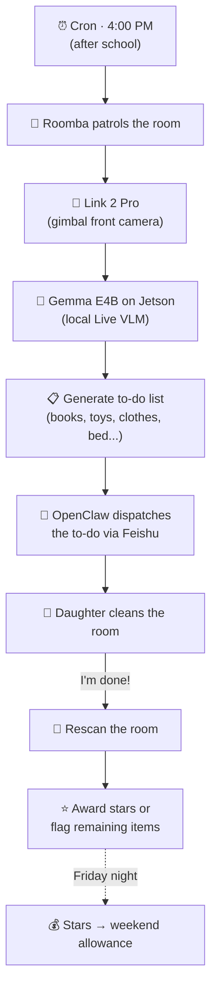
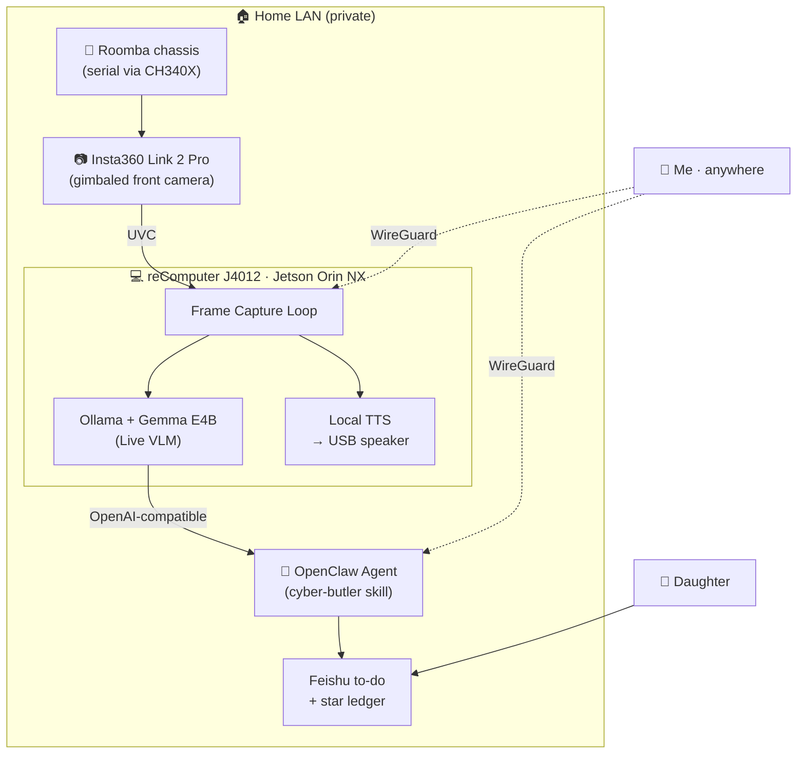

# Roomba-VLLM: A Cyber Butler That (Says It) Watches My Daughter's Room

> Attrax Spring Hackathon 2026 · Shenzhen · Insta360 Cameraman Track · Builder: PeterPan
>
> Cameraman Award · TOP 1/200 Outlier · April 26, 2026

---

## The Pitch (Public Version)

Every weekend my wife and I have the same conversation:

> "Did you see her room?"
> "Yeah."
> "I told her to clean it three times."
> "She'll do it after this episode."

She — my **8-year-old daughter** — never does it after this episode.

Here's what her room actually looks like:

What I claim I need is a **silent supervisor** who walks into her room, looks around, says "the books on the floor and the stuffed goose on the lower bunk need to go back," waits until she actually does it, double-checks, and gives her a star. Stars become weekend allowance. No yelling. No SaaS. No cloud uploads of an 8-year-old's bedroom.

So I built one. In 24 hours. At a hackathon. And it ended up winning the Insta360 Cameraman Award.

> *(There's a different version of why I really built this. It's at the very bottom of the post. Read on.)*

---

## Meet Roomba-VLLM

| | |
|---|---|
| **Name** | Roomba-VLLM — a roaming cyber butler riding a Roomba chassis with a VLM brain |
| **Job (the official one)** | Daily room inspections + to-do list generation + star-based reward system |
| **Personality** | Quiet, methodical, never raises its voice. Logs everything. |
| **Belongs to** | An 8-year-old. Allegedly. |
| **Built in** | 24 hours of real coding (after I burned a day jamming with a robotic arm — see end of post) |
| **Runs on** | Jetson Orin NX in our home network. Zero cloud dependency. |

The whole thing is a chunk of metal, plastic, and silicon I assembled by hand on a hackathon table. Nothing fancy — but the feedback loop it enables is the part that matters.

---

## Event Info

| Field | Details |
|-------|---------|
| **Event** | Attrax Spring Hackathon 2026 (Attrax 春潮黑客松) |
| **Track** | Insta360 Cameraman Track |
| **Hardware Sponsor** | JLCPCB (嘉立创) — sponsored the USB-to-serial debugger that ended up in the build |
| **Location** | Shenzhen · Livehouse MAO |
| **Hackathon Window** | April 23 – April 26, 2026 |
| **Project Window** | April 24 – April 25, 2026 (advertised 48 hours, actual coding 24 hours) |
| **Builder** | PeterPan (solo entrant) |
| **Result** | 🥇 **Cameraman Award · TOP 1/200 Outlier** (X5 Kit + GO Ultra Kit + ACE Pro 2) |
| **Project Repo** | [github.com/peterpanstechland/roomba-vllm](https://github.com/peterpanstechland/roomba-vllm) |

The venue itself is the kind of hackathon you remember:

And the scale, in case "TOP 1/200" felt abstract — here's the entire project map for this round:

---

## My "Teammates"

I went solo. Sort of.

I came with two cardboard standees of my wife and daughter — labeled **"队友 1 号 / 队友 2 号"** ("Teammate #1 / Teammate #2") — and propped them next to my workstation for the entire 48 hours.

People came over to ask if those were real teammates. They are real teammates — just on the cardboard layer of the OSI stack.

The plot twist came at the awards ceremony — **the actual humans showed up**. Daughter and wife came to the venue and we collected the trophy together. The cardboard team became a real team for the photo. (Award photo at the end.)

---

## What It Actually Does — The Daily Loop

Every weekday afternoon, after school:

1. **Patrol**. The Roomba chassis rolls around the room with the Link 2 Pro gimbaled front camera streaming video back to the Jetson Orin NX.
2. **Perceive**. Gemma E4B (running on Ollama, locally on the Jetson) reads the frames as a Live VLM and writes down what's out of place.
3. **Dispatch**. The already-deployed OpenClaw on my homelab takes the structured output and pushes a to-do list to Feishu (the same setup I use for my [Cyber Boss project](/docs/hackathons/2026/cyber-boss)).
4. **Verify**. When my daughter says "I'm done," the butler rescans and either awards stars or flags what's still out of place.
5. **Reward**. Friday night, stars get tallied. Stars become weekend allowance. The butler is the auditor; I'm just the bank.

No human supervision in the loop. No data leaves the LAN. The butler sees only what a butler should see.

---

## Hardware Stack

The build is a small parade of cameras, compute, and printed plastic:

### Insta360 Link 2 Pro — the front-facing eye

The gimbal does the framing for me — auto-tracking means I don't write a tracking loop. UVC plug-and-play to the Jetson.

### Insta360 X5 — the 360° eye (next phase)

I wasn't planning to use the X5 in the demo. Then I found out about DAP halfway through Day 2 and immediately re-scoped — more on that in the *X5 + DAP* section below.

### reComputer J4012 — Jetson Orin NX, the brain

Enough VRAM to keep Gemma E4B warm; quiet enough to live in our living room. The heatsink wing sticker is non-functional. Spiritually load-bearing.

### USB speaker — local TTS output

When the butler decides "books on the floor," it speaks the line locally over this speaker. The lobster on top is the OpenClaw mascot — I'm running on the same OpenClaw stack as [Cyber Boss](/docs/hackathons/2026/cyber-boss).

### JLCPCB sponsored CH340X USB-to-serial — the unsung hero

Big shoutout to **JLCPCB (嘉立创)**, this hackathon's hardware sponsor. They handed out CH340X USB-to-serial debuggers, and one of them ended up doing real work in the build — I needed to talk to the Roomba chassis over its serial port to script patrol routes, and this little board just worked. Plug, flash, talk.

### TinkerCAD-designed enclosure on Bambu Lab X1C

Designed in TinkerCAD on the venue table, printed in PLA on my own Bambu Lab X1C (which I brought with me — best decision of the weekend). Two iterations in one print night.

---

## Software Stack

| Layer | Technology | Role |
|-------|-----------|------|
| **Local Live VLM** | Ollama + Gemma E4B | Reads camera frames, describes the room, lists what's out of place |
| **Agent Orchestration** | OpenClaw (already deployed at home) | Daily cron, Feishu dispatch, star ledger, rescan logic |
| **Camera Streaming** | Insta360 Link 2 Pro UVC + custom capture loop | Pulls frames at scan time, hands them to the VLM |
| **Roomba Bring-up** | CH340X USB-to-serial (JLCPCB sponsored) | Talks to the Roomba chassis to script patrol routes |
| **Local Voice** | USB speaker + on-device TTS | Speaks the to-do out loud in the room |
| **Remote Access** | WireGuard | Inspect logs and trigger ad-hoc scans from outside the home network |
| **Inference Host** | Jetson Orin NX (reComputer J4012) | Keeps the model warm; serves OpenAI-compatible API on the LAN |

The honest detail: **the OpenClaw layer was not built at the hackathon**. It's the same OpenClaw stack I run at home for [Cyber Boss](/docs/hackathons/2026/cyber-boss). Roomba-VLLM is a new `cyber-butler` skill that plugs into that existing orchestration. Reusing this saved me roughly half the 24 hours.

> **Why this matters (and why I keep saying it):** if you're a hackathon participant, **the right pre-existing stack is half the hackathon**. Don't try to build the orchestration layer in 24 hours; build the *novel* part on top of it.

---

## Architecture

Two clean separations:

- **Edge (Jetson)** owns perception. It sees the room, runs the VLM, emits structured findings, and speaks them.
- **Agent (OpenClaw)** owns judgment. It schedules patrols, decides what to dispatch, and runs the star ledger.

Everything stays inside the LAN. WireGuard is the only door from outside, and it lands on services I already trust.

---

## The 24-Hour Sprint

The official project window was **48 hours** (April 24 – April 25). I burned the first 24 of them on a robotic arm that had nothing to do with my project (full story at the end of the post). Here's what the *actual* delivery timeline looked like once I started:

| Hour | What Happened |
|------|---------------|
| **T+0** | Realized I'd burned a day. Scoped down to "must demo a daily loop end-to-end." |
| **T+0 → T+3** | TinkerCAD enclosure design v1 → Bambu X1C print job started. |
| **T+3 → T+8** | Wired Link 2 Pro → Jetson over UVC. Got first frames into Gemma E4B locally. Brought the Roomba chassis up over JLCPCB's CH340X. |
| **T+8 → T+12** | Wrote the `cyber-butler` skill on top of existing OpenClaw. Reused Feishu dispatch from Cyber Boss. |
| **T+12 → T+15** | First end-to-end run. The VLM saw "books on the floor" — actually correct. |
| **T+15 → T+18** | Print v2 of the enclosure (the camera tower needed extra clearance for the gimbal). |
| **T+18 → T+22** | Mounted everything on the Roomba chassis. Tuned cron timing and the rescan loop. |
| **T+22 → T+24** | Demo recording, slides, submission. |

Three things saved me:

1. **OpenClaw was already running at home.** I just wrote a new skill.
2. **Bambu X1C is fast.** Two enclosure iterations in one print night.
3. **Live VLM with Gemma E4B is good enough.** I didn't need a 70B model to recognize "shoes on the bed."

---

## Why X5 + DAP Is the Next Unlock

I came to the hackathon planning to demo only the **front-camera + remote teleop** version of the butler (Link 2 Pro doing the work). Halfway through Day 2 I learned about Insta360 Research Team's **DAP** (Depth Any Panoramas) — a 360° panoramic depth foundation model — and realized this changes the project's ceiling.

| Capability | Before DAP | With DAP |
|-----------|-----------|----------|
| **Visual coverage** | Front cone (Link 2 Pro) | Full 360° (X5) |
| **Spatial perception** | RGB only — VLM has to guess depth | RGB + dense depth from a single equirectangular frame |
| **Navigation** | Tele-op or hand-tuned bumpers | Depth → SLAM map → autonomous navigation |
| **Failure mode** | "Couldn't see the toy under the bed" | "Saw it, knew it was 0.4m below the camera" |

Live X5 panorama from the hackathon floor:

Same frame, after running through DAP's BF16 1024×512 inference pipeline:

> **What I finished at the hackathon:** DAP deployment on the Jetson + successful reproduction on test panoramas (the depth map above is the actual on-site reproduction).
>
> **What's left for after the event:** intrinsic / extrinsic calibration on the X5 mount, then plumbing the depth maps into a SLAM map and turning the butler into a real autonomous agent. The roadmap is clear; only the calibration time is missing.

The X5 + DAP pair takes the butler from "a camera that talks" to "a robot that knows where everything is." That's the difference between a kitchen demo and a real cyber butler.

---

## Cameraman Is Accelerating Its Evolution

This project landed in an interesting week — Insta360 published its **2025 Annual Report · Letter to Investors** ([the letter](https://mp.weixin.qq.com/s/Yplv0SzQNg4SEEa-6kfUtw), authored by CEO **Liu Jingkang / 刘靖康**) the same week I was finalizing the demo. The framing in that letter is exactly the framing my project ended up needing.

The letter contains a section titled **"AI 赋能影像技术，Cameraman 加速进化"** (AI-Empowered Imaging, Cameraman Accelerating Its Evolution). The thesis is a clean three-part decomposition:

> **AI = the brain.** Lets the camera perceive space, intent, and the world.
>
> **Camera tech = the eyes.** Imaging across focal lengths.
>
> **Drone / gimbal = the limbs.** Free movement and angle-finding in space.
>
> Insta360 Cameraman is racing to put the last puzzle piece — the AI brain — in place.

That's *literally* the architecture of Roomba-VLLM:

- **Eyes** = Insta360 Link 2 Pro (now) → Insta360 X5 (next)
- **Limbs** = the Roomba chassis (and a gimbal on the Link 2 Pro)
- **Brain** = Gemma E4B + OpenClaw on the Jetson

The same letter section also calls out the open-source projects from [Insta360 Research Team](https://github.com/Insta360-Research-Team) that make the brain's *spatial* understanding real — and the user-side data showing why this matters at scale:

| Project | What It Does | Why It Matters for a Cyber Butler |
|---------|--------------|-----------------------------------|
| [**AirSim360**](https://github.com/Insta360-Research-Team/AirSim360) | Panoramic simulation platform within drone view | Train and evaluate spatial agents in simulation before risking the chassis |
| [**DAP**](https://github.com/Insta360-Research-Team/DAP) | Depth Any Panoramas — foundation model for panoramic depth | Single 360° frame → dense depth, the spine of indoor SLAM |
| [**DiT360**](https://github.com/Insta360-Research-Team/DiT360) | High-fidelity panoramic image generation (CVPR 2026) | Synthetic training data for rare household scenes |
| [**DDGS**](https://github.com/Insta360-Research-Team/DDGS) | Depth-and-Density Guided Gaussian Splatting | Sparse-view 3D reconstruction — useful for mapping a room from a few panoramas |

Together these are not "research demos." They're the building blocks of an embodied panoramic agent — and Insta360 has open-sourced almost all of it.

---

## How to Apply for the Insta360 SDK (For Hackers Without a Camera)

Since this whole project depends on the official Insta360 SDK, here's the actual application flow — the same one I used. If you don't already own a camera, you can still get hands-on through hackathons sponsored by Insta360 (more on that below).

### Step 1 — Open the Developer Portal

Go to [insta360.com/cn/developer/home](https://www.insta360.com/cn/developer/home) and click **立即申请** (Apply Now).

### Step 2 — Fill in the Application Form

Pick whether you own a camera (and which model), choose individual or enterprise, and write a short reason for needing the SDK. Be specific — "exploring DAP-based panoramic perception for a household cyber butler" works much better than "I want to play with it."

### Step 3 — Track Your Application

Once submitted, return to the same portal and click **申请管理与下载** (Application Management & Download).

### Step 4 — Download the SDKs Once Approved

Approval is fast (mine came in within a day). Once you see **审核通过** (Approved), every platform's SDK is one click away — Android, iOS, macOS, Windows.

If you don't have a camera and don't want to buy one yet, the path I took is realistic: **join an Insta360-sponsored hackathon**. The Cameraman Award alone is X5 + GO Ultra + ACE Pro 2 — that's three flagship cameras and effectively a way to bootstrap a serious panoramic perception lab in one weekend.

---

## The Cameraman Award

The cardboard teammates were upgraded to real teammates for the photo:

And one more from the floor right after the call-up:

> **TOP 1/200 Outlier · Insta360 Cameraman Award**
>
> X5 Kit + GO Ultra Kit + ACE Pro 2

The win wasn't just a trophy — it was a tool unlock. With the X5 in hand I can finish the DAP → SLAM → autonomous navigation pipeline I scoped out on the last day. Roomba-VLLM is going from "demo-grade prototype" to "actually-runs-in-our-living-room" because of this hardware.

---

## Lessons from a 24-Hour Sprint

1. **Reuse the orchestration layer.** OpenClaw was already running at home; I only had to write a new skill. Spending 24 hours building Feishu integration from scratch would have cost me the demo.
2. **Live VLMs are good enough for "is this room messy?"** I tested Gemma E4B against the actual mess — it nails "books on floor / clothes on bed / toys not in box." You don't need a 70B model.
3. **A panorama camera is not just "a wider lens."** It's a 360° sensor that, paired with DAP, gives you depth without depth hardware. That's the real unlock.
4. **Bring your own 3D printer.** The Bambu X1C lived under the hackathon table and printed two enclosure iterations in one night. Without it I'd have shipped a worse mount.
5. **Hardware sponsors save the unglamorous half.** The JLCPCB CH340X is the kind of part you don't think about until you need it. Hackathons that hand out actually-useful parts are gold.
6. **Cron + Feishu beats voice UI.** An 8-year-old doesn't need a wake word. She needs a card on Mom's phone that says "your room scan starts in 5 minutes."
7. **Local-only is a feature, not a constraint.** Nothing about my daughter's bedroom should ever leave the LAN. WireGuard is the only door, and only for me.
8. **Hardware events scope themselves.** The moment I learned about DAP, the project's ceiling moved. Don't refuse an unlock just because you're already scoped — re-scope around it.

---

## Resources

| Resource | Link |
|----------|------|
| **Project repo** | [github.com/peterpanstechland/roomba-vllm](https://github.com/peterpanstechland/roomba-vllm) |
| **Insta360 Developer Portal** | [insta360.com/cn/developer/home](https://www.insta360.com/cn/developer/home) |
| **Insta360 SDK / Camera open-source org** | [github.com/Insta360Develop](https://github.com/Insta360Develop) |
| **Insta360 Research Team (panoramic AI)** | [github.com/Insta360-Research-Team](https://github.com/Insta360-Research-Team) |
| **Insta360 2025 Annual Report · Letter to Investors** | [mp.weixin.qq.com/s/Yplv0SzQNg4SEEa-6kfUtw](https://mp.weixin.qq.com/s/Yplv0SzQNg4SEEa-6kfUtw) |
| **JLCPCB (hardware sponsor)** | [jlcpcb.com](https://jlcpcb.com/) |
| **Cyber Boss (sister OpenClaw project)** | [/docs/hackathons/2026/cyber-boss](/docs/hackathons/2026/cyber-boss) |
| **2026 Hackathon Index** | [/docs/hackathons](/docs/hackathons) |

---

## Easter Egg #1: The Robotic Arm That Danced

The truth about my "48-hour project window": I burned the first 24 hours of it on a robotic arm.

**GaoQing Power (高擎动力)** had a robotic arm at the Attrax floor that I could not stop playing with. April 24, all day — that arm and I designed motion paths, replayed routines, and at one point I had it carry a soda can across the table because I could.

Then came the Live Jam at night — Attrax's all-night DJ set that runs through the hackathon. I rigged the robotic arm to **dance to the music**. Beat detection on the music feed → joint trajectories on the arm. It bobbed, it weaved, it punched the air on the drops.

Here it is, on the dance floor:

<video controls width="100%" preload="metadata" style={{maxWidth: '720px', display: 'block', margin: '1.5rem auto'}}>
  <source src="/video/hackathons/2026/roomba-vllm-robotic-arm-jam-1.mp4" type="video/mp4" />
  Your browser does not support the video tag.
</video>

And another angle — same arm, same DJ set, different drop:

<video controls width="100%" preload="metadata" style={{maxWidth: '720px', display: 'block', margin: '1.5rem auto'}}>
  <source src="/video/hackathons/2026/roomba-vllm-robotic-arm-jam-2.mp4" type="video/mp4" />
  Your browser does not support the video tag.
</video>

It was, genuinely, the coolest thing I built that whole week. It also had nothing to do with my actual hackathon submission.

I went to bed somewhere around 2 AM, woke up at 6, did the math, realized I had **24 hours** until submission, and *then* started building Roomba-VLLM. Everything else you read above happened in those 24 hours.

> If you're at a hackathon and a piece of hardware seduces you — let it. Just remember to set an alarm.
>
> Big shoutout to **GaoQing Power (高擎动力)** for bringing that arm. It deserved its own demo. Maybe next hackathon. 🤖🎶

---

## Easter Egg #2: Okay, Fine, I'll Drop the Act

You read 4,000 words of "I built a butler so my 8-year-old will clean her room."

Here's the room I actually care about:

**Truth is, this hackathon project wasn't really for my daughter.**

It was for me.

A grown-ass adult with a workshop that looks like the photo above doesn't need an 8-year-old's room as a problem statement. He needs an excuse to spend 24 hours playing with an Insta360 X5, a Jetson Orin NX, a CH340X serial debugger, OpenClaw skills, DAP depth foundation models, a robotic arm, a Bambu X1C printing through the night, and a hackathon DJ set.

The cleaning butler is real. It runs. It works. My daughter (allegedly) benefits.

But the actual feedback loop being trained here is **mine**: I patrol the workshop, the workshop generates a to-do list, I award myself stars, the stars become — well, they become *the next hackathon*.

> "Books on the floor. Stuffed goose on the bed. You missed the corner."
>
> *— The butler, talking about my daughter's room. Allegedly.*

---

**Roomba-VLLM is live in our living room. The X5 is on its way. SLAM is next.**

**And the 8-year-old's room is incidental. The workshop is the point.** 🛠️
