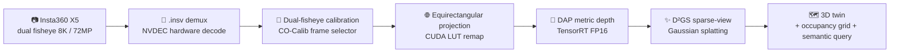
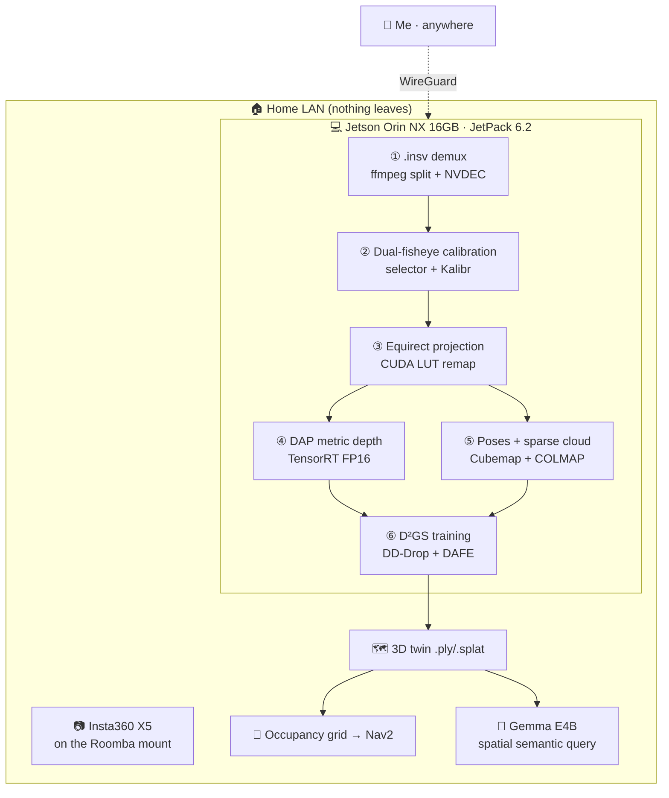
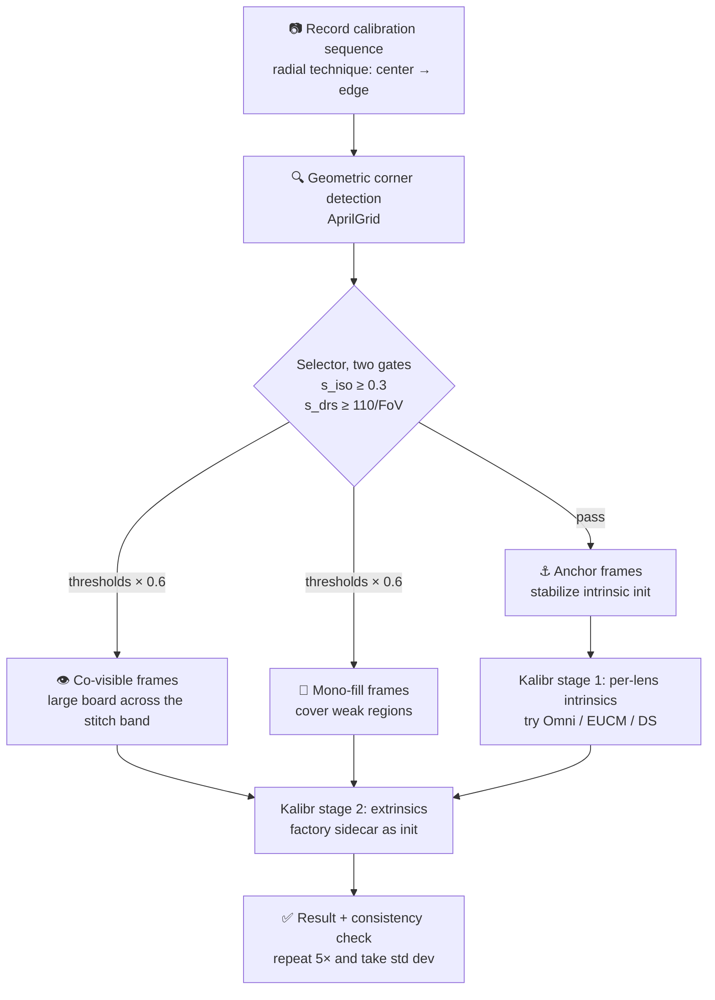

# PanoTwin: Turning a Room into an Edge-Side Gaussian-Splatting Digital Twin

:::info WIP — this write-up is still being finalized

**Status: work in progress.** The technical narrative is complete, but the performance re-measurement pass is not. Every row marked `⬜ TODO` in [Part 5.1](#51-measured-metrics) is still unmeasured. I'll backfill the numbers in place and drop this notice once that pass is done.

*Last updated: July 31, 2026*

:::

> **NVIDIA Jetson 2026 Developer Write-Up** · Hosted by the GPUS Developer Community
>
> **Development window: June 1 – July 28, 2026** (new project, not a rework of anything older)
>
> **Platform: NVIDIA Jetson Orin NX 16GB (reComputer J4012) · JetPack 6.2 · fully offline, nothing leaves the LAN**


---

## First: which numbers here are measured, and which aren't

:::warning An honest note about data

Code froze on July 28, but the **full performance re-measurement isn't finished yet**. So I won't fabricate numbers. Every metric that requires measurement lives in one place — [the metrics table in Part 5](#51-measured-metrics) — and anything marked `⬜ TODO` is **not measured yet**. I've written the collection command next to each one, and I'll backfill this post directly once they're done.

Every *other* number in this post has an explicit source: NVIDIA datasheet figures are labelled "official spec", paper figures are labelled "paper result (synthetic dataset)", and anything from my own board is labelled "measured on my unit". Please don't read the paper's success rates as *my* success rates on the X5 — those are two different experiments.

:::

---

## Project at a Glance

| Field | Details |
|-------|---------|
| **Project** | PanoTwin — a panoramic digital-twin pipeline |
| **One-liner** | Walk a 360° camera around a room, get a metric-scale Gaussian-splatting reconstruction, computed entirely on a Jetson |
| **Status** | **WIP** — code frozen July 28, 2026; performance re-measurement still in progress |
| **Development window** | June 1 – July 28, 2026 (~8 weeks, evenings and weekends, solo) |
| **Hardware** | NVIDIA Jetson Orin NX 16GB (Seeed reComputer J4012) + Insta360 X5 |
| **System stack** | JetPack 6.2 / L4T 36.4.3 · CUDA 12.6 · cuDNN 9.3 · TensorRT 10.3 · VPI 3.2 |
| **Core models** | DAP (Depth Any Panoramas, CVPR 2026) + D²GS (DDGS, ICLR 2026) + Gemma E4B (semantics) |
| **Key reference paper** | [CO-Calib: Observation Quality Matters (arXiv 2607.05777)](https://arxiv.org/html/2607.05777v1), HKUST Aerial Robotics |
| **Upstream project** | [Roomba-VLLM cyber butler](/docs/hackathons/2026/roomba-vllm) (Attrax Spring Hackathon 2026 · Insta360 Cameraman Award) |
| **Cloud dependency** | None. Capture, calibration, inference, reconstruction, and rendering all happen locally |

---

## Part 1: The Project and Where It Lands

### 1.1 Starting point: my cyber butler can see, but has no idea where anything is

In April I spent 24 hours at the Attrax Spring Hackathon building [Roomba-VLLM](/docs/hackathons/2026/roomba-vllm): a Roomba chassis, an Insta360 Link 2 Pro gimbal camera, and Ollama + Gemma E4B on a Jetson Orin NX. Every afternoon it patrols my 8-year-old's room, generates a to-do list ("the books on the floor need to go back"), and pays out stars that become weekend allowance. It won the Insta360 Cameraman Award, which is how I ended up with an X5.

That butler had one flaw I deliberately skipped over in the demo: **it has two-dimensional eyes and no three-dimensional memory.**

It can say "there are books on the floor," because a VLM recognized books in an RGB frame. But ask it three questions and it fails all three:

1. How far is that book from the door?
2. Is the stuffed goose on the edge of the lower bunk, or 40 cm under the bed?
3. Was anything in this spot yesterday?

The first two are **metric geometry** questions. The third is a **scene memory** question. A robot with nothing but monocular RGB can't answer either. It isn't an agent that acts in space — it's a camera that talks.

The day the hackathon ended, I left myself a line in that post:

> **What's left: intrinsic / extrinsic calibration on the X5 mount, then plumbing the depth maps into a SLAM map and turning the butler into a real autonomous agent. The roadmap is clear; only the calibration time is missing.**

PanoTwin is me finishing that sentence. And once I actually sat down to do the calibration, I found out how badly I'd underestimated the phrase "only the calibration time is missing" — Part 4 covers exactly how deep that hole goes.


### 1.2 Why none of the existing options worked

What I want sounds modest: **a metric-scale, queryable 3D basemap of an indoor space, produced by the robot itself.** I tried every off-the-shelf route, and each one dies somewhere specific:

| Existing approach | Where it dies |
|-------------------|---------------|
| **3D LiDAR SLAM** | A 3D LiDAR that can map an indoor space densely costs five figures; power and weight both blow past what a Roomba can carry. And LiDAR has no color, so the VLM gets no semantics |
| **iPhone / iPad LiDAR scanning** | Accuracy is fine, but **a human has to carry it**. The robot can't do it alone, coverage per pass is small, and the data lives in a phone — it never reaches my robot pipeline |
| **Cloud reconstruction services** | The rooms I want to scan are **my daughter's bedroom and my workshop**. Uploading that footage to someone else's servers was vetoed at home on step one. Also, my upstream bandwidth is not pushing 8K footage anywhere |
| **Monocular SLAM / monocular depth** | Indoor scenes are texture-poor (white walls, plain floors) with large rotational parallax; monocular SLAM drifts and has no scale. Monocular depth models give *relative* depth, which is useless for navigation |
| **Multi-camera pinhole rigs** | Covering 360° needs 4–6 cameras. Calibration complexity and cable complexity both explode, and none of it fits on a Roomba |

Mapped onto the usual pain-point list, this project hits nearly all of them: **existing solutions are expensive** (LiDAR), **data transmission is a privacy risk** (cloud reconstruction), **power and size are too high** (camera arrays, AGX-class compute), **cloud inference latency is too high** (online reconstruction services), and **existing devices aren't smart enough** (a Roomba only knows how to bump into walls).

### 1.3 What PanoTwin is

PanoTwin is a **three-stage pipeline running entirely on a Jetson Orin NX 16GB**. Input: panoramas shot by an Insta360 X5 from a handful of standing positions in a room. Output: a metric-scale 3D Gaussian splat scene (`.ply` / `.splat`) plus an occupancy grid you can hand to a navigation stack.



Each stage solves exactly one thing:

| Stage | The problem it solves | What it uses |
|-------|----------------------|--------------|
| **1 — Calibration** | Getting 200°-class fisheye intrinsics and extrinsics to actually converge. This is the foundation of everything downstream | Kalibr + my reproduction of the CO-Calib observation-quality frame selector |
| **2 — Depth** | Dense, **metric** depth from a **single panorama**, with no depth hardware at all | DAP (DINOv3-Large backbone) + TensorRT FP16 |
| **3 — Reconstruction** | A stable 3D scene from only a dozen or so panoramas (extremely sparse views) | D²GS's DD-Drop and DAFE, with depth priors from DAP |

### 1.4 What's novel here

Four things, and the first one is what I most want to share — I only found it after getting stuck:

**One: I translated a calibration paper's analysis into an executable capture technique.** CO-Calib's central finding is that multi-fisheye calibration failures are **not** primarily caused by low corner-detection recall, and **not** by uneven image-plane distribution, but by **ill-conditioned intrinsic initialization**. When observations occupy only a narrow radial band, the Jacobian directions of focal scale and fisheye projection-shape parameters become nearly collinear and can't be separated. For an engineer this is enormous: it means "fill the frame with the calibration board" is the **wrong instinct**, and the right instinct is "sweep the board **radially**, from the center of the image circle out to the edge." I implemented the paper's two frame-quality criteria in roughly 200 lines of Python, dropped them in front of Kalibr, and changed how I hold the board.

**Two: the X5's lens layout is harder than the hardest configuration in the paper.** The paper's stereo experiments go up to 120° relative yaw. The X5 is **back-to-back at 180°** — the co-visible region collapses to a narrow annular band along the stitch line. The closest analog in the paper is their Hex-Fisheye rig, where Kalibr failed on **all ten** sequences. So I couldn't copy the paper's procedure; I had to design a different way to collect co-visibility constraints for the 180° case (Part 3, Step 2).

**Three: a consumer 360° camera replaces the entire depth-sensing hardware stack.** One X5 exposure covers 360°. Paired with DAP, that's "one image, a full ring of metric depth." It's the natural capture device for sparse-view reconstruction: **one standing position does the work of a whole ring of pinhole cameras.** Twelve to sixteen positions cover a room.

**Four: the whole chain is offline.** From `.insv` demux to Gaussian-splatting training, everything runs on the Orin NX. Not a single frame leaves the LAN. That's not a nice-to-have privacy bonus — it's the **precondition** for this thing being allowed in my house.

### 1.5 Where it lands

| Scenario | What PanoTwin provides |
|----------|------------------------|
| **Home robot navigation (the main line)** | A 3D basemap for Roomba-VLLM — upgrading it from "can see" to "knows where things are and how far away" |
| **VLM spatial Q&A** | "Where's the goose?" stops being "on the bed" and becomes "on the edge of the lower bunk, 0.4 m above the floor, camera-frame (1.2, 0.4, 2.1)" |
| **Renovation / rental / insurance records** | Walk through once, keep a metric 3D archive you can measure and revisit later — and it stays on your own hardware |
| **Small-factory / server-room inspection** | Periodic reconstruction, diffed against the historical twin: "one extra box here, one missing panel there" |
| **Edge AI teaching material** | One chain that covers calibration, TensorRT deployment, and differentiable-rendering training — a complete Jetson case study |

---

## Part 2: Hardware, SDKs, Tools, and Models

### 2.1 Why it had to be the Orin NX 16GB


The conclusion first: **the gating spec for this pipeline is "16GB of unified memory," not compute.**

DAP's backbone is DINOv3-Large (ViT-L class, roughly 300M parameters). D²GS training has to keep Gaussian parameters, optimizer state, depth priors, and render intermediates resident simultaneously. On a Jetson both of those compete for the *same* LPDDR5 — there is no discrete VRAM, so **the GPU and CPU share one 16GB pool.** I tried it on an 8GB board: DAP inference alone barely fits, but the moment reconstruction training runs it OOMs, guaranteed.

Official specs for the Jetson Orin NX 16GB (from the Jetson Orin NX Series Modules Datasheet v1.7 and the JetPack 6.2 announcement):

| Spec | Standard mode | MAXN_SUPER |
|------|---------------|------------|
| **GPU** | 1024 CUDA cores + 32 Tensor cores @ 918 MHz | same silicon @ 1173 MHz |
| **INT8 (sparse / dense)** | 100 / 50 TOPS | 157 / 78 TOPS |
| **FP16** | 15 TFLOPS | 19 TFLOPS |
| **DLA** | 2× NVDLA v2, 40 / 20 TOPS | 80 / 40 TOPS |
| **CPU** | 8-core Arm Cortex-A78AE @ 2.0 GHz | same |
| **Memory** | 16GB 128-bit LPDDR5, 102.4 GB/s | same |
| **Power modes** | 10W / 15W / 25W | 40W |
| **Compute capability** | Ampere, `sm_87` | same |

MAXN_SUPER is the "Super mode" introduced in JetPack 6.2: the same board goes from 100 to 157 TOPS after a reflash, **with no hardware change**. The cost is thermal — a 40W envelope needs active cooling, and my original passive heatsink simply could not hold it (Part 4, difficulty 6).

Alternatives I actually compared:

| Candidate | Why not |
|-----------|---------|
| **Jetson Orin Nano 8GB (Super)** | 67 TOPS is genuinely enough for DAP inference, but 8GB cannot train D²GS. **Memory is a wall, not a performance curve** |
| **Jetson AGX Orin 64GB** | Runs everything, but several times the price, up to 60W, and physically won't fit on a Roomba chassis. Overkill for a home robot |
| **NVIDIA DGX Spark** | My other project, [NemoClaw Travel OS](/docs/hackathons/2026/nvidia-dgx-spark), runs on a Spark. It's excellent, but it's a **desktop AI workstation, not an edge device** — it's never riding a vacuum robot |
| **x86 + discrete RTX** | Faster reconstruction, obviously. But the whole premise is "the robot does it itself." Giving up mobility means giving up the project |

In one sentence: **Orin NX 16GB is the only intersection of "fits on a robot" and "can train a differentiable renderer next to a ViT-L."**

Three Orin NX features that mattered in practice and are easy to overlook at selection time:

- **NVDEC hardware decode.** The X5's `.insv` holds two H.265 streams; software-decoding 8K footage saturates all eight A78 cores. On NVDEC, decode costs almost no CPU.
- **Zero-copy unified memory.** Decoded frames can be mapped into CUDA directly as `NvBufSurface`, with no host round trip. At 8K, the bandwidth this saves is significant — 102.4 GB/s is the easiest ceiling to hit on this board.
- **Programmable power modes.** The same code runs online perception at 15W and offline reconstruction at 40W. That turns "quiet standby by day, full effort at night" into a single `nvpmodel` call.

### 2.2 Why the Insta360 X5


| X5 spec | Value | Why it matters here |
|---------|-------|---------------------|
| Sensors | Dual 1/1.28", f/2.0, 6mm equiv. | Enough SNR for indoor light; f/2.0 is friendly to household lighting |
| Video | 8K30 / 5.7K60 / 4K120 | At 5.7K and above, **two video tracks** live in one `.insv` |
| Stills | 72 MP (9504×4752), RAW DNG | **Static panoramas are the capture mode I ended up choosing** (Part 3, Step 0) |
| Build | Replaceable lenses, IP68 to 15 m | Bumps are routine on a robot; swappable lenses matter a lot |
| Raw data | `.insv` (dual H.265 + IMU track + protobuf calibration sidecar) | Determines the whole demux approach on Jetson |

The core reason is one sentence: **sparse-view reconstruction is starved for view coverage, and a 360° camera covers a full ring from one position.** A pinhole camera needs six shots from the same spot to cover that ring — and then those six need their relative poses calibrated too.

One thing to be precise about: **Insta360 doesn't publish the per-lens FoV of the X5.** What's certain is that it must exceed 180° for stitching to work (the overlap is what gets blended), and comparable products in this class sit in the 190°–200° range. I back-computed a value from the effective image-circle radius during calibration, and that number is in the [metrics table](#51-measured-metrics) awaiting re-measurement. **This matters**, because CO-Calib's selection threshold `s_drs = 110/FoV` depends directly on that FoV estimate — the paper explicitly says a rough manufacturer value is sufficient.

### 2.3 System and core SDKs

| Layer | Component | Version | Role in the project |
|-------|-----------|---------|---------------------|
| **OS** | JetPack | 6.2 (L4T 36.4.3, Ubuntu 22.04 aarch64) | Prerequisite for Super mode; below 6.2 you don't get 157 TOPS |
| **Compute** | CUDA | 12.6 | Equirectangular remap kernel, COLMAP GPU, differentiable rasterization |
| **Compute** | cuDNN | 9.3 | PyTorch backend |
| **Inference** | TensorRT | 10.3 | DAP FP16 engine with per-layer precision control |
| **Vision** | VPI | 3.2 | Tried its remap backend for fisheye unwrap first (later replaced, Part 4 difficulty 3) |
| **Decode** | NVDEC via `jetson-ffmpeg` / GStreamer `nvv4l2decoder` | ships with JetPack | Hardware decode of the dual H.265 tracks |
| **Vision lib** | OpenCV | 4.10 (self-built with CUDA, `sm_87`) | Corner detection, homography, visualization. **The OpenCV that ships with JetPack has CUDA disabled — you must rebuild** |
| **Calibration** | Kalibr | Docker (`ros:noetic` base) | The multi-camera BA backend. I only insert a selector **in front of** it; I don't touch the optimizer |
| **SfM** | COLMAP | 3.9 (`CMAKE_CUDA_ARCHITECTURES=87`) | Sparse poses plus `patch_match_stereo` / `stereo_fusion` for the dense cloud |
| **DL** | PyTorch | 2.x aarch64 wheels (jetson-ai-lab) | DAP baseline inference, D²GS training |
| **Rendering** | `gsplat` / `diff-gaussian-rasterization` | built from source, `TORCH_CUDA_ARCH_LIST=8.7` | Gaussian-splatting differentiable rasterizer |
| **Point cloud** | Open3D | built from source for aarch64 | Registration, TSDF, occupancy-grid export |
| **Robotics** | ROS 2 Humble + Nav2 | with Ubuntu 22.04 | Turning the twin into a costmap (export only this cycle, no closed loop) |
| **Semantics** | Ollama + Gemma E4B | reused from Roomba-VLLM | Natural-language queries against the 3D scene |

One item deserves its own callout: the **official Insta360 SDKs**. `Desktop-MediaSDK-Cpp` (stitching) and `Desktop-CameraSDK-Cpp` (camera control and streaming) support **Windows and Ubuntu 22.04 x86_64** — there is **no aarch64 build**. On a Jetson, that path simply does not exist. It was the first real roadblock in this project; the workaround is in Part 3 Step 1 and Part 4 difficulty 1.

I already documented the SDK application flow step by step with screenshots in [the Roomba-VLLM post](/docs/hackathons/2026/roomba-vllm) ([developer portal](https://www.insta360.com/cn/developer/home) → application form → approval → download), so I won't repeat it here.

### 2.4 Model selection and optimization

#### DAP (Depth Any Panoramas) — panoramic metric depth

| Item | Detail |
|------|--------|
| **Source** | Insta360 Research Team, CVPR 2026 — [GitHub](https://github.com/Insta360-Research-Team/DAP) · [weights](https://huggingface.co/Insta360-Research/DAP-weights) |
| **Architecture** | DINOv3-Large visual backbone + distortion-aware depth decoder |
| **Dual heads** | (1) metric depth head, outputs depth in meters; (2) plug-and-play range mask head with 10 m / 20 m / 50 m / 100 m thresholds |
| **Training resolution** | 512 × 1024 equirectangular |
| **Why I chose it** | It is **designed for equirectangular input**, not a pinhole depth model bolted onto panoramas. The severe polar stretching in equirect images breaks ordinary monocular depth models outright |
| **My config** | Indoor scenes use the **10 m range mask head**, input 512×1024 |

**Why "metric" deserves its own paragraph.** Ordinary monocular depth models (the MiDaS lineage) produce relative depth, so you have to recover scale separately. DAP outputs meters directly, and two places in this chain benefit immediately: D²GS depth priors need no scale alignment, and occupancy-grid export needs no reference object of known length. **Scale comes out of the model, not out of my curve fitting.**

The optimization path (details and pitfalls in Part 4):

```bash
# 1) Export ONNX with fixed shapes — dynamic shapes slow down kernel selection badly on ViTs
python tools/export_onnx.py \
  --ckpt weights/dap_large.pth \
  --range-head 10m \
  --height 512 --width 1024 \
  --opset 17 \
  --out dap_512x1024.onnx

# 2) Build a TensorRT FP16 engine, keeping the depth regression head in FP32
trtexec --onnx=dap_512x1024.onnx \
        --saveEngine=dap_fp16.plan \
        --fp16 \
        --precisionConstraints=obey \
        --layerPrecisions=depth_head/*:fp32 \
        --memPoolSize=workspace:2048 \
        --timingCacheFile=dap.cache \
        --builderOptimizationLevel=3
```

Three decisions and the reasoning:

1. **FP16, not INT8.** Depth is a **regression** task, not classification. I did run INT8 calibration: backbone quantization kept RMSE tolerable, but metric depth developed a systematic scale drift — and for navigation, scale drift is far more dangerous than noise. Conclusion: FP16 backbone, FP32 depth head, no INT8.
2. **The DLA is unusable here.** Two NVDLA v2 engines add up to 80 TOPS, which looks tempting, but a lot of ViT operators (multi-head attention, LayerNorm, Gather) aren't on the DLA's supported list, and shuffling tensors back and forth ends up slower than staying on the GPU. **It took me two days to accept this.**
3. **CUDA Graph to freeze the inference graph.** ViTs launch many short kernels, so launch overhead is a real fraction of the time. With fixed shapes plus CUDA Graph, that overhead mostly disappears.

#### D²GS / DDGS — sparse-view Gaussian splatting

| Item | Detail |
|------|--------|
| **Source** | Insta360 Research + Tsinghua + UCSD + NTU + Wuhan University, ICLR 2026 — [GitHub](https://github.com/Insta360-Research-Team/DDGS) · [project page](https://insta360-research-team.github.io/DDGS-website/) |
| **Problem it solves** | Two sparse-view failure modes of 3DGS: **near-field overfitting from excessive Gaussian density** and **far-field underfitting from insufficient coverage** |
| **DD-Drop** | Scores every Gaussian by local density and camera distance, drops high-scoring ones with higher probability, suppressing near-field overfitting and aliasing |
| **DAFE** | Uses depth priors to build a far-field mask and strengthens supervision there, curing underfitting |
| **IMR** | The paper's stability metric — optimal-transport comparison of Gaussian distributions across independently trained models (evaluation only) |
| **Why I chose it** | My input is inherently sparse-view: **12–16 positions per room.** Vanilla 3DGS falls apart at that view count |

There's a very clean coupling here: **D²GS normally needs a monocular depth estimator for its depth priors, and I happen to have DAP — a panorama-specific model that outputs meters.** Swapping D²GS's prior source for DAP means DD-Drop's distance term and DAFE's far-field threshold both operate on real metric distance rather than relative depth. Both modules are **distance-sensitive by design**, so metric depth is the more natural fit.

#### Gemma E4B — the semantic layer (reused)

I reuse the Ollama + Gemma E4B deployment already running for Roomba-VLLM. Its new job: take DAP's metric depth and the 3D twin, and turn questions like "where's the goose" into answers with coordinates.

### 2.5 How the CO-Calib paper entered this project

This is the most technically substantial part of the project, so it gets its own section.

Paper: [Observation Quality Matters: Robust Multi-Fisheye Calibration via Failure-Oriented Analysis](https://arxiv.org/html/2607.05777v1) (arXiv 2607.05777, HKUST Aerial Robotics, Peize Liu et al.).

I found it *after* hitting the wall. Kalibr kept failing to initialize on my X5 data, I assumed my corner detection was bad, and I spent days improving detection. **The paper told me that direction was wrong.**

The paper runs a controlled failure-localization study. Three findings, in order of importance:

| Hypothesis | Paper's conclusion (synthetic, 16 configs × 100 sequences) |
|------------|-----------------------------------------------------------|
| (1) Low peripheral corner recall starves the constraints | **Not the main cause.** Replacing detections with full ground truth *drops* the success rate from 68.1% **to** 53.7% — perfect observations actually expose the underlying optimization instability more thoroughly |
| (2) Imbalanced image-plane distribution | **Not the main cause.** The distribution gap `Δ_sp` between successful and failed trials is at most 0.13 percentage points — no better separated than a random split |
| (3) Ill-conditioned intrinsic initialization | **This is it.** At 220° FoV the overall failure rate hits 67%, and **98.5% of those failures occur during intrinsic initialization**; failed trials show systematically higher condition numbers `log10 κ` |

The mechanism: fisheye projection can be written locally as `û = F·φ(r; η) + c`, where `F = diag(fx, fy)` is focal scale and `η` are projection-shape parameters (Omni's ξ, EUCM's α/β, and so on). **Both focal scale and projection shape change the radial image coordinate**, so when observations occupy only a narrow radial band, their Jacobian directions become nearly collinear and the linearized update can't separate them. The paper verifies this across the Omni, EUCM, and Double-Sphere families: observations confined to a single radial band — central (C), middle (M), or edge (E) — all show markedly higher coupling than radially covered (R) observations.

CO-Calib's answer is deliberately **plug-in**: don't change the camera model, don't change the BA backend, only change *what you feed the optimizer*. Two components:

1. **A learning-based target detector** (U-Net encoder with coarse-to-fine corner regression, trained with online physically-grounded data generation)
2. **An error-analysis-guided frame selector** with two geometric criteria:
   - **Projective isotropy** `s_iso = σ_min(J_proj) / σ_max(J_proj)`, where `J_proj` is the local homography Jacobian at the board center. Small values mean a degenerate view and unstable pose initialization
   - **Directed radial span** `s_drs = (max t_j − min t_j) / 2`, with `t_j` the normalized projection of corners onto the primary radial direction. **Larger is better for separating focal scale from projection shape**
   - Thresholds: `s_iso = 0.3`, `s_drs = 110/FoV`; both are scaled by 0.6 in the Co-visible and Mono-fill stages
3. **Three-stage frame assembly**: Anchor (stabilize intrinsic init) → Co-visible (multi-camera extrinsic constraints) → Mono-fill (cover weakly constrained regions)

Reported results: synthetic success 68.1% → 99.3%, extrinsic error 0.54/0.029 → 0.18/0.021 (mm/deg); on real data, Kalibr fails all 10 Hex-Fisheye sequences while CO-Calib succeeds on 10/10.

:::info What I actually reproduced, and what I didn't

**Reproduced:** the frame selector — both geometric criteria and the three-stage assembly. Purely geometric, no training, about 200 lines of Python, sitting in front of Kalibr as a plug-in.

**Not reproduced:** the learning-based target detector. The paper says the code "will be made publicly available," and when I was building this the [CO-Calib repo](https://github.com/HKUST-Aerial-Robotics/CO-Calib) had no released weights. Training a detector with online physically-grounded data generation from scratch is not something I could finish in eight part-time weeks. So my corner detection is still Kalibr's geometric AprilGrid detector, which means **whatever improvement I got comes from only one of the paper's two components.**

**This has to be stated plainly:** the calibration improvement in my post cannot be compared against the paper's 99.3%. That figure includes the detector's contribution, and it's a statistic on a synthetic dataset.

:::

### 2.6 Supporting tools

| Tool | Use |
|------|-----|
| `tegrastats` / `jtop` (jetson-stats) | Primary monitor for power, memory, GPU load, temperature. **On a 16GB shared-memory project, keep this window open permanently** |
| `nvpmodel` / `jetson_clocks` | Power-mode switching (15W online / 40W reconstruction) and clock locking for comparable benchmarks |
| `trtexec` | Engine building, per-layer precision constraints, performance baselines — also the fastest way to find which layer fell back to FP32 |
| `nsys` (Nsight Systems) | Finding kernel-launch overhead and host-device copies. This is where the CUDA Graph win showed up |
| `polygraphy` | Layer-by-layer comparison of ONNX vs TensorRT outputs, to localize FP16 numerical issues |
| `ffprobe` / `ffmpeg` | `.insv` track analysis and per-track frame extraction |
| Kalibr's PDF report | Reprojection error distribution and per-camera residuals, for judging calibration quality |
| `matplotlib` | Radial coverage histograms and condition-number trajectories — **the only visualization that actually helped me tune the selector thresholds** |
| TinkerCAD + Bambu Lab X1C | The rigid X5 mount for the Roomba. Four revisions |
| Docker (`ros:noetic` base) | Kalibr's dependencies are old enough that containerizing is the only sane option |
| WireGuard | Checking reconstruction progress on the home Jetson from outside the house |

---

## Part 3: The Full Development Flow

### 3.0 Architecture



The flow splits into **offline reconstruction** and **online perception**. They share the same calibration and the same DAP engine, but their power budget and latency requirements are completely different:

| Path | Trigger | Power mode | Latency requirement |
|------|---------|------------|---------------------|
| **Offline reconstruction** | Manual / nightly cron | 40W (MAXN_SUPER) | Not real-time; tens of minutes per room is fine |
| **Online perception** | During a patrol | 15W | DAP must return within the patrol cadence |

### 3.1 Step 0: capture SOP — why I ended up with "stop and shoot"

This is the decision I reversed hardest, and the engineering judgment I most want to pass on.

**The original plan was video**: let the Roomba drive the X5 around the room recording 8K30, then extract frames. Sounds natural. Three problems detonate at once:

1. **Motion blur.** The Roomba chassis vibrates, the X5 shakes on its mount, and indoor light doesn't allow a fast enough shutter. Extracted frames have mush for edges. Neither corner detection nor SfM tolerates that.
2. **Rolling shutter.** The X5 uses a rolling-shutter CMOS, so every scanline is exposed at a different instant. Third-party reverse engineering ([insv-stitch](https://github.com/BenjaminHenriksson/insv-stitch)) measured the X5's readout at roughly 21 ms — a robot turning while it shoots produces frames whose geometry is *sheared*. For calibration that's fatal.
3. **Data volume.** Two minutes of 8K per room is several GB of `.insv`, and both NVMe and decode bandwidth get spent on frames that are 99% redundant.

So it became **stop-and-shoot**:

```text
Plan 12–16 positions per room (a perimeter ring + a few central points + fill-ins behind furniture)
At each position: stop → wait 0.5s for vibration to settle → one 72MP still panorama → move on
```

That change delivered three things at once: **no motion blur, no rolling-shutter shear, and 72 megapixels per image.** And the view count dropped from thousands of frames to a dozen or so, which **lands exactly inside D²GS's sparse-view regime** — what looked like a compromise turned out to match the design assumption of the algorithm I wanted to use.

> **Takeaway:** if you're doing panoramic reconstruction, don't start by writing a video frame-extraction pipeline. Decide first whether your downstream algorithm wants *dense views* or *high-quality sparse views*. For sparse-view-specialized methods like D²GS, **16 sharp images beat 2000 blurry ones.**

### 3.2 Step 1: demuxing `.insv` around the missing aarch64 SDK

As covered above, the official MediaSDK / CameraSDK exist only for Windows and Ubuntu 22.04 **x86_64**, so they're unusable on Jetson. The good news is that `.insv` isn't encrypted — Insta360's own [developer integration docs](https://onlinemanual.insta360.com/developer/en-us/resource/integration) state two crucial things:

- Rename `.insv` to `.mp4` and it opens as an ordinary container, giving you the **unstitched dual-fisheye stream**
- At 5.7K and above, the X5 stores **both fisheye streams as two video tracks in the same main file**, and FFmpeg can separate them

So demuxing is a few commands:

```bash
# Inspect the track layout (high-res X5 footage is two video tracks + audio + metadata)
ffprobe -v error -show_streams -select_streams v input.insv

# Split tracks, hardware-decode with NVDEC, extract frames per lens
for TRACK in 0 1; do
  ffmpeg -hwaccel nvdec \
         -i input.insv \
         -map 0:v:$TRACK \
         -vsync 0 -q:v 2 \
         "fisheye_${TRACK}_%05d.jpg"
done
```

Still images (`.insp`) are simpler: essentially JPEG with both fisheye circles side by side, so you just cut along the effective image circles.

**There's also a factory calibration sidecar inside `.insv`.** The `insv-stitch` project reverse-engineered it: the file carries protobuf-encoded calibration using the **MEI (Omni) camera model, ξ ≈ 2.0, 13 distortion coefficients per lens, plus per-lens extrinsics.** That finding was useful to me twice:

1. **It's a sanity check on my own calibration.** If my focal length or ξ lands an order of magnitude away from the factory values, I'm the one who's wrong — not the camera.
2. **It gives me an extrinsic initial guess.** Back-to-back 180° co-visibility is extremely weak (next step), and a factory extrinsic initialization is a lifesaver.

But it can't be used directly, for practical reasons: the X5 has replaceable lenses and mine has been swapped once, and the lenses are under load on the Roomba mount, so the geometry isn't exactly as-shipped. The factory data is a reference, not an answer.

### 3.3 Step 2: dual-fisheye calibration — reproducing the CO-Calib selector

#### First, how hard this configuration is

My setup is a notch harder than the hardest stereo case in the paper:

| | CO-Calib experiments | My X5 |
|---|---------------------|-------|
| Cameras | 2 (stereo) / 6 (Hex-Fisheye) | 2 |
| Relative yaw | 0° / 30° / 60° / 90° / 120° | **180° (back-to-back)** |
| Per-lens FoV | 180° / 200° / 220° / 240° | ~190°–200° |
| Co-visible region | Shrinks with yaw but stays substantial | **A narrow annular band along the stitch line** |

The paper's Kalibr failure rate is already 67% at 220° FoV, and on Hex-Fisheye it fails all ten sequences. For a back-to-back pair, the co-visible region *is* just the sliver by which each lens exceeds 180°. **Which means usable observations for extrinsics are scarce by construction.**

What I actually saw was textbook: Kalibr diverging during intrinsic initialization, focal length converging to obviously absurd values (thousands of pixels, or negative), or the optimizer simply failing. **Exactly the ill-conditioned initialization the paper describes.**

#### My three-stage approach



The two criteria are the heart of it. **Projective isotropy** `s_iso` — fit a homography from board points to image points, take the local projective Jacobian at the board center, and divide the smallest singular value by the largest:

```python
import cv2
import numpy as np

def projective_jacobian(H, xy):
    """2x2 local Jacobian of homography H at board-plane point xy"""
    x, y = xy
    d = H[2, 0] * x + H[2, 1] * y + H[2, 2]
    u = (H[0, 0] * x + H[0, 1] * y + H[0, 2]) / d
    v = (H[1, 0] * x + H[1, 1] * y + H[1, 2]) / d
    return np.array([
        [(H[0, 0] - u * H[2, 0]) / d, (H[0, 1] - u * H[2, 1]) / d],
        [(H[1, 0] - v * H[2, 0]) / d, (H[1, 1] - v * H[2, 1]) / d],
    ])

def isotropy_score(board_pts, img_pts):
    """s_iso = sigma_min / sigma_max; higher means a less degenerate view"""
    H, _ = cv2.findHomography(board_pts, img_pts, cv2.RANSAC, 3.0)
    if H is None:
        return 0.0
    J = projective_jacobian(H, board_pts.mean(axis=0))
    s = np.linalg.svd(J, compute_uv=False)
    return float(s[-1] / s[0])
```

**Directed radial span** `s_drs` — pick the primary radial direction (corner centroid relative to the image-circle center, falling back to the principal component when the centroid sits too close to the center), project all corners onto it, take the normalized span:

```python
def directed_radial_span(img_pts, center, r_max):
    """s_drs: normalized signed span along the primary radial direction.
    Larger values help separate focal scale from projection shape."""
    d = img_pts.mean(axis=0) - center
    if np.linalg.norm(d) < 0.05 * r_max:
        # board straddles the image center: use the principal direction instead
        centered = img_pts - img_pts.mean(axis=0)
        a = np.linalg.svd(centered, full_matrices=False)[2][0]
    else:
        a = d / np.linalg.norm(d)
    t = (img_pts - center) @ a / r_max
    return float((t.max() - t.min()) / 2.0)
```

Then the three-stage assembly. `FOV_DEG` can be a rough manufacturer value — the paper says so explicitly:

```python
S_ISO_TH = 0.30
S_DRS_TH = 110.0 / FOV_DEG      # FoV=200 → 0.55
RELAX     = 0.6                  # relaxation for Co-visible / Mono-fill

def select_frames(frames):
    anchors, covis, monofill = [], [], []
    for f in frames:
        ok = {}
        for cam in ("cam0", "cam1"):
            det = f.det.get(cam)
            if det is None:
                continue
            s_iso = isotropy_score(det.board_pts, det.img_pts)
            s_drs = directed_radial_span(det.img_pts, det.center, det.r_max)
            ok[cam] = (s_iso >= S_ISO_TH and s_drs >= S_DRS_TH,
                       s_iso >= S_ISO_TH * RELAX and s_drs >= S_DRS_TH * RELAX)

        # (1) Anchor: any camera passes strictly → stabilizes intrinsic init
        if any(v[0] for v in ok.values()):
            anchors.append(f)
        # (2) Co-visible: both cameras pass loosely → extrinsic constraints, very scarce back-to-back
        elif len(ok) == 2 and all(v[1] for v in ok.values()):
            covis.append(f)
        # (3) Mono-fill: single camera passes loosely → fills radial coverage gaps
        elif any(v[1] for v in ok.values()):
            monofill.append(f)

    return anchors, covis, monofill
```

#### How a paper conclusion became a hand technique

This was the highest-value insight of the whole project. The paper says radial span, not uniform image coverage, decides success. Translated into how you hold the board:

| Old technique (my instinct) | New technique (derived from the paper) |
|----------------------------|---------------------------------------|
| Fill the frame with the board | The board can be small in frame — **what matters is sweeping from the image-circle center out to the edge** |
| Distribute evenly across the frame | Move along **radial trajectories**, so one motion crosses the center, mid-radius, and peripheral distortion zone |
| Keep it facing the camera | **Deliberately tilt it** — but not so far that `s_iso` drops below 0.3 (a degenerate view) |
| More footage is always better | Few-and-correct beats many-and-redundant. The paper's ablation is blunt about it: an equally sized **random subset** succeeds only 30.9% of the time |

That ablation deserves emphasis: replacing the selected frames with a **random subset of the same size** drops success from 99.3% to 30.9%. **So the gain doesn't come from using fewer frames — it comes from using the right ones.**

#### Special handling for 180° back-to-back

The paper doesn't cover this configuration, so this part is my own design:

1. **Separate intrinsics from extrinsics.** Use Anchor frames to nail each lens's intrinsics independently (no co-visibility needed), then handle extrinsics separately.
2. **Collect co-visible frames with a large board across the stitch band.** The board has to sit in the overlap annulus of both lenses; I stand an A1-size AprilGrid up and rotate it slowly along the stitch azimuth.
3. **Use the factory sidecar extrinsics as the initial guess.** With so few co-visible observations, solving extrinsics from data alone is badly conditioned. Factory extrinsics as init, then let the optimizer refine slightly.
4. **Run all three projection models.** Calibrate once each with Omni (MEI), EUCM, and Double-Sphere, then compare reprojection residuals and repeat-run consistency. The paper verified focal–projection coupling across all three families, so **switching models doesn't fix the ill-conditioning** — but the numerical stability on my particular camera does differ between them.
5. **Use consistency instead of ground truth.** Real setups have no intrinsic ground truth, so I use the paper's real-data proxy: **calibrate 5 times, take the standard deviation of baseline length and relative rotation angle.** Stability means more than one pretty single-run number.

### 3.4 Step 3: equirectangular projection (CUDA LUT remap)

Dual fisheye has to become the equirectangular image DAP expects. With calibration in hand this is pure geometry: for each output pixel, invert to a direction vector, rotate into the lens frame with the extrinsics, project through the MEI/EUCM model, sample, and blend across the stitch band.

The key optimization: **this mapping depends only on the calibration, never on image content.** So calibrate once, precompute a `float2` lookup table, and every frame afterwards is one `remap`:

```python
# generated once after calibration, reused forever
lut = build_equirect_lut(calib, out_w=2048, out_h=1024)   # float2, 8MB
np.save("equirect_lut_2048x1024.npy", lut)
```

On the Orin NX this runs on CUDA: the LUT stays resident in memory, and remap uses either `cv::cuda::remap` or my own kernel (bilinear sampling plus stitch-band blending weighted by longitude preference times coverage depth). Two resolutions come out in parallel:

- **512 × 1024** → DAP input (matching its training resolution)
- **2048 × 1024** → texture supervision for D²GS

> **Pitfall preview:** I first tried to save effort using VPI's remap backend, and got stuck on expressing a custom fisheye model (Part 4, difficulty 3).


### 3.5 Step 4: DAP inference (TensorRT FP16)

The flow: PyTorch weights → ONNX (fixed 512×1024, opset 17) → TensorRT FP16 engine (depth head in FP32) → CUDA Graph capture.

Three details that matter at inference time:

1. **Use the 10 m range mask head.** The longest diagonal of an indoor room is a few meters, so the 10 m head's depth distribution is the tightest — the numerical range and quantization behavior are far more comfortable. Picking the 50 m or 100 m head indoors throws away a lot of effective precision.
2. **Discard the polar bands first.** Equirect stretching at the poles is extreme, so depth directly overhead and directly underfoot is essentially untrustworthy. In post-processing I mark roughly the top and bottom 10% of latitude invalid, so it never contaminates the D²GS depth priors.
3. **Store the mask with the depth.** The range mask head's valid-region output is the basis for the far-field mask DAFE needs inside D²GS, so saving it avoids recomputing later.


### 3.6 Step 5: poses and the sparse cloud

D²GS needs camera poses and an SfM point cloud, and **COLMAP does not eat equirectangular images** — there's no spherical camera model in its library, so geometric verification collapses if you feed panoramas straight in.

My approach is **cubemap faces**:

```text
Each panorama → 6 pinhole views at 90° FoV (cubemap faces)
              → the 6 virtual pinhole intrinsics are known (I chose them when slicing)
              → relative poses among the 6 faces of one position are known → rig constraints
              → run SfM on 6×N pinhole images, then fold poses back into the panorama rig frame
```

The upside is that everything in COLMAP works normally (GPU SIFT, geometric verification, BA); the cost is maintaining the virtual-camera-to-panorama-rig transform myself. Afterwards, `patch_match_stereo` + `stereo_fusion` produce the dense cloud that initializes D²GS.

One build flag you must remember:

```bash
cmake .. -DCMAKE_CUDA_ARCHITECTURES=87 -DGUI_ENABLED=OFF
```

`sm_87` is Orin's architecture. Without it, COLMAP compiles for its default architecture list and GPU SIFT simply won't run. `GUI_ENABLED=OFF` drops the Qt dependency chain for headless use.

Also, the IMU track inside `.insv` provides a relative-rotation prior between adjacent positions. I use it to pre-filter SfM match pairs (skipping position pairs that can't possibly overlap), which saves meaningful matching time.

### 3.7 Step 6: D²GS training

With poses, a sparse cloud, and DAP depth priors, training can start. I changed three things relative to the reference implementation:

1. **Swapped the depth prior source.** The official pipeline uses a monocular depth estimator; I use DAP's metric depth plus its valid-region mask. DD-Drop's distance term and DAFE's far-field threshold therefore operate in **real meters**, with no scale alignment step.
2. **Equirectangular supervision.** When comparing renders against the 2048×1024 panoramas, the loss needs latitude weighting (`cos(latitude)`), otherwise the polar regions dominate the gradient purely through inflated pixel density.
3. **Hard memory ceiling.** Under 16GB of shared memory, the Gaussian count needs a cap, the densification gradient threshold goes up, and iterations drop from 30k to the 7k tier. **This trades accuracy for feasibility and should be labelled as such.**

The key config, including the memory trade-offs:

```yaml
# configs/panotwin_orinnx.yaml
data:
  images: equirect_2048x1024/       # texture supervision
  depth:  dap_depth_512x1024/       # DAP metric depth priors
  depth_mask: dap_range_mask/       # valid region (includes polar trimming)
  sfm: colmap_cubemap/sparse/0/     # poses + initial point cloud

train:
  iterations: 7000                  # realistic tier on Orin NX (reference uses 30000)
  max_gaussians: 1_200_000          # hard ceiling for 16GB shared memory
  densify_grad_threshold: 0.0004    # raised, to keep Gaussian count from exploding
  latitude_weighted_loss: true      # for equirectangular supervision

dd_drop:                            # near-field overfitting suppression
  enable: true
  metric_depth: true                # because DAP gives meters
dafe:                               # far-field underfitting enhancement
  enable: true
  far_threshold_m: 4.0              # metric threshold, realistic for indoor rooms
```

### 3.8 Step 7: outputs and downstream

| Output | Format | Consumer |
|--------|--------|----------|
| 3D Gaussian scene | `.ply` / `.splat` | Free-viewpoint inspection in a web viewer; an archive of "this is what the room looked like yesterday" |
| Dense point cloud | `.pcd` | Registration and diffing in Open3D |
| Occupancy grid | `.pgm` + `.yaml` (ROS map_server format) | Nav2 costmap (export only this cycle; closing the loop is next) |
| Metric depth series | `.npy` | Coordinate grounding when Gemma E4B answers spatial questions |

### 3.9 Eight-week timeline

| Dates | Phase | What happened |
|-------|-------|---------------|
| **Jun 1 – Jun 7** | Kickoff and environment | Flashed JetPack 6.2, enabled MAXN_SUPER, rebuilt OpenCV with CUDA; confirmed no aarch64 official SDK, pivoted to direct `.insv` parsing |
| **Jun 8 – Jun 14** | Data path | `ffprobe`'d the `.insv` track layout, got ffmpeg track splitting + NVDEC decode working; discovered the protobuf factory sidecar |
| **Jun 15 – Jun 28** | Calibration hell | Kalibr failing to initialize over and over. **These two weeks went almost entirely here**, and for a while I was convinced it was a corner-detection problem — completely the wrong direction |
| **Jun 29 – Jul 5** | Found CO-Calib | Read the paper, confirmed failures were ill-conditioned intrinsic initialization; implemented the `s_iso` / `s_drs` selector; changed my board technique and re-recorded the sequences |
| **Jul 6 – Jul 12** | Calibration converges + projection | Three-stage calibration working, consistency checks across repeats; equirect LUT and CUDA remap done |
| **Jul 13 – Jul 19** | DAP deployment | ONNX export, TensorRT FP16 engine, per-layer precision debugging, CUDA Graph; confirmed the DLA path is a dead end |
| **Jul 20 – Jul 26** | Reconstruction working | Cubemap + COLMAP (`sm_87`); built `gsplat` from source; wired DAP priors into D²GS; iterated on the memory ceiling |
| **Jul 27 – Jul 28** | Freeze and write-up | End-to-end run on one room; capture SOP documented; benchmark scripts written (numbers pending) |

---

## Part 4: Difficulties, Debugging, and Fixes

This is the section I skip to first when I read other people's write-ups, so it's the most detailed one here. Eight difficulties, each as symptom → cause → investigation → fix → takeaway. All of them actually happened in these eight weeks.

### Difficulty 1: the official SDK has no aarch64 build

**Symptom.** First thing after getting the X5 was applying for the SDK at the [developer portal](https://www.insta360.com/cn/developer/home). Approval came fast, and the download page offers Android / iOS / macOS / Windows. The problem appeared on the Jetson: the Desktop `MediaSDK` and `CameraSDK` officially support **Windows and Ubuntu 22.04 x86_64**. Jetson is **aarch64** — the shared-library architecture doesn't match and `ldd` fails outright.

**Cause.** Insta360's Desktop SDK targets a PC workflow (stitch and export on a computer). ARM edge devices were never a target scenario. Not a bug — a product decision.

**Investigation.** I first suspected I'd downloaded the wrong package and pulled all four platforms to confirm. Then I tried `qemu-user-static` to run the x86 libraries (it starts, but performance is absurd and USB camera control doesn't work). I also considered putting an x86 mini-PC on the LAN just for stitching — but that violates the project's premise that the robot does this itself.

**Fix.** Bypass the SDK entirely and parse `.insv` myself:

| What the official SDK provides | My replacement |
|-------------------------------|----------------|
| Stitching to equirectangular | My own calibration + my own CUDA LUT remap (**actually better**, since I need *my* parameters, not the factory stitch) |
| Reading footage | Rename plus `ffmpeg` track splitting (Insta360's own docs confirm this works) |
| USB camera control and streaming | Static stills read from SD card / USB storage (stop-and-shoot doesn't need live streaming anyway) |
| Hardware decode | NVDEC (a better fit for Jetson than the SDK's software decode) |

**Takeaway.** Before committing to an edge platform, **check the aarch64 support status of every third-party SDK you depend on** — that matters far more than checking TOPS. I got lucky: bypassing the SDK actually produced a better-suited pipeline (own calibration plus hardware decode). But if I'd needed the camera's live control protocol, this project would have stopped in week one.

### Difficulty 2 (the hardest one): Kalibr won't converge on the X5

**Symptom.** Running the standard flow on the X5's dual fisheye, Kalibr diverges during intrinsic initialization: focal length lands at thousands of pixels or goes negative, or the optimizer throws a failure. Same data, different random seed or frame order, wildly different result — **and sometimes it produces a plausible-looking value that changes on the next run.** That "unstable success" is more dangerous than clean failure, because you'll believe you're done.

**My initial (wrong) diagnosis.** I was sure the peripheral corners were the problem: fisheye distortion is extreme near the image circle boundary and AprilGrid recall visibly drops there. So I spent nearly two weeks improving detection — bigger board, better lighting, tuned AprilTag parameters, custom subpixel refinement. **No meaningful improvement in success rate.**

**The turning point.** Finding CO-Calib, which contains an experiment that directly falsified my hypothesis: **replacing detections with full ground truth drops the success rate from 68.1% to 53.7%** (paper result, synthetic dataset). In other words, giving the optimizer more and better observations didn't help — it exposed the underlying instability more thoroughly.

The real cause is **ill-conditioned intrinsic initialization.** Fisheye projection is locally `û = F·φ(r; η) + c`, and both focal scale `F` and projection shape `η` change the radial image coordinate; when observations sit in a narrow radial band, their Jacobian directions are nearly collinear and the linearized update can't separate them. The paper quantifies this with the condition number `log10 κ` of the pose-eliminated Schur complement: failed trials are systematically worse conditioned.

**Fix.** Three things, in order of impact:

1. **Change the capture technique** (zero cost, biggest win): sweep the board **radially** from the image-circle center to the edge, instead of trying to fill the frame or distribute uniformly.
2. **Implement the selector** (~200 lines of Python): the `s_iso ≥ 0.3` and `s_drs ≥ 110/FoV` gates plus three-stage assembly (Anchor → Co-visible → Mono-fill).
3. **Keep the staged initialization.** The paper tested skipping initialization and going straight to BA: success drops to 13.5%. **A final joint optimization cannot rescue a badly conditioned initialization.** So don't tell yourself "the BA will sort it out."

**Takeaway — the most valuable thing in this post:**

> When an optimization problem succeeds sometimes, fails other times, and changes answers with the random seed, **go look at the condition number before you go improve your input data.** I spent two weeks proving a wrong hypothesis; the right direction took 200 lines of code. Learning to distinguish "not enough observations" from "observations that aren't separable" was the only lesson of those two weeks — but it was worth them.

### Difficulty 3: tried VPI for the equirect remap, ended up writing a CUDA kernel

**Symptom.** I planned to use VPI 3.2's remap backend for the fisheye unwrap (VPI has a lens-distortion-correction interface and can even run on the VIC hardware block to spare the GPU). In practice: VPI's distortion interfaces target conventional pinhole plus standard distortion models, and what I needed was **a MEI model with 13 distortion coefficients plus custom stitch-band blending.** There was no way to express it.

**Cause.** VPI's accelerated paths require the mapping to fit a model family it supports. Once your camera model is custom, you fall back to "compute your own LUT and use a generic remap."

**Fix.** Separate the two concerns clearly: **LUT generation** (content-independent, computed once after calibration, so slow is fine — Python plus NumPy is plenty) and **per-frame sampling** (high frequency, must be fast). Once that split is explicit, the design writes itself: precompute a `float2` LUT to disk in Python, keep it resident in memory at runtime, and run one CUDA kernel per frame for bilinear sampling plus longitude-weighted stitch blending.

**Takeaway.** Hardware blocks (VIC / PVA / DLA) only pay off when **your operator looks like what they expect.** For custom camera models and custom blending logic, hand-writing a CUDA kernel is faster — including in developer time.

### Difficulty 4: ONNX export and TensorRT build OOM on DINOv3-Large

**Symptom.** ONNX export is already heavy on Jetson; `trtexec` engine building gets killed by the OOM killer outright. ViT-L building requires autotuning a large number of operators, so builder scratch memory is large — and this board has 16GB **shared between the system and the GPU.**

**Cause.** Three things stacking: ViT-L's parameter count, TensorRT builder workspace demand, and the fact that the desktop session, browser, and other services are all competing for the same pool.

**Fix (all four together):**

```bash
# 1) Stop the desktop session before building — saves 1–2GB
sudo systemctl isolate multi-user.target

# 2) Swap on NVMe (needed during build, never touched at inference)
sudo fallocate -l 16G /mnt/nvme/swapfile
sudo chmod 600 /mnt/nvme/swapfile && sudo mkswap /mnt/nvme/swapfile
sudo swapon /mnt/nvme/swapfile

# 3) Cap the builder workspace so it can't balloon
trtexec --onnx=dap_512x1024.onnx --saveEngine=dap_fp16.plan \
        --fp16 --memPoolSize=workspace:2048 \
        --timingCacheFile=dap.cache

# 4) Reuse the timing cache — second and later builds are far faster
```

**Takeaway.** **Build-time and run-time resource profiles are different problems; don't optimize them together.** The NVMe swap exists purely so the engine can be built; once generated, inference never touches swap. And always use `--timingCacheFile` — while tuning you rebuild constantly, and the difference in iteration speed is obvious.

### Difficulty 5: FP16 introduced a metric scale drift in the depth

**Symptom.** The FP16 engine produced depth maps whose **structure was entirely correct** (edges, layering, relative relationships all fine) but whose absolute meters were systematically off. This bug is insidious: the depth visualization looks perfect, and you only catch it by measuring with a tape.

**Cause.** The depth head's output passes through exponential / scaling transforms where FP16's dynamic range isn't sufficient; the range mask head's threshold logic is also precision-sensitive, which amplified the error into a scale bias.

**Investigation.** Used `polygraphy` to compare the ONNX (FP32 reference) and TensorRT FP16 outputs layer by layer, walking forward to the first layer whose deviation exceeded threshold — which localized to the last few layers of the depth head, not the backbone.

```bash
polygraphy run dap_512x1024.onnx \
  --onnxrt --trt --fp16 \
  --atol 1e-2 --rtol 1e-2 \
  --validate \
  --save-outputs fp32_ref.json
```

**Fix.** Keep the backbone in FP16 (that's where the compute is, so that's where the win is) and **force the depth head to FP32**:

```bash
trtexec --onnx=dap_512x1024.onnx --saveEngine=dap_fp16.plan --fp16 \
        --precisionConstraints=obey \
        --layerPrecisions=depth_head/*:fp32
```

And to be explicit about **why INT8 was abandoned**: I ran INT8 calibration, and while the backbone's structural error was tolerable, the metric scale drift got worse. **For navigation, a wrong scale is far more dangerous than noise** — noise can be filtered, but a wrong scale makes the entire map wrong. Quantizing a regression task requires validating absolute output values, not just eyeballing the visualization.

**Takeaway.** In mixed-precision deployment, **classification tasks are validated by top-1; regression tasks must be validated by absolute error.** Build a physical check into the loop: I keep two markers at known distances in the room and verify against them every time I change a precision setting.

### Difficulty 6: passive cooling cannot hold 40W MAXN_SUPER

**Symptom.** Switched to 40W MAXN_SUPER for D²GS training. The first few minutes look great, then throughput visibly degrades. `tegrastats` shows SoC temperature climbing and GPU clocks dropping — textbook thermal throttling.

**Cause.** My setup used a **passive heatsink** (a Roomba-VLLM-era choice, because it lives in the living room and needed to be quiet). It holds 25W fine. It does not hold 40W. NVIDIA also states plainly that Super mode requires cooling capable of a 40W envelope.

**Fix.**

1. **Add an active fan** above the heatsink for forced convection.
2. **Switch modes per task instead of pinning 40W:**
   ```bash
   sudo nvpmodel -m 0    # MAXN_SUPER: offline reconstruction (runs at night, fan noise is fine)
   sudo nvpmodel -m 2    # 15W: online patrol perception (living room, must stay quiet)
   ```
3. **Lock clocks when benchmarking**, or the numbers aren't comparable:
   ```bash
   sudo jetson_clocks              # lock to the max clocks of the current mode
   tegrastats --interval 1000 --logfile bench.log
   ```

**Takeaway.** **Super mode trades cooling for compute; it isn't free performance.** Before committing to 40W, decide where the device lives, whether it's allowed to be loud, and whether there's airflow. And every performance number must carry its power mode and whether clocks were locked — which is exactly why every row of my [metrics table](#51-measured-metrics) demands the mode.

### Difficulty 7: 102.4 GB/s of memory bandwidth is the real ceiling

**Symptom.** Running "8K decode + equirect projection + DAP inference + D²GS training" concurrently gave far worse total throughput than the per-stage numbers suggested — while GPU utilization was *not* saturated.

**Cause.** The bottleneck isn't compute, it's **memory bandwidth.** The Orin NX 16GB peaks at 102.4 GB/s (official spec), and every link in this chain is bandwidth-hungry: 8K decode output, 2048×1024 panorama reads and writes, ViT activations, and the constant read-modify-write of Gaussian parameters and gradients. CPU and GPU share one memory bus.

**Fix.**

1. **Make it a time-sliced pipeline** rather than a concurrent one: demux plus projection is one batch stage, DAP inference is the second, D²GS training is the third, with results written to disk in between. **For offline reconstruction, time-slicing costs almost nothing in total wall clock and massively lowers peak memory pressure.**
2. **Zero-copy from NVDEC to CUDA**, mapping decoder output through `NvBufSurface` instead of a host round trip.
3. **Cut every resolution you don't need**: DAP consumes 512×1024, so don't hand it 2048×1024 and let it downscale internally.

**Takeaway.** When designing for Jetson, **budget bandwidth before you budget compute.** "GPU utilization is low but it's still slow" is, on a unified-memory architecture, usually a bandwidth or copy problem — one look at memcpy share in `nsys` beats staring at utilization graphs.

### Difficulty 8: COLMAP can't ingest equirectangular images

**Symptom.** Feeding panoramas straight into COLMAP, geometric verification during feature matching fails almost entirely and the resulting sparse cloud is garbage.

**Cause.** COLMAP's camera model library has no spherical / equirectangular model. On an equirect image, point relationships don't satisfy pinhole epipolar geometry, so verification legitimately fails.

**Fix.** Cubemap faces, as described in Step 5: slice each panorama into six 90° FoV virtual pinhole views, whose intrinsics are fully known because I chose them, and whose relative poses within a position are known and usable as rig constraints. SfM then runs normally in the pinhole domain, and poses are folded back into the panorama rig.

There's also a build trap:

```bash
cmake .. -DCMAKE_CUDA_ARCHITECTURES=87 -DGUI_ENABLED=OFF
```

Without `sm_87`, COLMAP builds for its default architecture list and GPU SIFT won't run on Orin. The resulting error message isn't obvious and is easy to misread as a driver problem.

**Takeaway.** When a mature tool "doesn't support my data format," **prefer transforming the data into the tool's comfort zone over modifying the tool.** Slicing cubemaps is a few dozen lines. Adding a camera model to COLMAP is a different project.

---

## Part 5: Results and Retrospective

### 5.1 Measured Metrics

:::warning This table is the only source of performance data in this post

Rows marked `⬜ TODO` are **not re-measured yet**. The collection command sits next to each one, and I'll backfill them directly. **Please don't cite the blanks.** Every performance number has to be read together with its **power mode** and **whether clocks were locked**, or it isn't comparable to anything.

:::

**1. Calibration quality (three-stage flow vs. baseline Kalibr flow)**

| Metric | How it's collected | Value |
|--------|-------------------|-------|
| Success rate, baseline flow (20 repeats) | `run_calib.sh --baseline --repeat 20`, count normal convergences | ⬜ TODO |
| Success rate, selector flow (20 repeats) | `run_calib.sh --selector --repeat 20` | ⬜ TODO |
| Reprojection RMSE (px, cam0 / cam1) | Kalibr report PDF | ⬜ TODO |
| Baseline-length consistency σ (mm, 5 repeats) | `calib_consistency.py --runs 5` | ⬜ TODO |
| Relative-rotation consistency σ (deg, 5 repeats) | same | ⬜ TODO |
| Residual comparison across Omni / EUCM / DS | one calibration each | ⬜ TODO |
| Back-computed per-lens FoV (deg) | from effective image-circle radius + intrinsics | ⬜ TODO |
| Selector retention ratio (kept / total frames) | selector log | ⬜ TODO |

**2. DAP inference performance (512×1024 input)**

| Metric | How it's collected | Value |
|--------|-------------------|-------|
| PyTorch FP32 latency (40W, clocks locked) | `python bench_dap.py --backend torch --iters 100` | ⬜ TODO |
| TensorRT FP16 latency (40W, clocks locked) | `trtexec --loadEngine=dap_fp16.plan --iterations=200` | ⬜ TODO |
| TensorRT FP16 latency (15W, clocks locked) | same, after `nvpmodel -m 2` | ⬜ TODO |
| Latency delta with CUDA Graph off / on | `bench_dap.py --cuda-graph 0/1` | ⬜ TODO |
| Peak memory | `tegrastats` RAM peak | ⬜ TODO |
| Absolute depth error (two known-distance markers) | tape-measure comparison | ⬜ TODO |
| Scale bias, full FP16 vs FP32 depth head | same two markers | ⬜ TODO |

**3. Reconstruction pipeline (one room, 16 positions)**

| Metric | How it's collected | Value |
|--------|-------------------|-------|
| `.insv` demux + NVDEC decode throughput | `ffmpeg -benchmark` | ⬜ TODO |
| Equirect projection time (2048×1024, per frame) | CUDA event timing | ⬜ TODO |
| Cubemap slicing + COLMAP SfM time | wall clock | ⬜ TODO |
| D²GS training time (7000 iters, 40W) | training log | ⬜ TODO |
| Final Gaussian count | training log | ⬜ TODO |
| Peak training memory | `tegrastats` | ⬜ TODO |
| **End-to-end total (footage to .ply)** | wall clock | ⬜ TODO |
| PSNR / SSIM / LPIPS (held-out views) | `eval.py --holdout 3` | ⬜ TODO |
| IMR (3 independently trained models) | official D²GS eval script | ⬜ TODO |
| Reference: vanilla 3DGS PSNR at the same 16 views | same data, reference implementation | ⬜ TODO |

**4. Power and thermals (the most-ignored part of this chain)**

| Metric | How it's collected | Value |
|--------|-------------------|-------|
| Mean power, online perception (15W mode, VDD_IN) | `tegrastats --interval 1000` | ⬜ TODO |
| Mean power, offline reconstruction (40W mode) | same | ⬜ TODO |
| Peak SoC temperature (passive vs. active cooling) | `tegrastats` thermal fields | ⬜ TODO |
| Time to thermal throttling at 40W | GPU clock curve | ⬜ TODO |
| Total energy per room reconstruction (Wh) | power integral | ⬜ TODO |

**5. Demo material still to capture**

| Material | Status |
|----------|--------|
| Radial-coverage histogram, before vs. after selection | ⬜ TODO |
| Condition-number `log10 κ` trajectories (success vs. failure) | ⬜ TODO |
| My own stitch vs. the factory stitch, side by side | ⬜ TODO |
| Free-viewpoint render of the 3D twin (screen recording) | ⬜ TODO |
| Exported occupancy grid overlaid on the actual floor plan | ⬜ TODO |
| The rig doing stop-and-shoot in the room | ⬜ TODO |
| `tegrastats` curves across the whole pipeline | ⬜ TODO |

### 5.2 What definitely works (qualitative)

Setting the pending numbers aside, these are **confirmed working** as of the July 28 freeze:

1. **`.insv` is fully parseable on Jetson.** No official SDK required: track splitting plus NVDEC decode plus my own calibration and stitching works, and suits this project better than the factory stitch would.
2. **The three-stage calibration converges reliably.** With the selector and the changed capture technique, the old "sometimes works, sometimes fails, answer keeps moving" behavior is gone, and repeated calibrations are reproducible. **This is the foundation the entire chain sits on.**
3. **DAP runs on the Orin NX, and its metric scale is usable.** With the depth head kept in FP32, the metric depth passes a tape-measure check (exact error pending).
4. **D²GS trains within 16GB.** It needs a Gaussian ceiling, a raised densification threshold, and the 7k-iteration tier — but it genuinely trains a free-viewpoint-renderable 3D scene from 16 panoramas on this board.
5. **Zero cloud, end to end.** From raw footage to final `.ply`, not one frame leaves the LAN.

### 5.3 What I learned

**One: suspect the conditioning of the problem before suspecting the quality of the data.** This is the biggest thing I take away, and it's worth the two weeks it cost. Next time an optimization "works sometimes and changes with the seed," my first move will be to look at condition numbers and parameter separability instead of piling on more and better input.

**Two: I now understand what unified memory really constrains.** On x86 with a discrete GPU, VRAM and system RAM are two pools; on Jetson there is one. That isn't just "less memory" — it changes the design: build-time and run-time get optimized separately, pipelines get time-sliced rather than run concurrently, and the bandwidth budget hits its ceiling before the compute budget does.

**Three: I mapped out the boundaries of mixed-precision deployment.** The FP16-backbone / FP32-regression-head pattern, plus the discipline that regression tasks require absolute-value validation with a physical check in the loop, transfers directly to the next project.

**Four: how I read papers changed.** I used to read for method and metrics. This time it was: hit the wall, read the paper, then translate the paper's *analysis* into something my hands do differently. CO-Calib's biggest gift wasn't the 200 lines of selector code — it was the insight that radial span matters more than image coverage, which changed how I physically hold a calibration board. **A paper that rewrites your muscle memory is worth more than a few points on a benchmark.**

### 5.4 Strengths

| Strength | Detail |
|----------|--------|
| **No depth sensor at all** | A consumer 360° camera plus an Orin NX replaces LiDAR or structured light |
| **True metric scale** | DAP outputs meters, so no reference object and no post-hoc scale fitting |
| **Extremely sparse views** | 12–16 positions per room; capture takes minutes |
| **Fully offline** | For home use this is the precondition, not a bonus |
| **Mobile** | A 40W envelope that fits on a vacuum robot — the fundamental difference from DGX Spark or x86 workstation approaches |
| **Reliable foundation** | The calibration is reproducible, not a one-off lucky run |

### 5.5 Current shortcomings (which I think must be stated)

1. **I didn't reproduce CO-Calib's learning-based detector.** I implemented one of the paper's two components. Peripheral corner recall is still distortion-limited, and that caps my calibration accuracy.
2. **Dropping from 30k to 7k iterations is an accuracy compromise.** It buys feasibility within 16GB and an acceptable runtime, but reconstruction detail is certainly below what a discrete GPU with full iterations would produce.
3. **Glass, mirrors, and blank white walls remain hard.** DAP's depth is unreliable there, and D²GS grows floating Gaussians in those regions. All I can currently do is mask the worst areas via the range mask — that's mitigation, not a solution.
4. **I gave up on the polar regions.** Roughly the top and bottom 10% of latitude are marked invalid, meaning **information directly overhead and directly underfoot is missing.** Low impact for navigation, a real gap for a complete twin.
5. **No incremental updates.** Every run rebuilds a room from scratch. Ideally, "only the desk changed today" should retrain only the desk.
6. **The Nav2 loop isn't closed.** The occupancy grid exports, but it isn't yet driving autonomous navigation on the Roomba. **This is the first thing to fix next cycle.**
7. **Dynamic objects aren't handled.** If someone walks through during capture, they leave ghosts in the scene.

### 5.6 Next iterations

| Direction | Concrete plan |
|-----------|---------------|
| **Add the learning-based detector** | Wire it in as soon as the [CO-Calib repo](https://github.com/HKUST-Aerial-Robotics/CO-Calib) publishes weights, and compare selector-only against selector-plus-detector |
| **Generate training data with DiT360** | [DiT360](https://github.com/Insta360-Research-Team/DiT360) (CVPR 2026) produces high-fidelity panoramas — useful for rare household scenes |
| **Validate in AirSim360** | [AirSim360](https://github.com/Insta360-Research-Team/AirSim360) gives a panoramic simulation environment for testing capture-position planning without touching the robot |
| **Close the Nav2 loop** | Feed the occupancy grid into the costmap and let the Roomba plan patrols against the 3D twin |
| **VLM spatial Q&A** | Connect Gemma E4B to the twin plus metric depth, so "where's the goose" returns coordinates instead of adjectives |
| **Incremental reconstruction** | Detect changed regions and retrain only those Gaussians |
| **Multi-device split** | Use [DGX Spark](/docs/hackathons/2026/nvidia-dgx-spark) for retraining and experiments, keep the Orin NX for online inference — **train inside, infer at the edge** |
| **Revisit INT8** | Quantize only the backbone, keep the depth head and final layers high-precision, and see whether metric scale survives so I can claim the 157 TOPS |

---

## Resources

| Resource | Link |
|----------|------|
| **CO-Calib paper (source of the calibration approach)** | [arXiv 2607.05777](https://arxiv.org/html/2607.05777v1) · [GitHub](https://github.com/HKUST-Aerial-Robotics/CO-Calib) |
| **DAP: Depth Any Panoramas (CVPR 2026)** | [GitHub](https://github.com/Insta360-Research-Team/DAP) · [weights](https://huggingface.co/Insta360-Research/DAP-weights) · [arXiv](https://arxiv.org/html/2512.16913v1) |
| **D²GS / DDGS (ICLR 2026)** | [GitHub](https://github.com/Insta360-Research-Team/DDGS) · [project page](https://insta360-research-team.github.io/DDGS-website/) · [arXiv](https://arxiv.org/html/2510.08566) |
| **Insta360 Research Team (panoramic AI org)** | [github.com/Insta360-Research-Team](https://github.com/Insta360-Research-Team) |
| **Insta360 developer portal (SDK application)** | [insta360.com/cn/developer/home](https://www.insta360.com/cn/developer/home) |
| **Insta360 integration docs (official note on `.insv` tracks)** | [onlinemanual.insta360.com/developer](https://onlinemanual.insta360.com/developer/en-us/resource/integration) |
| **Desktop-MediaSDK-Cpp (confirms platform support)** | [github.com/Insta360Develop/Desktop-MediaSDK-Cpp](https://github.com/Insta360Develop/Desktop-MediaSDK-Cpp) |
| **insv-stitch (third-party Linux parser; source of the MEI sidecar finding)** | [github.com/BenjaminHenriksson/insv-stitch](https://github.com/BenjaminHenriksson/insv-stitch) |
| **JetPack 6.2 Super mode announcement** | [developer.nvidia.com](https://developer.nvidia.com/blog/nvidia-jetpack-6-2-brings-super-mode-to-nvidia-jetson-orin-nano-and-jetson-orin-nx-modules/) |
| **Kalibr** | [github.com/ethz-asl/kalibr](https://github.com/ethz-asl/kalibr) |
| **COLMAP** | [colmap.github.io](https://colmap.github.io/) |
| **Upstream: Roomba-VLLM cyber butler** | [/docs/hackathons/2026/roomba-vllm](/docs/hackathons/2026/roomba-vllm) |
| **Sibling: NemoClaw Travel OS (DGX Spark)** | [/docs/hackathons/2026/nvidia-dgx-spark](/docs/hackathons/2026/nvidia-dgx-spark) |

---

## Closing: from a camera that talks to a robot that knows where things are

The day I won that award in April, I wrote "the roadmap is clear; only the calibration time is missing."

I now know how wrong that sentence was. Calibration isn't a step you finish by spending time on it — it's an optimization problem that can be **silently unstable.** You think you've calibrated; in reality, that run happened to converge. I spent two weeks optimizing corner detection in the wrong direction before I earned the right question: **what is the condition number of this problem?**

Eight weeks later, the cyber butler finally has a three-dimensional memory. It no longer just "sees books on the floor" — it knows which coordinate that book occupies, how high off the ground it sits, and how far it is from the door. That step from 2D to 3D didn't come from a bigger model. It came from **a 16GB edge board, a consumer panoramic camera, and one paper that explained a failure mechanism clearly.**

> **The data stays home. The room lives in the box.** 🛠️

*Re-measurement is in progress and this post will be updated in place. If you want to go deeper on any of it, open an issue on [my GitHub](https://github.com/peterpanstechland).*


