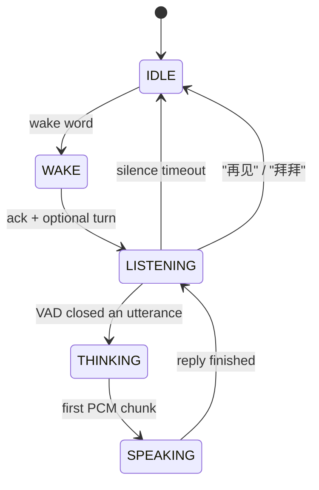
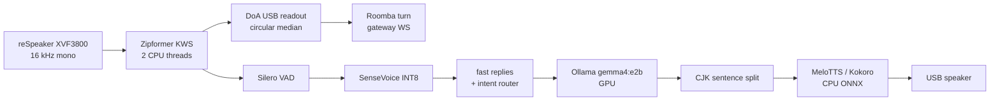

# VoiceButler: An Offline Chinese Speech-to-Speech Stack on Jetson Orin NX 16GB

> **NVIDIA Jetson 2026 Developer Write-Up**
>
> **Development window: August 2026** (new speech stack on the same Roomba + Orin NX that [Roomba-VLLM](/docs/hackathons/2026/roomba-vllm) and [PanoTwin](/docs/projects/2026/panotwin-jetson-x5) already live on)
>
> **Platform: NVIDIA Jetson Orin NX 16GB (reComputer J4012) · JetPack 6.2 · speech on CPU, LLM on GPU, nothing required from the cloud**

<div class="photo-pair">
  
  
</div>

This is the write-up I wish I had before wiring a Chinese speaker onto a Jetson that already had a VLM, a depth service, and three PyTorch virtualenvs. It is a **tutorial of a production pipeline**, not a survey of ASR papers. Every stage below is running on my board today.

---

## Project at a Glance

| Field | Details |
|-------|---------|
| **Project** | VoiceButler — offline speech-to-speech for a home robot |
| **One-liner** | Say a wake word, the robot turns toward you, understands Mandarin, answers locally, and can recite the textbook |
| **Status** | Running on the Orin NX as of August 28, 2026 |
| **Hardware** | Jetson Orin NX 16GB + Seeed reSpeaker Flex (XVF3800) + USB speaker + Roomba chassis |
| **Speech stack** | [sherpa-onnx](https://github.com/k2-fsa/sherpa-onnx) 1.13: Zipformer KWS + Silero VAD + SenseVoice ASR + MeloTTS (Kokoro as a quality fallback) |
| **Brain** | Ollama `gemma4:e2b` on the same SoC. `gemma4:e4b` OOMs once vision/depth already occupy unified memory |
| **Rule that saved the machine** | **No PyTorch in the speech venv.** ONNX Runtime on CPU only |

---

## Part 1: Why this stack, and why it is harder than "call a cloud API"

### 1.1 The product I actually wanted

The butler already *sees*. After the [Attrax hackathon](/docs/hackathons/2026/roomba-vllm) it can patrol a room with a camera. After [PanoTwin](/docs/projects/2026/panotwin-jetson-x5) it is growing a 3D memory. What it still could not do, in the house, without a phone in someone's hand, was **talk**.

The bar is a cheap smart speaker, raised one notch:

1. Wake on a phrase, not on every cough.
2. Understand Mandarin in a kitchen, not a studio.
3. Answer in one or two spoken sentences, not Markdown.
4. Turn the chassis toward whoever spoke.
5. Call tools (weather, search, drive, music, textbook) instead of hallucinating.
6. Stay on the LAN. Children's rooms are not a cloud product.

### 1.2 Why the obvious recipes die on this board

| Recipe | Where it dies on Orin NX 16GB |
|--------|-------------------------------|
| **Cloud ASR + cloud TTS** | Latency plus a veto from the household. Also dies when the WAN does |
| **Whisper large on GPU** | Fights Ollama for the same 16 GB. First-token time for the LLM becomes "go make tea" |
| **Hugging Face `speech-to-speech` as the daily driver** | Needs a Jetson PyTorch. I already have `torch 2.11` (PanoTwin) and `torch 2.8` (DAP). A third copy is how you brick an evening |
| **Always-on ASR** | SenseVoice is cheap, but not cheap enough to decode 16 kHz all day while a VLM is also resident |
| **Let the LLM do math / recite poems from memory** | Small local models invent arithmetic and mix couplets. Tools exist for a reason |

The design that survived: **gate with a tiny keyword spotter, recognise offline, think on the GPU, speak on the CPU, and never install PyTorch next to the microphone.**

### 1.3 What VoiceButler is

A single Python process (`butler_voice`) that owns the microphone for the whole session and walks a state machine:





IDLE is the only state that should run 24/7. It costs two CPU threads of Zipformer INT8. Everything heavier starts after the wake word.

---

## Part 2: Hardware, memory, and the "do not touch PyTorch" rule

### 2.1 The kit

| Piece | Role | Why this one |
|-------|------|----------------|
| **Jetson Orin NX 16GB** (Seeed reComputer J4012) | Unified CPU/GPU memory, Ollama, the rest of the robot | 8 GB cannot hold Gemma + a vision stack. 16 GB is the floor, not a luxury |
| **Seeed reSpeaker Flex (XVF3800)** | AEC / NS / beamforming + **DoA over USB** | Far-field kitchen mic. DoA is a vendor control transfer, not a neural net |
| **USB speaker** | Playback | Cheap. The painful part is that the XVF3800 does **not** get an AEC reference from it — see Part 8 |
| **Roomba chassis** | Turns toward the speaker | Open-loop differential drive through `ws://127.0.0.1:8000/ws/control` |


:::warning The expensive SKU is the harder one

I opened the Circular-4 + XIAO box expecting a USB microphone. The box gives you a pretty render, a lime-green logo, and **no wiki URL**. If you do not already know that Seeed documentation lives at [wiki.seeedstudio.com](https://wiki.seeedstudio.com/respeaker_flex_xiao_introduction/), you are staring at two PCBs and an FFC with no next step.

The high-end board with the XIAO ESP32S3 soldered on ships as an **I2S** device for the XIAO, not as a UAC sound card. To use it the way a Jetson wants — "it shows up as `XVF3800` in PortAudio" — you either:

1. **Write firmware on the XIAO** and talk to the XVF3800 over I2S, or
2. **DFU-flash the XMOS USB firmware** so the array enumerates as a USB mic. That flash goes through the USB-C **next to the 3.5 mm jack** (XMOS), not the XIAO port. Seeed's own notes: [reSpeaker Flex + XIAO](https://wiki.seeedstudio.com/respeaker_flex_xiao_introduction/) and [XVF3800 USB array](https://wiki.seeedstudio.com/respeaker_xvf3800_introduction/).

That is a real on-ramp. I wanted far-field ears for a kitchen robot, not a weekend of `dfu-util`. The cheaper SKU without the XIAO would have been the USB-mic default.

:::

Match audio devices **by name substring**, never by ALSA card index. USB hubs re-enumerate; `hw:2` is a different gadget after a replug.

```text
BUTLER_INPUT_MATCH=XVF3800
BUTLER_OUTPUT_MATCH=USB2.0 Device
BUTLER_SAMPLE_RATE=16000
BUTLER_BLOCK_MS=32
```

One capture stream stays open for the whole process. Opening the XVF3800 twice fails; closing it between KWS and ASR drops the first ~200 ms of speech — enough to eat the first syllable of 你好.

### 2.2 Memory budget on 16 GB unified RAM

This board has **no discrete VRAM**. Ollama, TensorRT depth, and Python heaps all sit in the same 16 GB.

| Resident | Where it lives | Notes |
|----------|----------------|-------|
| Ollama `gemma4:e2b` | GPU / unified | Daily driver. Warm first token ~1.2 s |
| Ollama `gemma4:e4b` | GPU / unified | Better answers. **Do not load it** while PanoTwin / DAP is also resident — OOM |
| SenseVoice INT8 + Zipformer KWS + Silero + Melo | CPU via ONNX Runtime | Stays out of the GPU's way |
| PanoTwin / DAP (when running) | GPU | Why speech must not also grab CUDA |

The speech venv is created **without** `--system-site-packages` and **without** `pip install torch`. If a README tells you to `pip install sherpa-onnx[gpu]`, ignore it on this machine.

I did keep a separate `hf-s2s-env` with Jetson PyTorch for experiments with Hugging Face `speech-to-speech`. It is a lab, not production. It also cannot share the microphone with VoiceButler.

### 2.3 Models on disk (~1.2 GB)

All of these are official [sherpa-onnx releases](https://github.com/k2-fsa/sherpa-onnx/releases):

| Model | Job |
|-------|-----|
| `sherpa-onnx-kws-zipformer-gigaspeech-3.3M-2024-01-01` | English BPE keyword spotting |
| `silero_vad.onnx` | Endpointing |
| `sherpa-onnx-sense-voice-zh-en-ja-ko-yue-2024-07-17` | Multilingual ASR, we pin `language=zh` |
| `vits-melo-tts-zh_en` | Production TTS (faster than real-time on this board) |
| `kokoro-multi-lang-v1_1` | Higher quality zh+en, slower (RTF ~1.2 @ 6 threads) |

Fetch once, skip if present:

```bash
./scripts/fetch_models.sh
```

---

## Part 3: Stage-by-stage — the actual pipeline

Work through this in order. Each stage is independently testable. Do not start with the LLM.

### 3.1 Wake word (KWS)

The GigaSpeech Zipformer is an **English BPE** model. The keywords file is **not** plain text. `"HEY BOSS"` becomes:

```text
▁HE Y ▁BO S S
```

Build it with SentencePiece against the model's `bpe.model`:

```bash
./s2s-env/bin/python scripts/make_keywords.py \
  "HEY BOSS" "HEY BOT" "YO BUTLER" "HEY ROOMIE" "HEY DUSTY" "HEY JARVIS"
```

Per-keyword score (`:`) and threshold (`#`) can be appended on the same line. Runtime knobs:

| Env | Default on the robot | Meaning |
|-----|----------------------|---------|
| `BUTLER_KWS_THRESHOLD` | `0.10` (tuned; library default 0.25) | Lower = easier to wake, more false fires |
| `BUTLER_KWS_SCORE` | `1.5` | Boost for the listed phrases |
| `BUTLER_KWS_THREADS` | `2` | Leave the other cores for TTS later |

After a hit, **reset the KWS stream** so the same utterance cannot retrigger. Then leave KWS. You are now in conversation mode; ASR takes the mic buffers.

Chinese wake phrases need a Chinese KWS model. Do not tokenise 小爱同学 through an English BPE and expect it to work.

Live probe:

```bash
./s2s-env/bin/python scripts/test_wake.py --threshold 0.15 --score 2.0
```

### 3.2 Direction of arrival, then turn


The XVF3800 exposes azimuth as a USB vendor control transfer (`resid=20`, `cmdid=18`): status byte + `uint16` degrees + speech flag. No neural net, no extra GPU.

Two implementation traps:

1. **0/360 wrap.** A linear median of `[355, 358, 2, 5]` is ~180 — the robot turns its back on you. Use a **circular median**: shift so the circular mean sits at 180°, take the ordinary median, shift back.
2. **Mounting offset.** "Zero" on the chip is not "forward on the chassis." Stand in front of the robot, read the azimuth, put that number in `BUTLER_DOA_OFFSET_DEG`. If it always turns the wrong way, set `BUTLER_DOA_SIGN=-1`.

Sample a window around the wake (`0.2 s` before, `0.5 s` after), estimate, then turn on a **background thread** while the wake-ack TTS plays (`嗯？` / `在呢。`). The user should hear the ack before the wheels finish.

Turning is **open-loop** from wheelbase kinematics. Carpet slip needs `BUTLER_ROOMBA_TURN_CAL = requested_deg / measured_deg`. Command 90°, measure with a square, update.

```bash
./s2s-env/bin/python scripts/test_turn.py --watch
./s2s-env/bin/python scripts/test_turn.py --degrees 90
```

### 3.3 VAD, then SenseVoice (not streaming ASR)

SenseVoice in sherpa-onnx is **offline**: you hand it a complete utterance. Silero VAD decides the endpoints.

| Knob | Production | What it does |
|------|------------|--------------|
| `BUTLER_VAD_THRESHOLD` | `0.5` | Speech probability cut |
| `BUTLER_VAD_SILENCE_S` | `0.45` | Trailing silence that closes the utterance (library default 0.6 felt sluggish) |
| `BUTLER_VAD_MIN_SPEECH_S` | `0.25` | Reject clicks |
| `BUTLER_VAD_MAX_SPEECH_S` | `15` | Hard cap so a TV cannot hold the floor forever |

Measured on this Orin NX, JetPack 6.2.1: **SenseVoice RTF 0.058** at 4 CPU threads. A two-second sentence transcribes in well under 150 ms. That is why ASR can stay on CPU.

Language is pinned to `zh` with inverse text normalisation on. SenseVoice will still emit the occasional English token; the rest of the stack is built for Mandarin-first replies.

### 3.4 Three exits before the LLM

A local 2B model is the slowest *and* the least trustworthy part of the loop. Bypass it whenever the utterance is closed-form.

**1. Fast replies.** `你好` / `hi` / `在吗` map to a **cached** TTS clip. First audio is milliseconds, not a GPU round-trip. Preload `你好`, `好的`, the wake ack, and the goodbye at startup.

**2. Intent router.** Regex + a few parsers, **before** tool-calling JSON:

| User says | Tool | Why not the LLM |
|-----------|------|-----------------|
| `前进半米` / `左转` | `robot_control` | Driving must not wait on a 2B model that might say "好的" and sit still |
| `我是小学生` | `student_mode` | Session flag, not a chat topic |
| `三点五乘以七` | `calculate` | Small models invent arithmetic |
| `今天天气` / `帮我搜一下…` / `开始巡逻` / `放首歌` | weather / search / patrol / music | Grounding |

ASR noise is part of the matcher: `是小学生` (dropped 我) still enters student mode; `木江吟` still finds 暮江吟.

**3. Goodbye.** `再见` / `拜拜` / `退下` speak a canned line, **reset chat history**, return to IDLE.

Only the leftovers hit Ollama.

### 3.5 LLM: stream, split, speak — never wait for the full paragraph

Ollama is reached as an OpenAI-compatible `/v1/chat/completions` plus a native `/api/chat` for `keep_alive`.

Critical settings on Gemma 4:

```text
BUTLER_LLM_MODEL=gemma4:e2b
BUTLER_LLM_REASONING=none
BUTLER_LLM_KEEP_ALIVE=-1
BUTLER_LLM_MAX_TOKENS=256
BUTLER_LLM_HISTORY_TURNS=6
```

- **`reasoning=none`.** Gemma 4 thinks before answering by default. On a 256-token budget that thought is the entire reply, and the speaker stays silent.
- **`keep_alive=-1`.** Ollama's default eviction is 5 minutes. A cold reload on this board is **~25 s**. Pin the model; ping it every few minutes so it stays resident.
- **System prompt** must forbid lists, Markdown, and emoji, and must order short spoken sentences. TTS is a pipe, not a slide deck.

Streaming alone is not enough. Gemma often separates Chinese phrases with **spaces** instead of `。`. `pop_speakable()` treats:

- `。！？!?；;` and newlines as hard breaks
- a comma or whitespace **between CJK characters** as a break
- a hard cap of ~22 CJK chars so Kokoro/Melo can start

Three threads:

1. Pull LLM chunks into a text queue.
2. Synthesize each speakable piece into an audio queue.
3. The main thread writes PCM to the USB speaker as soon as the first samples exist.

That is the difference between "answers in 1.2 s" and "answers after the full paragraph plus one TTS call."

Tool calls that the router missed still go through OpenAI-style `tools=` on the same client. The 2B model is allowed to call `calculate` / `student_tutor` / `get_weather`; it is not allowed to skip them when the prompt says not to.

### 3.6 TTS: Melo in production, Kokoro on the shelf

| Engine | RTF on this board | Use |
|--------|-------------------|-----|
| **MeloTTS zh_en** (INT8 VITS) | **~0.88** @ default threads | Production. Faster than real time, good enough Mandarin |
| **Kokoro multi-lang v1.1** | **~1.2** @ 6 threads, 24 kHz | Better zh *and* en. Switch with `BUTLER_TTS_ENGINE=kokoro` when you can wait |

TTS is the slowest link once the LLM is warm. Raise `BUTLER_TTS_THREADS` — the LLM owns the GPU, CPU cores are spare. Cache clips shorter than ~24 characters (greetings, 好的). Strip markup the model still sneaks in (`[]《》：`) before vocoding, or the speaker spells punctuation.

Startup cost for the whole stack (KWS + ASR + TTS load): **~11 s**. Do it once per boot, not per wake.

---

## Part 4: Tools, and the textbook tutor that broke `pypdf`

### 4.1 Tool surface

The robot is useless as a speaker that only chats. The registry is small on purpose:

| Tool | Grounding |
|------|-----------|
| `robot_control` | Gateway websocket, same as the rest of the chassis |
| `start_patrol` | Existing patrol service |
| `get_weather` | Real weather API, default city 深圳 |
| `web_search` | Live search, max 3 hits, spoken summary |
| `music_control` | Local files; **pause during TTS** so two pipelines do not fight the USB speaker |
| `calculate` | Python eval of a parsed expression, not the LLM |
| `home_status` | Home Assistant if configured; otherwise an honest "not wired up" |
| `student_mode` / `student_tutor` | Session + textbook index |

### 4.2 Why reciting 古诗 from a PDF is a parsing problem, not an embedding problem

I indexed 义务教育 textbooks (ChinaTextbook, 小学) into SQLite FTS. First attempt: `pypdf` + 480-character chunks. The butler then recited pinyin ruby and 注释 as if they were verses.

The PDFs are **digital**, not scans. Two landmines:

1. **Pinyin ruby** lives in a real font (`HanyuXi-JZ`) whose ToUnicode map is garbage (`tWng`, `jKng`). `pypdf` dumps that into the body.
2. **Two-column layout.** 注释 sit on the **right**. A naive mid-page split steals the last character of titles (`九月九日忆山东兄`) or glues 注释 into the poem.

The fix is layout-aware parsing with PyMuPDF:

1. Drop spans whose font is pinyin, or whose size is a footnote mark.
2. Split columns at the **left edge of 注释**, not at page mid.
3. Group remaining lines into semantic units: poem / notes / body / TOC. Skip 目录 and 写字表.
4. Index those units. Recite from the poem unit, not from a sliding window.

Hardcoding famous poems was a tempting hotfix. It does not survive the next grade. Parse the book.

Still broken, honestly: **一年级下册 poems are image-only** (no text layer), same as some 科学 scans. OCR is the next job, not a fake embedding upgrade. FTS on clean structure already lists 三年级上册 as 7 titles and recites 山行 without mixing in 注释.

Spoken lists cap at six titles plus "还有 N 首". Follow-ups (`第一首`, `还有`, `谁写的`) are session state, not a new search from scratch.

---

## Part 5: Bring-up on a Jetson (copy this)

Assumes JetPack 6.2, Python 3.10, Ollama already serving `gemma4:e2b`.

```bash
python3 -m venv s2s-env          # deliberately NOT --system-site-packages
./s2s-env/bin/pip install -r requirements.txt
# sherpa-onnx, sounddevice, fastapi, httpx, pymupdf, …
# do not pip install torch here

./scripts/fetch_models.sh
./s2s-env/bin/python scripts/make_keywords.py \
  "HEY BOSS" "HEY BOT" "YO BUTLER" "HEY ROOMIE" "HEY DUSTY" "HEY JARVIS"

sudo cp deploy/udev/99-respeaker-xvf3800.rules /etc/udev/rules.d/
sudo udevadm control --reload-rules
sudo udevadm trigger --attr-match=idVendor=2886
```

`.env` next to `run.sh` (the values on my robot):

```bash
BUTLER_KWS_THRESHOLD=0.10
BUTLER_KWS_SCORE=1.5
BUTLER_WAKE_ACK=在呢。
BUTLER_TTS_ENGINE=melo
BUTLER_TTS_SPEED=1.05
BUTLER_VAD_SILENCE_S=0.45
BUTLER_LLM_MODEL=gemma4:e2b
BUTLER_LLM_REASONING=none
```

Self-test without talking:

```bash
./s2s-env/bin/python scripts/selftest.py --play
```

Daily driver:

```bash
./run.sh --serve          # assistant + HTTP :8010 for the web VOICE tab
./run.sh --always-on      # skip KWS (bench only — burns ASR all day)
./run.sh --no-roomba --no-doa
```

The phone UI is the existing Roomba-VLLM web app, **VOICE** tab: live KWS hits, VAD sliders, a DoA compass, a 90° turn calibration, and a TTS voice picker. Tunables write back to `.env`.

---

## Part 6: Measured on this Orin NX 16GB (JetPack 6.2.1)

I will not invent numbers I did not take. This table is from the running box.

| Stage | Cost |
|-------|------|
| SenseVoice STT | RTF **0.058** (4 CPU threads) |
| `gemma4:e2b` first token | **~1.2 s** warm, **~25 s** cold |
| MeloTTS | RTF **~0.88** |
| Kokoro v1.1 `sid=3` | RTF **~1.2** @ 6 threads, 24 kHz |
| Model load at process start | **~11 s** total |

If replies feel sluggish after the first token, look at TTS threads, not at "a bigger LLM." A bigger LLM (`e4b`) on this 16 GB board, with the rest of the robot loaded, does not come up — it OOMs.

---

## Part 7: Calibration labs (do these before you demo)

A voice robot that you cannot calibrate is a science fair. The same process hosts the labs, so you do not load a second copy of the models. Open the Roomba-VLLM web app → **VOICE**. Knobs write through to `.env`.


1. **KWS lab** — say the wake phrase, watch hits, drag threshold. Stop when a kettle does not wake it and a normal "Hey Boss" does.


2. **VAD lab** — speak a sentence, drag silence ms. Too low: it cuts 谢谢. Too high: you wait on the trailing 0.6 s like a call centre.


3. **DoA lab** — stand in front, tap "当前方向 = 正前方", then walk a quarter circle and confirm the compass.
4. **Turn lab** — command 90°, measure, write `BUTLER_ROOMBA_TURN_CAL`.

Do this on carpet, not on a desk. The kinematics lie on shag.

---

## Part 8: Known limits (read before you copy the architecture)

**Half duplex.** The XVF3800 never sees the USB speaker as an AEC reference, so the microphone is ignored while Butler talks. Barge-in needs that reference wired, or a loopback that I have not built.

**Open-loop turning.** No wheel encoders in the path we use. Recalibrate when you change flooring.

**One USB speaker.** The older GStreamer audio tab and this process cannot play at once.

**English KWS, Chinese conversation.** Wake phrases are GigaSpeech English. Dialogue is Mandarin. That split is a model limitation, not a product preference.

**Image-only textbook pages.** OCR is not in the index yet. Do not tell a child the book "doesn't contain" 咏鹅 on a scan-only page — the parser never saw the glyphs.

**No barge-in, no speaker ID, no multi-user diarisation.** One conversation at a time, 12 s of silence back to IDLE (`BUTLER_CONV_TIMEOUT_S`).

---

## Part 9: Lessons I would send to yesterday

**1. The venv is a safety device, not a style choice.** Speech on this robot is ONNX + numpy. The moment `torch` enters `s2s-env`, you will one day `pip install` a wheel that shadows the Jetson PyTorch the depth service needs. Create the venv clean.

**2. First audio beats best audio.** Cached `你好`, streamed sentences, and a 22-character CJK cap did more for "it feels alive" than swapping Melo for Kokoro.

**3. Router before tools before LLM.** Tool-calling on a 2B model is a fallback. Driving, arithmetic, and "I am a primary-school student" must not depend on JSON the model might not emit.

**4. Layout is retrieval.** If the index contains pinyin ruby, no embedding model will save the recitation. Fix the PDF parser.

**5. Pin the LLM or own the 25-second hole.** `keep_alive` and a warmup ping are part of the voice UX.

**6. Name the sound card, not its number.** Future you, unplugging a hub, will thank present you.

**7. The SKU with more chips is not the SKU that works on day one.** Circular-4 + XIAO ships I2S. USB mic is a firmware choice, and the box will not tell you that.

---

## Part 10: Where this sits next to PanoTwin

VoiceButler is the **ears and mouth**. PanoTwin is the **metric memory**. Roomba-VLLM is the **eyes and patrol**. They share one Orin NX, which is exactly why the speech stack is forbidden from CUDA.

The next honest upgrades, in the order I would actually do them:

1. AEC reference from the USB speaker into the XVF3800, then barge-in.
2. RapidOCR on image-only textbook pages.
3. Optional Chinese KWS model so the wake phrase can be Mandarin.
4. Only then: a larger LLM, and only if PanoTwin is not also resident.

Until barge-in works, the robot will finish its sentence. That is a hardware wiring problem dressed up as an NLP problem. I am leaving it labelled correctly.

---

## References

- [sherpa-onnx](https://github.com/k2-fsa/sherpa-onnx) — KWS, VAD, SenseVoice, Melo, Kokoro, all CPU ONNX
- [SenseVoice](https://github.com/FunAudioLLM/SenseVoice) — multilingual ASR
- [Silero VAD](https://github.com/snakers4/silero-vad)
- [Ollama](https://ollama.com/) — local Gemma 4 on Jetson
- [Roomba-VLLM](/docs/hackathons/2026/roomba-vllm) — the chassis this mouth is bolted to
- [PanoTwin](/docs/projects/2026/panotwin-jetson-x5) — why the GPU is already busy
- [reSpeaker Flex + XIAO wiki](https://wiki.seeedstudio.com/respeaker_flex_xiao_introduction/) — the page that should have been printed on the box
- [reSpeaker XVF3800 USB array wiki](https://wiki.seeedstudio.com/respeaker_xvf3800_introduction/) — DFU / USB firmware
