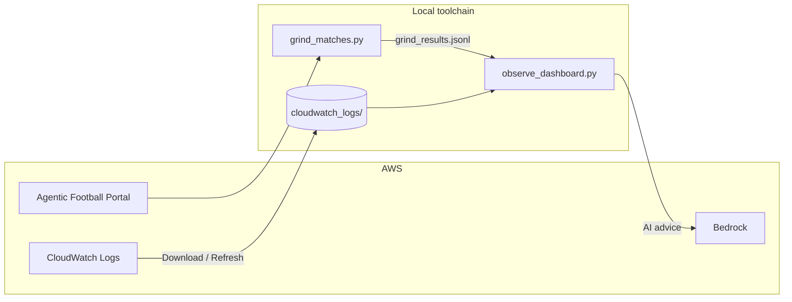

# Agentic Football Cup 72-Hour Pre-Test — From Harness to Local Observability

**When**: July 3, 2026 16:00 — July 6, 2026 16:00 (72 hours)  
**Organizer**: Amazon Web Services China User Group  
**Goal**: De-risk the first **Agentic Football Cup Beijing UG Workshop**  
**Wrap-up**: Live stream on July 5 at 20:00  
**Open-source toolchain**: [sample-ai-possibilities / agentic-football-sample-agents](https://github.com/peterpanstechland/sample-ai-possibilities/tree/football-workshop/agentic-football-sample-agents) (branch `football-workshop`)

---

## Background: Agentic Football Cup Workshop

[Agentic Football Cup](https://catalog.workshops.aws/agentic-football-cup/en-US) is an AWS workshop that teaches **Agentic AI** through a fun 2D football game. You build decision logic for 11 AI players using **Amazon Bedrock AgentCore**, **CloudWatch**, and related services.

Three ways to create agent players:

| Method | Best for | Highlights |
|--------|----------|------------|
| **AgentCore Harness (GUI)** | Quick start, no local setup | Browser-based configuration |
| **CloudShell** | AWS account, no local tools | Deploy from the cloud terminal |
| **Local deploy (Kiro, etc.)** | Deep customization | Develop locally, upload to AgentCore Runtime |

We tested **Harness** first, then **local deploy** — Harness validates the happy path; local deploy unlocks observability, heatmaps, AI tuning advice, overrides, and Playwright automation.

---

## Timeline

```mermaid
timeline
    title 72-Hour Pre-Test
    Jul 3 16:00 : Workshop kickoff
                : Harness smoke test
                : Switch to local deploy
    Jul 4-5     : Observability dashboard
                : CloudWatch analysis
                : Blast-shot override / prompt tuning
                : Playwright match grinding
    Jul 5 20:00 : Community live stream
    Jul 6 16:00 : Pre-test ends
```

---

## Phase 1: Harness Quick Validation

Using **AgentCore Harness**, we created and deployed agent players in the browser and confirmed:

- AgentCore Runtime accepts match requests
- The Portal runs games and emits DECISION logs
- Basic prompt / fallback flows work

This took about 1–2 hours and built a mental model for local development.

---

## Phase 2: Local Deploy & Game Mechanics

### 2 seconds per tick

Each match advances **one tick every 2 seconds**. On every tick, all 11 players invoke their agent for move / pass / shoot decisions. A full match is roughly **120 ticks (~4 minutes)** of continuous play.

### Override: blast shots

We added **blast shot** logic under `overrides/` for forwards — when in range with a good angle, increase shot power and priority. This noticeably improved goals and win rate.

### Prompt & fallback tuning

- **Prompts**: push forwards, link midfield, mark defensively, reduce useless sideways passes
- **Fallbacks**: deterministic rules when the LLM times out or returns invalid actions (clearance, keeper hold, etc.)
- Comparing CloudWatch logs across matches improved decision stability

### Per-role model selection

Example split:

- **FWD / MID**: `amazon.nova-2-lite-v1:0`
- **DEF / GK**: `amazon.nova-micro-v1:0` (lower latency, lower cost)

Goalkeepers need faster responses within the tick budget — this split worked well.

---

## Phase 3: Observability Platform

We open-sourced an **Agentic Football observability toolchain** in the repo.

### Architecture



### Three pages

1. **Decisions** — DECISION log stream by tick  
2. **Analytics** — match list, score, possession, goals, **role-colored heatmaps**  
3. **Settings** — AWS credentials, **Download CloudWatch data**

#### Portal & leaderboard


#### Live vs Training observability


#### Analytics — match picker


#### Player heatmap


#### AI modification suggestions


#### Settings — local CloudWatch cache


The dashboard is **local-first**: it reads `cloudwatch_logs/` on startup. Use **Download CloudWatch data** in Settings or **Refresh data** on the home page to sync.

### Splitting multiple matches

When grinding many games via Playwright, CloudWatch DECISION timestamps do **not** reset game clock `t` between matches. We split sessions using **`grind_results.jsonl` time windows** in `lib/match_analytics.py` so Analytics shows separate 2-1, 2-6, 3-5 results.

---

## Phase 4: Playwright Match Grinding

[`grind_matches.py`](https://github.com/peterpanstechland/sample-ai-possibilities/blob/football-workshop/agentic-football-sample-agents/grind_matches.py) drives the Portal with Playwright, runs batch matches, and writes scores to `grind_results.jsonl`.


### Live coach injection (experimental ⚠️)

We tried injecting **coach shout** prompts mid-match via Playwright to simulate tactical changes. **Not successful yet** — likely Portal UI / tick timing constraints. More testing welcome; PRs appreciated.

---

## Install & Usage

Verified on **Windows PowerShell**; on macOS/Linux replace `\.venv\Scripts\` with `bin/`.

### 1. Clone

```powershell
git clone -b football-workshop https://github.com/peterpanstechland/sample-ai-possibilities.git
cd sample-ai-possibilities/agentic-football-sample-agents
```

### 2. Python environment

```powershell
python -m venv .venv
.\.venv\Scripts\Activate.ps1
pip install -r requirements-observability.txt
playwright install chromium
```

### 3. AWS configuration

```powershell
copy .env.example .env
# Edit .env: AAFC_TEAM_CODE=your team code
```

Or enter credentials on the Dashboard **Settings** page (writes `aafc-workshop` profile under `~/.aws/credentials`).

### 4. Start the dashboard

```powershell
$env:AWS_DEFAULT_REGION = "us-east-1"
.\.venv\Scripts\python.exe observe_dashboard.py --prefix agg_ --minutes 180 --port 8777
```

Open **http://127.0.0.1:8777/**

| Route | Purpose |
|-------|---------|
| `/` | Decisions stream |
| `/analytics` | Match analytics + heatmap + AI advice |
| `/settings` | AWS creds + CloudWatch download |

Download CloudWatch data once in Settings for fast Analytics loads.

### 5. Grind matches (optional)

```powershell
$env:AAFC_TEAM_CODE = "your team code"
.\.venv\Scripts\python.exe grind_matches.py --count 5
```

### 6. Full reference

See [`docs/OBSERVABILITY.md`](https://github.com/peterpanstechland/sample-ai-possibilities/blob/football-workshop/agentic-football-sample-agents/docs/OBSERVABILITY.md) for architecture, env vars, and FAQ.

---

## Connection to AWS Summit Shanghai 2026

At **AWS Summit Shanghai 2026**, I first tried Agentic Football Cup via Harness and met the **game author** — a great intro experience.


This 72-hour pre-test went deeper: Harness → local deploy → batch grinding → heatmaps and AI advice — preparation for the **Beijing UG Workshop**.

---

## Summary

| Takeaway | Detail |
|----------|--------|
| AgentCore end-to-end | Harness → local agent → Runtime matches |
| Game mechanics | 2s/tick, overrides, per-role models |
| Observability | CloudWatch DECISION → local cache → dashboard |
| Data-driven tuning | Heatmaps, possession/goals, Bedrock suggestions |
| Automation | Playwright grinding; coach injection TBD |
| Community | 72-hour pre-test + Jul 5 live stream for Beijing |

We had fun and learned a lot about AgentCore. If you're joining the Beijing or online workshop, feel free to use our [open-source toolchain](https://github.com/peterpanstechland/sample-ai-possibilities/tree/football-workshop/agentic-football-sample-agents) — issues and PRs welcome.

---

*AWS China UG · Agentic Football Cup Pre-Test Team · July 2026*
