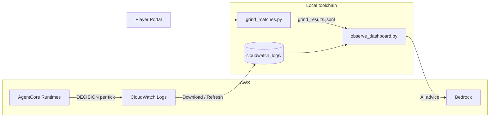

# Agentic Football Cup 72-Hour Pre-Test — From Harness to Local Observability

**When**: July 3, 2026 16:00 — July 6, 2026 16:00 (72 hours)  
**Organizer**: Amazon Web Services China User Group  
**Goal**: De-risk the first **Agentic Football Cup Beijing UG Workshop**  
**Wrap-up**: Community live stream on July 5 at 20:00  
**Open-source toolchain**: [sample-ai-possibilities / agentic-football-sample-agents](https://github.com/peterpanstechland/sample-ai-possibilities/tree/football-workshop/agentic-football-sample-agents) (branch `football-workshop`)

---

## Background: the Agentic Football Cup Workshop

[Agentic Football Cup](https://catalog.workshops.aws/agentic-football-cup/en-US) is an AWS workshop that teaches **Agentic AI** through a 2D pixel-art football game, built around **Amazon Bedrock AgentCore**, **CloudWatch**, and related services.

Matches are **5v5**, with five positions per team: **GK / DEF / MID / FWD1 / FWD2**. The key idea: **every player is an independent agent deployed on AgentCore Runtime** — with its own system prompt, its own model, its own fallback rules, invoked independently on every decision tick. You are not "playing a game"; you are **operating five production agents at once**.

The Portal also gamifies AgentCore's capabilities: the trophy wall maps to **Runtime, Memory, Code Interpreter, Browser, Identity, Gateway, Observability, Bedrock, Guardrails, and Evaluations**, with daily quests and XP. By the time you have played a few matches, you have toured the AgentCore product map.

Three ways to create agent players:

| Method | Best for | Highlights |
|--------|----------|------------|
| **AgentCore Harness (GUI)** | Quick start, no local setup | Configure prompts and models in the browser |
| **CloudShell** | AWS account, no local tools | One-shot deploy from the cloud terminal |
| **Local deploy (Kiro, etc.)** | Deep customization | Develop agent code locally, push to AgentCore Runtime |

During the pre-test we used **Harness** first, then switched to **local deploy** — Harness validates the happy path in an hour or two; local deploy unlocks everything covered below: an observability platform, heatmaps, AI tuning advice, deterministic overrides, and Playwright automation.

---

## Timeline

```mermaid
timeline
    title 72-Hour Pre-Test
    Jul 3 16:00 : Workshop kickoff
                : Harness smoke test
                : Switch to local deploy
    Jul 4-5     : Observability dashboard
                : CloudWatch analysis
                : Blast-shot override / prompt tuning
                : Playwright match grinding
    Jul 5 20:00 : Community live stream
    Jul 6 16:00 : Pre-test ends
```

---

## Phase 1: Harness Quick Validation

With **AgentCore Harness** we created and deployed agent players entirely in the browser — write the player prompt, pick a model, deploy. It confirmed three things:

- AgentCore Runtime accepts match requests
- The Portal runs games and emits DECISION logs to CloudWatch
- Basic prompt / fallback flows work

That took about 1–2 hours and built the mental model for local development. If you just want a taste, Harness is enough; to go deeper, go local.

---

## Phase 2: Local Deploy & Game Mechanics

### One team = five independent agents

The "My Team" page makes the architecture explicit: every player card is bound to an **Agent ARN** on AgentCore Runtime, showing live invocation counts, token usage, response latency, and a pre-match fitness check.


Details worth noting:

- **Configurable formation** (1-2-1 in the screenshot): each of the five positions is defined by its own system prompt — changing formation means changing the prompt mix
- **Latency is a stat**: the screenshot shows GK 531ms, DEF 446ms, MID 675ms — slow agents miss decision windows and it shows on the pitch
- The repo ships several team templates: `ai-team-strands-balanced`, `extremely-aggressive`, `extremely-defensive`, `gateway`, `memory`, deployable as a whole squad via `deploy-wsl.sh`

### How a match runs: ~2 seconds per tick

The match clock runs about **120 seconds**, advancing one **tick every ~2 seconds**. On each tick all five players invoke their agents and return one command each:

`MOVE_TO`, `PASS`, `SHOOT`, `MARK`, `SLIDE_TACKLE`, `PRESS_BALL`, `INTERCEPT`, `GK_DISTRIBUTE`, `CLEAR`, …

A full match adds up to **300–600 agent invocations per team**. Responses slower than ~900ms risk timing out, in which case the game falls back to deterministic rules — so a well-written prompt matters exactly as much as a fast response.


The match screen is dense: live score and clock, per-player nameplates, a tactical minimap, and AI-generated commentary at the bottom. Note the **coach shout box** at the bottom left — you can send natural-language tactical instructions to your team mid-match. That input box returns in our Playwright experiment later.

### Post-match reports and "Behind the Scenes"

Every match produces two layers of reporting. The first is the full-time page: winner, MVP, fastest agent, possession, shots, and the goal timeline.


The second layer is **Behind the Scenes** — a report written for agent developers: an AI-generated match summary and per-goal narrative, a **command breakdown** for both teams (what every agent decided all match), a "Coach's Corner" with tactical advice, and **per-position latency and success rates**.


This report earns its keep. In the 2-1 win above, our team averaged **1049ms per command against the opponent's 550ms**, and our DEF spiked to **1333ms** — we won on tactics while losing on latency. That observation directly drove two of our next steps: switching to faster models per position, and building our own observability platform.

### Overrides: the blast shot

The game lets agent code apply **deterministic overrides** — tactical actions taken by code, bypassing the LLM. We gave our forwards a **blast shot**: inside the shooting zone with a good angle, the code fires `SHOOT` at full power with zero LLM hesitation. Other overrides in our team include `mark-near`, `tackle`, `hold-line`, `no-chase`, and `support`; the analytics page later counts how often each one triggers.

The blast shot measurably raised goals and win rate. The division of labor became clear: **the LLM reads the game, the code pulls the trigger.**

### Prompt & fallback tuning

- **Prompts**: push forwards, link midfield, mark tightly, cut useless sideways passes
- **Output format**: LLMs occasionally chat outside the JSON, breaking parsing. Our dashboard later turned this into an alert: `parse-fallback 34/255: LLM output drifting from pure JSON — tighten the response format section or lower temperature`
- **Fallbacks**: deterministic rules when the LLM times out or returns an invalid action (clearances, keeper hold). But fallbacks cut both ways — in training mode we once caught the team playing **entirely on rules with 0% LLM decisions** (next chapter)

### Per-position model selection

With the latency numbers in front of us, the natural next step was **different Bedrock models for different positions**. We benchmarked candidates with `bench_models.py` and settled on:

- **FWD / MID**: `amazon.nova-2-lite-v1:0` (stronger reasoning for attacking decisions)
- **DEF / GK**: `amazon.nova-micro-v1:0` (lower latency for defensive reactions)

Goalkeepers must answer inside the tick window; this split held up in practice.

---

## Phase 3: Observability Platform

The biggest payoff of going local: you can pull **CloudWatch DECISION logs** and **Portal results** into your own analysis. We built and open-sourced an **observability toolchain** (in `agentic-football-sample-agents/`), with a bilingual English/Chinese UI.

### Architecture



### Dashboard home: five position cards + latency scatter


The home page renders one card per position: ticks, **LLM decision share**, p50/p95 latency, **code override count**, command mix, and auto-generated health hints, such as:

- DEF card: `parse-fallback 34/255: LLM output drifting from pure JSON — tighten the response format section or lower temperature`
- GK card: `GK never used GK_DISTRIBUTE — distribution priority may not be firing`

Below sits the **LLM latency scatter** (colored by position, dashed line at the 900ms timeout-risk threshold — you can see at a glance which position keeps crossing it) and the team-wide command mix.

### Training mode and Live-vs-Training comparison

The dashboard supports three data sources: **Live (CloudWatch)**, **Training ground (local logs)**, and a **side-by-side comparison**.


Training mode earned its keep immediately: in the session above, all five cards flagged `only 0% decisions from LLM — the team is effectively playing on rule-based fallback`. **We thought we were testing prompts; we were actually testing rules.** Without observability, that failure mode is nearly invisible.


Comparison mode turns each position into a delta table and overlays the command mix as paired bars — edit a prompt, verify on the training ground, then check it against live data. That is the iteration loop.

### Match analytics: splitting the sessions


Here is a trap every team will hit: the game clock `t` in CloudWatch DECISION logs **does not reset between matches**. Grind a dozen games and a naive analysis merges them into one 7000-tick "supermatch". Our fix: split by the **time windows recorded in `grind_results.jsonl`** (start/end of every grind session), so the Analytics dropdown correctly lists 2-1, 6-5, 4-3… as separate matches. Matches without local logs keep their scores, labeled "No CloudWatch logs".

### Player heatmaps


Heatmaps aggregate player coordinates from the DECISION logs, filterable by **ALL / GK / DEF / MID / FWD1 / FWD2**. The per-player panel on the right reports average position, distance to both goals, **half split** (this FWD1 spent only 23% of ticks attacking), shot discipline, override counts, and command mix.

The finding in this screenshot is a classic: FWD1's shot attempts cluster **near the center circle** (red arrows) — far too far out to convert. That single observation became the next prompt edit: "only shoot near the box."

### AI modification suggestions


The **"AI tuning advice"** button (top right of Analytics) sends the current match's stats and DECISION samples to Bedrock and returns targeted suggestions in 20–40 seconds — which prompt to tighten, which position deserves a faster model, which override to add. The analysis model itself is switchable: Nova 2 Lite (recommended), Nova Lite, Nova Micro (fast), Claude Sonnet 4.6 / 4.5 / 4, Claude Haiku 4.5, Llama 3.1 8B — comparing how different models coach the same match is a fun side quest.

### Settings: local-first data strategy


The dashboard is **local-first**: on startup it reads the `cloudwatch_logs/` cache instead of hitting the CloudWatch API (fast, cheap, works offline). To sync, click **Download CloudWatch data** in Settings (choose prefix and time window) or **Refresh data** on the home page. Credentials support the Workshop's temporary STS tokens and are written only to the local `~/.aws/credentials`.

Prefer the terminal? `analyze_match.py` prints the same per-agent stats as a CLI report.

---

## Phase 4: Playwright Automation

### Match grinding

Analysis needs data. A manual match takes half a dozen clicks plus four minutes of waiting, so we wrote [`portal_bot.py`](https://github.com/peterpanstechland/sample-ai-possibilities/blob/football-workshop/agentic-football-sample-agents/portal_bot.py) + [`grind_matches.py`](https://github.com/peterpanstechland/sample-ai-possibilities/blob/football-workshop/agentic-football-sample-agents/grind_matches.py): Playwright drives the Player Portal — log in → schedule → watch → record the score to `grind_results.jsonl` — for N matches in a loop.


Over 72 hours we ground out **19 ranked matches** (5W 1D 13L — a 26% win rate and 5th place; the data does not flatter us, but every match became a training sample). The repo also ships a more aggressive `autopilot.py`: a fully automated **schedule → pull logs → analyze → tune → redeploy** loop.

### Live coach injection (experimental ⚠️)

Remember the coach shout box on the match screen? We tried using Playwright to inject tactical prompts mid-match automatically (e.g. shout "all-out attack" when trailing), automating the halftime adjustment too. **Not successful yet** — likely the shout input's frontend event binding or the tick window in which shouts apply. More testing welcome; PRs appreciated.

---

## Install & Usage

Commands verified on **Windows PowerShell**; on macOS/Linux replace `\.venv\Scripts\` with `bin/`.

### 0. Prerequisites

| Tool | Requirement | Used for |
|------|-------------|----------|
| Python | 3.10+ | Dashboard and scripts |
| AWS credentials | Workshop temporary STS or long-lived | CloudWatch reads, Bedrock calls |
| Team Code | Assigned by the workshop | Playwright match scheduling |
| A deployed team | Repo README sections 1–5 | No agents, no DECISION logs |

### 1. Clone

```powershell
git clone -b football-workshop https://github.com/peterpanstechland/sample-ai-possibilities.git
cd sample-ai-possibilities/agentic-football-sample-agents
```

### 2. Python environment

```powershell
python -m venv .venv
.\.venv\Scripts\Activate.ps1
pip install -r requirements-observability.txt
python -m playwright install chromium   # only needed for the grinding scripts
```

### 3. AWS configuration

```powershell
copy .env.example .env
# Edit .env: Workshop STS credentials + AAFC_TEAM_CODE
```

Or start the dashboard and fill in the **Settings** page (writes to your local `~/.aws/credentials`, Session Token supported).

### 4. Start the dashboard

```powershell
$env:AWS_DEFAULT_REGION = "us-east-1"
.\.venv\Scripts\python.exe observe_dashboard.py --prefix agg_ --minutes 180 --port 8777
```

`--prefix` is your runtime log prefix (log group `/aws/bedrock-agentcore/runtimes/agg_*` → `agg_`). Open **http://127.0.0.1:8777/**; the language toggle is top right.

| Route | Purpose |
|-------|---------|
| `/` | Observability: position cards, latency scatter, Live vs Training |
| `/analytics` | Match analytics: score, heatmaps, AI tuning advice |
| `/settings` | AWS credentials + CloudWatch download |

On first use, click **Download CloudWatch data** in Settings once — every page then loads from the local cache.

### 5. Grind matches (optional)

```powershell
$env:AAFC_TEAM_CODE = "your team code"
.\.venv\Scripts\python.exe grind_matches.py --count 5
```

Back in `/analytics`, the dropdown lists each session split by the `grind_results.jsonl` time windows.

### 6. Full reference

- CLI report: `analyze_match.py --prefix agg_ --minutes 30`
- Fully automated loop: `autopilot.py` (schedule → pull logs → tune → redeploy)
- Complete docs: [`docs/OBSERVABILITY.md`](https://github.com/peterpanstechland/sample-ai-possibilities/blob/football-workshop/agentic-football-sample-agents/docs/OBSERVABILITY.md) (architecture, env var table, FAQ: Bedrock 403, match splitting, and more)

---

## Connection to AWS Summit Shanghai 2026

This was not my first encounter with Agentic Football Cup. At **AWS Summit Shanghai 2026** I competed on-site via Harness and had the pleasure of meeting the **game's author** — that visit was about discovering how fun it is.


This 72-hour pre-test was the systematic follow-up: Harness → local deploy → batch grinding → heatmaps and AI advice. If Shanghai was the demo, this was writing the **coach's handbook and toolchain** for the Beijing UG Workshop.

---

## Summary

| Takeaway | Detail |
|----------|--------|
| AgentCore end-to-end | Harness deploy → local agents → Runtime matches; one team = five independent agents |
| Game mechanics | ~2s/tick, command set, 900ms timeout, overrides, per-position models |
| Observability | CloudWatch DECISION → local cache → dashboard (caught a "0% LLM decisions" incident) |
| Data-driven tuning | Heatmap exposed center-circle shooting; latency scatter exposed slow positions; Bedrock advice |
| Automation | 19 matches ground via Playwright + an autopilot loop; coach injection still TBD |
| Community | 72-hour pre-test + Jul 5 live stream, paving the way for Beijing |

We had a great time and genuinely learned AgentCore along the way. If you are joining the Beijing or online Agentic Football Cup workshop, take our [open-source toolchain](https://github.com/peterpanstechland/sample-ai-possibilities/tree/football-workshop/agentic-football-sample-agents) with you — issues and PRs welcome.

---

*AWS China UG · Agentic Football Cup Pre-Test Team · July 2026*
