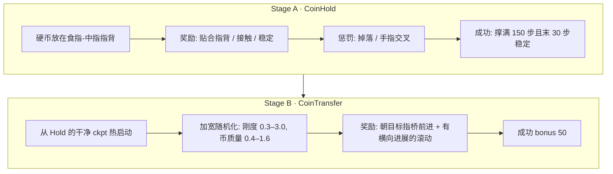

# ① 从官方 URDF 到第一个策略：Isaac Lab 仿真栈与指背滚币

> 系列第 1 篇 · [总览](./index.md) · 下一篇 [② 真机 SDK 首次连通](./02-real-hand-sdk.md)

黑客松开始前两天我们还没有实物手。能做的只有一件事：先把仿真栈搭起来，让手到的那一刻，策略、关节表、导出格式全都是现成的。这一篇是那两天的复盘，也是一份可以从零跟做的教程。任务选的是**指背滚币**（coin knuckle roll）——硬币平躺在指背上从食指滚到中指，一个看起来很酷、又足够小的手内操作。


---

## 0. 你需要什么

| 项 | 我们的配置 | 说明 |
| --- | --- | --- |
| GPU | RTX 4080 Laptop **12 GB** | 2048 个并行环境约占 4.5 GB；不要同时跑两个训练进程 |
| 系统 | Ubuntu 22.04 | |
| Isaac Sim | 6.0.1，装在 `~/isaacsim-env` | 自带 Python 3.12 venv |
| Isaac Lab | v3.0.0-beta2.patch1 | clone 到仓库旁的 `IsaacLab/`，不 vendor |
| RL | RSL-RL（`rsl-rl-lib` ≥ 5.0.1） | PPO |
| 手的模型 | [Rysen 官方 URDF](https://github.com/RysenRobotics/apex-hand-urdf)（v0.2.0，BSD-3） | 放到 `assets/apex-hand-urdf/` |
| 代码 | [peterpanstechland/apexhand](https://github.com/peterpanstechland/apexhand) | 本文所有路径以它为根 |

官方 URDF 自带坐标系图，后面所有"掌法向 / 指向"的讨论都基于它：


---

## 1. 环境：先把 Python 环境隔离干净

Isaac Sim 的 Kit 对 `libstdc++`、`PYTHONPATH` 极其敏感。我们这台机器上装着 ROS Humble 和 conda，第一次起 Kit 就报 `GLIBCXX_3.4.30 not found`。解法是一个 `env.sh`，每开一个终端 source 一次：

```bash
cd ~/Documents/apexhand
source env.sh
```

`env.sh` 做四件事：

1. 清掉 ROS / conda 污染的 `PYTHONPATH`、`LD_LIBRARY_PATH`；
2. 强制使用系统 `libstdc++`；
3. 激活 `~/isaacsim-env`；
4. 设置 `ISAACLAB_PATH`、`PIP_CONSTRAINT=constraints.txt`、`PYTHONPATH=.../source`。

然后安装本仓库的扩展包，**不要**让 pip 去解依赖：

```bash
pip install -e . --no-deps
```

`pyproject.toml` 的依赖列表是空的，仿真和 RL 依赖全部来自 Isaac Sim / Isaac Lab 环境。`constraints.txt` 把 `torch==2.11.0+cu128`、`warp-lang==1.13.0` 等钉死。Isaac Lab 3.0 beta 里 `packaging` 在 `isaacsim-core` 与 `isaaclab-rl` 之间互相打架，遇到冲突保留 isaacsim 侧的版本。

**Gate 1：Isaac Lab 本身能跑**

```bash
python IsaacLab/scripts/environments/list_envs.py | grep -iE "cartpole|allegro|repose"
python IsaacLab/scripts/reinforcement_learning/rsl_rl/train.py \
  --task Isaac-Cartpole-v0 --headless --max_iterations 20
python IsaacLab/scripts/reinforcement_learning/rsl_rl/train.py \
  --task Isaac-Repose-Cube-Allegro-v0 --headless --num_envs 1024 --max_iterations 20
```

Allegro 1024 环境如果 OOM，就把 `num_envs` 降到 512——这一步也顺便告诉你这台机器的显存余量。

---

## 2. 资产：URDF → USD，和一个会吃掉指尖的开关

```bash
bash scripts/convert_apex_urdf.sh      # 左右手各转一次 -> assets/apex/usd/{right,left}/
python scripts/inspect_apex.py --headless
python scripts/generate_coin_stl.py    # 半径 16 mm、厚 4 mm 的 PΛN 币
```

**硬性禁忌：不要给 URDF 转换器加 `--merge-joints`。** 合并固定关节会把 `*_pad`、`*_tip` 这些坐标系一起合掉，后面指腹观测、指尖位置、真机对齐全都会坏。我们踩过一次，症状是 `inspect_apex.py` 数出的 pad / tip 少了一半。

**Gate 2：USD 完整**——左右手都要解析出 21 个关节、5 个 pad、5 个 tip。

### 2.1 PhysX 不执行 mimic 关节

Apex 的 URDF 用 `<mimic>` 把 5 个被动关节（四指 DIP `*_j3`、拇指末节 `thumb_j4`）1:1 绑到源关节上。Isaac Sim 6 把它写成 `newton:mimic*` 属性，**PhysX 不认**。转出来直接训，这 5 个关节就是自由关节，指尖会软掉、耷下来。

我们的解法是一个自定义动作项 `ApexCoupledEMAAction`（`source/pan_dexterous_lab/tasks/coin_roll/mdp/actions.py`）：策略输出 16 维，动作项在应用时把源关节的目标复制给耦合关节，同时把被动关节的位置直接写进仿真：

```python
def apply_actions(self):
    super().apply_actions()
    coupled_targets = self.processed_actions[:, self._src_slot]
    self._asset.set_joint_position_target_index(target=coupled_targets, joint_ids=self._cpl_ids_t)
    src_q = self._asset.data.joint_pos.torch[:, self._src_ids_t]
    self._asset.write_joint_position_to_sim_index(position=src_q, joint_ids=self._cpl_ids_t)
```

真机上这 5 个关节由固件耦合，也**不应该**单独下发——仿真和真机在这一点上是一致的。

### 2.2 动作的原点是默认姿态，不是行程中点

Isaac Lab 自带的 `EMAJointPositionToLimitsAction` 会把 action=0 映射到每个关节行程的**中点**。对灵巧手来说这是一个紧握的姿态，指背桥面是斜的，硬币一放就滚掉。我们改成相对默认姿态的有界增量：

```text
target = default_joint_pos + action * scale   →  EMA(α=0.6)  →  clamp 到 soft limits
```

这样策略初始的零均值高斯输出对应"标定好的掌心朝下姿态"，硬币能待住，训练才有起点。

**Gate 3：耦合动作**

```bash
python scripts/check_action.py --headless
```

它对动作空间施加 0 / +1 / −1，检查动作维度是 16，5 个被动关节与源关节 1:1 跟随、误差接近 0。

### 2.3 关节表只有一份

`source/pan_dexterous_lab/assets/joints.py` 是关节名的**唯一真相源**。策略输出第 `i` 维永远对应 `ACTUATED_LOGICAL[i]`，真机映射走同一张表，任何地方都不允许出现裸的整数下标：

```python
ACTUATED_LOGICAL = [
    "thumb_j0", "thumb_j1", "thumb_j2", "thumb_j3",
    "index_j0", "index_j1", "index_j2",
    "middle_j0", "middle_j1", "middle_j2",
    "ring_j0", "ring_j1", "ring_j2",
    "pinky_j0", "pinky_j1", "pinky_j2",
]
COUPLED_LOGICAL        = ["thumb_j4", "index_j3", "middle_j3", "ring_j3", "pinky_j3"]
COUPLED_SOURCE_LOGICAL = ["thumb_j3", "index_j2", "middle_j2", "ring_j2", "pinky_j2"]
```

第 ② 篇会讲真机侧怎么按路径加载这同一个文件。

---

## 3. 任务几何：掌心朝下，币在指背

第一版我们把任务理解反了：掌心朝上、指腹托币。训了一轮才发现参考动作（[Coin knuckle roll](https://www.instructables.com/Coin-knuckle-roll/)）是**掌心朝下、硬币在指背上翻**。纠正后的几何（`assets/apex_cfg.py`）：

- 掌心朝下的 root 四元数 `(0.7071068, 0.0, -0.7071068, 0.0)`——注意 Isaac Lab 3.0 的四元数是 **(x, y, z, w)**，别按 wxyz 读；
- 硬币座位：knuckle `link1` / `link2` 中点 + **世界 +Z** 偏移 13 mm（用 body-local 偏移会偏到指缝里）；
- `enabled_self_collisions=False`：Apex 的触觉外壳在零位就互相重叠，开自碰撞 PhysX 会直接发散；
- 于是必须另外防穿指：外展关节 `*_j0` 的动作缩放钳到 **0.04**，再加一项 `finger_crossing` 惩罚（权重 −20）。


---

## 4. 课程：Stage A 托住，Stage B 传递



Gym id：`PAN-CoinHold-Apex-v0` / `PAN-CoinTransfer-Apex-v0`，各有一个 `-Play-v0`（少环境、关噪声、无超时）。

### 4.1 观测与动作

| 项 | 含义 |
| --- | --- |
| `joint_pos` / `joint_vel` | 16 个主动关节，按限位归一化 |
| `object_*` | 硬币位姿与线 / 角速度 |
| `fingertip_pos` | 指尖世界坐标 |
| `coin_to_knuckle` | 硬币相对指背接触点 |
| `last_action` | 上一步动作 |

训练时观测加高斯噪声（`enable_corruption=True`），Play 关掉。动作空间 `[-1, 1]^16`，经上面的默认姿态偏移 + EMA。PPO：actor / critic 都是 `[512, 256, 128]` + ELU，`num_steps_per_env=24`，自适应学习率，`entropy_coef=0.002`。

### 4.2 Domain Randomization

| 随机项 | Stage A | Stage B |
| --- | --- | --- |
| 手的摩擦 | 0.7–1.3 | 同 |
| 手的质量 scale | 0.95–1.05 | 同 |
| 关节刚度 / 阻尼 | 0.8–1.25 | **刚度 0.3–3.0** |
| 硬币摩擦 | 0.55–0.90 | 同 |
| 硬币质量 scale | 0.85–1.15 | **0.4–1.6** |

Episode：Hold 约 3 s，Transfer 约 5 s。控制频率 `dt=1/240`，`decimation=4` → **60 Hz**，和后面真机回放一致。

### 4.3 Stage A 的两个坑

1. **success 恒为 0。** 最初的成功判据没法触发。改成"撑满 ≥150 个控制步 + 最后 30 步稳定"，并写了独立评估脚本 `scripts/eval_hold.py`。
2. **手指交叉穿模。** 自碰撞关掉之后，策略第一反应是把两根手指穿过对方来夹住硬币——分数很高，动作作弊。这就是外展钳制 + `finger_crossing` 的来历。


命令：

```bash
python scripts/train.py --task PAN-CoinHold-Apex-v0 --headless \
  --num_envs 2048 --max_iterations 1500 --seed 42
python scripts/eval_hold.py --num_envs 64 --episodes 2 \
  --checkpoint logs/rsl_rl/pan_coin_hold/2026-09-04_04-20-40/model_100.pt
```

结果：离线 eval success **100%**。有意思的是我们最后用于热启动的是 `model_100` 而不是训满的 `model_1499`——后者 success 仍高，但动作标准差上升、指缝越收越紧，热启动反而不干净。**训得久不等于更好用。**

### 4.4 Stage B：一轮被 hack，一轮重平衡

第一轮传递训练 `success≈0`，回放一看：策略在**原地转硬币**刷分。原因很清楚——`hold_ok≈0.95` 每步都给，加上没封顶的 `roll_rotation≈6`，两项把 `progress` 完全压死，策略根本不需要移动硬币就能拿高分。

重平衡后的 `TransferRewardsCfg`（`coin_roll_env_cfg.py` + `mdp/rewards.py`）：

| 项 | 旧 | 新 | 说明 |
| --- | --- | --- | --- |
| `hold_ok` | 每步正奖励 | **0** | 托住是前提，不是目标 |
| `progress` | 小 | **8** | 前向 Δφ + 朝目标相位 ≈0.55 的稠密项 |
| `roll_rotation` | 无封顶 | **0.5**，ω 封顶且**必须有横向前进才计分** | 堵死原地转 |
| `slip` | — | −2 | |
| `success` | — | 50 | |
| 座位距离 | 单桥 | `coin_bridge_distance`：index-middle / middle-ring 两桥取 min | |

```bash
python scripts/train.py --task PAN-CoinTransfer-Apex-v0 --headless \
  --num_envs 2048 --max_iterations 2000 --seed 42 --resume \
  --checkpoint /ABS/PATH/pan_coin_hold/2026-09-04_04-20-40/model_100.pt
```

续训一定要用**绝对路径** + `--resume`，rsl_rl 会从 ckpt 记录的 iteration 再加 `max_iterations`。三段续训（`rebalance_v2` → `_cont` → `_fin`）到 `model_2099`。

**离线评估**（`scripts/eval_transfer.py`，128 env × 4 ep = 512 次）：

| 指标 | 值 |
| --- | --- |
| transfer_success | **61.5%**（315/512），门闸 >50% 通过 |
| phase_at_success | 均值 0.544（p10 0.521 / p90 0.572） |
| drop | 0.4%（2/512） |
| 手指最小间隙 | 0.4 mm（有挤压风险） |
| 最大外展 | 0.44 rad |

<video controls width="100%" preload="metadata" poster="/img/hackathons/2026/apex-hand/sim-coin-transfer-15s-poster.jpg" style={{maxWidth: '720px', display: 'block', margin: '1.5rem auto'}}>
  <source src="/video/hackathons/2026/apex-hand/sim-coin-transfer-15s.mp4" type="video/mp4" />
</video>

*`model_2099` 的 15 秒回放。手指动作偏大、指缝偶尔收紧，但硬币确实在指背上从食指走到了中指。*

---

## 5. 回放、评估、导出

日志目录：

```text
logs/rsl_rl/<experiment_name>/<YYYY-MM-DD_HH-MM-SS>[_run_name]/
├── model_*.pt
├── params/            # env.yaml / agent.yaml：当时的完整配置
├── videos/{train,play}/
└── exported/          # policy.onnx / policy.pt / joint_map.json
```

```bash
# 回放并录像（5 s ≈ 300 步，15 s ≈ 900 步）
python scripts/play.py --task PAN-CoinTransfer-Apex-Play-v0 --num_envs 1 \
  --checkpoint /ABS/PATH/model_2099.pt --video --video_length 900 --headless

# 导出给真机
python scripts/export_onnx.py --task PAN-CoinTransfer-Apex-v0 --headless \
  --checkpoint /ABS/PATH/model_2099.pt
```

`export_onnx.py` 产出两样东西：`policy.onnx`，以及 `joint_map.json`——里面有任务名、checkpoint、**16 个主动关节的顺序**、耦合关系、动作缩放、EMA α、60 Hz 标注，后来又加进了**观测的逐项布局**。**禁止事后重排 joint_map 里的索引。** 这份文件是第 ⑤ 篇所有 sim2real 工作的基础。

`DISPLAY` 常为空的机器用 `--video --headless` 就够；有桌面时 `--viz kit` 需要先 `pip install --no-deps -e IsaacLab/source/isaaclab_visualizers`，否则报 `visualizer(s) ['kit'] could not be configured`。

---

## 6. 给不懂 RL 的人：WebUI

黑客松队伍里不是每个人都读过 PPO。我们做了一个本地网页，把 200 多个参数连同"调大 / 调小会怎样、新手建议"暴露出来：

```bash
source env.sh
python -m webui        # http://127.0.0.1:8090  首页是启动台，/console 是训练控制台
```


控制台能做的事：

1. 左侧选任务、物理引擎（PhysX / Newton）、手部姿态、物体预设（`pan_coin_32mm`、`baoding_38/45/50mm`、`cube_60mm`…）、相机；
2. **参数体检**：红色是硬错误（比如小批次不能整除），黄灯是"你可能没意识到"；
3. **场景预览**只 spawn 几步，写一张 `scene.png`；**玩手**开一个环境的交互仿真，拖滑条拨关节；
4. **Reward 探针**跑 100 步随机动作，列出每项均值 / 方差 / 是否死项——Stage B 那个被 hack 的奖励，用它一眼就能看出 `roll_rotation` 的量级不对；
5. **自然语言奖励**：接任意 OpenAI 兼容 API，用中文描述行为 → 生成 `user_rewards.py` → 静态检查 → 1 环境 headless 自检 → 你审阅通过才写入，默认权重 0；
6. 配方保存在 `configs/recipes/*.yaml`，Hold 正常结束可自动 `--resume` 串 Transfer。

**一次只能跑一个任务**——真机、摄像头、12 GB 显存三样都互斥，启动台会拒绝第二个"开始"。

---

## 7. 踩坑清单

1. Hold success 恒为 0 → 成功判据改为"撑满 ≥150 步 + 末 30 步稳定"。
2. action=0 映射到关节行程中点 → 改为相对 `default_joint_pos` 的偏移。
3. 手指交叉 + 自碰撞必须关 → 外展钳 0.04 + `finger_crossing` −20。
4. 硬币出生穿模 / 弹飞 → `max_depenetration_velocity=1.0`、`reset_coin_on_knuckles`、关节 jitter 0.05。
5. 座位偏移用 body-local 会偏到指缝 → 用世界 +Z。
6. 续训必须用绝对 `--checkpoint` + `--resume`。
7. 12 GB 上别并行两个 `train.py`（我们误开过双进程，两个都慢得像卡死）。
8. `--merge-joints` 会吃掉 pad / tip。
9. Isaac Lab 3.0 四元数是 `(x, y, z, w)`。
10. `scripts/train.py` 顶层不能 import `pan_dexterous_lab...mdp`（会先于 Kit 拉起 USD → `free(): invalid pointer`），要用就在函数里 import；AppLauncher 必须在 Hydra 环境注册之前。

## 8. 文件速查

| 模块 | 路径 |
| --- | --- |
| 手 / 币资产 | `source/pan_dexterous_lab/assets/apex_cfg.py`、`joints.py`、`token_cfg.py` |
| 环境与奖励权重 | `source/pan_dexterous_lab/tasks/coin_roll/coin_roll_env_cfg.py` |
| MDP（观测 / 奖励 / 事件 / 动作） | `source/pan_dexterous_lab/tasks/coin_roll/mdp/` |
| PPO 配置 | `.../config/apex_hand/agents/rsl_rl_ppo_cfg.py` |
| 训练 / 回放 / 评估 / 导出 | `scripts/train.py`、`play.py`、`eval_hold.py`、`eval_transfer.py`、`export_onnx.py` |
| 自检 | `scripts/check_action.py`、`inspect_apex.py` |
| WebUI | `webui/` |

下一篇：[② 真机 SDK 首次连通](./02-real-hand-sdk.md)——手到了，第一件事不是让它动，是让它不动。
