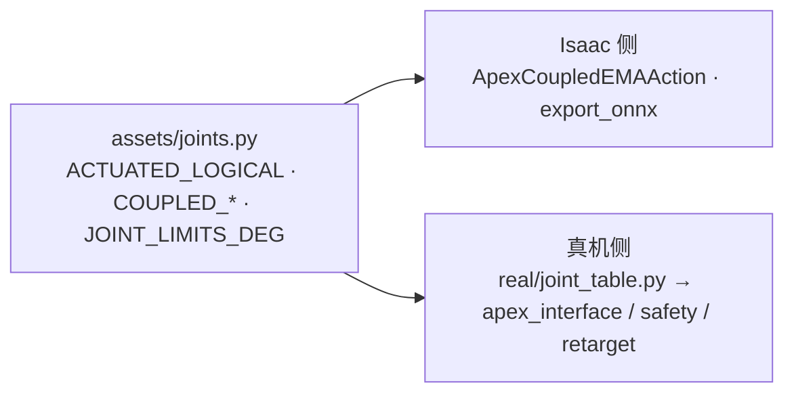

# ② 手到了，先让它不动：真机 SDK 首次连通与安全层

> 系列第 2 篇 · [上一篇 ①](./01-isaac-lab-sim-stack.md) · [总览](./index.md) · 下一篇 [③ 摄像头遥操作与 Kapandji](./03-teleop-kapandji.md)

9 月 5 日 13:39，实物手接上网线。15:01，它已经跟着摄像头里的人手在动。中间的 80 分钟就是这一篇：怎么连、怎么隔离环境、以及在它动起来之前先给它套上哪几层保险。这只手是**左手**，固件 3.2.5，SDK 1.5.2。


---

## 0. 你需要什么

- 一只 Apex Hand，一根网线，一个千兆网口（Wi-Fi 别想，RTT 要 ≤5 ms）。
- Ubuntu 22.04 + Python **3.10**（官方 SDK 的 `.so` 是按 3.10 编的；Isaac 那边是 3.12，两边不能混）。
- 官方 SDK 源码：[RysenRobotics/Rysen_SDK](https://github.com/RysenRobotics/Rysen_SDK)，我们放在 `third_party/Rysen_SDK/`（不进 git）。官方文档：[Apex Hand 入门](https://docs.rysenbot.com/apex-hand/get-started)。
- 官方还提供 [Rysen Explorer](https://github.com/RysenRobotics/rysen-explorer)（Docker 打包的 ROS2 后端 + 网页前端），只想先看手会不会动可以用它；我们要接策略，直接走 Python SDK。

---

## 1. 网段与 IP

出厂默认在 `192.168.0.x`：

| | 地址 | TCP |
| --- | --- | --- |
| 出厂 · 右手 | `192.168.0.103` | 5856 / 5857 |
| 出厂 · 左手 | `192.168.0.102` | 同上 |
| **我们的左手（改过）** | `192.168.88.200` | 同上 |

第一次连一只出厂状态的手，最快的办法是给有线网卡临时加一个别名，不用改系统网络：

```bash
sudo ip addr add 192.168.0.50/24 dev enp109s0
ping -c 2 192.168.0.102
```

我们的手到手时是 `192.168.0.2`，和现场网段不一致。SDK 里有改设备 IP 的接口，我们把它固定到了本地网段 `192.168.88.200`，然后所有脚本默认读环境变量 `APEX_HAND_IP`，`--ip` 可覆盖。

---

## 2. 一个完全独立的 venv

```bash
cd ~/Documents/apexhand
source env_real.sh          # 不是 env.sh！
```

`env_real.sh` 只做三件事：激活 `.venv-apex-real/`（Python 3.10）、把 `third_party/Rysen_SDK/rysen_sdk/lib/x86_64` 加进 `LD_LIBRARY_PATH`、设置 `APEX_HAND_IP`。

两条纪律：

- **不要**在 `isaacsim-env` 里 `pip install rysen-sdk`；
- **不要**在 `.venv-apex-real` 里装 Isaac 的任何东西。

系统级依赖 spdlog / fmt / boost 我们机器上本来就有，`import rysen_apexhand_sdk` 直接通过；缺库再跑官方的 `install_rysen_deps.sh`。

---

## 3. 只读冒烟：连上、读关节、不动电机

```bash
python scripts/real_sdk_smoke.py        # IP 默认取 APEX_HAND_IP
```

它按顺序做：`ping` → 探 TCP 5856 / 5857 → `Rysen().connect(ip, ETHERNET)` → 读 5 次 `get_joint_states()` → 断开。**默认不产生任何运动**；想动一下要显式 `--wiggle --i-know-what-im-doing`，而且 v1 里这个分支也只是把你引到官方 `example.py`。

你应该看到：

```text
=== network ===
ping 192.168.88.200: OK
tcp 192.168.88.200:5856: OK
tcp 192.168.88.200:5857: OK
=== connect ===
CONNECT_OK
=== read joints ===
[0] JointStates(...)
```

`sdk.get_hand_dir()` 会告诉你这是左手还是右手——后面所有脚本用它自动选 `--side`，不要靠人记。

---

## 4. 和仿真共用一份关节表

第 ① 篇说过，`source/pan_dexterous_lab/assets/joints.py` 是关节名的唯一真相源。真机 venv 里装不了 Isaac 包，于是 `real/joint_table.py` **按文件路径**把这一个 `joints.py` 加载进来，而不是复制一份：



这样策略输出的第 `i` 维在仿真和真机上永远是同一个关节。一旦出现第二份关节顺序，早晚会有一天悄悄错位——第 ⑤ 篇会讲一次真实事故。

`real/apex_interface.py` 是薄封装：

| 方法 | 做什么 |
| --- | --- |
| `connect()` | 连接，读 `get_hand_dir()` 记住左右 |
| `configure_motion(max_speed, max_accel, finger_torque_pct)` | 21 个关节的限速、限加速，5 根手指的力矩上限（百分比） |
| `enable()` / `disable()` | 使能 / 断电所有手指 |
| `get_actuated_pv()` | 16 个主动关节的位置 / 速度 / 力矩，按 `ACTUATED_LOGICAL` 顺序 |
| `get_finger_currents()` | 每根手指的最大电机电流（A） |
| `set_joint_positions(q16)` | 下发位置目标；**耦合关节在这里 1:1 复制**，从不单独下发 |

---

## 5. 安全层：`real/safety.py`

策略和遥操作发出的目标都要过 `SafetyFilter` 再到 SDK。它做四件事。

### 5.1 限位留余量

固件对 100° 的内部上限是 **1.7453 rad**，而 `deg2rad(100)` 算出来是 1.74533…，**比它大**——直接越界报错。所有限位统一留 1 mrad 余量。

### 5.2 固件包络比 URDF 小

URDF 给 `thumb_j1` 的上限是 60°（1.047 rad），固件 3.2.5 在 **0.66 rad 左右就拒绝**。更麻烦的是：**一个关节越界，整包 21 个关节的指令都被丢掉**，手看起来像是"随机卡住"。于是发送路径用固件包络（`thumb_j1` ≤ 0.60 rad），IK 仍然读 URDF 限位；`set_joint_positions` 收到 `OUT_OF_RANGE` 时会把所有指令朝零收 2° 再发一次，保证另外 15 个关节至少还在动。

### 5.3 每拍 Δq 上限

遥操作默认 `--max-step 0.10 rad`，策略回放另有 `--gain`。视觉每一帧都会跑在电机前面，不限幅的话手指会以电机的全速追目标，抖、响、发热。

### 5.4 电流缓放，而不是冻结

这只手没有触觉阵列，判断"碰到东西"只能靠每根手指的电机电流。两条经验：

- 固件上报的电流会卡在 **449–453 mA** 这个假满量程值上，不过滤的话安全层会认为手指永远在碰撞——`get_finger_currents()` 里直接丢掉 440–460 mA 区间。
- 碰撞后不要"冻结"手指（策略回放可以，遥操作不行——操作者看到的就是一根卡住的手指）。做法是**电流缓放**：超过该指的接触阈值后，把这根手指的屈曲关节按超阈值比例最多张开 `backoff_rad`（默认 0.04），电流降下来再合回去；起效快（0.35）、释放慢（0.08），防止在球上抖来抖去。外展轴不参与——它是扫，不是捏。
- 但**主动捏取和撞到障碍物的电流特征一模一样**。解法是让上层把"当前想捏多少"前馈给安全层，捏取时豁免拇指和食指——纯靠电流分不出来，第 ③ 篇会讲。

---

## 6. 第一次让它动：遥操作与空载回放

```bash
# 摄像头遥操作（Space 才使能电机，Esc 退出）—— 详见第 ③ 篇
python scripts/landmark_teleop.py --side left

# ONNX 策略空载回放：会动！清空周围再跑，gain 从小起
python -m real.policy_runner --gain 0.30 --seconds 12
```

`policy_runner` 以 60 Hz 跑 ONNX，安全层全程在环。第一次空载回放我们看到的是"手在轻微抽动，几乎不动"——不是 sim2real gap，是观测向量错位，那个故事留到第 ⑤ 篇。

9 月 5 日下午的遥操作从 15:01 起连续跑了 **19 分钟**没有断，这是我们敢在第二天把它搬上展台的底气。


---

## 7. 上机第一天的安全清单

1. 急停可达；`SafetyFilter` 异常 → 张开手的分支已接线。
2. 用 `joint_map.json` 核对每一维与 SDK 关节名（第 ⑤ 篇）。
3. 小 Δq 开环正弦扫关节，确认方向与限位——我们第一次跑就把"张开 / 握拳"搞反了。
4. 先空载 → 轻载 → 再放物体。
5. 监控电流；穿模式动作立即停。
6. `configure_motion` 先给保守值：`--torque-pct 30`、`--max-speed 3.5 rad/s`、`--max-accel 40`。

## 8. 验收清单（我们的实际状态）

- [x] 网线插好，`ping` 通
- [x] TCP 5856 / 5857 探测 OK
- [x] `CONNECT_OK` + 能打印关节状态
- [x] 摄像头遥操作驱动实机（连续 19 分钟）
- [x] ONNX 策略空载回放（60 Hz，安全层在环）
- [ ] 掌面标定 + 装球闭环（第 ⑤ 篇）

## 9. 文件速查

| 文件 | 职责 |
| --- | --- |
| `env_real.sh` | 真机 venv 入口 |
| `scripts/real_sdk_smoke.py` | 只读冒烟 |
| `real/joint_table.py` | 按路径加载 `assets/joints.py` |
| `real/apex_interface.py` | SDK 封装，耦合关节 1:1 复制 |
| `real/safety.py` | 限位余量、固件包络、Δq 上限、电流缓放 |
| `real/policy_runner.py` | ONNX 回放循环 |
| `docs/REAL_SDK.zh.md` | 本机联调记录 |

下一篇：[③ 赛道一：摄像头遥操作与 Kapandji](./03-teleop-kapandji.md)。
