# ③ 赛道一：一个 webcam 遥操灵巧手，还要做出医学对掌试验

> 系列第 3 篇 · [上一篇 ②](./02-real-hand-sdk.md) · [总览](./index.md) · 下一篇 [④ 保健球 RL 仿真](./04-baoding-rl-sim.md)

赛道一的题目：用摄像头捕捉人手动作去遥操灵巧手，动作要能覆盖**医学上的手部检测方法**，而且对**响应速度**有要求。我们把"医学检测"具体化为 **Kapandji 拇指对掌试验**——临床上评估拇指功能的 0–10 分量表：拇指尖依次去点食指近节侧方、中节侧方、食指尖、中指尖、无名指尖、小指尖，再沿小指往下点 DIP 横纹、PIP 横纹、MCP 横纹，最后到掌横纹。满分靠的是**对掌轴走满**，不是捏得紧。

主办方给的**赛道一参考**是这样的：显示器上 RGB-D 手部跟踪，镜头前是人手，桌上 Apex 手逐指跟随。那是要对齐的目标；我们自己的栈是 MediaPipe（可选融 D435 深度）→ DexPilot IK → Kapandji HUD，不是他们那套闭源界面。

<video controls width="100%" preload="metadata" poster="/img/hackathons/2026/apex-hand/official-teleop-reference-poster.jpg" style={{maxWidth: '720px', display: 'block', margin: '1.5rem auto'}}>
  <source src="/video/hackathons/2026/apex-hand/official-teleop-reference.mp4" type="video/mp4" />
</video>

*赛道一官方参考（主办方提供）：操作者手上的骨架叠加，桌上 Apex 手跟手。*


---

## 0. 相机选型：我们都试了什么

| 相机 | 接法 | 我们怎么用 | 结论 |
| --- | --- | --- | --- |
| **Logitech C920** | USB，夹在笔记本顶上 | 主力。对着人手跑 MediaPipe，HUD 实测 33–39 fps | 正对手掌、光线正常时 RGB 就够。便宜，好摆 |
| 笔记本内置摄像头 | 自带 UVC | 当 C920 被拿去俯拍机器人（第 ⑤ 篇）时，用它对操作者 | 能跑；画质和角度不如 C920。脚本默认优先外接，显式 `--camera N` 才选它 |
| **RealSense D435** | USB 3 | `--realsense`：彩色 + 深度对齐，实测 z 替换 MediaPipe 的相对深度 | 拇指对掌、指尖互相遮挡时明显更稳。必须插 USB 3（蓝口 / Type-C），别和 T265 共用 hub，一次超规格开流会卡到硬件复位 |
| RealSense T265 | USB | 想做第二视角 | 它是跟踪相机（双鱼眼 + IMU），**没有彩色 + 深度**，librealsense 版本还和 D435 冲突。没进闭环 |
| Insta360 X5 | 机箱顶 | 调酒机上的 360° 拉客镜头，原计划做剪刀石头布 | 没进入遥操作链路 |

结论先说：**RGB 跟手不需要深度相机**。MediaPipe 的 `world_landmarks` 给出相对掌坐标系的三维结构已经够用；深度相机帮的是"拇指 Z / 对掌 / 侧摆"和"手侧对相机时的漂移"这两件事。

`discover_camera()` 用 `v4l2-ctl --list-devices` 找设备，跳过名字里带 `USB2.0 HD UVC`、`Integrated`、`IR Camera` 的内置节点，优先外接 USB。C920 被别的进程占住时它会静默失败——我们第一次就是这样，`fuser /dev/video*` 看一眼再杀掉。

---

## 1. 五种运行方式

```bash
source env_real.sh
python scripts/landmark_teleop.py --side left                 # 真机（Space 才使能电机，Esc 退出）
python scripts/landmark_teleop.py --dry-run                   # 只开相机，看 HUD
python scripts/landmark_teleop.py --sim --side left           # 驱动 Isaac 沙盒里的手，不动电机
python scripts/landmark_teleop.py --realsense --side left     # D435 深度替换 MediaPipe z
python scripts/landmark_teleop.py --side left --calib configs/palm_calib.json --record logs/gait/demo.npz
```

`--sim` 需要另开一个终端跑 Isaac 沙盒（注意是 `env.sh`，不是 `env_real.sh`）：

```bash
source env.sh
python scripts/sandbox_hand.py --task PAN-BaodingRotate-Apex-Left-Play-v0 --hand-pose palm_up_cradle
```

9 月 5 日 14:16，第一版 HUD 在展台上跑起来的样子（当时还是绿色骨架、没有 Kapandji 分）：


两个进程通过 `logs/webui/sandbox/` 里的文件交换目标角与实测角。9 月 5 日晚上手被主办方收回去了，我们就是用这个模式调了一夜的拇指映射。


HUD 怎么读：

| 字段 | 含义 |
| --- | --- |
| `ARMED` / `SAFE` | 电机是否使能；Space 切换 |
| `robot=left` / `dry-run` / `sim` | 目标是真机哪只手 / 不连 / 沙盒 |
| `fps` | 整条链路的实际频率（目标 `--hz 45`） |
| `Right 0.98` | MediaPipe 的手性与置信度；低于 `--min-score 0.65` 就保持上一帧 |
| `Kapandji=9` | 当前的对掌分数 |
| `pinch=0.00` | 拇指尖-食指尖捏合程度 0–1，会前馈给安全层 |
| `SENT` / `HOLD` | 这一帧有没有下发 |
| `CAL37%` | 骨长标定进度（前 90 帧约 3 s） |
| `depth=17/21` | D435 给出了几个关键点的实测深度 |
| `t:0.23A i:0.04A …` | 每根手指的电机电流；`CONTACT thumb` 表示该指进入电流缓放 |
| `t0:+28 t1:+13 …` | 16 个主动关节目标角（度），t=拇指、i=食指、m=中指、r=无名指、p=小指 |

---

## 2. 流水线

```mermaid
flowchart LR
  Cam["相机帧<br/>C920 / 内置 / D435"] --> MP["MediaPipe Hands<br/>image landmarks + world landmarks"]
  MP --> Fuse["fuse()<br/>平面取 image 头, 深度取两头均值<br/>(有 D435 时用实测 z)"]
  Fuse --> Euro["1€ 滤波<br/>min_cutoff 1.2 Hz, beta 10"]
  Euro --> Rebuild["按操作者骨长重建<br/>90 帧中位数"]
  Rebuild --> Chir["手性归一<br/>side × forward 指向掌心"]
  Chir --> Seed["retarget.py<br/>解析种子: 四指 abd/heading/fold, 拇指 j0-j3"]
  Seed --> IK["apex_fk.ik_hand<br/>DexPilot 向量匹配 + 解析 Jacobian<br/>10 个 Kapandji 位点"]
  IK --> EMA["EMA 0.28 + 死区 0.5°"]
  EMA --> SF["SafetyFilter<br/>限位 / Δq 0.10 rad / 电流缓放 / 捏取豁免"]
  SF --> SDK["SDK move_j_position_follow<br/>耦合关节 1:1 复制"]
```



### 2.1 MediaPipe 有两路输出，各有各的毛病

- **image landmarks**：画面平面内很准，但每个轴各自归一化，深度只是粗略的相对值。
- **world landmarks**：是米制三维，能看出手指弯没弯，但它的平面位置是带强先验的回归——伸直的拇指 IP 会被读成弯 30°，真正的拇指-食指捏合永远闭不到 0.17 个掌宽以下，骨长还会逐帧抖 20–30%。

`HandModel`（`tracking/hand_model.py`）把两路合成一副可信的骨架：

1. **融合**：平面坐标取 image 头（乘上画面宽高比换回同一单位，再最小二乘缩放到 world 头的尺度），深度取两头均值——深度**不能按手指分别取**，两头的偏移不一致，拇指用一套、四指用另一套，它们就永远不知道自己碰上了；有 D435 时，实测的米制点直接替换 MediaPipe 的猜测，没测到的点沿 MediaPipe 方向放到同样的米制上。
2. **1€ 滤波**：截止频率 = `min_cutoff + beta × |速度|`。捏合时指尖速度 0.3–0.5 m/s，`beta` 必须是 10 这个量级，滤波器才会在运动时"打开"；早期用归一化图像坐标调出来的 0.04，在米制下等于一个固定 1.2 Hz 的低通，捏合到位晚了七帧。
3. **按骨长重建**：前 90 帧（约 3 s）取每根骨头长度的中位数作为这位操作者的骨长，之后每帧保留测到的方向、替换成固定长度。**滤波必须在重建之前**——反过来会把刚建立的长度约束又抹掉。
4. **手性归一**：让 `side × forward` 永远指向掌心。于是操作者伸左手还是右手都能驾驭这只左机器人手，不需要 `--mirror` 之外的任何手性开关。

`world_ok()` 在这之前先把塌掉 / 被遮挡的骨架拒掉（掌宽不在 2–20 cm、手指长度不在 0.25–2.2 个掌宽都算坏帧），坏帧保持上一姿态，连续 12 帧丢失才重置滤波。

### 2.2 为什么"关节角对关节角"的映射做不了 Kapandji

最直接的 retarget 是量人手每个关节的夹角，直接写到机器人对应关节。四指这样做基本没问题（张开、握拳、剪刀、竖指都对得上）。**拇指不行**。Apex 的拇指是四个主动关节：

| 关节 | 含义 | 行程 | 对应人体 |
| --- | --- | --- | --- |
| `thumb_j0` | 对掌 | 0–90° | CMC 对掌 |
| `thumb_j1` | 侧摆 | −10–60°（固件实际约 ≤34°） | CMC 外展 |
| `thumb_j2` | 近端弯曲 | 0–80° | MCP 屈 |
| `thumb_j3` | 远端弯曲 | −20–80°（`j4` 1:1 跟随） | IP 屈 |

机器人张开时拇指在掌侧 14 cm 处；要点到小指根，需要对掌、折叠面的滚转、几乎打满的 `j2` 一起动。而人的拇指横过掌心时几乎是**直的**——照抄人的铰链角，机器人拇指尖会停在指腹前方 15 cm。Kapandji 6–10 分的目标全在这个区域，所以关节角映射对拇指只能"有动作"，做不到"在做你手上的那个动作"。

### 2.3 DexPilot 向量匹配 + 10 个 Kapandji 位点

`tracking/apex_fk.py` 用的是 DexPilot（Handa et al., ICRA 2020）的思路：不匹配角度，匹配**掌坐标系里的位点到位点向量**；当操作者把两个位点靠到一起时，把这一对投影成接触。DexPilot 原文的位点是四个指尖，我们把对掌集合换成 **10 个 Kapandji 位点**——其中六个不是指尖，而是指骨侧面和掌横纹，需要自己的关键点组合（`hand_model.KAPANDJI_SITES`）：

| 分 | 位点 | MediaPipe 关键点组合 |
| --- | --- | --- |
| 1 | 食指近节侧方 | 0.5·(5) + 0.5·(6) |
| 2 | 食指中节侧方 | 0.5·(6) + 0.5·(7) |
| 3 | 食指尖 | 8 |
| 4 | 中指尖 | 12 |
| 5 | 无名指尖 | 16 |
| 6 | 小指尖 | 20 |
| 7 | 小指 DIP 横纹 | 19 |
| 8 | 小指 PIP 横纹 | 18 |
| 9 | 小指 MCP 横纹 | 17 |
| 10 | 掌横纹 | 0.30·(5) + 0.45·(17) + 0.25·(0) |

"碰到"的判据是拇指尖到位点的**掌面内**距离 ≤ 0.25 个掌宽（约 1.5 cm）——临床医生就是这样看的，正面相机把已经贴在掌上的拇指读成略微在前方也不影响。`kapandji_score()` 取**能碰到的最高分**，而不是最近的那个。

IK 求解用**解析 Jacobian**：每个关节都是转动关节，Jacobian 的一列就是 `axis × (point − origin)`。每次迭代只做一次 FK，而不是有限差分的 17 次；而且关节顶在限位上时它依然正确——有限差分的探测步被裁掉会产生一整列死零。这一步是"响应速度"要求的主要来源之一：整条链路在 C920 上稳定 33–39 fps。

### 2.4 解析种子 + IK 收尾

`retarget.py` 先用几何量给 IK 一个好的初值：

- 四指：外展 = 近节骨在掌面内相对该指静止方向的偏航；heading = 近节骨与前向的夹角；fold = 0.65 × PIP 折角 + 0.35 × DIP 折角（`_DIP_BLEND`），因为机器人的 `j3` 是跟着 `j2` 的，把人两段的弯曲分摊到一个主动关节上跟指尖朝向更准。
- 拇指：按**拇指尖在掌坐标系里的位置**解 `j0`（出掌 / 尺侧多少）、`j2`（离开桡侧静止位多少）、`j1`（折叠面向小指滚了多少）、`j3 = max(铰链角, 0.45·j2)` 保证 `j2` 抬起后 IP 仍可达。

然后 `ik_hand()` 在这个种子附近解 DexPilot 目标，最后按 `JOINT_LIMITS_DEG` 裁剪。早期版本把手压扁到图像平面、再用一堆调出来的"角度下限"补深度（42°、52°、58°……这类魔法数字）；有了真三维之后这些下限全删了——留着只会和观测打架。

---

## 3. 让它不打手：安全层怎么配合遥操作

MediaPipe 抖一下，食指和中指的 `j0` 就可能在掌面上交叉。仿真里有 `finger_crossing` 惩罚和 0.04 的外展缩放，那是给策略的，遥操作没有。我们分了四层：

| 层 | 做什么 | 操作者的观感 |
| --- | --- | --- |
| 指令侧 | 相邻指 `j0` 差不能让指骨在掌面交叉；要交叉就只夹外展，屈指照跟 | 几乎看不出，剪刀 / 握拳都还在 |
| 硬件帽 | `--torque-pct 30`：交叉时外展顶不动，不会绞坏 | 顶住，不弹开 |
| 电流缓放 | 某指电流超阈值 → 屈曲关节最多张开 0.04 rad，电流降了再合回 | 碰到东西会"让一下"，不会卡死 |
| 捏取豁免 | `pinch` 前馈给 `SafetyFilter`，主动捏合时拇指和食指不触发缓放 | 捏得住，不会捏一下就松 |

最后一条是必须的：拇指-食指主动捏东西的电流特征和撞到障碍物**一模一样**，电流本身分不出来，只能由上层告诉安全层"我现在是故意的"。这只手没有触觉阵列，指腹对指腹（捏）和指侧互顶（交叉）只能间接看：**关键点在靠近 + 关节跟得上 = 在做动作；关键点没靠近 + 外展跟丢 = 在交叉。**

`SafetyFilter(hold_on_lag=False)`——策略回放时"关节落后目标就冻结"是合理的（说明撞上了），遥操作必须关掉，视觉每帧都跑在电机前面，冻结就是操作者眼里的"手指卡住"。

---

## 4. 速度相关的参数

| 参数 | 默认 | 作用 |
| --- | --- | --- |
| `--hz` | 45 | 控制循环目标频率；SDK 侧是 100 Hz |
| `--min-cutoff` / `--beta` | 1.2 Hz / 10 | 1€ 滤波：静止时平滑、运动时跟得上 |
| `--ema` | 0.28 | 关节角的二级 EMA，越小越稳越钝 |
| `--deadzone` | 0.5° | 小于它的关节变化忽略，消除静止抖动 |
| `--hold-miss` | 12 帧 | 跟丢多少帧后重置滤波 |
| `--max-step` | 0.10 rad | 每拍 Δq 上限 |
| `--max-speed` / `--max-accel` | 3.5 rad/s / 40 rad/s² | 下发给 SDK 的关节限速、限加速 |
| MediaPipe `model_complexity` | 1 | 0 更快更糙，2 更准更慢 |

我们没有换检测模型。9 月 5 日夜里反复讨论过"要不要上更重的手部模型 / 要不要买深度相机"，最后的结论是：**先把 retarget 的拇指语义改对，再用 2 ms 的向量 IK 收尾**，检测模型不是瓶颈。

---

## 5. 那一夜：拇指映射是怎么调出来的

9 月 5 日 21:16，群里出现一条别队的遥操作视频，指尖对得很齐。我们当时四指已经能跟，拇指只是"在动"。手已经被收走，能用的只有 Isaac 沙盒 + `--sim`。


接下来五个小时的截图，几乎每张都有红圈：


按时间顺序，改动是这样叠上去的：

1. 掌坐标系的三轴重新绑定（`palm_basis`：side = 食指 MCP → 小指 MCP，forward = 腕 → 两个 MCP 的中点，normal = 二者叉积并正交化），之前的 heading 全部算在错的平面上；
2. 四指的 fold 从"只看 PIP"改为 PIP / DIP 加权，机器人 `j3` 跟 `j2` 的事实要在人这一侧就吃掉；
3. 拇指从"照抄铰链角"改为"按指尖位置解四个轴"；
4. 发现 world landmarks 在拇指伸直时把 IP 读成弯 30°、捏合闭不到 0.17 掌宽——这就是 `fuse()` 里两头融合的来历；
5. 有限差分 Jacobian 在限位上出死列，换成解析 Jacobian；
6. 早上 RealSense 到了，把 D435 的实测深度接进 `fuse()` 的 `measured` 参数，拇指 Z 稳了。


9 月 6 日 08:32 真机回来，08:41 打出 Kapandji = 9（文首那张图）。10 分还没有稳定打出来——拇指尖到掌横纹这一档，靠单目 + 世界坐标的深度还是差一点，D435 在正对手掌时帮不上更多。这是这条赛道目前的边界。


---

## 6. 在展台上怎么一键拉起

WebUI 启动台（`python -m webui`，首页）有"遥操"一栏：**真机连通自检**、**Landmark 真机遥操**（可勾选 RealSense、仅相机预览）、**仿真玩手**。卡片目录在 `webui/launcher.py` 的 `APPS` 里，命令不写在 HTML。一次只能跑一个任务，真机、摄像头、显存三样互斥。


---

## 7. 踩坑清单

1. **张开 / 握拳反了**：第一次上真机，fold 的符号和 URDF 的正方向相反。用开环正弦先扫一遍每个关节的方向。
2. **`thumb_j1` 越界丢整包**：URDF 说 60°，固件 3.2.5 约 0.66 rad 就拒绝，且一个关节越界整包 21 关节都不动。发送路径用固件包络。
3. **C920 被占用**：`discover_camera()` 静默失败 → `fuser /dev/video*`。
4. **D435 插在 USB 2 口上**：`pyrealsense2` 报没有可用 profile，提示信息会告诉你换蓝口、拔掉同 hub 的 T265。
5. **1€ 的 `beta` 单位**：坐标从归一化图像坐标换成米之后，`beta` 必须跟着换量级（0.04 → 10），否则捏合慢七帧。
6. **不要事后重排关节索引**：`ACTUATED_LOGICAL` 是唯一顺序。
7. **假电流**：449–453 mA 是固件的满量程假值，不过滤安全层会一直认为在碰撞。

## 8. 文件速查

| 文件 | 职责 |
| --- | --- |
| `scripts/landmark_teleop.py` | 主循环、HUD、按键、录制 |
| `tracking/camera.py` | webcam / RealSense 帧源，深度采样 |
| `tracking/hand_tracker.py` | MediaPipe 封装，两路关键点 |
| `tracking/hand_model.py` | 融合、1€、骨长重建、手性、Kapandji 位点与打分 |
| `tracking/retarget.py` | 解析种子 → `ik_hand` → 限位 |
| `tracking/apex_fk.py` | 左手掌坐标系 FK、DexPilot 目标、解析 Jacobian |
| `tracking/filters.py` | 1€ / EMA |
| `real/safety.py` | 限位、Δq、电流缓放、捏取豁免 |
| `scripts/sandbox_hand.py` | Isaac 沙盒（`--sim` 的另一半） |

下一篇：[④ 赛道二：保健球 RL 仿真](./04-baoding-rl-sim.md)——换一条完全不同的路：不让人教，让仿真教。
