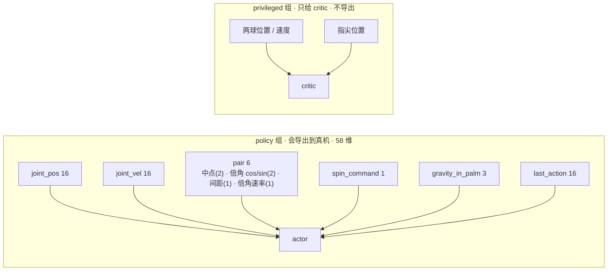

# ④ 赛道二：让仿真教手盘核桃

> 系列第 4 篇 · [上一篇 ③](./03-teleop-kapandji.md) · [总览](./index.md) · 下一篇 [⑤ 保健球 Sim2Real 与复盘](./05-baoding-sim2real.md)

赛道二的题目是"盘核桃"：像玩保健球一样，让两颗小球在掌心里互相绕着转。9 月 5 日 15:08 我们在遥操作刚通的兴奋里接下这道题，从此每一轮训练都会托、几乎都不转。这一篇把九轮实验、每轮为什么作废、以及 9 月 8 日那个"手放错方向了"的顿悟原原本本写出来。**这是一篇进行中的教程**——结尾的安装角扫描还在跑。

<video controls width="100%" preload="metadata" poster="/img/hackathons/2026/apex-hand/human-baoding-reference-poster.jpg" style={{maxWidth: '360px', display: 'block', margin: '1.5rem auto'}}>
  <source src="/video/hackathons/2026/apex-hand/human-baoding-reference.mp4" type="video/mp4" />
</video>

*我们的参考动作：我自己的手，两颗 30 mm 木球，5 秒。所有几何数字都是从这段视频和这两颗球量出来的。*

主办方还给了一段**官方 Apex 示范**：光学平台上的左手、两颗镜面钢保健球、俯拍镜头下对转。那是我们要对齐的目标动作；我们能拿去训练的，是便宜的木球对和后来发现的挂钩安装姿态。

<video controls width="100%" preload="metadata" poster="/img/hackathons/2026/apex-hand/official-baoding-reference-poster.jpg" style={{maxWidth: '360px', display: 'block', margin: '1.5rem auto'}}>
  <source src="/video/hackathons/2026/apex-hand/official-baoding-reference.mp4" type="video/mp4" />
</video>

*源升 Apex 官方参考：钢保健球在掌心对转（主办方提供）。*


---

## 0. 先把任务定义清楚

- **物体**：两颗车制木球，直径 30 mm，实测 9.55 g / 颗 → 密度 676 kg/m³，正好在山毛榉 / 桦木区间。仿真里球的半径、间距、复位位置全部从这一个半径推导，换球只改一个数。
- **手**：**左手**——实物就是左手，直接训左手省掉部署时镜像策略这一步。
- **动作**：两球绕掌心法向互相转圈。一"圈"= 每颗球回到原位 = 球对连线转 2π。评估指标是**每个 episode 转了多少圈**（`baoding_revolutions`），不是奖励值。
- **episode**：10 s（600 步 @ 60 Hz），球掉出掌窝立即结束。


Gym id：`PAN-BaodingRotate-Apex-Left-v0`（训练）/ `PAN-BaodingRotate-Apex-Left-Play-v0`（回放，16 环境、关噪声、无超时）。配置在 `source/pan_dexterous_lab/tasks/coin_roll/baoding_env_cfg.py`。

---

## 1. 观测：只让策略看真机也能测到的东西

第 ① 篇的滚币策略看的是**特权状态**（硬币位姿、指尖绝对坐标）。上真机时这些量测不到，只能喂零，策略立刻饱和。保健球任务从一开始就把 actor 和 critic 分开：



`pair` 这 6 个数是整条 sim2real 链路的契约：`real/ball_tracker.py` 必须能从两个 blob + 一次掌面标定算出**同序、同单位**的六个数（第 ⑤ 篇）。所以里面刻意**没有**两样东西：

- **球的身份**。两颗球一模一样，相机分不出谁是谁；一旦观测里有"球 1 / 球 2"，策略会学到一个真机上不存在的信息。解法是只报这一**对**的中点、间距和**倍角**后的轴向：交换两球给轴角加 π，倍角之后加 2π，不变。
- **球离掌心的高度**。一颗固定相机测不出来；30 mm 的球在 30 cm 外几毫米的高度变化不到一个像素。

`gravity_in_palm` 是 9 月 8 日加的：重力在手坐标系里的单位向量，掌心朝上水平时是 (0, 0, −1)，指尖下垂 90° 时是 (1, 0, 0)。它告诉策略"手是怎么装的"，真机上由 `--mount-pitch-deg` 给同一个常数。**加了它之后 obs 从 55 变 58 维，旧的保健球 checkpoint 不能再 `--resume`。**

---

## 2. 动作与奖励

动作是关节角相对"托举姿态"（`_CRADLE_JOINT_POS`）的有界增量，缩放按参考视频的行程定，不按关节范围定：

| 关节 | scale（rad） | 为什么 |
| --- | --- | --- |
| 拇指 `j0–j3` | 0.32 | 拇指尖 Jacobian 约 85–105 mm/rad；0.25 只够当围栏、推不动交换，0.5 变成砸球的锤子，0.32 ≈ 视频里一次 28–33 mm 的拨动 |
| 四指 `j0`（外展） | 0.25 | |
| 四指 `j1 / j2` | 0.35 | 视频里手指上下约 15–20 mm |

目标的变化率被钳在 `JOINT_MAX_SPEED_RAD_S = 2.0 rad/s`——和真机 SDK 的 `MaxJointSpeed` 一致，不然策略会学出真手做不出来的挥击。

当前奖励（`BaodingRewardsCfg`）：

| 项 | 权重 | 含义 |
| --- | --- | --- |
| `target_pair` | +1 | RoTO 式两个"座位"互换：座位在掌面内 ±16.5 mm、高度 ±10 mm（一高一低），球到达一个座位就把两个座位对调。**只按进度给分**——绝对距离的 tanh 会让策略坐着不动吃分 |
| `spin` | +2 | 球对连线按指令方向转过的角度（每步封顶 0.12 rad，每圈 +1 bonus）；同时是 `baoding_revolutions` 的唯一记账者 |
| `ball_gap` | −4 | 球心距偏离"刚好贴上"（2r + 3 mm）：小于接触是穿模或挤压，大于 12 mm 的松弛带才开始罚 |
| `pair_centering` | −3 | 球对中点偏离掌窝中心（8 mm 死区）；量的是到掌窝而不是到掌坐标原点——原点在腕，罚它会奖励把球往手腕拖 |
| `hold_pair` | **0** | 参考视频从不"停着托"；每步给托住的分正是上一轮学会坐着不动的原因 |
| `drop` | −12 | 球掉出的**那一步**罚一次，之后不再罚 |
| `finger_crossing` | −20 | 自碰撞关着，这是唯一阻止手指互相穿过的东西 |
| `action_rate_l2` / `joint_vel_l2` / `action_l2` | −0.01 / −2.5e-5 / −1e-4 | 别抖 |

终止：超时 10 s、`balls_dropped`、球离手 0.45 m。摩擦 0.60–0.95（木球在橡胶垫上比硬币抓得多）、质量 ±8%（球称过了，不确定的是摩擦和关节增益，不是质量）。

---

## 3. 九轮实验：为什么都会托不转

每轮训练的目录里都有 `params/env.yaml`（当时的完整配置）、`code/`（决定这个策略的源文件快照）、`RUN.md`（命令、git、复原方法）。这是 9 月 5 日晚上我们给自己定的规矩："要记录每次模型的代码和操作，才能找到最优解并同步改动"——后来证明这是整个项目最值钱的一条纪律。

| # | run | 思路 | 结局 |
| --- | --- | --- | --- |
| 1 | `09-05_16-14-27` | HOLD：`hold_pair` 每步 +1，球坐掌心槽；4096 env × 3000 iter | **作废**。会托、几乎不转 |
| 2 | `09-05_19-13-22_orbit_reset` | 复位时给球对注入 `orbit_omega=3.5` 的初始旋转 | **作废**。学会了大半径绕大圈，不是手内互换 |
| 3 | `09-05_21-43-43_pair_mill` | 四指对称做深杯，原地互碾 | **唯一能转的**：18.2 圈 / 578 步，93% 活满。观感幅度大、分工不像视频。留作真机测试的候选 |
| 4 | `09-05_22-27-26_hook_walls` | 小指当墙、拇指当另一堵墙 + 扣球、三指做钩；对中只罚侧向 | **作废**。600 iter 早停，rev≈0.02 |
| 5 | `09-06_00-33-14_swap_targets` | RoTO 两点互换（半径 16.5 mm）+ 轻 spin；小指收回笼子 | **半成品**。400 iter 5.6 圈 / 600 步，会转；但拇指像锤子竖着砸，行程过大 |
| 6 | `09-06_07-57-50_thumb_wall` | 同上奖励；FK 解出拇指垫贴球的静止位；拇指 scale 0.25；`clip_actions=1` + 2 rad/s 限速 | **作废**。600 iter 平台，rev≈0。`target_pair` 的绝对距离项仍在给"坐着"发分 |
| 7–9 | `09-06_08-43 / 09-32 / 09-43 / 09-51_over_under` | 座位加 ±10 mm 高差（一高一低）；gap 松弛 12 mm；对中死区 8 mm；spin 权 2；进度 shaping | **作废**。三次中断续训到 it=600 平台，rev≈0.006，ep≈560：坐着吃分堵死了，但仍学不会互换 |

看四段回放，比看表格更直观（都是同一个镜头）：

<video controls width="100%" preload="metadata" poster="/img/hackathons/2026/apex-hand/sim-baoding-hold-model2999-poster.jpg" style={{maxWidth: '720px', display: 'block', margin: '1.5rem auto'}}>
  <source src="/video/hackathons/2026/apex-hand/sim-baoding-hold-model2999.mp4" type="video/mp4" />
</video>

*#1 HOLD，`model_2999`：托得极稳，就是不转。奖励曲线很漂亮——这正是问题。*

<video controls width="100%" preload="metadata" poster="/img/hackathons/2026/apex-hand/sim-baoding-orbit-reset-poster.jpg" style={{maxWidth: '720px', display: 'block', margin: '1.5rem auto'}}>
  <source src="/video/hackathons/2026/apex-hand/sim-baoding-orbit-reset.mp4" type="video/mp4" />
</video>

*#2 orbit_reset：球是在转，但绕的是一个手掌那么大的圈。*

<video controls width="100%" preload="metadata" poster="/img/hackathons/2026/apex-hand/sim-baoding-pair-mill-poster.jpg" style={{maxWidth: '720px', display: 'block', margin: '1.5rem auto'}}>
  <source src="/video/hackathons/2026/apex-hand/sim-baoding-pair-mill.mp4" type="video/mp4" />
</video>

*#3 pair_mill：18.2 圈 / episode。能转，但四指动作幅度很大、拇指几乎不参与——和人手的分工不一样。*

<video controls width="100%" preload="metadata" poster="/img/hackathons/2026/apex-hand/sim-baoding-swap-targets-poster.jpg" style={{maxWidth: '720px', display: 'block', margin: '1.5rem auto'}}>
  <source src="/video/hackathons/2026/apex-hand/sim-baoding-swap-targets.mp4" type="video/mp4" />
</video>

*#5 swap_targets：拇指竖起来像锤子一样砸球。行程过大，但方向对了。*

<video controls width="100%" preload="metadata" poster="/img/hackathons/2026/apex-hand/sim-baoding-over-under-poster.jpg" style={{maxWidth: '720px', display: 'block', margin: '1.5rem auto'}}>
  <source src="/video/hackathons/2026/apex-hand/sim-baoding-over-under.mp4" type="video/mp4" />
</video>

*#7–9 over_under：座位一高一低，坐着不再有分，可它还是选择托着。*

我在 9 月 5 日 22:13 写下的一段判断，后来成了第 4–9 轮的设计依据："小拇指是用来当墙的，大拇指用来扣动球运动的同时也是另一堵墙，剩下的手指像一个 hook / bowl 把球护在手指窝窝里。"


### 3.1 这些失败的共同点

- **每步给"托住"的分，策略就会选择只托住。** 这个教训在 #1 和 #6 各付了一次学费。
- **绝对距离奖励可以坐着吃**：球停在两个座位之间的某个点，对两个座位的 tanh 距离都不差，于是不动。改成只奖励**进度**（距离的减少量）才堵住。
- **拇指的行程是最难调的一个数**：0.25 rad 推不动交换，0.5 rad 变成锤子，0.32 rad 之后又"不敢动"。
- 所有这些实验都有一个共同前提——**掌心朝上、水平托举、球躺在掌面上、手指从上面去拨**。这个前提在第 5 节被推翻。

---

## 4. 五张曲线怎么读

图来自 #1 那次长训（4096 env，截到 iteration 1450）。它是"会托不转"的教科书案例，用来学怎么读 TensorBoard 反而最合适。

```bash
source env.sh
tensorboard --logdir logs/rsl_rl/pan_baoding_rotate/2026-09-05_16-14-27 --port 6006
```

**1. 总奖励和活多久**


前 100 个 iteration 两条都陡升：手从"球一放上去就飞"学会了把球留在掌心里。100 以后长度贴着上限 600 步抖，奖励还在慢爬。**长度贴上限只说明没掉，不说明在转。**

**2. episode 为什么结束**


三条加起来约等于 1。`drop` 从开头接近 1.0（策略乱抓把球弹出去）降到 ~2%，`time_out` 升到 ~98%。红降绿升 = 先学会了生存。

**3. 任务本身**


`hold_pair` 很快到 0.97 并饱和；`spin` 在 ~0.52 慢慢爬。**`hold` 饱和之后只看 `spin` 就够了**——它平台很久而总奖励也不动，就是该停训或改奖励的时候。这次是我们没等到平台就已经知道它不会转：回放里球根本没动。

**4. 动作约束**


都是小负数。`finger_crossing` 权重 −20 却贴着 0（约 −0.001），说明几乎没交叉；它如果掉到 −1 以下，真机上手指会打架。

**5. PPO 内部**


surrogate 有起伏正常；value loss 不发散就行（critic 看得到特权真值，所以只反映"估得稳不稳"）；entropy 还在 10.5 没塌掉。**这三张不用来判断球转得好不好。**

吞吐：4096 环境约 37–43k steps/s，3000 iteration 约 1 小时 50 分；12 GB 显存上这是这台机器的实际上限。

---

## 5. 9 月 8 日的顿悟：手装错方向了

凌晨 1:22，重新看参考视频时突然意识到：视频里的手**不是水平托着**的。手是挂着的，指尖低于手腕，两颗球坐在食指 / 中指 / 无名指弯曲成的钩里，小指和拇指是两侧的墙，拇指从**下往上**拨球换位。而我们九轮实验全部是掌心朝上水平托举、手指从上面去拨——那是另一个任务。

哪一种几何可学，不靶猜。做法是在**一次训练里同时开几种安装角**：

- `events.hand_tilt`（startup 事件）把第 `i` 个环境的手绕掌窝转 `pitch_deg[i % 桶数]`，整场不变，等价于把手按那个角度固定在台面上。绕掌窝转，所以球的出生点不变、播放镜头不用改。
- 所有几何项（球座、RoTO 座位、掉球判定、对中、`pair` 观测）改成在**手坐标系** `HandFrame`（`_geom.hand_frame`：从 root 位姿推出的 前 / 侧 / 掌法向 三轴）里算，不再假设掌法向 = 世界 +Z。0° 桶和改动前数值完全一致。
- 策略靠新加的 `gravity_in_palm` 分辨自己在哪个桶。
- 训练日志每 50 iter 打一行 `[tilt] pitch+0: x.xx rev / drop 0.xx  pitch+30: …`；TensorBoard 里是 `Train/baoding_revolutions/pitch+XX` 与 `Train/drop_rate/pitch+XX`。先看哪个桶 drop 先降、rev 先起，再把桶收窄到那个角度附近（`env.events.hand_tilt.params.pitch_deg=[60,75,90]`，`jitter_deg=5` 变成角度带）。
- **静态检查先做**：零动作、默认握姿下 0 / 30 / 60 / 90 四个角度 3 s 内掉球率都是 0%——现有握姿在竖直时也钩得住球，所以桶之间的差别来自可学性，不是出生就掉。

```bash
# 正式扫描：默认桶 0/30/60/90，每桶 512 只手
python scripts/train.py --task PAN-BaodingRotate-Apex-Left-v0 --headless --num_envs 2048 --seed 42 \
  --run_name tilt_sweep
# 开窗口看 8×8 手阵列（边训边看）
python scripts/train.py --task PAN-BaodingRotate-Apex-Left-v0 --viz kit --grid_view \
  --max_visible_envs 64 --num_envs 64 --max_iterations 300
# 回放时指定角度
python scripts/play.py --task PAN-BaodingRotate-Apex-Left-Play-v0 --num_envs 1 --checkpoint ... \
  env.events.hand_tilt.params.pitch_deg=[60]
```


### 5.1 第一次窗口版扫描的结果（如实记录）

512 个环境 + 开着窗口渲染，跑到 600 iter 早停，`rev` 平台在 0.13。分桶掉球率：

| 安装角 | 0° | 30° | 60° | 90° |
| --- | --- | --- | --- | --- |
| drop | 0.89 | **0.34** | 0.88 | 1.00 |

只有 30° 那一排学会了托住，**谁都还没转起来**。512 个环境加窗口渲染太小，不下结论；正式跑是 `--headless --num_envs 2048 --run_name tilt_sweep`，加上 `--video --video_interval 12000 --grid_view` 顺手把延时素材也录了。这个结果会补进来。

<video controls width="100%" preload="metadata" poster="/img/hackathons/2026/apex-hand/tilt-sweep-grid-model-0-poster.jpg" style={{maxWidth: '720px', display: 'block', margin: '1.5rem auto'}}>
  <source src="/video/hackathons/2026/apex-hand/tilt-sweep-grid-model-0.mp4" type="video/mp4" />
</video>

*iteration 0 的随机策略：16 只手 4×4，每一排一个安装角（上到下 90° / 60° / 30° / 0°）。*

<video controls width="100%" preload="metadata" poster="/img/hackathons/2026/apex-hand/tilt-sweep-grid-model-600-poster.jpg" style={{maxWidth: '720px', display: 'block', margin: '1.5rem auto'}}>
  <source src="/video/hackathons/2026/apex-hand/tilt-sweep-grid-model-600.mp4" type="video/mp4" />
</video>

*同一镜头，600 iter 之后：30° 那排稳了，其余还在掉。*

<video controls width="100%" preload="metadata" poster="/img/hackathons/2026/apex-hand/tilt-sweep-live-kit-poster.jpg" style={{maxWidth: '720px', display: 'block', margin: '1.5rem auto'}}>
  <source src="/video/hackathons/2026/apex-hand/tilt-sweep-live-kit.mp4" type="video/mp4" />
</video>

*直录 Kit 窗口的 20 秒：训练中的手阵列。*

---

## 6. 把训练录成视频

三种录法，各有用处：

**1. 训练中自动录（推荐出延时片）**——每隔 N 个环境步用固定镜头离屏渲染一段，不需要开窗口：

```bash
python scripts/train.py --task PAN-BaodingRotate-Apex-Left-v0 --headless \
  --num_envs 256 --video --video_length 300 --video_interval 2400 --grid_view
# -> <run>/videos/train/rl-video-step-{0,2400,4800,...}.mp4   每 100 iter 一段 5 s
```

**2. 训完按 checkpoint 补录**（同一镜头，任选 ckpt / 角度）：

```bash
for ck in model_0 model_300 model_600; do
  python scripts/play.py --task PAN-BaodingRotate-Apex-Left-Play-v0 --headless \
    --num_envs 16 --video --video_length 600 --grid_view \
    --checkpoint logs/rsl_rl/pan_baoding_rotate/<run>/$ck.pt
done
```

**3. 直录 Kit 窗口**（被别的窗口挡着也能录）：

```bash
ffmpeg -f x11grab -window_id <xwininfo 里的 id> -framerate 15 -i :1 -t 20 out.mp4
```

拼接：`ffmpeg -f concat -safe 0 -i list.txt -c copy out.mp4`（`list.txt` 每行 `file '/abs/path.mp4'`）。WebUI 控制台里对应"训练中定期录像 / 录像间隔 / 每段录像长度"三个参数，产出的 mp4 在"视频"栏播放。

**踩的坑**：Isaac Lab 3.0 的 `--video` 走 `VideoRecorderCfg`，它在 env 构造时把 `viewer.eye / lookat` 当世界坐标抄过去，和 Kit 窗口的相机控制器**是两套**。第一版我们建完 env 后去挪窗口相机——窗口对了，录像却拍着两只手之间的空地，录出来一片空白。修法是 `--grid_view` 在**建 env 之前**按 `num_envs × env_spacing` 算好网格范围写进 `viewer`（`pan_dexterous_lab/viewer.py`，train / play 共用），窗口和录像用同一份数。


---

## 7. 复原任意一轮实验

```bash
RUN=logs/rsl_rl/pan_baoding_rotate/<run>
cp "$RUN/code/apex_cfg.py"         source/pan_dexterous_lab/assets/apex_cfg.py
cp "$RUN/code/objects.py"          source/pan_dexterous_lab/assets/objects.py
cp "$RUN/code/baoding_env_cfg.py"  source/pan_dexterous_lab/tasks/coin_roll/baoding_env_cfg.py
cp "$RUN/code/rewards_baoding.py"  source/pan_dexterous_lab/tasks/coin_roll/mdp/rewards_baoding.py
cp "$RUN/code/events.py"           source/pan_dexterous_lab/tasks/coin_roll/mdp/events.py
cp "$RUN/code/_geom.py"            source/pan_dexterous_lab/tasks/coin_roll/mdp/_geom.py
cp "$RUN/code/rsl_rl_ppo_cfg.py"   source/pan_dexterous_lab/tasks/coin_roll/config/apex_hand/agents/rsl_rl_ppo_cfg.py
```

真机需要的初始姿态 `q0` 在该 run 的 `exported/joint_map.json` 里，不依赖当前仓库的 `_CRADLE_JOINT_POS`。

## 8. 踩坑清单

1. 每步给"托住"分 → 只托住。`hold_pair` 权重归零。
2. 绝对距离 tanh → 坐着吃分。只奖励进度。
3. 观测里有球身份 → 学到真机没有的信息。倍角。
4. 拇指行程 0.25 / 0.5 / 0.32 rad 三个数三种失败方式。
5. 左手不是字符串替换：`hand_side.apply_hand_side()` 要把 USD、关节列表、注入给各奖励项的 `side` 三者一起搬，否则左手 USD 被问 `right_palm_link 在哪`，报错点离原因很远。
6. `--resume` 老 ckpt 到新 obs 维度会直接报 shape 错——加观测就是新实验。
7. 12 GB 上 4096 env 是上限；开窗口时把 env 数降到 64。
8. 录像相机和窗口相机是两套（见第 6 节）。

## 9. 文件速查

| 模块 | 路径 |
| --- | --- |
| 任务配置 | `source/pan_dexterous_lab/tasks/coin_roll/baoding_env_cfg.py` |
| 奖励 | `.../mdp/rewards_baoding.py` |
| 观测（`pair`、`gravity_in_palm`） | `.../mdp/observations.py` |
| 手坐标系与几何 | `.../mdp/_geom.py` |
| 事件（`hand_tilt`、复位） | `.../mdp/events.py` |
| 左右手改造 | `.../hand_side.py` |
| 物体预设 | `source/pan_dexterous_lab/assets/objects.py` |
| 录像镜头 | `source/pan_dexterous_lab/viewer.py` |
| 评估 | `scripts/eval_baoding.py`（每 episode 圈数 + 掉球 / 飞出 / 穿指三种作弊统计） |
| 实验索引 | `docs/BAODING_RUNS.md`、`docs/BAODING_TRAINING.zh.md` |

下一篇：[⑤ 保健球 Sim2Real 与复盘](./05-baoding-sim2real.md)——策略导出之后，真机那一侧要做的所有事。
