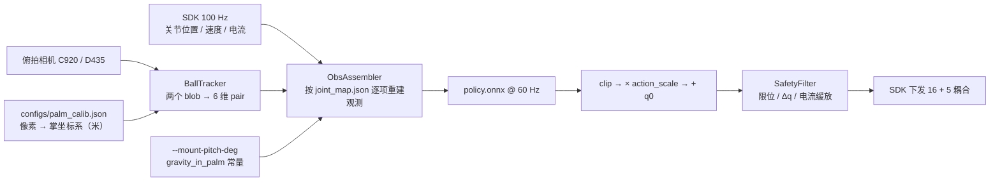

# ⑤ 保健球 Sim2Real：观测契约、掌面标定、球跟踪、相位步态

> 系列第 5 篇 · [上一篇 ④](./04-baoding-rl-sim.md) · [总览](./index.md)

第 ④ 篇结束在 `export_onnx.py`。这一篇是真机那一侧要做的所有事——也是这两天里最值得写下来的基础设施：它们的目标都是**让不匹配变成开机报错，而不是一次莫名其妙的失败实验**。文末如实写现状：空载回放通了、真机托住了球、装球闭环还没稳。


---

## 0. 真机闭环长什么样



```bash
source env_real.sh
python scripts/calibrate_palm.py --camera 2 --side left --out configs/palm_calib.json
python -m real.policy_runner --onnx logs/rsl_rl/pan_baoding_rotate/<run>/exported/policy.onnx \
  --camera 2 --calib configs/palm_calib.json --spin +1 --gain 0.3 --show
```

---

## 1. 事故：观测静默错位

第一次把滚币策略放上真机，观测向量是在真机脚本里**手写**的 88 维布局，尾部还拿 `np.zeros(15)` 补齐。后来策略改了形状，**没有任何报错**，向量整体错位，手只是轻微抽动。这类 bug 不会崩溃，只会让人误以为"sim2real gap 太大"而去调错方向——我们真的往那个方向调了一阵。

解法是把观测布局变成**训练侧的导出产物**：

- `scripts/export_onnx.py` 把 actor 的观测布局**逐项**写进 `joint_map.json`：每个 term 的名字和维度、驱动关节顺序、动作缩放（正则 → 关节）、EMA α、控制频率、左右手、以及训练用的安装角桶 `hand_tilt`。
- `real/obs_assembler.py` 按这份 spec 逐项填充，每个 term 对应一个命名的 provider；**任何一项没有 provider 就在启动时报错**。它自己不知道总维度是多少——全部来自 spec。

```text
joint_map.json（节选）
  task, checkpoint, side
  actuated_joint_names[16]   # 策略第 i 维 ≡ 这一项，禁止事后重排
  coupled -> source
  action_scale (regex -> rad), ema_alpha, control_hz
  obs_terms: [{name: joint_pos, dim: 16}, {name: joint_vel, dim: 16},
              {name: pair, dim: 6}, {name: spin_command, dim: 1},
              {name: gravity_in_palm, dim: 3}, {name: last_action, dim: 16}]
  hand_tilt: {pitch_deg: [0, 30, 60, 90]}
```

`policy_runner` 收到一份需要 `pair` 的策略却没有 `--calib` 时，**拒绝使能**。观测不匹配现在是一个开机错误。

顺带一条同类教训：**左右手不是字符串替换**。原来把环境改成左手是把关节名里的 `right_` 换成 `left_`，但奖励 / 观测项还要用 `side` 参数解析 body 名（掌心、指背、指腹、指尖），它们默认 `side="right"`，于是左手 USD 被问 `right_palm_link 在哪`，报错点离原因很远。现在 `hand_side.apply_hand_side()` 把 USD、关节列表、注入给各 term 的 `side` 一起搬，导出时也把 side 记进 `joint_map.json`。

---

## 2. 掌面标定：点四个指根

策略的 `pair` 观测是**掌坐标系里的米**，所以相机得知道掌坐标系在画面里的哪儿。手和相机都是固定的，一次相似变换标定就够。

```bash
python scripts/calibrate_palm.py --camera 2 --side left --out configs/palm_calib.json
# 加 --realsense 会一并写入掌面深度 palm_depth_m
```

流程：空格冻结一帧 → 依次点击**食指、中指、无名指、小指**四个掌指关节（MCP）→ Enter 求解，Backspace 撤销。这四个点在掌坐标系里的位置是从仿真里的关节模型量出来的（`ball_tracker._LEFT_MCP_LANDMARKS_M`，托举姿态下用 `debug_spawn.py` 读的）：它们是掌心朝上时画面里最好认的点，而且外展关节几乎不动它们，所以任何托举类姿态都适用。两个点在数学上就够，四个点让残差能抓出误点。合成数据回归残差小于 0.01 mm。


标定时手必须在**托举姿态**——`policy_runner --warmup` 会一直保持这个姿态，两个脚本并排跑就行。

---

## 3. 球跟踪：产出和仿真一模一样的六个数

`real/ball_tracker.py` 只有一个目标：产出第 ④ 篇 `baoding_pair_obs` 定义的那六个数，**同序、同单位**：

| 下标 | 含义 |
| --- | --- |
| 0:2 | 球对中点相对掌窝中心，掌面内（米） |
| 2:4 | 倍角轴向的 cos / sin |
| 4 | 球心距 |
| 5 | 倍角速率（rad/s） |

设计由两个事实决定：

- **两颗球分不出来** → 六维特征里没有身份（倍角）。只有步态时钟（第 5 节）自己维护一个最近邻身份，让"拇指侧的座位"跨过一次交换还是拇指侧。
- **手和相机都固定** → 一次标定把像素变成掌坐标系的米。高度可选：有 D435 时用对齐的深度 + 标定时的 `palm_depth_m` 给出球面高度，没有就没有，六维特征不变。

检测是"足够亮的 blob 搜索 + 掌坐标系门控"：木球是饱和的褐色而不是浅色，饱和度不设限；掌窝周围 10 cm 半径、8 cm 深的盒子（和仿真掉球判定 `DROP_RADIUS_M / DROP_DEPTH_M` 一样的包络）负责把灰色地砖排除掉。


```bash
python scripts/calibrate_palm.py --camera 2 --side left --out configs/palm_calib.json --preview
# 不点击，直接加载标定、显示实时 pair 特征
```

---

## 4. 策略回放：`real/policy_runner.py`

```bash
# 空载：只验证映射与限幅，周围清空
python -m real.policy_runner --gain 0.30 --seconds 12

# 带球闭环（标定好、相机为 --camera 2）
python -m real.policy_runner --onnx <run>/exported/policy.onnx \
  --camera 2 --calib configs/palm_calib.json --spin +1 --gain 0.3 --show \
  --mount-pitch-deg 0
```

每个 tick：SDK 读 16 个关节的位置 / 速度 → `BallTracker.observe()` → `ObsAssembler` 拼观测 → ONNX 推理 → 输出 clip 到 ±1 → 乘 `joint_map` 里的 `action_scale`（正则匹配到真实的 `left_*` 关节名，最后一个匹配的模式生效，和 Isaac Lab 一致）→ 加初始姿态 `q0` → `SafetyFilter` → 下发。60 Hz，和仿真的 `decimation=4 @ 240 Hz` 一致。

几个参数：

| 参数 | 作用 |
| --- | --- |
| `--gain` | 动作增益，从 0.3 起步逐步放开 |
| `--mount-pitch-deg` | 手在台面上的安装俯仰，给 `gravity_in_palm` 同一个常量；不在训练桶范围内会警告 |
| `--warmup` | 使能前保持托举姿态的秒数，用来放球 / 标定 |
| `--realsense` | D435 走同一条 `tracking.camera.open_source` 路径 |

策略回放时 `SafetyFilter(hold_on_lag=True)`：关节落后目标 0.18 rad（约 10°）就认为撞上了东西，冻结该指——这对策略是对的，对遥操作是错的（第 ③ 篇）。

---

## 5. RL 之外的保底：相位索引步态

黑客松要 demo，RL 不一定按时收敛。9 月 6 日上午我们并行做了一条**不训练策略**的路：`real/gait.py` + `scripts/baoding_gait.py`。

核心想法：步态表 `q_ref(φ)` 的索引不是时间，是**球对轴向的相位 φ**——`BallTracker` 给出的那个角。一圈 = φ 走 2π。两颗球同款，交换一次（φ 走 π）之后手回到同一物理状态，所以表每 π 重复一次（`ORBIT_FOLD = 2`），拟合时把两次交换当一次看，A/B 标签变得无关紧要。

三种来源，同一套拟合 / 回放：

```bash
# 1) 几何种子：不需要相机，只有手
python scripts/baoding_gait.py synthesize --out logs/gait/orbit_q_ref.npz
python scripts/baoding_gait.py play logs/gait/orbit_q_ref.npz --open-loop --seconds 8

# 2) 人手示教：遥操作时同时录 landmarks + q + φ + 电流
python scripts/landmark_teleop.py --realsense --calib configs/palm_calib.json \
    --record logs/gait/demo.npz --side left
python scripts/baoding_gait.py fit logs/gait/demo.npz --out logs/gait/q_ref.npz
python scripts/baoding_gait.py play logs/gait/q_ref.npz --calib configs/palm_calib.json --realsense

# 3) 自学习：相机看着杯子，每个 episode 按球实际转了多远打分，用每个球相位下发过的姿态重拟合
python scripts/baoding_gait.py learn --calib configs/palm_calib.json --realsense --iters 20 --episode-s 12
```

几何种子的幅度不是拍脑袋，是用第 ③ 篇的 FK 算的：托举姿态下手指 PIP 走 8° ≈ 指尖沿掌法向 9 mm，外展 6° ≈ 侧向 10 mm，拇指 `j0` 16° ≈ 横过掌心 12 mm，`j2` 6° 再加 6 mm——拇指一次拨动约 35 mm，是视频里的行程，不是 55 mm 的锤子。一圈 2.0 s，比视频的 1.3–1.8 s 略慢，为了把拇指的扫动压在 `JOINT_MAX_SPEED_RAD_S` 之下。

回放是闭环的：查表得到基准姿态，再加一小段来自实时球对 / 高度 / 电流的残差。

### 5.1 别把球攒死

9 月 6 日 11:34 的现场笔记："注意电流反馈，要不然就把球攒死了。"一个位置目标落在球**里面**，电机会顶到力矩上限并一直待在那儿，球被夹死、相机也看不见它了（12:08："初始化状态球卡得太死，检测不到球了"）。

两处修：

- **电流缓放**（第 ② 篇）对所有人生效：超过该指接触阈值后按比例张开屈曲关节，电流降了再合回。
- **重新落座姿态** `_OPEN_OFF`：把托举姿态的手指再张开一些（食指 `j1` −15°、`j2` −25°……），指尖高出 30 mm 的球、掌窝完全露出来，从上面放进去的球会滚进杯底而不是落在指弓上，相机也能看见两个完整的圆。

<video controls width="100%" preload="metadata" poster="/img/hackathons/2026/apex-hand/real-hand-hanging-hook-poster.jpg" style={{maxWidth: '360px', display: 'block', margin: '1.5rem auto'}}>
  <source src="/video/hackathons/2026/apex-hand/real-hand-hanging-hook.mp4" type="video/mp4" />
</video>

*9 月 6 日 11:30：把手挂在机箱上指尖朝下，球坐在三指弯成的钩里，笔记本上是球跟踪窗口。两天后我们才意识到，这才是参考视频里的几何。*

同一套几何，用 `scripts/analyze_ref_motion.py` 去跟**官方**钢球片也能看出来：对轴在推进，但角速度是粘滑而不是刚性自旋——适合当步态表的运动学目标，不能当成我们木球策略已经对齐官方的证据。


---

## 6. 现状（如实）

| 项 | 状态 |
| --- | --- |
| 网络、SDK、只读冒烟 | 通 |
| 摄像头遥操作驱动真机 | 通，连续 19 分钟；Kapandji 9 分 |
| ONNX 策略空载回放 | 通，60 Hz，安全层在环 |
| 观测契约 `joint_map.json` + `ObsAssembler` | 通 |
| 掌面标定 + 球跟踪 | 通，`configs/palm_calib.json` |
| 真机托住两颗球 | 通（展台视频） |
| 真机装球闭环转起来 | **未稳**。仿真策略本身还"会托不转"（第 ④ 篇）；相位步态能动，还没有稳定的整圈 |
| 安装角扫描 | 进行中 |

风险与备选在 Checkpoint 1 里就写好了：带球闭环不稳，就用已经跑通的遥操作演示手内操作能力，同时给出仿真里的圈数指标——两条链路独立，不会一起失败。展台上实际就是这么做的。

---

## 7. 这两天的教训

1. **观测静默错位是最危险的 bug。** 让布局成为训练侧的导出产物，缺项就启动失败。
2. **左右手不是字符串替换。** USD、关节列表、`side` 参数一起搬。
3. **固件的两个坑**：100° 的 `deg2rad` 越过固件上限 1.7453 rad；电流卡在 449–453 mA 的假满量程。
4. **过流保护和主动捏取无法用电流区分。** 上层把意图前馈给安全层。
5. **自碰撞必须关，于是要防穿指。** 外展钳 0.04 + `finger_crossing` −20。
6. **两颗球长得一模一样。** 观测里不能有身份，用倍角。
7. **单目测不出深度。** 球离掌心的高度是保健球任务上真机最大的不确定项；后续加第二视角或触觉阵列。
8. **奖励会被 hack**，而且每次都不一样：原地转币、坐着托球、绝对距离吃分。只奖励进度，回放一定要看。
9. **12 GB 显存**：2048 env 约 4.5 GB，4096 是保健球任务的上限，别并行两个训练。
10. **每步给"托住"分，策略就只托住。** 参考动作里从来没有"停着"这个状态。

## 8. 下一步

- 安装角扫描正式跑（2048 env、headless），把桶收窄到 drop 最先下降的角度带；
- 域随机化加宽关节增益和摩擦，URDF 动力学没有标定过，不能假设策略直接上真机；
- 第二个视角（或 D435 的深度）补球高度，或者接触觉阵列；
- 相位步态和 RL 策略在同一个 `policy_runner` 里切换，展台上哪个稳用哪个。

## 9. 文件速查

| 文件 | 职责 |
| --- | --- |
| `scripts/export_onnx.py` | ONNX + `joint_map.json`（含观测布局、安装角桶） |
| `real/obs_assembler.py` | 按 spec 重建观测，缺项即报错 |
| `real/policy_runner.py` | 60 Hz 回放循环 |
| `scripts/calibrate_palm.py` | 点四个 MCP 的相似变换标定 |
| `real/ball_tracker.py` | 六维 `pair` 特征、掌坐标系门控、步态时钟 |
| `real/gait.py`、`scripts/baoding_gait.py` | 相位索引步态：synthesize / fit / play / learn |
| `real/safety.py` | 限位、Δq、电流缓放、lag 冻结 |
| `docs/CHECKPOINT1.zh.md` | 赛事 Checkpoint 1 提交材料（技术难点原文） |

回到 [总览](./index.md)，或 [黑客松列表](../../index.md)。
