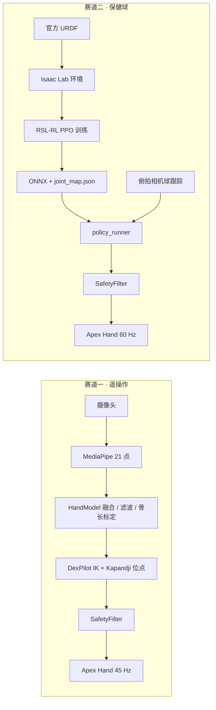

# AIx Origin 黑客松：两天之内，把一只 Apex 灵巧手从仿真训到真机

> AIx Origin Summit · 深圳场 · INNOAI 黑客松 · 2026 年 9 月 · 项目：PΛN（rebartender V0.2） · Builder：PeterPan
>
> 影石 Insta360 特别奖 · Demo Show 2026-09-06

---

## 一句话版本

9 月 3 日深夜我们还在装 Isaac Lab；9 月 5 日中午拿到源升（Rysen）Apex Hand 实物，下午 3 点它已经跟着我的手在动；9 月 6 日 Demo Show，它顶在我们那台调酒机 PΛN 的头上，一边拉客一边表演；再往后的两天，我们把黑客松给的两道灵巧手题——**摄像头遥操作 + 医学对掌试验**、**保健球对转（盘核桃）**——从仿真一路推到实物手上，有的通了，有的还在路上。

黑客松本身只有两天（9 月 5 日、6 日）；前面两天是仿真准备，后面两天是赛后继续探索。这个系列把这前后六天拆成 5 篇教程，从零开始、可以跟着做。这一篇是导读。

---

## 赛事与奖项

| 项 | 内容 |
| --- | --- |
| 赛事 | AIx Origin Summit · 深圳场 · INNOAI 黑客松 |
| 时间 | 2026 年 9 月 5–6 日，两天；Checkpoint 1 提交 9 月 5 日；Demo Show 与颁奖 9 月 6 日 |
| 项目 | **PΛN** = Personal Agent for Nightlife（rebartender V0.2），一台 **HDMI**（Human Drink Machine Interface）调酒机 |
| 灵巧手部分 | 赛道一：摄像头动作捕捉遥操作 + 医学手部检测动作（Kapandji 对掌试验），有响应速度要求；赛道二：盘核桃 / 保健球对转 |
| 结果 | **影石 Insta360 特别奖** |
| 代码 | [github.com/peterpanstechland/apexhand](https://github.com/peterpanstechland/apexhand)（MIT，训练 / 真机 / 遥操作全部开源） |

调酒机本体（点单、出酒、拿起电话讲话的那一整套）会另写一篇，这个系列只讲**灵巧手**。

据我们所知，我们是这场黑客松里第一支把灵巧手真正跑起来的队：9 月 5 日 13:39 接上网线，15:01 摄像头遥操作可用，之后连续跑了 19 分钟没有断。

---

## 两条赛道，两条技术路线

- **赛道一**走的是"人教手"：普通 RGB 摄像头看人手，MediaPipe 出 21 个关键点，重建成有真实骨长的三维骨架，再用 DexPilot 风格的向量匹配把它解到 Apex 的 16 个主动关节上。为了能做 Kapandji 对掌试验（拇指尖依次点到食指侧方、各指尖、小指根、掌横纹，0–10 分），匹配的目标点不是 4 个指尖而是 10 个临床位点。
- **赛道二**走的是"仿真教手"：在 Isaac Lab 里开几千只手并行训 PPO，策略只看真机也能测到的量（关节 + 相机能恢复的球对特征），导出 ONNX 之后由真机侧按同一份观测规范重建向量。

两条路线**共用**一份关节表、一个安全层和一个 WebUI 启动台。

---

## 时间线

| 日期 | 发生了什么 |
| --- | --- |
| 9-03 深夜 | 在已有的 Isaac Sim 6.0.1 上装好 Isaac Lab 3.0 beta，官方 URDF 转 USD，发现 PhysX 不执行 mimic 关节 |
| 9-04 | 指背滚币两阶段训练：Hold 100%，Index→Middle 传递 61.5%；写 WebUI 调参控制台；仓库开源 |
| 9-05 13:39 | 实物左手接上网线；改 IP、装 SDK、封安全层 |
| 9-05 15:01 | 摄像头遥操作在真机上跟手；下午改题为保健球，开第一轮长训 |
| 9-05 夜 | 看到别队的遥操作视频后决定把 Kapandji 做进去；手被收回，用 Isaac 沙盒调了一夜拇指映射 |
| 9-06 上午 | RealSense D435 / T265 到手；真机回来，Kapandji 打到 9 分；展台上真机托住两颗木球 |
| 9-06 下午 | Demo Show，影石特别奖 |
| 9-07 → 9-08 | 保健球九轮奖励迭代都"会托不转"；意识到手的安装角不对，做安装角扫描；把训练录成视频 |

---

## 系列导读

| 篇 | 讲什么 | 适合谁 |
| --- | --- | --- |
| [① Isaac Lab 仿真栈与指背滚币](./01-isaac-lab-sim-stack.md) | 环境隔离、URDF→USD、耦合关节、三道自检、两阶段课程训练、奖励被 hack 与重平衡、WebUI | 想在 Isaac Lab 上训一只灵巧手的人 |
| [② 真机 SDK 首次连通](./02-real-hand-sdk.md) | 网段与 IP、Python 3.10 独立 venv、关节表单一真相、安全层（限位 / Δq / 电流）、固件的坑、上机第一天清单 | 拿到 Apex Hand 实物的人 |
| [③ 赛道一：摄像头遥操作与 Kapandji](./03-teleop-kapandji.md) | 相机选型、MediaPipe 两路关键点怎么融合、DexPilot + 解析 Jacobian、10 个 Kapandji 位点、45 Hz 跟手、防打手 | 想用一个 webcam 遥操灵巧手的人 |
| [④ 赛道二：保健球 RL 仿真](./04-baoding-rl-sim.md) | 球按实物建模、无身份的球对观测、actor/critic 分离、九轮奖励迭代、怎么读曲线、安装角扫描、把训练录成视频 | 想用 RL 做手内操作的人 |
| [⑤ 保健球 Sim2Real 与复盘](./05-baoding-sim2real.md) | 观测契约 joint_map.json、掌面标定、俯拍球跟踪、策略回放、RL 之外的相位步态保底、教训 | 想把仿真策略搬到真手上的人 |

---

## 设备清单

我们这几天实际用到（以及试过但没用上）的东西，每一项写清"接法 / 用在哪 / 结论"。

### 灵巧手

- **Rysen Apex Hand，左手**。固件 3.2.5，SDK 1.5.2，以太网 TCP 5856 / 5857，控制 100 Hz。21 个关节，其中 16 个主动、5 个（四指 DIP + 拇指末节）由固件 1:1 耦合，策略和遥操作都只输出 16 维。
- 这只是触觉手套外壳版，但**没有**官方文档里的触觉阵列输出（`get_hand_sensor_image` 拿不到数据），所以碰撞只能靠每根手指的电机电流判断。这一点决定了后面安全层的设计。

### 网络

- 网线直连，或者经展台上那台 TP-Link 小交换机。
- 出厂 IP：左手 `192.168.0.102`，右手 `192.168.0.103`。我们改到了本地网段 `192.168.88.200`，`env_real.sh` 把它写进 `APEX_HAND_IP`，所有脚本默认读它。

### 主机

- RTX 4080 Laptop（**12 GB**，不是 16 GB）· Ubuntu 22.04。训练与真机是同一台机器，靠两套 venv 隔离：Isaac 侧 Python 3.12，真机侧 Python 3.10。
- Isaac Sim 6.0.1 + Isaac Lab v3.0.0-beta2.patch1 + RSL-RL PPO。
- 现场另一台笔记本只做一件事：浏览器打开 WebUI 启动台。

### 相机（都试过）

| 相机 | 接法 | 用在哪 | 结论 |
| --- | --- | --- | --- |
| Logitech C920 | USB，夹在笔记本顶上或俯拍支架 | 赛道一对着人手跑 MediaPipe（HUD 实测 33–39 fps）；赛道二改成俯拍固定相机做球跟踪 | 正对手掌、光线正常时 RGB 就够跟手；便宜、好摆 |
| 笔记本内置摄像头 | 自带 UVC | 当 C920 被拿去对机器人时，用它对着操作者 | 能跑；画质和摆放不如 C920。脚本默认优先外接 USB，显式 `--camera N` 才用内置 |
| Intel RealSense D435 | USB 3 | `--realsense`：用实测深度替换 MediaPipe 的相对 z；球跟踪时给掌面深度和球高度 | 拇指对掌、指尖互相遮挡时明显更稳。必须插 USB 3，别和 T265 共用 hub，一次超规格开流会把它卡到硬件复位 |
| Intel RealSense T265 | USB | 想拿它做第二视角 | 它是跟踪相机（双鱼眼 + IMU），**没有 RGB-D**，且 librealsense 版本与 D435 不兼容。没有进闭环 |
| Insta360 X5 | 机箱顶 | 调酒机上做 360° 拉客与展示；原计划做人手识别（剪刀石头布）和装机后的玩法 | 没有进入灵巧手控制链路，留给 PΛN 那篇 |

### 物体

- 两颗 30 mm 车制木球，实测 9.55 g / 颗（保健球任务）。
- 一枚 32 × 4 mm 的 PΛN 币，STL 由脚本生成（滚币任务）。

---

## 软件栈

| 层 | 用了什么 |
| --- | --- |
| 仿真 | Isaac Sim 6.0.1、Isaac Lab v3.0.0-beta2.patch1、PhysX（也导出过 MJCF 给 Newton / MuJoCo-Warp） |
| 强化学习 | RSL-RL PPO（actor / critic MLP 512-256-128） |
| 手部跟踪 | MediaPipe Hands（image + world 两路关键点）、1€ 滤波、DexPilot 风格向量匹配 + 解析 Jacobian IK |
| 真机 | Rysen Python SDK 1.5.2、ONNX Runtime、OpenCV、pyrealsense2 |
| 工具 | 自研 WebUI（启动台 + 200 多个参数带解释的训练控制台）、TensorBoard、ffmpeg |

---

## 系列之外

- 调酒机 PΛN 本体、HDMI 交互、Insta360 X5 的 360° 拉客怎么做：另一篇。
- 保健球在真机上的装球闭环、安装角扫描的正式大规模训练：还在跑，结果会补进第 ④ ⑤ 篇。

下一篇：[① Isaac Lab 仿真栈与指背滚币](./01-isaac-lab-sim-stack.md)。回到 [黑客松总览](../../index.md)。
