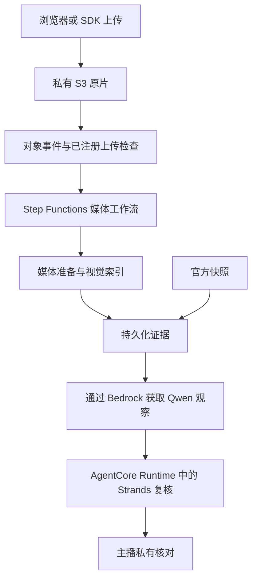
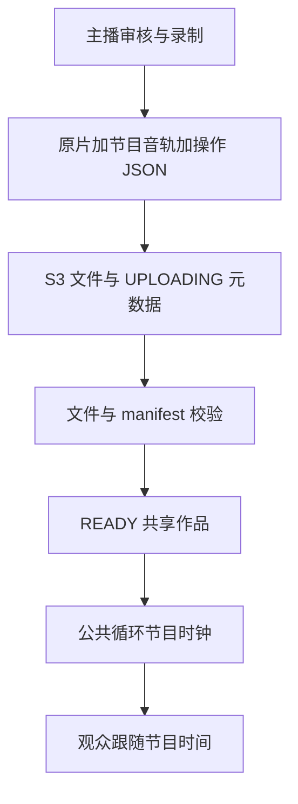

我们 TEAM7 的 Courtside IQ 没有进入决赛，但其中关于证据、人工复核和节目制作的设计仍有复用价值。我是 PeterPan，这篇文章记录团队的实现与取舍，供其他 Builder 参考；它不是 AWS 官方撰文或背书。

Courtside IQ 想做的是主播身边的分析搭档：上传一段篮球视频，在关键画面暂停，查看依据，提问，再决定哪些内容进入节目。贯穿这件事的验收标准是：**人、画面、数据、时刻要对应正确。** 模型说得顺，远远不够。

## 先定义主播能够核对的结论

画面里穿白衣、靠近篮筐的人，不一定已被正确识别；篮球接近某只手，也不一定代表控球。官方逐回合记录能告诉我们谁被记为得分者，却不能直接替画面里每个身体命名。把这些信息混在一起，很容易得到一段听起来合理、实际需要主播不断纠错的解说。

我们把官方事实、视觉观察和战术假设分开。提词要能回到相应帧、轨迹、来源与时间；身份不足就保留未知。主播先看私有回答，审核后才让图层或台词公开。系统的价值包括帮助人判断哪里需要核对，而不只是增加一句解说。

xFG 是最容易误用的例子。项目引用与匹配出手关联的官方历史出手质量指标，它不保证这球会进，也不能在出手前泄露最终出手者和结果。我们没有根据一张图生成“球员引力”数值、得分概率或抢断概率。想做这些指标，必须先定义含义、采集测量，再独立验证，不能靠模型补一个百分比。

这些约束可以在[官方证据实现](https://github.com/peterpanstechland/NBAHackathon/blob/f43f4e0b0b1424b2aa36cd09301ac2ac047cc32c/services/shared/src/nba_copilot/official_evidence.py)里核对。

## 先拆链路，再放 AWS 服务

我们把系统分成三条链路。体验与控制链路通过 CloudFront、HTTP／WebSocket API、Lambda 和 DynamoDB 处理工作台、会话与操作状态；异步媒体链路处理上传视频；推理链路读取已保存的证据。大视频不需要挤进互动连接，长任务也不必让主播一直等待同一个请求。

图表达的是应用流程，不能顺手把它画成网络隔离证明。当前 AgentCore 配置为 PUBLIC 网络模式；Claude 使用 global 推理配置文件，CloudFront 是全球边缘，WebSocket 有独立地址，预签名上传直达 S3。把所有服务圈进单一区域的私有 VPC，会给读者错误印象。

Roboflow 是可选的运行时诊断路径，启用时会跨第三方服务边界。Tripo 则用于创作小 Q 的模型资产，日常分析请求不会逐次调用它生成吉祥物。讲依赖时，必须区分每次请求要经过什么、哪些只是制作资产时用过。

对应实现见 [AgentCore 配置](https://github.com/peterpanstechland/NBAHackathon/blob/f43f4e0b0b1424b2aa36cd09301ac2ac047cc32c/infra/lib/constructs/agents.ts)与[可选 Roboflow 路径](https://github.com/peterpanstechland/NBAHackathon/blob/f43f4e0b0b1424b2aa36cd09301ac2ac047cc32c/services/pipeline/roboflow.py)。

## 把上传视频变成可检查的任务

上传接口先登记素材，再返回 S3 预签名地址。网页、CLI 和 Python SDK 复用应用 API，评测者不需要我们的 AWS 凭证。对象创建事件只处理已经登记的 MP4 路径，避免把桶中任意文件误认为新分析任务。

Step Functions 协调 MediaConvert、记分牌 OCR、官方匹配和视觉分析。准备视频时保留源尺寸，抽帧也保存原始像素，方便读取很小的球衣号码；跟踪可以使用独立的小画布。较大的媒体和 JSON 放在 S3，任务状态与关联放在 DynamoDB。

阶段产物先保存，后续模型不可用时，已经得到的视觉底稿和官方提词仍能保留。当前有号码、foundation 和 reasoning 的显式恢复入口，没有承诺任意失败都自动从上一帧续跑。分析采样为每秒四帧，最多覆盖前十分钟；长比赛需要分段。这些限制应该出现在使用说明里，而不是等观众发现缺帧后再解释。

可以从[上传事件处理器](https://github.com/peterpanstechland/NBAHackathon/blob/f43f4e0b0b1424b2aa36cd09301ac2ac047cc32c/services/pipeline/upload_completed.py)、[媒体阶段](https://github.com/peterpanstechland/NBAHackathon/blob/f43f4e0b0b1424b2aa36cd09301ac2ac047cc32c/services/pipeline/workflow.py)和[索引限制](https://github.com/peterpanstechland/NBAHackathon/blob/f43f4e0b0b1424b2aa36cd09301ac2ac047cc32c/services/shared/src/nba_copilot/video_index.py)追踪这条路径。

## 对齐两个时钟，保留估算的边界

视频秒数向前走，比赛倒计时会停止，剪辑和重播又可能打断映射。项目把记分牌读数拟合成时钟映射，在已有官方快照里筛选比赛，再关联逐回合事件与出手记录。文件名日期、球员提示也可能参与候选选择，因此这是一套有覆盖范围的启发式方法。

匹配到事件不代表找到精确离手帧。证据结构保留近似位置和容差，实时提问只获得当前时刻已解锁的记录，结果信息还要经过对齐容差后才披露。官方快照没有覆盖的新视频仍可分析视觉轨迹，姓名和统计继续保持未知。

轨迹 ID 同样只是局部视觉对象。多帧号码、球队和名单可以帮助补全身份，但遮挡交叉、镜头切换不能盲目继承。后来露出的清晰号码可用于回放补证，却不能证明此前正在持球。

例如，主播暂停在出手之前问哪里可以传球，回答可以使用此刻可见站位与已经发生的统计；不能因为后续记录写了某人得分，就提前选定他。赛后复盘允许揭示结果，但仍应说清哪部分来自画面，哪部分来自官方记录。

匹配假设见[比赛解析器](https://github.com/peterpanstechland/NBAHackathon/blob/f43f4e0b0b1424b2aa36cd09301ac2ac047cc32c/services/shared/src/nba_copilot/truth/resolver.py)。

## 给 Agent 分工，也给补证设上限

Strands Agents SDK 负责 Agent、工具与图编排；AgentCore Runtime 承载应用；Amazon Bedrock 提供模型推理。三者承担不同职责，排查问题时也要分开看。平台概念可对照 [Runtime 文档](https://docs.aws.amazon.com/bedrock-agentcore/latest/devguide/agents-tools-runtime.html)和 [Strands Graph 文档](https://strandsagents.com/docs/user-guide/sdk/multi-agent/graph/)。

Qwen 通过 Bedrock Converse 接收选定图片与结构化底稿，输出必须引用实际输入时刻和允许的轨迹。暂停关键帧主要回答当前站位问题，不能凭稀疏邻近帧重建已经完成的传球，动作草稿会被清空。读球与检测候选冲突时，持球者保持未知，其余可用站位仍可以分析。

整段分析真正使用 GraphBuilder，顺序经过 evidence_planner、tactical_analyst、evidence_editor。规划者找缺口，分析者解释攻防，编辑者对照原始证据删改。之后还有程序校验：引用是否存在、姓名是否绑定相应画面、事件时间是否越界、是否生成无依据百分比或传球结论。

校验拒绝后，编辑者有一次修复机会；仍不合格的条目可以删除，不能换个标签就算通过。流水线最多挑三个窗口补充更密的图片，只补一轮。再问一次模型不是新增证据，多 Agent 意见一致也不是准确率证明。trace、耗时和未解决问题都要保留。

实现见 [Qwen 输出约束](https://github.com/peterpanstechland/NBAHackathon/blob/f43f4e0b0b1424b2aa36cd09301ac2ac047cc32c/services/shared/src/nba_copilot/scene_model.py)、[三节点图](https://github.com/peterpanstechland/NBAHackathon/blob/f43f4e0b0b1424b2aa36cd09301ac2ac047cc32c/agent/src/copilot_agent/game_analysis.py)和[有界补证](https://github.com/peterpanstechland/NBAHackathon/blob/f43f4e0b0b1424b2aa36cd09301ac2ac047cc32c/services/pipeline/game_analysis.py)。

## 缓存的是可复核的工作成果

关键帧保存图片、源时间、标注版本和分析结果。主播可以改框、确认身份与角色，选择重跑并恢复历史版本。保存会检查版本，证据变化后清除旧分析的关联，不会让新标注继续背着上一版答案。

播报稿另有版本。AI 可以提供初稿，但重跑不能覆盖主播已经审核编辑的文本；证据变了，稿件标记为过期。Polly 音频按合成设置复用，读取时重新签发播放地址，不把会过期的 URL 当作长期文件标识。

这样，缓存不仅节省一次调用，还能回答：这段话依据哪个版本、用哪种语言、是否被人修改、现在还能不能用。只缓存最后一段模型文字，会丢掉这些关系。人工确认也应该有具体适用范围，不能从一帧扩散成整场无条件真值。

一个可演示的检查是：先分析关键帧，再把错误身份修正并保存，重新载入后确认修正仍在，旧稿也没有被悄悄当作新证据的产物。随后重新生成初稿，检查已经人工编辑的台词是否仍被保护。界面显示了分析文字，只能证明有文字可读；要证明这次真正执行了推理，还要看请求对应的来源、状态与 trace，不能把缓存命中算成新的 Agent 执行。

对应代码是[关键帧存储](https://github.com/peterpanstechland/NBAHackathon/blob/f43f4e0b0b1424b2aa36cd09301ac2ac047cc32c/services/shared/src/nba_copilot/keyframes.py)与[可编辑播报缓存](https://github.com/peterpanstechland/NBAHackathon/blob/f43f4e0b0b1424b2aa36cd09301ac2ac047cc32c/services/shared/src/nba_copilot/keyframe_narration.py)。

## 制片要保存两条时间轴

主播暂停、慢放或跳转后，节目时间与原片时间就分开了。默认录制模式保留原视频，单独记录节目混音，再把图层和控制状态保存为带版本的 JSON。画面暂停时，解说录音继续；回放根据节目时刻找到对应原片位置和图层。

我们把这个结构称为编辑决策列表，但它是自有 schema，没有声称兼容标准 EDL 或外部剪辑软件。这个模式在录制阶段不重新编码原片；合成一个扁平视频仍需要编码，不能称为无损输出。

另一条兼容路径由浏览器先合成 WebM，再上传给 MediaConvert 转成 MP4。MediaConvert 处理的是已合成录制文件，并没有直接解释我们这份操作 JSON。把两条路径写清楚，比一句“云端自动成片”更能帮助后来的人复用。

参考[项目时间轴](https://github.com/peterpanstechland/NBAHackathon/blob/f43f4e0b0b1424b2aa36cd09301ac2ac047cc32c/web/src/engine/productionProject.ts)和[录制实现](https://github.com/peterpanstechland/NBAHackathon/blob/f43f4e0b0b1424b2aa36cd09301ac2ac047cc32c/web/src/engine/ProgramRecorder.tsx)。

## 分享成品和进入节目是两件事

文件上传完成还不等于作品可播放。服务端检查文件尺寸、内容类型与 manifest 结构后，作品才能成为 READY。发布要有 owner 能力令牌，观众分享链接只带作品 ID，不带主播令牌；共享作品不依赖工作会话继续存在。

公共节目保存统一位置与更新时间。循环播放时，用已播放节目时长对总时长取模，新观众进入当前进度，而不是每个人从头开一份。这是上传节目同步回放，没有承诺真实直播输入或帧级同步。

签名媒体链接会过期，观众播放器定期换取新地址，并保留同一份 manifest 与播放位置；媒体错误也会触发重取。浏览器自动播放策略则需要交互配合：静音播放、加入按钮和声音开关都是产品的一部分。服务端显示“正在播放”，不代表浏览器一定允许有声播放。

见 [READY 校验](https://github.com/peterpanstechland/NBAHackathon/blob/f43f4e0b0b1424b2aa36cd09301ac2ac047cc32c/services/shared/src/nba_copilot/productions.py)、[公共时钟](https://github.com/peterpanstechland/NBAHackathon/blob/f43f4e0b0b1424b2aa36cd09301ac2ac047cc32c/services/shared/src/nba_copilot/public_broadcast.py)及[播放器续期](https://github.com/peterpanstechland/NBAHackathon/blob/f43f4e0b0b1424b2aa36cd09301ac2ac047cc32c/web/src/surfaces/broadcast/PublicProductionPlayback.tsx)。

## 把未验证部分变成测量计划

开发片段跑过流程，不等于陌生视频盲测。系统允许 partial-analysis；串号、遮挡、缺少球权证据和官方覆盖不足仍会出现。prep 分析路径明确调用 Bedrock Guardrails 检查报告输出，不能据此认定所有实时或语音路径都已覆盖。篮球事实还需要应用校验与人工复核。

AgentWorker 的 SQS 失败目的地接收异步调用失败记录，它不是正常任务队列，也没有配置自动消费重放。图里出现 SQS 和告警，不代表形成自动恢复闭环。比赛接口配置文件仍是设计笔记，没有运行时适配器，不能声称已满足统一评测接口。

边界见 [README](https://github.com/peterpanstechland/NBAHackathon/blob/f43f4e0b0b1424b2aa36cd09301ac2ac047cc32c/README.md)、[Worker 基础设施](https://github.com/peterpanstechland/NBAHackathon/blob/f43f4e0b0b1424b2aa36cd09301ac2ac047cc32c/infra/lib/constructs/realtime.ts)与[接口设计笔记](https://github.com/peterpanstechland/NBAHackathon/blob/f43f4e0b0b1424b2aa36cd09301ac2ac047cc32c/config/contest-contract.json)。

我们没有实测账单可发布。下一步可以对代表性视频分别记录 GPU 在线与空闲时长、利用率、图像及推理 token、转码工作量、存储、传输与重试。比较首次完整分析、缓存回放和局部纠错，报告每分钟分析与每个审核节目成本，同时呈现延迟分布、失败率和主播修正次数。

每组实验应固定素材版本、长度、画质和模型配置，记录是否冷启动、是否使用已有缓存、是否发生补证。否则一次短视频缓存回放与一次长视频首次分析放在一起，平均值很难解释。GPU 不工作的在线时间也需要计入观察范围；缩小图片或减少采样可能省资源，却可能漏掉号码与球的关键证据，因此要把成本变化和质量变化一起呈现。

质量评估要使用独立标注的陌生视频，分别检查身份串号、事件时间误差和无证据断言，并保留被拒绝的案例。缓存是否便宜，不能脱离版本有效性；调用费更低、却让主播花更多时间修正，也未必是更好的方案。以上都是待执行的测量方法，不是已取得的性能结果。

## 复用方法，从一个可核对闭环开始

换到其他领域，不必照搬全部服务。先选一种源素材、一份带时间范围的证据、一处能编辑的复核界面和一种可发布结果。提前定义哪些信息保持未知，区分观察与事实，明确修改后哪些缓存失效，限制补证次数，把发布权交给有责任的人。通过陌生输入验证后，再扩展架构。

第一次验收也可以很小：陌生素材能否进入同一流程；一个错误能否修正并刷新恢复；未审核内容是否仍留在私有范围；公开链接能否在没有主播凭证的新浏览器中播放。把这些问题做成可重复的检查，比先增加更多 Agent 或服务，更容易判断下一步投入在哪里。

我很喜欢项目里的互动 AWS 架构图：读者可以逐层看数据怎么走、哪里需要等待、哪些调用跨出边界。[AWS 官方图标](https://aws.amazon.com/architecture/icons/)承担视觉识别，部署条件仍要用文字说明。我们把这套制作方式提炼成了[可复用的互动架构图 Skill](./interactive-architecture-skill)。

<iframe src="/labs/courtside-iq-architecture-zh.html" title="Courtside IQ 互动 AWS 架构图" width="100%" height="720" loading="lazy" style={{border: '1px solid #ccd6e0', borderRadius: '12px'}} />

这次留下的可复用成果，是让人能够查看、修正、批准和重放 AI 判断的一组约定。后续评测可以围绕这些具体约定继续推进。

[下载可投稿的文章稿（Markdown）](pathname:///downloads/courtside-builder-article.zh.md)
