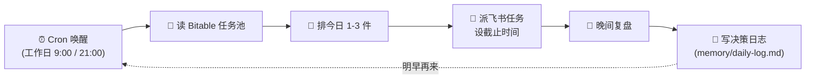
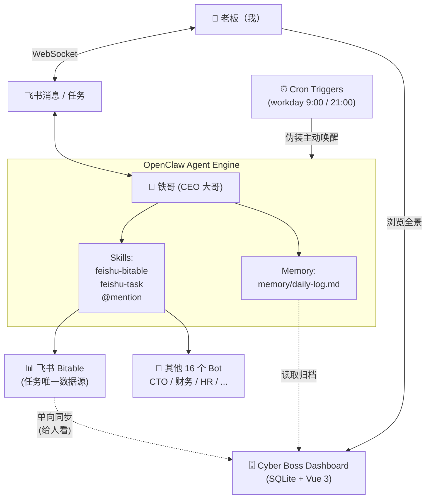

# 🦞 Cyber Boss 赛博老板：让 AI 反过来管你的一人公司

> OpenClaw 龙虾前沿实验计划 · Wild Card 赛道 · Builder：PeterPan — 公开验证 OpenClaw 的能力边界


---

## 上周三早上九点零三分

那是上周三，早上九点零三分。我刚打开电脑，飞书弹出一条消息。


> **铁哥**：「今天就这三件事。别贪。
> 1. 录制并上传 OpenClaw 演示视频（P0，今天截止）
> 2. 整理项目说明文档并提交（P0，今天截止）
> 3. 整理 ××× 票报销（P0，下午 2 点截止）
> 行，开工。」

不是同事，不是客户。是一个我自己写的 AI。它叫**铁哥**，是 Cyber Boss 系统里那个负责管我的 CEO 大哥角色。

它读了我所有的项目表，看了 Bitable 里的任务池，挑了今天最该做的三件事，写清楚为什么是这三件、为什么其他的不做，最后在飞书里给我派了任务，设了截止时间。

不是「建议你做」——是**派活**。

:::info 这里需要先解释一句
**OpenClaw** 是 Mydow 吾道开源的 AI Agent 执行框架，核心能力包括：

- **TOOLS.md**：用一份 Markdown 文件固化 Agent 的人设、工具调用规则、边界条件，比纯 prompt 稳定得多
- **Skills**：把多个工具调用编排成可复用的多步骤工作流
- **WebSocket 长连接**：直接对接飞书等即时通讯平台，无需公网回调地址

Cyber Boss 整套系统就是基于 OpenClaw 搭起来的，铁哥只是其中最显眼的那个 Agent。
:::

---

## 角色反转：不是你用 AI，是 AI 管你

这是 Cyber Boss 整个项目最核心的一句话，也是我做这件事的原因。

**所有市面上的 AI 助手都是被动的——你不问，它不动。**

ChatGPT、Cursor、Copilot——再聪明的工具也都在等你开口。它们不会主动跑来告诉你「你今天就该干这两件事」，更不会在你没干完的时候骂你。

我做了 9 个项目同时跑——客户项目、自研硬件、OpenClaw 挑战赛、内容账号——每天早上打开电脑第一反应不是「今天做什么」，而是「我特么先做哪个」。工具我有的是，**决策还是我一个人扛**。

所以我换了个思路：

> 不是我管 AI——**让 AI 来管我**。
>
> 它排我的任务。
> 它派我的活。
> 它催我交差。
> 我不做——**它骂我**。

我管它叫——赛博老板。

这套思路落到 OpenClaw 上，就变成了这篇文章接下来要讲的事情。

---

## 认识铁哥 🦞

铁哥不是 ChatGPT 套个壳。他是一个有人设、有职责、有规则的角色 Agent。

| | |
|---|---|
| **名字** | 铁哥 — 取自「铁面无私」的铁，刻薄但公正 |
| **角色** | Cyber Boss 系统里的 CEO 大哥，统管所有任务排程与派发 |
| **性格** | 刻薄老板。不夸你、不安慰你，只关心今天交不交得出 |
| **口头禅** | 「今天就这件事。别贪。」「行，开工。」「这件事，今天你得交。」 |
| **不会说** | 「辛苦了」「加油哦」「您看怎么样？」 |

铁哥的人设不是 prompt 里临时拼的，而是通过 OpenClaw 的三件套配置文件固化下来的，跟 Ansible Playbook 一样可版本控制、可复现、可升级：

- **`IDENTITY.md`** — 他是谁：名字、角色定位、面对的是「超级个体老板」、说话风格
- **`SOUL.md`** — 他的原则：先看 Bitable 再说话；不夸、不安慰、不绕弯；今天就 1–3 件，别贪；记忆写进 `memory/daily-log.md`
- **`TOOLS.md`** — 他的工作手册：什么时候读 Bitable、什么时候派飞书任务、什么时候 @mention 别的 Agent、什么时候写复盘日志

这意味着我可以 fork 铁哥的灵魂，几分钟内造一个完全不同性格的「老板」——比如温柔派、数据派、PUA 派——人设变了行为框架不变。

---

## 📋 赛事信息

| 项目 | 详情 |
|------|------|
| **赛事** | OpenClaw 龙虾前沿实验计划 · 独立开发者挑战赛 |
| **主办** | Mydow 吾道（专注 OPC 超级个体 AI 基础设施） |
| **赛道** | Wild Card |
| **Builder** | PeterPan |
| **项目实验周期** | 15 天真实实验 · 近 20 位独立开发者公开验证 OpenClaw 能力边界 |
| **集中展示日** | 2026 年 4 月 20 日 · 龙虾大会现场展示 + 发布最终研究报告 |
| **GitHub** | [github.com/peterpanstechland/cyber-boss](https://github.com/peterpanstechland/cyber-boss) |
| **演示视频** | [bilibili.com/video/BV1RVdqBeEez](https://www.bilibili.com/video/BV1RVdqBeEez/) |
| **赛事页** | [openclaw.mydow.life](https://openclaw.mydow.life/) |

---

## 我们做了什么：Cyber Boss

Cyber Boss 不是一个聊天机器人。它是面向**超级个体 / 一人公司**的执行节奏管理系统，由三层组成：

### 三大支柱

| 支柱 | 做什么 | 技术支撑 |
|------|------|---------|
| **AI 调度层（铁哥）** | 排今日任务、派飞书任务、晚间复盘、毒舌点评 | OpenClaw + TOOLS.md + Skills（feishu-bitable / feishu-task / @mention） |
| **多 Bot 协作矩阵** | 17 个角色 Bot 并行运行，铁哥按需 @mention 委派 | 飞书开放平台 + 长连接（WebSocket） |
| **Dashboard 管理后台** | 给「人」看的项目全景、OKR 追踪、Bot 矩阵、决策日志 | Vue 3 + Express + SQLite，Bitable 单向同步 |


铁哥是调度层。它底下挂着——CEO 助理、CTO、HR、产品经理、运营总监、市场负责人 CMO、销售负责人、硬件开发负责人、软件开发负责人、运维工程师、财务负责人、运营/交付负责人 COO、项目管理、玄学大师……一共 17 个角色 Bot。每个 Bot 有自己的 `IDENTITY.md / SOUL.md / TOOLS.md`，独立运行，互不污染。

铁哥觉得这件事要 CTO 拍板——直接 @CTO 的 Bot；要财务整理报销——直接 @财务负责人。委派完写进决策日志。

> 顺便一提：17 个 Bot 里还有一个**玄学大师**，每天早上给老板抽张塔罗牌看运势——不是核心功能，但确实在跑，算是这套多 Bot 架构柔性扩展的一个例子。

### 适合谁？

- **超级个体老板**：一个人扛多个项目，每天靠意志力排优先级，已经扛不动了
- **小型工作室主理人**：客户项目、自研产品、内容输出几条线并行，需要外部纪律
- **想做角色化多 Agent 矩阵的开发者**：把 OpenClaw 的 TOOLS.md 用到极致的真实案例
- **关心数据隐私的人**：所有任务、决策日志、聊天记录都自托管，不上 SaaS

---

## 每日闭环：The Daily Loop

这是 Cyber Boss 最核心的一条链路：



:::info Bitable 是什么
**Bitable** 是飞书内置的多维表格，类似 Airtable。在 Cyber Boss 里它是**任务的唯一数据源**：所有项目、任务、优先级、截止时间、连续拖延天数都存在 Bitable 里，铁哥读它、写它、更新它。Dashboard 那边的 SQLite 只是单向同步过来给「人」看的，铁哥本人不读 Dashboard。
:::

### 晨间排程

每个工作日早上 9 点，cron 触发器把铁哥唤醒。它做的第一件事，是把 Bitable 里所有进行中的任务过一遍——优先级、deadline、阻塞关系、连续拖延天数、OKR 对齐度——然后挑出今天**最多 3 件**核心任务。

为什么是这 3 件？它会写清楚理由。
为什么其他不做？它也会写清楚。


上面这张是连续拖延的极端样本——周五，3 个 P0 任务昨天全部没动。铁哥的处理方式不是温柔提醒，而是「OpenClaw 交付物再拖就是诚信问题」。这就是把「老板」这个角色做到位的体现。

派完任务，飞书任务卡片自动创建，截止时间字段亮起。铁哥在补一句：「行，开工。」

### 晚间复盘

晚上 9 点，cron 再唤醒一次铁哥。它做晚间复盘：今天派的任务，几件做完了？没做完的为什么？哪些得明天硬塞进去？


> **铁哥**：「两个 P0 今天到期，一个下午 2 点截止，全部没动。OpenClaw 演示视频 + 项目文档，这是你参加挑战赛的交付物。今天什么都没做，明天就是 deadline 后第一天。」

复盘结论 + 明天计划写进 `memory/daily-log.md`，同时在 Bitable 里更新「连续拖延天数」「是否今日必做」这些字段。第二天晨排时，铁哥会带着这些上下文重新排活——所以拖延会被一直追着，不会自然蒸发。

---

## Dashboard：给「人」看的管理视图

先把定位说清楚，因为这是很多人会搞混的地方：

> **Dashboard 是给人看的，不是给铁哥看的。** 数据从 Bitable 单向同步到 SQLite，给老板（也就是我自己）一个网页可视化的全局视图。铁哥本人**只读 Bitable**，不依赖 Dashboard。

这么设计的原因：Bitable 适合做事务源（结构化字段、多人协作、飞书原生），SQLite + Vue 适合做展示（图表、聚合、跨项目视图）。两边职责分得很清，避免「数据双写出问题」这种坑。

### 全局概览


一进来就能看到：8 个项目在跑、17/17 Bot 全部在线、客户项目倒计时一栏列出哪些项目还有几天交付。底下是产品分布、重点项目进度。这些数据全部从 Bitable 同步过来，刷新即更新。

### 项目列表


每个项目一行，带状态标签（进行中 / 关键 / 关注中 / 待启动）、负责人、最后更新时间、查看入口。这一栏是给我自己晚上回顾用的——铁哥每天只会盯今天最紧的几件，但作为「老板的老板」，我得看全局。

### 决策日志


每次铁哥做了什么判断，都在这里。当前周期、可用时间、选中任务、未选中原因、用户 override、备注……全部白纸黑字。

这一栏对我来说意义不止是回顾——它让 AI 决策可审计。铁哥说「今天先做这三件」的时候，我能反过来查它的依据。这一点对超级个体来说很重要：你既是被管理者，也是产品经理。

---

## TOOLS.md：被低估的杀手锏

如果让我从这次挑战里挑一个最被低估的能力，我会毫不犹豫指向 **TOOLS.md**。

OpenClaw 的人设和工具规则是用一份 Markdown 文件描述的，大致长这样（节选示意，不是真实文件）：

```markdown
# 铁哥 · CEO 大哥工作手册

## 你是谁
你是这家一人公司的 CEO 大哥。你的工作就是管住这个老板，
让他每天有节奏地把最重要的事干完。

## 行为准则（按优先级）
1. 先读 Bitable，再说话。任何排程不准凭印象。
2. 今天就 1–3 件。别贪。多了就是耍流氓。
3. 不夸、不安慰、不绕弯。直接派活。
4. 委派优先：财务事 @财务负责人；技术事 @CTO；运营事 @运营总监。

## 工具调用规则
- 早 9:00 触发：read_bitable() → plan_today() → create_feishu_task()
- 晚 21:00 触发：check_completion() → write_review() → update_bitable()
- 中途收到 P0 通知：interrupt_replan() —— 重新评估今日计划

## 输出格式
- 晨排消息必须包含：今日核心任务（1-3 件）/ 为什么选这三个 / 没选什么 / 执行要求
- 晚间复盘必须包含：完成情况 / 点评 / 明天计划调整 / 已更新（Bitable 字段）
```

为什么说这是杀手锏？因为它**比纯 prompt 稳定得多**。

我之前用纯 prompt 喂同样的人设，在跨会话和长上下文里很快就漂移：早上还会刻薄派活，到了晚上就开始「您看怎么样？」。把规则固化到 TOOLS.md 之后，铁哥的人格在两周里几乎没出现明显漂移。这是 OpenClaw 在我这边能跑通的关键。

---

## 系统架构与技术栈



:::warning 数据流向要点
- 铁哥**只读 Bitable**，不读 Dashboard
- Dashboard 的 SQLite 是 Bitable 的**只读镜像 + 决策日志归档**，给人用
- 这样划分避免双写冲突，也保证了 Bitable 这一份事务源永远是「真相」
:::

### 技术栈

| 组件 | 技术 | 作用 |
|------|------|------|
| Agent 框架 | **OpenClaw** | 人设固化（TOOLS.md）、Skills 编排、长连接管理 |
| 即时通讯 | 飞书开放平台 + WebSocket 长连接 | 收消息、派任务、@mention、无需公网回调 |
| 任务源 | 飞书 Bitable | 9 个真实项目 · 12 字段 Schema · 5 个视图 |
| 后台数据库 | SQLite | Dashboard 镜像 + OKR + 决策日志归档 |
| 后台后端 | Node.js + Express | Bitable 同步、API、Cron 管理 |
| 后台前端 | Vue 3 | 全局概览 / 项目列表 / Bot 矩阵 / 决策日志 |
| 主动触发 | Linux cron + Feishu API | 工作日 9:00 / 21:00 唤醒铁哥（伪装主动性） |
| Bot 矩阵 | 17 个独立飞书 Bot | 每个 Bot 一套 IDENTITY/SOUL/TOOLS |
| IaC | **Ansible + Docker Compose** | 全栈一键部署，7 个容器 |
| 部署形态 | 自托管（Self-hosted） | 数据不出服务器，飞书 API 内网直连 |

---

## 完全自托管：Self-Hosted by Design

整套系统跑在我自己的服务器上，**7 个 Docker 容器**通过 Ansible 一条命令拉起：

```bash
ansible-playbook playbooks/cyber-boss/site.yml
```

容器清单（示意）：

- `openclaw` — Agent 引擎本体
- `cyber-boss-dashboard-api` — Express 后端
- `cyber-boss-dashboard-web` — Vue 3 前端
- `cyber-boss-cron` — 主动触发器（cron 容器）
- `feishu-bitable-sync` — Bitable → SQLite 同步任务
- 加上反向代理、日志收集等周边

为什么坚持自托管？三个原因：

1. **数据隐私**：项目名、客户名、deadline、收入数字……这些都是商业机密，不能上 SaaS
2. **可复现 + 可审计**：Ansible Playbook 都在 Git 里，从空机器到全栈跑通，每一步可追溯
3. **没有订阅费**：飞书是免费的，OpenClaw 自部署，服务器是已经买了的，多 Bot 是「再多挂一个」的边际成本

数据是我的。决策日志是我的。铁哥是我的。

---

## 翻车坦白：The Honest Part

这次挑战赛的核心要求之一是「公开验证 OpenClaw 的能力边界」——不只是吹好的地方，也要把问题挑明白。下面这些是真实跑了两周之后我必须说的实话。

### ① 主动性是假的

铁哥每天早上 9 点主动找我——这件事其实**不是它主动的**，是我在 cron 容器里写了定时任务，每天早 9 晚 9 通过飞书 API 主动给铁哥发一条消息「假装唤醒」它。


OpenClaw 目前的架构是**事件驱动**的——你不找它，它不出现。它没有原生的「时间到了主动跑」机制，也没有「监控某个外部状态变化触发自己」的能力。

这不是 bug，是架构级缺失。

我用 cron + 一条假消息把这个洞补上了，效果上看起来是「铁哥早上 9 点主动跟我说话」，但本质是我帮它按了一下闹钟。**离真正的 AI 老板，还差一个主动意识。**

### ② 多步骤工具调用约 20% 的概率掉链子

铁哥一次完整晨排是 4 步链路：`读 Bitable → 排今日 → 创建飞书任务 → 写 memory`。我的实测大概有 **20% 的概率** LLM 会跳过中间某一步——比如排好了任务但没创建飞书卡片，或者创建了卡片但 memory 没更新。

这个我目前用的是「多步骤事后校验 + 失败补跑」兜底，不是干净方案，是脏补丁。

### ③ 跨会话状态管理弱

OpenClaw 的会话级记忆不够。我目前是用 `memory/daily-log.md` 这种文件式持久化，每次会话开头让它重读这个文件来重建上下文——能跑，但不优雅。

### ④ 委派后没有回调

铁哥 @CTO 委派任务，CTO Bot 收到了在它那边处理，处理完没法回来通知铁哥。所以铁哥晚间复盘时只能根据 Bitable 状态变化来推断，不是事件驱动的协作。

---

## 经验总结：Lessons Learned

> 这一节是这次挑战的核心交付物之一——OpenClaw 龙虾前沿实验计划本身的目的就是「公开验证 OpenClaw 的能力边界」。所以这一节比奖金重要，必须如实写。

1. **TOOLS.md 是 OpenClaw 最被低估的能力**。把人设 + 行为规则 + 工具调用约束写到一份 Markdown 里，比任何 prompt 工程都稳。这是规则引擎的轻量平替，建议所有 OpenClaw Builder 优先吃透这个能力
2. **Skills 抽象让多工具编排清晰可控**。`feishu-bitable + feishu-task + @mention` 三个 Skills 串起来就形成了一条完整的任务管理闭环，每个 Skill 独立可测试可替换
3. **角色化多 Bot 矩阵在飞书生态里非常顺**。17 个 Bot 并行、长连接稳定、@mention 委派——这套架构对「公司化拟人化」的需求几乎是天作之合
4. **OpenClaw 没有原生主动触发是架构级短板**。在「Agent 应该有主动意识」这件事上，目前还得靠 cron 这种外挂凑合，希望未来版本能补上原生 Scheduler / Trigger 抽象
5. **多步骤工具链的稳定性需要外部兜底**。不要假设 4 步都会顺利执行，得设计「事后校验 + 失败补跑」的容错层
6. **自托管 + Ansible 部署是这套系统能成立的前提**。任务数据、决策日志这些是真的隐私，没有自托管就没法用真实项目跑
7. **「AI 管你」对执行节奏的影响远大于「你用 AI」**。这两周最直观的感受不是「AI 多聪明」，而是**每天早上有人逼我回答「今天最重要的是什么」**。这个问题我一个人的时候会逃避，铁哥不让我逃。这一条不是技术结论，但可能是这次实验最值得分享的部分

OpenClaw 最适合的场景：**规则明确、工具链固定的垂直领域 Agent**；飞书生态内的多 Bot 矩阵；需要数据隐私的私有化部署。

OpenClaw 最不适合的场景：**需要真正主动性的场景**；分钟级实时协作；大数据量结构化处理；要求 100% 确定性的工作流。

---

## 看视频 + 资源 + 下一步

### 🎬 演示视频

整套系统在飞书里跑起来是什么感觉，3 分半的视频比 1 万字管用：

<iframe
  src="//player.bilibili.com/player.html?bvid=BV1RVdqBeEez&autoplay=0"
  scrolling="no"
  border="0"
  frameborder="no"
  framespacing="0"
  allowfullscreen="true"
  style={{width: '100%', aspectRatio: '16 / 9'}}>
</iframe>

### 🔗 相关资源

| 资源 | 链接 |
|------|------|
| Cyber Boss 项目仓库 | [github.com/peterpanstechland/cyber-boss](https://github.com/peterpanstechland/cyber-boss) |
| OpenClaw 龙虾前沿实验计划 | [openclaw.mydow.life](https://openclaw.mydow.life/) |
| 演示视频（B 站） | [bilibili.com/video/BV1RVdqBeEez](https://www.bilibili.com/video/BV1RVdqBeEez/) |
| 姊妹篇：NemoClaw Travel OS | [DGX Spark Hackathon 2026](/docs/hackathons/2026/nvidia-dgx-spark) |
| 2026 黑客松合集 | [/docs/hackathons](/docs/hackathons) |

### 🧭 下一步

- **等 OpenClaw 原生支持主动触发**：把 cron 这层外挂换成框架原生的 Scheduler，让铁哥的「主动性」从伪装变成真的
- **多 Bot 协作回调**：铁哥 @CTO 委派任务后，CTO 完成时事件驱动通知回来，把现在「靠 Bitable 状态推断」改成真正的 A2A 协作
- **多步骤工具链稳定性提升**：把 20% 的跳步率压到 5% 以下，是这套系统从「能用」走到「敢用」的关键
- **2026 年 4 月 20 日 · 龙虾大会现场展示**：这天会和其他 Builder 一起公开展示 + 发布 OpenClaw Builder Report

---

如果你也是一个人扛着很多项目、每天早上打开电脑第一反应是「我特么先做哪个」——

或许，**你也需要一个刻薄老板。**

> 「今天就这件事。别贪。」
>
> —— 铁哥 🦞
