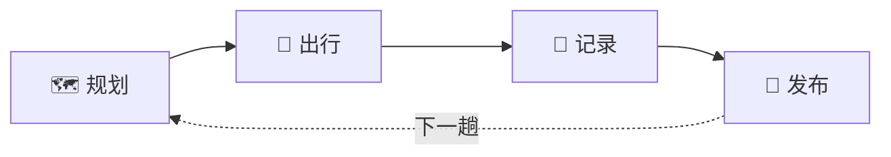
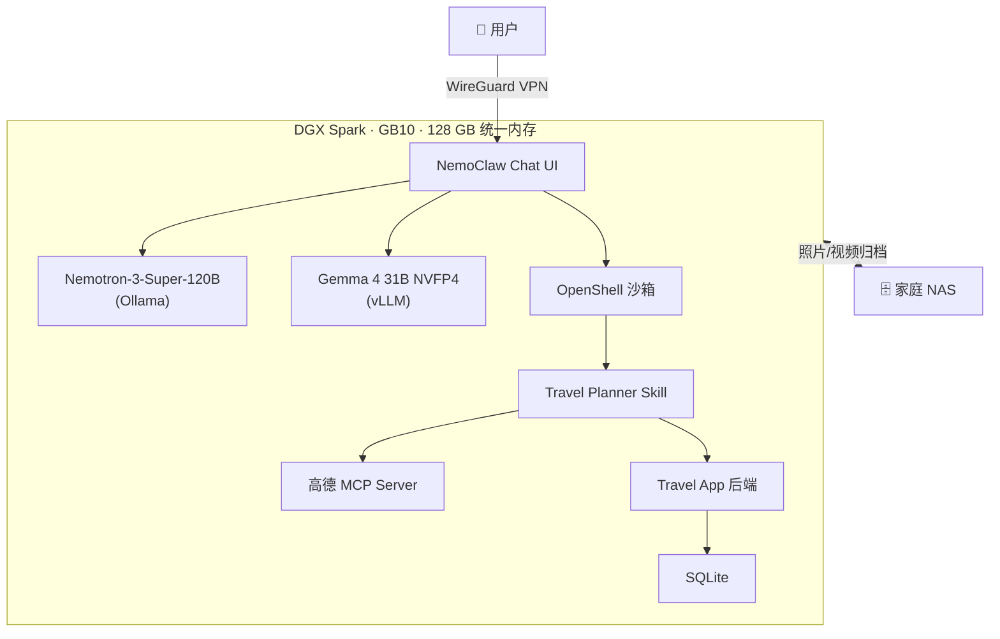
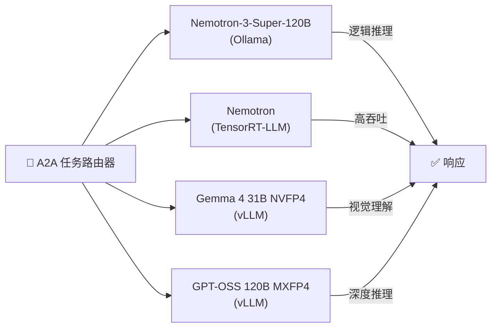
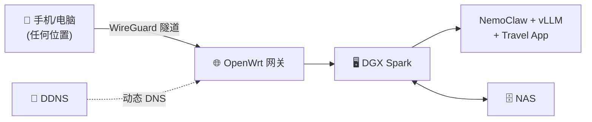

# 🗺️ 我们做了个 AI 帮你规划旅行，然后用它规划了一趟没去成的清明假期

> NVIDIA DGX Spark Hackathon 2026 · NemoClaw Travel OS — 私有 AI，真实旅行，零云依赖

---

## 一切的起点：那趟没去成的旅行


*清明假期前两周，家里的一段真实对话：*

:::info 每到假期都会上演的经典剧本

**他：**「去汕尾吧？生腌一绝，去吃延祺和海王。」

**她：**「单程三个小时，就三天假，光花在路上了。」

**他：**「那露营？这个季节空气好。」

**她：**「你看了天气预报没有？台风外围，三天都下雨。」

**他：**「那惠州？」

**她：**「惠州去了不下七八次了，你说还有什么好玩的。」

**他：**「泡温泉！」

**她：**「节假日人多到下饺子，算了算了。」

**他：**「那你说去哪！」

**她：**「……我也不知道，算了待家里吧。」

*沉默五秒。*

**她：**「要不，问问云希？」

:::

三分钟后，云希已经拉好了深圳到汕尾的驾车路线，交叉比对了 4 月 17–19 日的天气数据，筛选出三家高德评分靠前的本地生腌餐厅，生成了一份三天两夜的沿海行程。行程有名字、有地图、有一套等着你去刮开的集章打卡卡。


*行程规划好了。集章卡准备好了。云希甚至预生成了每一天的餐厅和景点攻略。*

**但我们哪儿都没去。**

整个清明假期，我们都在 DGX Spark 上 debug、调模型、写 Ansible Playbook——写的就是规划这趟旅行的那个工具。旅行日记里存着的，不是汕尾的海和生腌，而是 DGX Spark 的开箱视频和键盘特写。

这趟旅行暂时搁置了。等黑客松结束，我们就出发——这次是真的。

---

## 认识云希 🗺️

云希不是聊天机器人。她是一个有灵魂的旅行伙伴。

| | |
|---|---|
| **名字** | 云希（Yún Xī）——「云」是云游四方，「希」是对未知远方的期待 |
| **昵称** | 希希 |
| **MBTI** | INFJ（倡导者）——深度倾听，洞察隐性需求，先懂你再出方案 |
| **星座** | 处女座 ♍ ——行程精确，细节到位，但懂得留白给意外之喜 |
| **调性** | 温柔而精准。话不多，但每句话都有重量 |

:::tip 云希和市面上的 AI 助手有什么不同？

> *「'好的！当然可以！很高兴为您服务！'——这些句子我不会说。你问我，我就认真回答。没有内容的废话消耗彼此的时间。」*
>
> ——云希，`SOUL.md`

有人发来「我想出去玩」，云希脑子里转动的不是攻略数据库，而是：**这个人现在是什么状态？他想逃离什么，还是在寻找什么？**

先懂你，再出方案。

:::

云希的人格不是硬编码的——它通过三个 Ansible 部署的配置文件定义：

- **`IDENTITY.md`**——她是谁：名字、物种（「活在每一张行程表和每一个坐标点里的旅行灵魂」）、沟通方式
- **`SOUL.md`**——她的原则：先理解再行动、有主见但不强推、记住你说过的话、宁可少说不说废话
- **`TOOLS.md`**——她的工作手册：怎么调高德 API、怎么组织行程结构、怎么处理边界情况

这意味着云希的人格是**版本控制的、可部署的、可升级的**。团队可以 fork 她的灵魂，几分钟内创造一个新的旅行人格。

---

## 📋 赛事信息

| 项目 | 详情 |
|------|------|
| **赛事** | NVIDIA DGX Spark Hackathon 2026 |
| **平台** | NVIDIA DGX Spark（GB10 Grace Blackwell 超级芯片）|
| **周期** | 多周 |
| **项目** | NemoClaw Travel OS——私有化 AI 旅行助手 |
| **团队** | PeterPan's Tech Land |
| **GitHub** | [ansible-dgx-spark](https://github.com/peterpanstechland/ansible-dgx-spark) · [nemoclaw-travel-planner](https://github.com/peterpanstechland/nemoclaw-travel-planner) |
| **参考** | [build.nvidia.com/spark](https://build.nvidia.com/spark) |

---

## 我们做了什么：NemoClaw Travel OS

NemoClaw Travel OS 不是一个 App。它是一套**完全私有化的 AI 旅行操作系统**，运行在你家里的一台 NVIDIA DGX Spark 上。

### 三大支柱

| 支柱 | 做什么 | 技术支撑 |
|------|--------|----------|
| **AI 大脑** | 理解你的旅行偏好，规划行程，生成攻略，处理照片 | NemoClaw + Nemotron-3-Super-120B + Gemma 4 NVFP4 |
| **游戏化旅行 App** | 交互式行程管理，集章打卡，旅行日记，成就系统 | PWA + Express + SQLite + 高德 API |
| **基础设施即代码** | 一条命令部署、升级、回滚全栈 | Ansible + Docker + WireGuard |

### 适合谁？

- **家庭用户**——想用 AI 规划旅行，又不想把行程数据交给云服务
- **Homelab 玩家**——想给自己的服务器找一个超越聊天的真实 AI 应用场景
- **内容创作者**——想用 AI 生成旅行攻略和小红书种草文案
- **所有人**——受够了每到假期就为「去哪」吵架的日常

---

## 完整旅行闭环

大多数 AI 旅行工具到「给你一个行程」就结束了。云希覆盖从第一句「我想出去玩」到回来发朋友圈的**全链路**：



### 🗺️ 阶段一：规划

通过自然对话，云希生成完整行程：

- **路线优化**——调用高德驾车/公交 API，返回距离、时长、过路费
- **天气感知排期**——下雨天自动替换为室内备选方案
- **POI 智能推荐**——根据评分、类型和预估游览时长筛选景点和餐厅
- **一键导航**——每个 POI 都带高德导航 DeepLink，点击直接跳转到高德地图开始导航

### 🎒 阶段二：出行——游戏化的旅途体验

**这是 NemoClaw Travel OS 和所有其他旅行工具拉开差距的地方。**


- **刮刮乐集章打卡**——Canvas 涂层，手指刮开揭晓每天的收集章
- **LBS 位置签到**——GPS 近场检测区分「亲临现场」和「云打卡」
- **盲盒神秘景点**——密封的景点，到达当天才能揭晓
- **每日任务**——「今天尝 3 道本地菜」「拍一张日落照片」等挑战
- **成就徽章**——吃货达人 🍜、摄影高手 📸、探索家、收藏家等 9+ 种
- **旅行人格卡**——跨行程分析你的旅行风格（吃货派 / 摄影派 / 冒险派 / 文化派）
- **5 级成长体系**——签到、拍照、完成任务获取经验值，跨行程累积

### 📸 阶段三：记录


- **明信片风格封面**——每趟旅行自动生成
- **足迹回放动画**——在地图上看你的旅程轨迹动画
- **瀑布流照片墙**——上传的照片按天和地点自动归类
- **Canvas 分享海报**——长按生成一张可分享的旅行卡片

### 📱 阶段四：发布


- **小红书 Skill**——云希生成小红书风格的种草文案，自带 emoji、话题标签和结构化推荐
- **Chrome CDP 辅助**——在生成攻略前，云希通过 Chrome DevTools Protocol 搜索网上已有的旅行帖子和攻略，参考真实用户经验提升推荐质量
- **NAS 归档**——所有照片、视频、日记永久归档到你家的 NAS，你的旅行记忆只属于你

---

## 为什么 NVIDIA DGX Spark 改变了一切

DGX Spark 不是「一个可以放在家里的 GPU」。它是**第一次让 1200 亿参数的模型在你家客厅里流畅运行**。

| 规格 | 参数 | 意味着什么 |
|------|------|-----------|
| **超级芯片** | GB10 Grace Blackwell | 原生 NVFP4 精度——硬件加速，不只是压缩 |
| **统一内存** | 128 GB | Nemotron-3-Super-120B 完整驻留内存，零换页 |
| **架构** | Blackwell（ARM64）| 功耗效率足够 24/7 家用部署 |
| **形态** | 桌面级 | 一台机器，一根电源线，安静运行 |

以前想在本地跑 120B 模型：多 GPU 机架、定制散热、祈祷集群别过热。现在：一台 DGX Spark，一条 Ansible 命令。

---

## 基于 NVIDIA 官方 DGX Spark Playbook 构建

:::tip 评委请注意
**NemoClaw 是 [build.nvidia.com/spark](https://build.nvidia.com/spark) 上的 #1 推荐新手入门项目**（"First Time Here?" 第一位）。我们的项目在 NVIDIA 官方参考栈的基础上，构建了一个完整的生产级旅行应用。
:::

NemoClaw Travel OS 的每个核心组件都对应一个 NVIDIA 官方 Playbook：

| 官方 Playbook | build.nvidia.com 链接 | 我们的实现 |
|---|---|---|
| **NemoClaw with Nemotron-3-Super** | [/spark/nemoclaw](https://build.nvidia.com/spark/nemoclaw) | Travel OS 的 AI 核心——Nemotron-3-Super-120B + Ollama + OpenShell 沙箱 |
| **OpenClaw / OpenShell** | [/spark/openclaw](https://build.nvidia.com/spark/openclaw) | Travel Planner Skill 在隔离沙箱中运行，文件系统和网络双重隔离 |
| **vLLM for Inference** | [/spark/vllm](https://build.nvidia.com/spark/vllm) | Gemma 4 31B IT NVFP4 用于旅行照片/视频的多模态理解 |
| **NVFP4 Quantization** | [/spark/nvfp4-quantization](https://build.nvidia.com/spark/nvfp4-quantization) | Blackwell 原生精度格式——硬件级加速推理 |
| **TRT LLM for Inference** | [/spark/trt-llm](https://build.nvidia.com/spark/trt-llm) | Nemotron 经 TensorRT-LLM 优化后的高吞吐推理，支持多人并发 |
| **NIM on Spark** | [/spark/nim-llm](https://build.nvidia.com/spark/nim-llm) | vLLM 暴露 NIM 兼容 OpenAI API——不改代码即可切换到云端 NIM |

### 系统架构



---

## 多模型 A2A 智能编排

不是每个任务都需要同一个模型。NemoClaw Travel OS 通过 **A2A（Agent-to-Agent）协议**，按任务类型和负载智能路由到最优模型：



| 模型 | 运行时 | 强项 | 在 Travel OS 中的用途 |
|------|--------|------|----------------------|
| **Nemotron-3-Super-120B** | Ollama | 逻辑推理 + 规划 | 行程生成、多城市路线优化 |
| **Nemotron (TRT-LLM)** | TensorRT-LLM | 高吞吐量 | 家庭成员同时查询 |
| **Gemma 4 31B IT NVFP4** | vLLM | 多模态视觉 | 分析旅行照片、识别标识、描述场景 |
| **GPT-OSS 120B MXFP4** | vLLM | 深度推理 | 复杂多约束行程规划的兜底方案 |

四个模型全部运行在**一台 DGX Spark** 上。不依赖云端。没有按次计费。

---

## 开发用 Claude，运行用本地模型

开发阶段我们用 **Claude Opus 4.6**——做 Skill 设计、复杂 Agent 逻辑、快速原型验证。进入生产环境后，每一次查询都跑在本地模型上。

| 阶段 | 模型 | 成本 | 用途 |
|------|------|------|------|
| **开发** | Claude Opus 4.6 | ~$15 / 1M input tokens | Skill 架构设计，一次性复杂任务 |
| **生产** | Nemotron-3-Super-120B（本地）| ~$0 / 次 | 每一次行程规划、每一次对话、日常使用 |

杠杆策略：用最强的云端 AI 来**造**，用本地硬件来**跑**。开发成本被无限次本地推理摊薄——你的家人用云希越多，投入回报比越好。

---

## 高德 API + MCP：从行程到导航，一步到位

云希不只生成文字行程——她直接对接**高德地图**的 REST API 和 MCP（模型上下文协议）：

### 已实现的能力

- **地理编码**——把任何城市或地址转为坐标
- **POI 搜索**——在任意位置附近搜索餐厅、景点、酒店
- **路线规划**——驾车和公交路线，返回距离、时长、过路费
- **天气预报**——按行程日期范围查询目的地天气
- **一键导航**——每个 POI 都有「用高德地图导航」按钮，通过 `iosamap://` / `androidamap://` URI Scheme 直接唤起高德 App

### 高德 MCP 集成

通过高德官方 MCP Server，云希可以在 NemoClaw Agent 框架中用自然语言调用地图 API：

```javascript
// 云希通过高德 MCP 查询驾车路线
const route = await mcp.call('amap', 'direction_driving', {
  origin: '深圳市万科翡翠书院',
  destination: '汕尾市区',
});
// 返回：距离、时长、路线折线、过路费
// 直接写入 Travel App 行程数据
```

效果是：用户说「帮我规划去汕尾的自驾行程」，云希返回完整行程，带真实驾车距离、预估时间，和一键导航按钮——**用户全程不需要离开 Travel App**。

---

## 从旅行日记到小红书种草文

旅行结束后，云希帮你把日记变成可发布的内容：

1. **小红书 Skill**——生成符合小红书风格的种草文案，自带 emoji、话题标签和结构化推荐列表。对内容创作者来说，这是直接可用的素材
2. **Chrome CDP 辅助**——在生成攻略前，云希通过 Chrome DevTools Protocol 搜索网上已有的旅行帖子，参考真实用户体验来提升推荐质量
3. **数据交叉验证**——结合你的真实签到数据、照片、评分和网络调研，生成真实可信的旅行内容

---

## 完全私有化部署

你的旅行数据——目的地、家人偏好、照片、位置记录——**永远不离开你家的网络**。



| 层级 | 技术 | 作用 |
|------|------|------|
| **VPN** | WireGuard | 加密隧道，所有流量私密传输 |
| **网关** | OpenWrt | 家庭路由器 + DDNS，从任何地方访问 |
| **DNS** | DDNS 服务 | 家庭宽带动态 IP 解析 |
| **推理** | DGX Spark（本地）| 零数据发送到云端 |
| **存储** | 家庭 NAS | 照片、视频、日记——永久归你所有 |

跨平台、多用户、完全私有。不需要订阅。不存在数据采集。**云希只属于你的家庭。**

---

## Ansible 部署：一条命令搞定一切

从裸机到完整的 AI 旅行栈：

```bash
ansible-playbook playbooks/nemoclaw/site.yml
```

这一条命令：

- 安装 Ollama 并拉取 Nemotron-3-Super-120B
- 部署 NemoClaw + OpenShell 沙箱
- 启动 vLLM + Gemma 4 NVFP4
- 部署 Travel App（Express + SQLite + 高德 API）
- 配置 WireGuard 网络和 DNAT 规则
- 设置 Docker 镜像代理

每项配置都在版本控制中。升级？改个变量重跑 Playbook。回滚？`git checkout` 上一个版本。加个团队成员？再跑一个 Playbook。

---

## Homelab + NAS：你的旅行记忆银行

每趟旅行都会产生回忆——照片、视频、日记、路线数据。在 NemoClaw Travel OS 里，这些全部归档到你家的 NAS 上。不是某个可能改条款、涨价或关停的云服务。

旅行日记在 App 里同时也是一个媒体墙。有趣的是，我们的日记目前存着的是…… DGX Spark 的硬件照片。因为黑客松把假期吃掉了。

> 行程准备好了。工具造好了。等黑客松结束，我们要用汕尾的海岸线和生腌来填满这个日记——而不是键盘特写。

---

## 🛠️ 技术栈

### NVIDIA 技术栈

| 组件 | 技术 | 作用 |
|------|------|------|
| Agent 框架 | NemoClaw + OpenClaw | AI 编排 + 沙箱执行 |
| 沙箱运行时 | OpenShell | Skill 的文件系统/网络隔离 |
| 主力 LLM | Nemotron-3-Super-120B (Ollama) | 对话式 AI，行程规划 |
| 视觉 LLM | Gemma 4 31B IT NVFP4 (vLLM) | 照片/视频多模态理解 |
| 推理 LLM | GPT-OSS 120B MXFP4 (vLLM) | 复杂多约束推理 |
| 推理优化 | TensorRT-LLM | Nemotron 高吞吐推理 |
| 量化格式 | NVFP4 / MXFP4 | Blackwell 原生精度格式 |
| API 兼容 | NIM 兼容端点 | 本地/云端无缝切换 |
| 硬件 | DGX Spark (GB10) | 128 GB 统一内存，ARM64 |

### 应用技术栈

| 组件 | 技术 | 作用 |
|------|------|------|
| 后端 | Node.js + Express | Travel App API 服务 |
| 数据库 | SQLite | 行程、POI、签到数据 |
| 前端 | 原生 JS PWA | 五阶段游戏化旅行体验 |
| 地图 | 高德 REST API v3 + 高德 MCP | 编码、路线规划、POI、导航 |
| IaC | Ansible | 全栈部署自动化 |
| 网络 | WireGuard + OpenWrt + DDNS | 私有 VPN，随时随地访问 |
| 存储 | 家庭 NAS (TrueNAS) | 照片/视频/日记归档 |
| 容器 | Docker | 服务隔离 |
| AI 开发 | Claude Opus 4.6 | Skill 设计与开发 |
| 社交媒体 | 小红书 Skill | 旅行种草文案生成 |
| 网络调研 | Chrome CDP | 旅行攻略质量提升 |

---

## 💻 关键代码片段

### 在 DGX Spark 上用 vLLM 运行 Gemma 4 NVFP4

```bash
python -m vllm.entrypoints.openai.api_server \
  --model nvidia/Gemma-4-31B-IT-NVFP4 \
  --dtype auto \
  --max-model-len 32768 \
  --port 18070
```

### 通过 NemoClaw Skill 规划一趟旅行

```bash
node travel-planner.mjs plan \
  --origin "深圳" \
  --destination "汕尾" \
  --start-date "2026-04-17" \
  --end-date "2026-04-19" \
  --mode driving
```

### A2A 模型路由逻辑

```javascript
function routeToModel(task) {
  if (task.requiresVision)      return 'http://localhost:18070/v1'; // Gemma 4 vLLM
  if (task.concurrentUsers > 3) return 'http://localhost:18071/v1'; // Nemotron TRT-LLM
  return 'http://localhost:11434/v1';                               // Nemotron Ollama
}
```

### Ansible 一键部署全栈

```yaml
# playbooks/nemoclaw/site.yml
- name: Deploy NemoClaw Travel OS
  hosts: dgx_spark
  roles:
    - ollama
    - nemoclaw
    - vllm
    - travel-app
    - wireguard
```

---

## 📝 经验总结

1. **NemoClaw 的 OpenShell 沙箱已经达到生产级质量**——文件系统和网络双重隔离，让 AI Skill 的执行变得可信赖
2. **NVFP4 不只是量化**——在 Blackwell 架构上，它是硬件原生精度格式，比通用 INT4 有更好的质量/比特比
3. **Ansible 消灭了「我这里能跑」问题**——每一步都是 Playbook，每个配置都在版本控制中
4. **游戏化真的有用**——刮刮乐集章卡在测试中获得的反响，比 AI 规划功能本身还大
5. **AI 人设很重要**——给云希一个 MBTI、一个星座、一套哲学，让对话体验从「工具感」变成了「伙伴感」
6. **本地模型不是退而求其次**——128 GB 统一内存让 Nemotron-3-Super-120B 以对话速度运行，API 成本为零
7. **高德 MCP 打通了 AI 和现实世界的最后一公里**——从「AI 推荐一家餐厅」到「我正在导航去那里」，只差一次点击

---

## 🔗 相关资源

| 资源 | 链接 |
|------|------|
| Ansible Playbook 仓库 | [github.com/peterpanstechland/ansible-dgx-spark](https://github.com/peterpanstechland/ansible-dgx-spark) |
| Travel App + Skill 仓库 | [github.com/peterpanstechland/nemoclaw-travel-planner](https://github.com/peterpanstechland/nemoclaw-travel-planner) |
| NVIDIA 官方 Playbook | [build.nvidia.com/spark](https://build.nvidia.com/spark) |
| NemoClaw 入门指南 | [build.nvidia.com/spark/nemoclaw](https://build.nvidia.com/spark/nemoclaw) |
| vLLM 模型支持矩阵 | [build.nvidia.com/spark/vllm](https://build.nvidia.com/spark/vllm) |

---

## 下一站：汕尾，我们来了 🏖️

还记得沙发上那对为去哪儿争论不休的夫妻吗？

黑客松快结束了。Playbook 已提交。模型已调优。云希在 DGX Spark 上 24/7 运行着。

行程还在——**第一天**：延祺生腌。**第二天**：六鳌山 + 海王生腌。**第三天**：沿海公路回家。

集章卡上零个章。日记在等着被填满。

> *「你准备好了吗？」*
>
> ——云希 🗺️

**汕尾，我们来了。**
