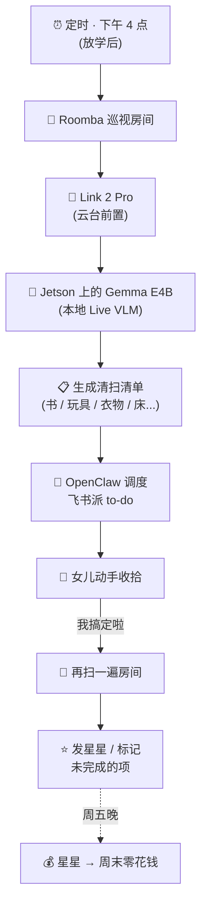
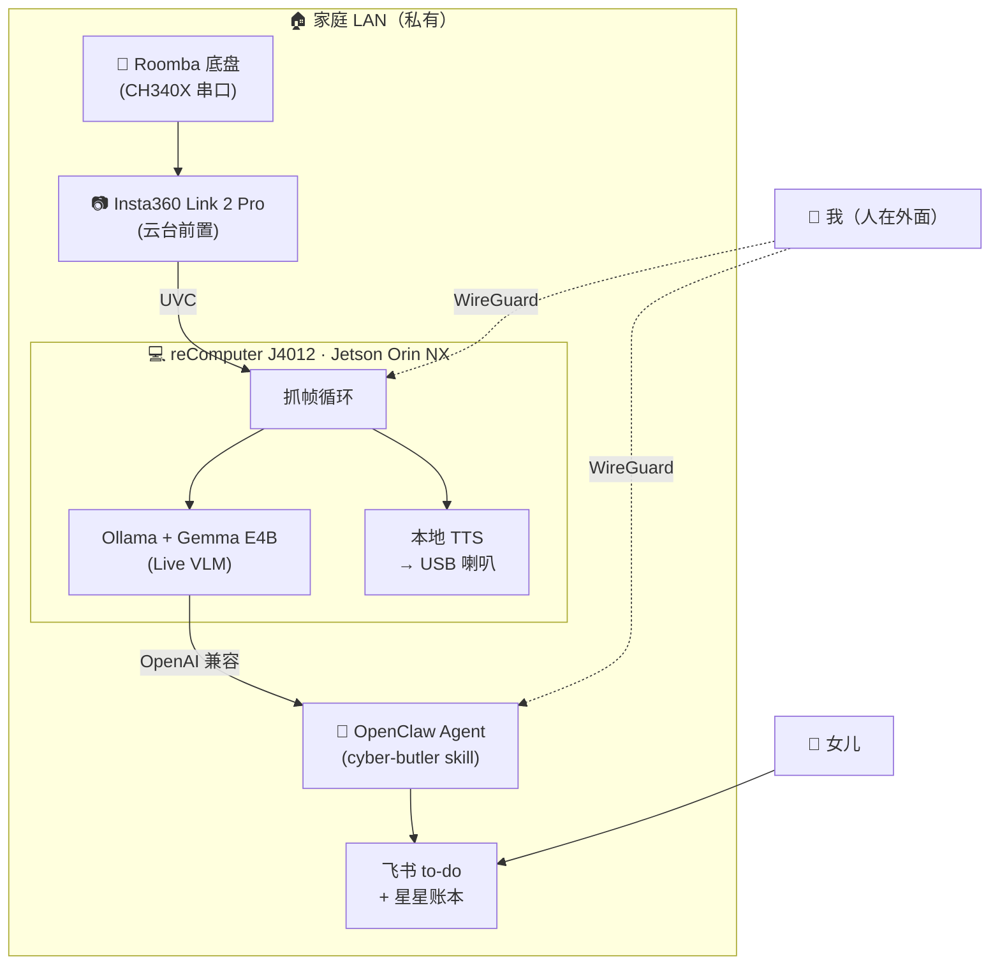

# Roomba-VLLM 赛博管家：表面上盯着我女儿的房间，实际上⋯

> Attrax 春潮黑客松 2026 · 深圳 · 影石 Cameraman 赛道 · Builder：PeterPan
>
> Cameraman 大奖 · TOP 1/200 Outlier 特别奖 · 2026 年 4 月 26 日

---

## 故事的明面版本

每个周末我和我老婆都在重复同一段对话：

> 「你看了她房间没？」
>
> 「看了。」
>
> 「我已经叫她收拾三遍了。」
>
> 「她说看完这集就收。」

她——我**8 岁的女儿**——从来不会看完这集就收。

这是她房间的真实状况：

我"声称"自己需要的，是一个**沉默的监工**：进她房间，看一圈，告诉她「地上的书要回书架，下铺那只鹅要回玩偶箱」，等她真的去做，再回来检查一次，给她一颗星。星星周末换零花钱。不吼她、不上 SaaS、不把我女儿房间的画面传到云上。

所以我自己做了一个。**24 小时**做完，黑客松现场交付，最后还拿了影石 Cameraman 大奖。

> *（关于我*真正*为什么做这件事，有一个不一样的版本。在文章最末。读到底。）*

---

## 认识 Roomba-VLLM

| | |
|---|---|
| **名字** | Roomba-VLLM — 一个骑着 Roomba 底盘、装着 VLM 大脑的赛博管家 |
| **官方职责** | 每日房间巡视 + 生成 to-do 清单 + 星星积分奖励系统 |
| **性格** | 安静、有条理、从不大声。所有事都记账。 |
| **服务对象** | 一个 8 岁的小姐。号称是。 |
| **建造时间** | 实际编码 24 小时（前 24 小时被一只机械臂夺去了，文末有视频） |
| **运行环境** | 家庭 LAN 内的 Jetson Orin NX。零云依赖。 |

整个东西就是我在黑客松桌上手工组装出来的一坨金属、塑料和硅。看上去不花哨——但它能跑通的反馈循环，才是真正重要的部分。

---

## 赛事信息

| 项目 | 详情 |
|------|------|
| **赛事** | Attrax 春潮黑客松 2026 |
| **赛道** | 影石 Cameraman 赛道 |
| **硬件赞助** | 嘉立创（JLCPCB）— 赞助了真正用上的 USB 转串口调试器 |
| **地点** | 深圳 · Livehouse MAO |
| **赛事周期** | 2026 年 4 月 23 日 – 4 月 26 日 |
| **项目周期** | 2026 年 4 月 24 日 – 4 月 25 日（官方 48 小时，实际编码 24 小时） |
| **Builder** | PeterPan（独立参赛） |
| **成绩** | 🥇 **Cameraman 大奖 · TOP 1/200 Outlier 特别奖**（X5 套装 + GO Ultra 套装 + ACE Pro 2） |
| **项目仓库** | [github.com/peterpanstechland/roomba-vllm](https://github.com/peterpanstechland/roomba-vllm) |

现场是会让你记一辈子的那种黑客松：

如果「TOP 1/200」听起来还有点抽象，下面这张是这次活动交付的全部项目分布——200 多张项目卡铺满整个会场，我的「FamilyQuest / 家庭副本」就在前排：

---

## 我的"队友们"

我是独立参赛——但又不太是。

我把我老婆和女儿做成了两块**KT 板剪贴像**——分别贴上「**1 号队友**」「**2 号队友**」的标签——立在我工位旁，陪我打完整整 48 小时。

有人路过来问"是真队友吗"。**是真队友——只不过在 OSI 网络协议栈的 KT 板这一层。**

剧本反转出现在颁奖环节——**真人本尊都来了**。女儿和老婆赶到现场，我们一起领了奖。KT 板队友升级成真人队友合影。（合影在文末。）

---

## 它每天到底在干什么 — 每日闭环

每个工作日下午放学后：

1. **巡视**：Roomba 底盘载着带云台的 Link 2 Pro 在房间里走一圈，画面实时回传到 Jetson Orin NX
2. **感知**：Gemma E4B（在 Jetson 上的 Ollama 里）作为 Live VLM 读图，写下哪儿不对劲
3. **派发**：家里早就部署好的 OpenClaw 拿到结构化输出后，把 to-do 推到飞书（和我 [Cyber Boss 项目](/docs/hackathons/2026/cyber-boss) 用的是同一套）
4. **核验**：女儿说「我搞定啦」之后，管家再扫一次，要么发星星，要么标记还没收的项
5. **奖励**：周五晚结算星星，星星换零花钱。管家是审计员，我只是出纳

整条闭环没有人类监工。**数据不出 LAN**。管家只看一个管家该看的东西。

---

## 硬件栈

整套东西就是一队相机、算力和 PLA 打出来的小物件：

### Insta360 Link 2 Pro — 前置的眼睛

云台自己取景——我不用写跟踪循环。UVC 即插即用进 Jetson。

### Insta360 X5 — 360° 的眼睛（下一阶段）

我原本没打算把 X5 搬到 demo 里。第二天打到一半我才知道有 DAP，立刻重新规划——下文 *X5 + DAP* 段细讲。

### reComputer J4012 — Jetson Orin NX，大脑

显存够大可以常驻 Gemma E4B；够安静可以放客厅。翅膀贴本身没功能。**精神上承重。**

### USB 喇叭 — 本地 TTS 输出

管家判定「书在地上」之后，会通过这只喇叭本地 TTS 念出来。顶上的小龙虾是 OpenClaw 吉祥物——我跟 [Cyber Boss](/docs/hackathons/2026/cyber-boss) 共用同一套 OpenClaw。

### 嘉立创赞助的 CH340X USB 转串口 — 沉默的英雄

给 **嘉立创（JLCPCB）** 一个大大的 shoutout——这次黑客松的硬件赞助方。他们发了一批 CH340X USB 转串口调试器，其中一只在我项目里**真的干活了**：我需要走 Roomba 底盘的串口给它脚本化巡视路径，这块小板子直接就 work——插上、烧、说话。

### TinkerCAD 设计 + Bambu Lab X1C 现场打印

在现场桌上用 TinkerCAD 设计，自己背的 Bambu Lab X1C 打 PLA（背它来是这个周末最值的一次决策）。一个晚上打了两版。

---

## 软件栈

| 层 | 技术 | 角色 |
|----|------|------|
| **本地 Live VLM** | Ollama + Gemma E4B | 读相机画面，描述房间状态，列出哪些东西没归位 |
| **Agent 编排** | OpenClaw（家里早就部署好） | 每日定时、飞书派单、星星账本、回扫逻辑 |
| **相机视频流** | Insta360 Link 2 Pro UVC + 自定义抓帧循环 | 巡视时拉帧，喂给 VLM |
| **Roomba 底盘** | CH340X USB 转串口（嘉立创赞助） | 走串口脚本化巡视路径 |
| **本地语音** | USB 喇叭 + 设备端 TTS | 在房间里念出 to-do |
| **远程访问** | WireGuard | 在外网看日志、临时触发一次扫描 |
| **推理主机** | Jetson Orin NX（reComputer J4012） | 模型常驻；在 LAN 内提供 OpenAI 兼容 API |

老实说：**OpenClaw 那一层不是在黑客松现场写的**。它就是我家里跑 [Cyber Boss](/docs/hackathons/2026/cyber-boss) 的同一套 OpenClaw。Roomba-VLLM 只是新挂了一个 `cyber-butler` 的 skill。复用这套现成基础设施，给我省下了大概一半的 24 小时。

> **为什么我反复强调这件事：** 如果你要打黑客松，**一套合适的"现成"基础栈，本身就是黑客松的另一半。** 别想着 24 小时把编排层从零搭起来，把*新颖*的部分搭在它上面。

---

## 系统架构

两层很干净的分离：

- **边缘端（Jetson）** 负责感知。看房间、跑 VLM、输出结构化结论、念出来。
- **Agent（OpenClaw）** 负责判断。排定时、决定派单内容、跑星星账本。

所有东西都在 LAN 内。WireGuard 是外网唯一一扇门，落点都是我自己已经信任的服务。

---

## 24 小时极限交付时间线

官方给的项目周期是 **48 小时**（4 月 24 日 – 4 月 25 日）。我把前 24 小时整整献给了一只跟我项目毫无关系的机械臂（文末会有视频）。下面是我*真正开干*之后的时间线：

| 时间 | 干了啥 |
|------|--------|
| **T+0** | 意识到我已经烧掉一天了。范围砍到「必须能端到端跑通每日闭环」。 |
| **T+0 → T+3** | TinkerCAD 外壳 v1 → 在 Bambu X1C 上开始打印。 |
| **T+3 → T+8** | Link 2 Pro → Jetson UVC 走通。第一帧画面进 Gemma E4B 本地推理。用嘉立创的 CH340X 给 Roomba 底盘 bring-up 串口。 |
| **T+8 → T+12** | 在已有 OpenClaw 上写 `cyber-butler` skill。复用 Cyber Boss 的飞书派单。 |
| **T+12 → T+15** | 第一次端到端跑通。VLM 报「地上有书」——居然真的对。 |
| **T+15 → T+18** | 外壳 v2 打印（摄像头立柱要给云台多让一点空间）。 |
| **T+18 → T+22** | 装到 Roomba 底盘上。调 cron 时间和回扫逻辑。 |
| **T+22 → T+24** | 录 demo、写 slides、提交。 |

三件事救了我：

1. **OpenClaw 已经在家里跑着了。** 我只需要写一个新 skill。
2. **Bambu X1C 真的快。** 一个晚上打了两版外壳。
3. **Live VLM + Gemma E4B 已经够用。** 识别"鞋子在床上"根本不需要 70B 模型。

---

## 为什么 X5 + DAP 是下一个解锁

我原本来黑客松只打算 demo「**前置摄像头 + 远程遥操**」版本的管家（Link 2 Pro 干活）。第二天打到一半，我才知道影石研究院的 **DAP**（Depth Any Panoramas）——一个 360° 全景深度的基础模型——这把项目的天花板一下子推到完全不同的高度。

| 能力 | 没有 DAP | 有 DAP |
|------|---------|--------|
| **视野覆盖** | 前向锥（Link 2 Pro） | 全 360°（X5） |
| **空间感知** | 只有 RGB — VLM 得自己猜深度 | RGB + 单帧等距全景出稠密深度 |
| **导航** | 遥操或硬编码碰撞条件 | 深度 → SLAM 地图 → 自主导航 |
| **失败模式** | 「床底下那个玩具我没看到」 | 「我看到了，它在我下方 0.4 米」 |

黑客松现场用 X5 拍的全景：

同一帧扔进 DAP 的 BF16 1024×512 推理管线之后：

> **黑客松内已完成的部分：** Jetson 上的 DAP 部署 + 测试全景上的成功复现（上面这张深度图就是黑客松现场的实际输出）。
>
> **赛后要做的部分：** X5 挂载点的内/外参标定，把深度图喂给 SLAM 地图，最终把管家变成一台真正的自主代理。路线图很清晰，缺的只是标定时间。

X5 + DAP 这一对，把这只管家从「会说话的相机」推到「知道东西在哪儿的机器人」。这就是「厨房 demo」和「真正的赛博管家」之间的差距。

---

## 影石 2025 年报《致投资人信》：Cameraman 加速进化

这个项目正好踩在影石的一个关键时间点上——影石发布了 **2025 年报《致投资人信》**（[原文链接](https://mp.weixin.qq.com/s/Yplv0SzQNg4SEEa-6kfUtw)，CEO **刘靖康**亲笔），这封信的叙事框架，恰好就是我的项目最终需要的框架。

信里有一段标题叫 **「AI 赋能影像技术，Cameraman 加速进化」**，把 Cameraman 战略拆得很清楚：

> **AI = 大脑。** 让相机感知空间、感知意图、感知世界。
>
> **相机技术 = 眼睛。** 各类影像技术实现不同焦段的高清成像。
>
> **无人机 / 云台 = 四肢。** 让相机在空间中自由移动和寻找角度。
>
> 影石 Cameraman（摄影机器人）正在加速拼上最后一块拼图 —— AI 大脑。

这*就是* Roomba-VLLM 的架构：

- **眼睛** = Insta360 Link 2 Pro（现在）→ Insta360 X5（下一步）
- **四肢** = Roomba 底盘（再加 Link 2 Pro 上的云台）
- **大脑** = Jetson 上的 Gemma E4B + OpenClaw

同一封《致投资人信》还点名了 [影石研究院（Insta360 Research Team）](https://github.com/Insta360-Research-Team) 开源的一整套全景 AI 基础栈——它们正是给「大脑」补上*空间理解*的核心积木；同时给出了用户侧 AI 剪辑导出率与付费用户备份云存数据量的增长曲线，证明这一切不是 PPT，是真在跑：

| 项目 | 做什么 | 对赛博管家意味着什么 |
|------|--------|----------------------|
| [**AirSim360**](https://github.com/Insta360-Research-Team/AirSim360) | 全景仿真平台（含无人机视角） | 让空间智能体先在仿真里训练评估，不必拿底盘冒险 |
| [**DAP**](https://github.com/Insta360-Research-Team/DAP) | Depth Any Panoramas 全景深度基础模型 | 单张 360° 帧 → 稠密深度，是室内 SLAM 的脊梁 |
| [**DiT360**](https://github.com/Insta360-Research-Team/DiT360) | 全景文生图（CVPR 2026） | 给罕见家庭场景生成合成训练数据 |
| [**DDGS**](https://github.com/Insta360-Research-Team/DDGS) | 深度+密度引导的高斯泼溅 | 稀疏视角三维重建 — 几张全景就能把房间建出来 |

这些不是「研究 demo」。这是一整套具身全景智能体的积木——而影石把绝大部分都开源了。

---

## 怎么申请影石 SDK（给没相机的同学）

整个项目都基于影石官方 SDK，下面是我用过的实际申请流程。如果你还没有相机，也可以通过参加影石赞助的黑客松拿到——下文有讲。

### 第 1 步 — 打开开发者门户

打开 [insta360.com/cn/developer/home](https://www.insta360.com/cn/developer/home)，点 **立即申请**。

### 第 2 步 — 填申请表

选你是否有相机（型号）、个人/企业用户、写一段 SDK 申请理由。**写具体一点** — 「探索基于 DAP 的全景感知做家庭赛博管家」比「我想玩玩」效果好很多。

### 第 3 步 — 跟进申请

提交后回到同一个门户，点 **申请管理与下载**。

### 第 4 步 — 审核通过后下载 SDK

审核很快（我两次都是当天通过）。看到 **审核通过** 之后，所有平台的 SDK 一键下载——Android、iOS、macOS、Windows。

如果你没相机也不想立刻买，我走的这条路很现实：**参加影石赞助的黑客松**。光 Cameraman 大奖一份就是 X5 + GO Ultra + ACE Pro 2，相当于一个周末就启动了一个像样的全景感知小实验室。

---

## Cameraman 大奖

KT 板队友升级成真人队友，合影瞬间：

颁完奖在场地里再补一张：

> **TOP 1/200 Outlier · 影石 Cameraman 大奖**
>
> X5 套装 + GO Ultra 套装 + ACE Pro 2

这个奖不仅是奖杯——更是一次"工具解锁"。拿到 X5 之后，我可以把最后一天才规划好的 DAP → SLAM → 自主导航这条管线真正做完。Roomba-VLLM 因为这套硬件，正在从「demo 级原型」走到「真正在我家客厅跑」。

---

## 从 24 小时极限交付里学到的事

1. **复用编排层。** OpenClaw 已经在家里跑着了，我只用写一个新 skill。如果 24 小时从零写飞书集成，我连 demo 都拿不出来。
2. **Live VLM 处理"这房间乱不乱"已经够用。** 我拿真实乱场景测过 Gemma E4B — 「书在地上 / 衣服在床上 / 玩具没归箱」识别得很稳。不需要 70B 模型。
3. **全景相机不是「更广角」那么简单。** 它是 360° 传感器，配 DAP 之后，不需要额外深度硬件就有深度。这是真正的解锁。
4. **自带 3D 打印机。** Bambu X1C 在我桌底下蹲着，一个晚上打两版外壳。没它我交付的就是更糟的固定方案。
5. **硬件赞助救的是不光鲜的那一半。** 嘉立创的 CH340X 是那种"用上之前你都不会想起的零件"——黑客松能发出真用得上的东西，黄金。
6. **Cron + 飞书完爆语音 UI。** 8 岁小孩不需要唤醒词。她需要妈妈手机上一张「你的房间扫描 5 分钟后开始」的卡片。
7. **「全本地」不是限制，是特性。** 我女儿的房间，没有任何一帧应该离开 LAN。WireGuard 是唯一外门，而且只对我开。
8. **硬件赛事会自己重新定义你的边界。** 我一知道有 DAP，项目天花板就被推高了。别因为已经定好范围就拒绝解锁——要围着新解锁重新规划。

---

## 资源

| 资源 | 链接 |
|------|------|
| **项目仓库** | [github.com/peterpanstechland/roomba-vllm](https://github.com/peterpanstechland/roomba-vllm) |
| **影石开发者门户** | [insta360.com/cn/developer/home](https://www.insta360.com/cn/developer/home) |
| **影石 SDK / 相机开源组织** | [github.com/Insta360Develop](https://github.com/Insta360Develop) |
| **影石研究院（全景 AI）** | [github.com/Insta360-Research-Team](https://github.com/Insta360-Research-Team) |
| **影石 2025 年报《致投资人信》** | [mp.weixin.qq.com/s/Yplv0SzQNg4SEEa-6kfUtw](https://mp.weixin.qq.com/s/Yplv0SzQNg4SEEa-6kfUtw) |
| **嘉立创（硬件赞助方）** | [jlcpcb.com](https://jlcpcb.com/) |
| **姊妹篇 Cyber Boss（同一套 OpenClaw）** | [/zh-Hans/docs/hackathons/2026/cyber-boss](/zh-Hans/docs/hackathons/2026/cyber-boss) |
| **2026 黑客松合集** | [/zh-Hans/docs/hackathons](/zh-Hans/docs/hackathons) |

---

## 彩蛋 #1：会蹦迪的机械臂

关于我这个「48 小时项目周期」的实话：前 24 小时我献给了一只机械臂。

**高擎动力（GaoQing Power）** 在 Attrax 现场摆了一只机械臂，我整个人栓在那里下不来。4 月 24 日一整天，我和那只机械臂一起设计动作路径、回放轨迹，到了某一刻我让它在桌面上把一罐可乐递过来——只因为我能。

晚上是 Live Jam——Attrax 通宵的 DJ Set。我把那只机械臂接上**蹦迪指令**：音频流走节拍检测 → 机械臂关节轨迹跟着节拍走。它在副歌里挥拳、在 drop 上拍点。

视频，舞池上的它：

<video controls width="100%" preload="metadata" style={{maxWidth: '720px', display: 'block', margin: '1.5rem auto'}}>
  <source src="/video/hackathons/2026/roomba-vllm-robotic-arm-jam-1.mp4" type="video/mp4" />
  你的浏览器不支持播放这个视频。
</video>

再来一个角度——同一只手臂、同一组 DJ Set、不同 drop：

<video controls width="100%" preload="metadata" style={{maxWidth: '720px', display: 'block', margin: '1.5rem auto'}}>
  <source src="/video/hackathons/2026/roomba-vllm-robotic-arm-jam-2.mp4" type="video/mp4" />
  你的浏览器不支持播放这个视频。
</video>

**那是我那一周做出来最酷的东西。**

它跟我提交的项目一点关系都没有。

我大概凌晨 2 点回床上，6 点醒来一算时间——只剩 **24 小时**——*然后才*开始做 Roomba-VLLM。本文上面的所有其他内容，都是那 24 小时里发生的。

> 在黑客松遇到一块勾魂的硬件，就让它勾。**但是请你设个闹钟。**
>
> 给 **高擎动力（GaoQing Power）** 一个超大的 shoutout —— 那只机械臂值得有自己的一篇专题。下次黑客松吧。🤖🎶

---

## 彩蛋 #2：好吧，不装了，摊牌了

你已经读了 4000 字「我做了个管家因为我 8 岁的女儿不收拾房间」。

**我真正在乎的房间，长这样**：

**说实话，这次黑客松项目其实不是为了我女儿。**

**是为了我自己。**

一个工作室长成上图这样的成年人，用不着拿 8 岁小孩的房间当问题陈述。他需要的，是一个借口——花 24 小时，去玩 Insta360 X5、Jetson Orin NX、CH340X 串口调试器、OpenClaw skill、DAP 全景深度基础模型、一只机械臂、一台通宵打印的 Bambu X1C，以及一组黑客松 DJ Set。

清扫管家是真的。它在跑、它能用。我女儿（号称）受益。

但真正在被训练的反馈循环，是**我的**：我巡视这个工作室、工作室生成 to-do、我给自己发星星，星星变成——嗯，星星变成*下一场黑客松*。

> 「书在地上。鹅在床上。墙角那块你漏了。」
>
> *—— 管家在念我女儿的房间。号称是。*

---

**Roomba-VLLM 已经在客厅里跑着了。X5 在路上。SLAM 是下一站。**

**而 8 岁那位的房间是顺带的。工作室才是核心。** 🛠️
