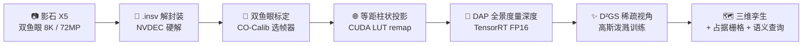
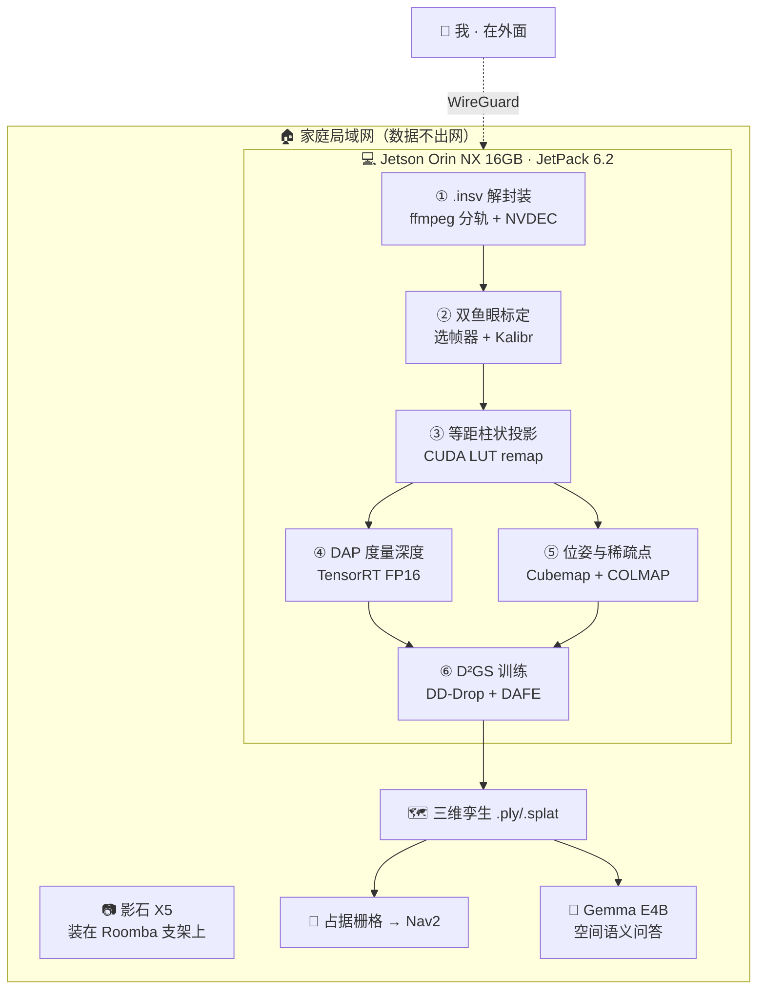
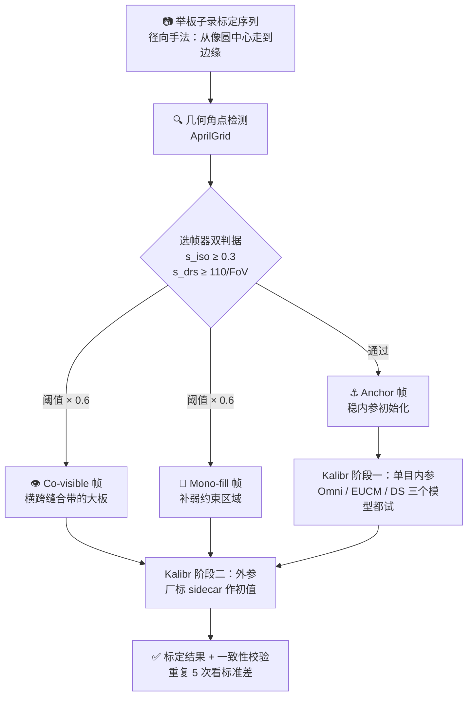

# PanoTwin：用 Jetson Orin NX 16GB + 影石 X5 把一间房重建成边缘端高斯泼溅数字孪生

> **NVIDIA Jetson 2026 开发者有奖征文** · 主办：GPUS 开发者社区
>
> **项目开发周期：2026 年 6 月 1 日 – 2026 年 7 月 28 日**（全新开发，非历史存量项目）
>
> **运行平台：NVIDIA Jetson Orin NX 16GB（reComputer J4012）· JetPack 6.2 · 全流程离线，数据不出局域网**


---

## 写在最前面：这篇文章里哪些是实测，哪些还没测完

:::warning 关于数据的诚实声明

这个项目在 7 月 28 日冻结代码，但**性能数据的完整复测还没跑完**。为了不给同行提供假参考，本文所有需要实测的数字都集中放在[模块五的指标表](#51-实测指标表)里，凡是标 `⬜ TODO` 的都是**还没有复测完成的项**，我把采集命令一并写在了旁边，跑完会直接回填这篇文章。

文中引用的**其他数字都有明确出处**：来自 NVIDIA 官方数据手册的标注为「官方规格」，来自论文的标注为「论文数据（合成数据集）」，来自我自己机器的标注为「本机实测」。请不要把论文里的成功率直接当成我在 X5 上的成功率——那是两个不同的实验。

:::

---

## 项目速览

| 项目 | 详情 |
|------|------|
| **项目名** | PanoTwin — 全景数字孪生流水线 |
| **一句话定位** | 用一台 360° 相机走一圈房间，在 Jetson 上离线重建出带真实尺度的高斯泼溅三维场景 |
| **开发周期** | 2026 年 6 月 1 日 – 7 月 28 日（约 8 周，业余时间，单人开发） |
| **硬件平台** | NVIDIA Jetson Orin NX 16GB（Seeed reComputer J4012）+ 影石 Insta360 X5 |
| **系统栈** | JetPack 6.2 / L4T 36.4.3 · CUDA 12.6 · cuDNN 9.3 · TensorRT 10.3 · VPI 3.2 |
| **核心模型** | DAP（Depth Any Panoramas，CVPR 2026）+ D²GS（DDGS，ICLR 2026）+ Gemma E4B（语义层） |
| **关键参考论文** | [CO-Calib：Observation Quality Matters（arXiv 2607.05777）](https://arxiv.org/html/2607.05777v1)，HKUST Aerial Robotics |
| **上游项目** | [Roomba-VLLM 赛博管家](/docs/hackathons/2026/roomba-vllm)（Attrax 春潮黑客松 2026 · 影石 Cameraman 大奖） |
| **是否上云** | 完全不上云。采集、标定、推理、重建、渲染全部在 Orin NX 本地完成 |

---

## 模块一：项目整体介绍与落地场景

### 1.1 起点：我的赛博管家「看得见」，但「不知道东西在哪」

今年 4 月，我在 Attrax 春潮黑客松用 24 小时做了一台 [Roomba-VLLM 赛博管家](/docs/hackathons/2026/roomba-vllm)：Roomba 底盘 + 影石 Link 2 Pro 云台摄像头 + Jetson Orin NX 上跑 Ollama + Gemma E4B，每天放学后巡视一次我女儿的房间，生成「地上的书要回书架」这样的待办清单，做完发星星换零花钱。那个项目拿了影石 Cameraman 大奖，也让我拿到了一台 X5。

但那台管家有一个我在演示时刻意没提的硬伤：**它只有二维的眼睛，没有三维的记忆**。

它能说「地上有书」，因为 VLM 在一张 RGB 图里认出了书。但你问它三个问题，它一个都答不上来：

1. 那本书离门口多远？
2. 玩偶是掉在下铺的床沿，还是滚到了床底下 40 厘米处？
3. 昨天这个位置有东西吗？

前两个是**度量几何**问题，第三个是**场景记忆**问题。一个只有单目 RGB 的机器人，两个都做不到。它不是一个能在空间里行动的智能体，它是一个会说话的摄像头。

黑客松结束那天，我在文章里给自己留了一句话：

> **接下来要做的：X5 支架的内外参标定，然后把深度图接进 SLAM 地图，让管家变成真正的自主智能体。路线是清楚的，只差标定的时间。**

PanoTwin 就是把这句话做完的项目。而当我真的坐下来做标定，才发现「只差标定的时间」这句话，是我对鱼眼标定这件事最严重的低估——后面模块四会讲这个坑有多深。


### 1.2 场景痛点：为什么现有方案都不合适

我要的东西说起来很朴素：**给一个室内空间建一份带真实尺度、可以反复查询的三维底图，并且这件事必须能在机器人身上自己完成**。市面上的路线我都试过，每条都在某个地方卡死：

| 现有方案 | 卡在哪里 |
|---------|---------|
| **激光雷达 SLAM** | 一台能建室内稠密图的 3D LiDAR 动辄五位数，装在 Roomba 上功耗和重量都超标；而且 LiDAR 没有颜色，VLM 拿不到语义 |
| **iPhone / iPad LiDAR 扫描** | 精度够用，但必须**人举着走**，机器人自己完成不了；单次覆盖小，一间房要走好几遍；数据在手机里，进不了我的机器人流水线 |
| **云端重建服务**（上传影像出模型） | 我要扫的是**我女儿的卧室和我的工作台**。把全屋影像上传到别人的服务器，这个方案在我家第一步就被否了。另外家里上行带宽跑 8K 素材也不现实 |
| **单目 SLAM / 单目深度** | 家居环境弱纹理（白墙、地板）+ 大视差旋转，单目 SLAM 漂移严重、尺度不确定；单目深度模型给的是相对深度，没有米制尺度，导航用不了 |
| **多目针孔相机阵列** | 覆盖 360° 需要 4–6 路相机，标定复杂度和线束复杂度都爆炸，装在 Roomba 上完全不现实 |

痛点归纳成征文提到的那几类，正好一条不落：**现有方案成本昂贵**（LiDAR）、**数据传输隐私风险**（云端重建）、**设备功耗过高 / 体积超标**（相机阵列、AGX 级算力）、**云端推理延迟过高**（在线重建服务）、**传统设备智能化不足**（Roomba 只会撞墙）。

### 1.3 PanoTwin 是什么

PanoTwin 是一条**完全跑在 Jetson Orin NX 16GB 上的三级流水线**，输入是一台影石 X5 在房间里若干个站位拍的全景照片，输出是一个带真实米制尺度的 3D 高斯泼溅场景（`.ply` / `.splat`）加一张可以喂给导航栈的占据栅格。



三级各自解决一件事：

| 级 | 解决的问题 | 用的东西 |
|---|---|---|
| **一级：标定** | 让 200° 级鱼眼的内外参真的收敛，这是整条链的地基 | Kalibr + 我复现的 CO-Calib 观测质量选帧器 |
| **二级：深度** | 从**单张全景**拿到有米制尺度的稠密深度，不需要任何深度硬件 | DAP（DINOv3-Large 骨干）+ TensorRT FP16 |
| **三级：重建** | 只有十几张全景（极稀疏视角）也能出稳定的三维场景 | D²GS 的 DD-Drop + DAFE，深度先验来自 DAP |

### 1.4 创新点与落地优势

这个项目我认为有价值的地方有四个，其中第一个是我在动手之后才发现的、也是整篇文章我最想分享的部分：

**第一，把一篇标定论文的分析结论，翻译成了一套可执行的拍摄手法。** CO-Calib 论文的核心发现是：多鱼眼标定失败的主因**不是**角点检出率低、**也不是**图像平面分布不均，而是**内参初始化的病态性**——当观测只占据很窄的径向区间时，焦距尺度和鱼眼投影形状参数的雅可比方向变得近似共线，无法分离。这个结论对做工程的人来说信息量极大：它意味着「标定板要举得满图都是」是**错的直觉**，正确的直觉是「标定板要沿着**径向**从像圆中心一路扫到边缘」。我把论文的两个筛帧判据实现成了大约 200 行 Python，插在 Kalibr 前面，同时改掉了自己举板子的手法。

**第二，X5 的双镜头配置比论文里最难的立体配置还要难。** 论文的立体实验做到相对偏航 120°，而 X5 是**背靠背 180°**——两个镜头的共视区只剩缝合带上一条环形窄带。论文里唯一可比的是 Hex-Fisheye 六目系统，而在那个系统上 Kalibr 十条序列**全部失败**。所以我不能照抄论文流程，得为 180° 背靠背这个特例重新设计共视约束的收集方式（模块三 Step 2 详述）。

**第三，用一台消费级 360° 相机替掉了整个深度硬件。** X5 单次成像就覆盖 360°，配上 DAP 就是「一张图出一圈米制深度」。这是稀疏视角重建的天然采集器：**一个站位顶得上一圈针孔相机**。房间里站 12–16 个点，就能覆盖到全屋。

**第四，全链路离线。** 从 `.insv` 解封装到高斯泼溅训练，全部在 Orin NX 上完成，没有一帧画面离开局域网。这不是「顺带的隐私优势」，这是我家能不能部署这套东西的**准入条件**。

### 1.5 落地场景

| 场景 | PanoTwin 提供什么 |
|-----|------------------|
| **家用机器人导航（本项目主线）** | 给 Roomba-VLLM 一张三维底图，从「能看见」升级到「知道东西在哪、有多远」 |
| **VLM 空间问答** | 「鹅玩偶在哪」不再只回答「在床上」，而是回答「在下铺床沿，距地面 0.4 m，相机坐标系 (1.2, 0.4, 2.1)」 |
| **装修 / 租房 / 保险取证** | 走一圈留一份带尺度的三维存档，纠纷时可测量、可回溯，且数据在自己手里 |
| **小型工厂 / 机房巡检** | 巡检机器人定期重建，跟历史孪生做差分，发现「多了一个箱子 / 少了一块盖板」 |
| **边缘 AI 教学** | 一条链把标定、TensorRT 部署、可微渲染训练全串起来，是很完整的 Jetson 教学案例 |

---

## 模块二：核心技术选型与 SDK、工具、模型详解

### 2.1 硬件平台：为什么必须是 Orin NX 16GB


先说结论：**这条流水线的选型门槛是「16GB 统一内存」，不是算力**。

DAP 的骨干是 DINOv3-Large（ViT-L 级，约 3 亿参数），D²GS 训练时要同时驻留高斯参数、优化器状态、深度先验和渲染中间量。这两件事在 Jetson 上共享同一块 LPDDR5——Jetson 没有独立显存，**GPU 和 CPU 抢的是同一个 16GB**。我在 8GB 的板子上试过，DAP 单独推理勉强能跑，但只要同时开着重建训练就必然 OOM。

Jetson Orin NX 16GB 的官方规格（来自 NVIDIA Jetson Orin NX 系列数据手册 v1.7 与 JetPack 6.2 官方博客）：

| 规格项 | 标准模式 | MAXN_SUPER 模式 |
|-------|---------|----------------|
| **GPU** | 1024 CUDA Core + 32 Tensor Core @ 918 MHz | 同硬件 @ 1173 MHz |
| **INT8 算力（稀疏 / 稠密）** | 100 / 50 TOPS | 157 / 78 TOPS |
| **FP16 算力** | 15 TFLOPS | 19 TFLOPS |
| **DLA** | 2× NVDLA v2，40 / 20 TOPS | 80 / 40 TOPS |
| **CPU** | 8 核 Arm Cortex-A78AE @ 2.0 GHz | 同 |
| **内存** | 16GB 128-bit LPDDR5，102.4 GB/s | 同 |
| **功耗档位** | 10W / 15W / 25W | 40W |
| **计算架构** | Ampere，`sm_87` | 同 |

MAXN_SUPER 是 JetPack 6.2 才放出来的「Super 模式」，同一块板子刷完新 JetPack 就能从 100 TOPS 提到 157 TOPS，**不换硬件**。代价是散热：40W 的功耗包线需要主动散热，我原来那套被动散热片直接顶不住（模块四难点 6）。

同代方案我做过横向对比，选型理由如下：

| 候选平台 | 为什么没选 |
|---------|-----------|
| **Jetson Orin Nano 8GB（Super）** | 67 TOPS 算力其实够跑 DAP 推理，但 8GB 内存跑不了 D²GS 训练。**内存是硬墙，不是性能问题** |
| **Jetson AGX Orin 64GB** | 什么都跑得动，但价格是 Orin NX 的数倍、功耗最高 60W、体积装不上 Roomba 底盘。为了一个家用机器人上这个平台不合理 |
| **NVIDIA DGX Spark** | 我另一个项目 [NemoClaw Travel OS](/docs/hackathons/2026/nvidia-dgx-spark) 用的就是 Spark，它很强，但它是**桌面级 AI 工作站，不是边缘设备**，不可能装在扫地机器人上跑 |
| **x86 + RTX 独显** | 重建速度当然更快，但这个项目的命题就是「机器人自己完成」。放弃移动性等于放弃项目 |

一句话：**Orin NX 16GB 是「能装上机器人」和「跑得动 ViT-L + 可微渲染训练」这两个条件的唯一交集**。

另外三个在项目里真正用上了的 Orin NX 特性，选型时容易被忽略：

- **NVDEC 硬解**：X5 的 `.insv` 是两路 H.265，8K 素材靠 CPU 软解会直接把 8 个 A78 核吃满。走 NVDEC 之后解码基本不占 CPU。
- **统一内存零拷贝**：NVDEC 解出来的帧可以直接以 `NvBufSurface` 映射进 CUDA，不走 host 内存往返。8K 分辨率下这一步省下的带宽非常可观（102.4 GB/s 是这块板子最容易触顶的资源）。
- **可编程功耗档位**：同一套代码，在线感知跑 15W，离线重建切 40W。这个能力让「白天低功耗待机、夜里全力重建」变成一行 `nvpmodel` 命令。

### 2.2 传感器：为什么是影石 X5


| X5 关键规格 | 值 | 对本项目的意义 |
|------------|---|---------------|
| 传感器 | 双 1/1.28"，f/2.0，6mm 等效 | 室内弱光下信噪比够用，f/2.0 对家居照明友好 |
| 视频 | 8K30 / 5.7K60 / 4K120 | 5.7K 以上会在同一个 `.insv` 里存**两条视频轨** |
| 照片 | 7200 万像素（9504×4752），支持 RAW DNG | **静态全景是我最终选的采集方式**（见模块三 Step 0） |
| 结构 | 可换镜头、IP68 15m 防水 | 装在机器人上磕碰是常态，镜头能单独换非常关键 |
| 原始数据 | `.insv`（双路 H.265 + IMU 轨 + protobuf 标定 sidecar） | 决定了 Jetson 上的解封装方案 |

选它的核心理由只有一句：**稀疏视角重建缺的是「视角覆盖」，而 360° 相机一个站位就把一整圈覆盖掉了**。用针孔相机要在同一个站位拍 6 张才能凑出一圈，而这 6 张之间还得再标一次相对位姿。

需要说清楚的一点：**X5 官方没有公布单镜头的精确 FoV**。可以确定的是它必须大于 180° 才能拼接（重叠区用来做缝合），业内同类产品普遍在 190°–200° 区间。我在标定里按有效像圆半径反算了一个值，这个数字列在[指标表](#51-实测指标表)里等复测。**这一点很重要**，因为 CO-Calib 的选帧阈值 `s_drs = 110/FoV` 直接依赖这个 FoV 估计——论文原文也说了「实际应用中从厂商拿一个粗略 FoV 值即可」。

### 2.3 系统与核心 SDK

| 层 | 组件 | 版本 | 在项目里干什么 |
|---|------|------|--------------|
| **系统** | JetPack | 6.2（L4T 36.4.3，Ubuntu 22.04 aarch64） | Super 模式的前提，低于 6.2 拿不到 157 TOPS |
| **计算** | CUDA | 12.6 | 等距柱状投影 remap 核、COLMAP GPU、可微光栅化 |
| **计算** | cuDNN | 9.3 | PyTorch 后端 |
| **推理** | TensorRT | 10.3 | DAP 的 FP16 引擎，逐层精度控制 |
| **视觉** | VPI | 3.2 | 早期版本试过用 VPI 的 remap 做鱼眼展开（后来换成自写核，见模块四难点 3） |
| **解码** | NVDEC + `jetson-ffmpeg` / GStreamer `nvv4l2decoder` | 随 JetPack | `.insv` 双路 H.265 硬解 |
| **视觉库** | OpenCV | 4.10（自编译，开 CUDA + `sm_87`） | 角点检测、单应估计、可视化。**JetPack 自带的 OpenCV 没开 CUDA，必须重编** |
| **标定** | Kalibr | Docker 镜像（`ros:noetic` 基座） | 多相机 BA 后端。我只在它**前面**插选帧器，不改它的优化器 |
| **SfM** | COLMAP | 3.9（`CMAKE_CUDA_ARCHITECTURES=87`） | 稀疏位姿 + `patch_match_stereo` / `stereo_fusion` 出稠密点云 |
| **深度学习** | PyTorch | 2.x aarch64 官方轮子（jetson-ai-lab） | DAP 推理基线、D²GS 训练 |
| **渲染** | `gsplat` / `diff-gaussian-rasterization` | 源码编译，`TORCH_CUDA_ARCH_LIST=8.7` | 高斯泼溅的可微光栅化核 |
| **点云** | Open3D | aarch64 源码编译 | 点云配准、TSDF、导出占据栅格 |
| **机器人** | ROS 2 Humble + Nav2 | 随 Ubuntu 22.04 | 把孪生转成 costmap 喂给导航（本期只做到导出，未闭环） |
| **语义层** | Ollama + Gemma E4B | 沿用 Roomba-VLLM 的部署 | 三维场景的自然语言查询 |

需要专门提一句 **Insta360 官方 SDK**：官方的 `Desktop-MediaSDK-Cpp`（拼接）和 `Desktop-CameraSDK-Cpp`（取流控制）支持的平台是 **Windows 与 Ubuntu 22.04 x86_64**——**没有 aarch64 版本**。这意味着在 Jetson 上，官方 SDK 这条路是**走不通的**。这是本项目的第一个真实拦路虎，解法在模块三 Step 1 和模块四难点 1。

SDK 的申请流程我在 [Roomba-VLLM 那篇](/docs/hackathons/2026/roomba-vllm)里已经一步步截图写过（[开发者门户](https://www.insta360.com/cn/developer/home) → 填申请 → 审核通过 → 下载），这里不重复。

### 2.4 AI 模型选型与优化

#### DAP（Depth Any Panoramas）— 全景度量深度

| 项 | 内容 |
|---|------|
| **来源** | Insta360 Research Team，CVPR 2026，[GitHub](https://github.com/Insta360-Research-Team/DAP) · [权重](https://huggingface.co/Insta360-Research/DAP-weights) |
| **结构** | DINOv3-Large 视觉骨干 + 畸变感知深度解码器（distortion-aware decoder） |
| **双头设计** | ① 度量深度头，直接出米制深度；② 可插拔 range mask 头，提供 10m / 20m / 50m / 100m 四个距离阈值 |
| **训练分辨率** | 512 × 1024（等距柱状） |
| **选它的理由** | 它是**为等距柱状投影设计的**，不是把针孔深度模型硬套到全景上。全景图两极的严重拉伸会让普通单目深度模型直接崩掉 |
| **本项目配置** | 室内场景用 **10m range mask 头**，输入 512×1024 |

**为什么「度量」这两个字值一整段：** 普通单目深度模型（MiDaS 系列那一类）给的是相对深度，你得再想办法恢复尺度。而 DAP 直接输出米制深度，这条链上有两处直接受益：D²GS 的深度先验不需要额外对齐尺度；导出占据栅格时不需要人工标一个已知长度的参照物。**尺度是从模型里直接来的，不是我拟合出来的。**

优化路线（细节和踩坑在模块四）：

```bash
# 1) 导出 ONNX（固定 shape，动态 shape 在 ViT 上会拖慢 kernel 选择）
python tools/export_onnx.py \
  --ckpt weights/dap_large.pth \
  --range-head 10m \
  --height 512 --width 1024 \
  --opset 17 \
  --out dap_512x1024.onnx

# 2) 构建 TensorRT FP16 引擎；深度回归头强制留 FP32
trtexec --onnx=dap_512x1024.onnx \
        --saveEngine=dap_fp16.plan \
        --fp16 \
        --precisionConstraints=obey \
        --layerPrecisions=depth_head/*:fp32 \
        --memPoolSize=workspace:2048 \
        --timingCacheFile=dap.cache \
        --builderOptimizationLevel=3
```

三条优化决策及理由：

1. **用 FP16 而不是 INT8。** 深度是**回归**任务，不是分类。我做过 INT8 校准，骨干量化后 RMSE 还能接受，但度量深度出现了整体尺度漂移——对导航来说尺度漂移比噪声致命得多。结论：骨干 FP16、深度头 FP32，不碰 INT8。
2. **DLA 用不上。** 两个 NVDLA v2 加起来有 80 TOPS，看着很香，但 ViT 里的大量算子（多头注意力、LayerNorm、Gather）不在 DLA 支持列表里，切分后来回搬数据比全跑 GPU 更慢。**这个结论我是花了两天才接受的。**
3. **CUDA Graph 固化推理图。** ViT 的 kernel 数量多、单个 kernel 短，launch 开销占比不低。固定 shape + CUDA Graph 之后，这部分开销基本消掉了。

#### D²GS / DDGS — 稀疏视角高斯泼溅

| 项 | 内容 |
|---|------|
| **来源** | Insta360 Research + 清华 + UCSD + NTU + 武大，ICLR 2026，[GitHub](https://github.com/Insta360-Research-Team/DDGS) · [项目页](https://insta360-research-team.github.io/DDGS-website/) |
| **解决的问题** | 稀疏视角下 3DGS 的两种失效：**近处高斯过密导致过拟合**、**远处高斯不足导致欠拟合** |
| **DD-Drop** | 按局部密度和相机距离给每个高斯打 dropout 分，高分高概率丢弃，压住近场过拟合和 aliasing |
| **DAFE** | 用深度先验生成远场 mask，对远场加强监督，治欠拟合 |
| **IMR** | 论文提出的稳定性指标，基于最优传输比较多个独立训练模型的高斯分布一致性（只用于评估） |
| **选它的理由** | 我的输入天生就是稀疏视角——**一间房 12–16 个站位**。原版 3DGS 在这个视角数下会直接糊掉 |

这里有一处非常顺的耦合：**D²GS 原本需要一个单目深度估计器来提供深度先验，而我手上正好有 DAP——一个专门为全景做的、输出米制深度的模型。** 把 D²GS 的深度先验源换成 DAP，等于让 DD-Drop 的距离判据和 DAFE 的远场 mask 都建立在真实米制距离上，而不是相对深度上。这两个模块本来都是**距离敏感**的设计，用米制深度是更自然的搭配。

#### Gemma E4B — 语义层（沿用）

沿用 Roomba-VLLM 已经在跑的 Ollama + Gemma E4B，不重复建设。它的新职责是：拿到 DAP 的米制深度和三维孪生之后，把「鹅在哪」这类自然语言问题翻译成带坐标的回答。

### 2.5 关键参考论文：CO-Calib 是怎么进入这个项目的

这是本项目技术含量最高的一环，值得单独一节。

论文：[Observation Quality Matters: Robust Multi-Fisheye Calibration via Failure-Oriented Analysis](https://arxiv.org/html/2607.05777v1)（arXiv 2607.05777，HKUST Aerial Robotics，Peize Liu 等）。

我是先撞了墙才找到这篇论文的。当时 Kalibr 在我的 X5 数据上反复初始化失败，我以为是自己角点检得不好，于是花了几天优化检测。**论文告诉我这个方向是错的。**

论文用受控实验做了失败定位，三条结论按重要性排列：

| 论文的假设 | 论文的结论（合成数据集，16 种配置 × 100 序列） |
|-----------|------------------------------------------|
| ① 边缘角点检出率低导致约束不足 | **不是主因。** 把检测结果换成完整真值，成功率反而从 68.1% **掉到** 53.7%——真值观测甚至会把底层的优化不稳定性暴露得更彻底 |
| ② 图像平面空间分布不均 | **不是主因。** 成功组与失败组的分布差异 `Δ_sp` 最大只有 0.13 个百分点，跟随机划分没有区别 |
| ③ 内参初始化病态 | **就是主因。** 220° FoV 下总失败率 67%，其中 **98.5% 的失败发生在内参初始化阶段**；失败样本的条件数 `log10 κ` 显著更高 |

机理是这样的：鱼眼投影可以局部写成 `û = F·φ(r; η) + c`，其中 `F = diag(fx, fy)` 是焦距尺度、`η` 是投影形状参数（Omni 的 ξ、EUCM 的 α/β 之类）。**焦距和投影形状都会改变径向像坐标**，所以当观测只落在一条窄的径向带里时，两者的雅可比方向近似共线，线性化更新就分不开它们了。论文在 Omni、EUCM、Double-Sphere 三个投影族上都验证了：只覆盖中心（C）、中环（M）或边缘（E）单一径向带的观测，耦合度都明显高于径向全覆盖（R）的观测。

于是 CO-Calib 给出的方案是**插件式**的：不改相机模型、不改 BA 后端，只改「喂给优化器的观测」。两个部件：

1. **学习式标定板检测器**（U-Net 编码器 + 由粗到细的角点回归，在线物理化数据生成训练）
2. **误差分析引导的选帧器**，两个几何判据：
   - **投影各向同性** `s_iso = σ_min(J_proj) / σ_max(J_proj)`，`J_proj` 是板中心处单应的局部雅可比。太小说明视角退化，位姿初始化不稳
   - **有向径向跨度** `s_drs = (max t_j − min t_j) / 2`，`t_j` 是角点在主径向方向上的归一化投影。**越大越有利于分离焦距和投影形状**
   - 阈值：`s_iso = 0.3`，`s_drs = 110/FoV`；Co-visible 和 Mono-fill 阶段两个判据都乘 0.6 放宽
3. **三阶段组帧**：Anchor（稳内参初始化）→ Co-visible（多相机外参约束）→ Mono-fill（补弱约束区域）

论文报告的结果是合成数据成功率 68.1% → 99.3%，外参误差 0.54/0.029 → 0.18/0.021（mm/deg）；真实数据上 Kalibr 在 Hex-Fisheye 六目系统上 10 条序列全败，CO-Calib 10/10 成功。

:::info 我实际复现了什么，没复现什么

**复现了：** 选帧器的两个几何判据和三阶段组帧策略。纯几何、无需训练，大约 200 行 Python，作为 Kalibr 的前置插件。

**没复现：** 学习式标定板检测器。论文写的是代码「will be made publicly available」，我做的时候 [CO-Calib 仓库](https://github.com/HKUST-Aerial-Robotics/CO-Calib)还没有放出权重，而从零训一个带在线物理化数据生成的检测器不是我这 8 周业余时间能做完的事。所以我的角点检测仍然用 Kalibr 自带的几何检测（AprilGrid），**这也意味着我拿到的提升只是论文两个部件里「选帧器」这一半的贡献**。

**这一点必须说清楚**：我文章里的标定成功率提升，不能跟论文的 99.3% 对标。论文的数字包含了检测器的贡献，而且是在合成数据集上的统计。

:::

### 2.6 辅助开发工具

| 工具 | 用途 |
|-----|------|
| `tegrastats` / `jtop`（jetson-stats） | 功耗、内存、GPU 占用、温度的主要监测手段。**16GB 共享内存的项目，这个窗口要一直开着** |
| `nvpmodel` / `jetson_clocks` | 功耗档位切换（在线 15W / 重建 40W），锁频做可比的性能测试 |
| `trtexec` | 引擎构建、逐层精度约束、性能基线。也是查「哪一层掉回 FP32 了」的最快手段 |
| `nsys`（Nsight Systems） | 找 kernel launch 开销和 host-device 拷贝。CUDA Graph 的收益就是这里看出来的 |
| `polygraphy` | 比对 ONNX 与 TensorRT 引擎的逐层输出，定位 FP16 数值问题 |
| `ffprobe` / `ffmpeg` | `.insv` 的轨道结构分析与分轨抽帧 |
| Kalibr 的报告 PDF | 重投影误差分布、每相机残差图，判断标定质量 |
| `matplotlib` | 画径向覆盖直方图和条件数轨迹——**这是我调选帧阈值时唯一有用的可视化** |
| TinkerCAD + Bambu Lab X1C | X5 在 Roomba 上的刚性支架，打了 4 版 |
| Docker（`ros:noetic` 基座） | Kalibr 的依赖太老，容器化是唯一理智的选择 |
| WireGuard | 出门时远程连回家里的 Jetson 看重建进度 |

---

## 模块三：完整开发流程与核心实现思路

### 3.0 系统架构



流程分成**离线重建**和**在线感知**两条路径，共用同一套标定和同一个 DAP 引擎，但功耗档位和实时性要求完全不同：

| 路径 | 触发 | 功耗档 | 时延要求 |
|-----|------|-------|---------|
| **离线重建** | 手动 / 夜间定时 | 40W（MAXN_SUPER） | 不要求实时，一间房跑几十分钟可接受 |
| **在线感知** | 机器人巡视中 | 15W | DAP 单帧要在巡视节奏内出结果 |

### 3.1 Step 0：采集 SOP —— 为什么最后选了「停下来拍照」

这是整个项目里我改得最狠的一个决定，也是最值得分享的工程判断。

**最初的方案是录视频**：让 Roomba 带着 X5 在房间里走一圈，录 8K30，然后抽帧重建。听起来很自然，实际上三个问题同时爆炸：

1. **运动模糊。** Roomba 的底盘会震，X5 在支架上会有高频抖动，室内光照下快门不够快，抽出来的帧边缘全是糊的。角点检测和 SfM 都受不了。
2. **卷帘快门。** X5 是 CMOS 卷帘快门，运动中每一条扫描线的曝光时刻不同。第三方逆向工程（[insv-stitch](https://github.com/BenjaminHenriksson/insv-stitch)）测出 X5 的读出时间约 21 ms——机器人一边转一边拍，同一帧里的几何是被剪切过的。这对标定是致命的。
3. **数据量。** 一间房录两分钟 8K，`.insv` 就是几个 GB，NVMe 和解码带宽都被浪费在 99% 冗余的帧上。

于是改成 **stop-and-shoot（停下来拍照）**：

```text
房间里规划 12–16 个站位（沿墙一圈 + 中心几个 + 家具遮挡区补点）
每个站位：机器人停稳 → 等 0.5s 消震 → 拍一张 72MP 静态全景 → 移动到下一站位
```

改完之后同时收获三样东西：**没有运动模糊、没有卷帘畸变、每张图 7200 万像素**。而且视角数从「几千帧」降到「十几张」，**这恰好落进 D²GS 的稀疏视角设定里**——原本看着像是妥协的方案，反而正好命中了我要用的算法的设计前提。

> **避坑经验：** 如果你也在做全景重建，先别急着写视频抽帧管线。想清楚你的下游算法要的是「密集视角」还是「高质量稀疏视角」。对 D²GS 这类专治稀疏视角的方法，**16 张清晰的图打得过 2000 张糊的图**。

### 3.2 Step 1：`.insv` 解封装（绕过没有 aarch64 的官方 SDK）

前面说了，官方 MediaSDK / CameraSDK 只有 Windows 和 Ubuntu 22.04 **x86_64** 版本，Jetson 上用不了。好消息是 `.insv` 本身没有加密——影石官方的[开发者集成文档](https://onlinemanual.insta360.com/developer/en-us/resource/integration)里就写了两件关键的事：

- `.insv` 改扩展名成 `.mp4` 就能当普通容器打开，拿到的是**未拼接的双鱼眼流**
- X5 在 5.7K 及以上分辨率时，**两路鱼眼存在同一个主码流文件的两条视频轨里**，可以直接用 FFmpeg 分轨

于是解封装就是几行命令：

```bash
# 看清楚轨道结构（X5 高分辨率素材是双视频轨 + 音频轨 + 元数据）
ffprobe -v error -show_streams -select_streams v input.insv

# 分轨 + NVDEC 硬解 + 抽帧，两路鱼眼各自出图
for TRACK in 0 1; do
  ffmpeg -hwaccel nvdec \
         -i input.insv \
         -map 0:v:$TRACK \
         -vsync 0 -q:v 2 \
         "fisheye_${TRACK}_%05d.jpg"
done
```

静态照片（`.insp`）更简单：本质是 JPEG，双鱼眼并排放在一张图里，按有效像圆切开就行。

**`.insv` 里还藏着一个厂标 sidecar。** 上面提到的 `insv-stitch` 项目逆向出来的结论是：文件里带一个 protobuf 编码的标定信息，用的是 **MEI（Omni）相机模型，ξ ≈ 2.0，每个镜头 13 个畸变系数，外加每镜头外参**。这个发现对我有两个用处：

1. **它是我自己标定结果的 sanity check。** 我标出来的焦距和 ξ 如果跟厂标差了一个数量级，那就是我错了，不用怀疑相机。
2. **它给了我外参初值。** 背靠背 180° 的共视约束极弱（见下一步），厂标外参当初值能救命。

但它**不能直接拿来用**，原因很实际：X5 是可换镜头设计，我这台换过一次镜头；而且镜头装在 Roomba 支架上受力，跟出厂状态不完全一致。厂标是参考，不是答案。

### 3.3 Step 2：双鱼眼标定 —— 复现 CO-Calib 选帧器

#### 先看问题有多难

我这个配置比论文里最难的立体配置**还要难一档**：

| | CO-Calib 论文实验 | 我的 X5 |
|---|-----------------|--------|
| 相机数 | 2（立体）/ 6（Hex-Fisheye） | 2 |
| 相对偏航 | 0° / 30° / 60° / 90° / 120° | **180°（背靠背）** |
| 单镜头 FoV | 180° / 200° / 220° / 240° | 190°–200° 量级 |
| 共视区 | 随偏航角减小，但始终存在可观重叠 | **只剩缝合带上一条环形窄带** |

论文里 Kalibr 在 220° FoV 下失败率就到 67%，在 Hex-Fisheye 上 10 条序列全败。而背靠背双目的共视区，本质上就是两个 FoV 超出 180° 的那一点点余量所形成的窄带。**这意味着标外参的可用观测天生就少得可怜。**

我实际看到的失败现象很典型：Kalibr 跑到内参初始化就发散，焦距收敛到明显荒谬的值（几千像素或者负值），或者直接抛出优化失败。**跟论文描述的病态初始化完全对得上。**

#### 我的三段式方案



关键实现是那两个判据。**投影各向同性** `s_iso`——用板面角点和图像角点估一个单应，在板中心处求局部投影雅可比，取最小奇异值与最大奇异值之比：

```python
import cv2
import numpy as np

def projective_jacobian(H, xy):
    """单应 H 在板面点 xy 处的 2x2 局部雅可比"""
    x, y = xy
    d = H[2, 0] * x + H[2, 1] * y + H[2, 2]
    u = (H[0, 0] * x + H[0, 1] * y + H[0, 2]) / d
    v = (H[1, 0] * x + H[1, 1] * y + H[1, 2]) / d
    return np.array([
        [(H[0, 0] - u * H[2, 0]) / d, (H[0, 1] - u * H[2, 1]) / d],
        [(H[1, 0] - v * H[2, 0]) / d, (H[1, 1] - v * H[2, 1]) / d],
    ])

def isotropy_score(board_pts, img_pts):
    """s_iso = sigma_min / sigma_max，越大说明视角越不退化"""
    H, _ = cv2.findHomography(board_pts, img_pts, cv2.RANSAC, 3.0)
    if H is None:
        return 0.0
    J = projective_jacobian(H, board_pts.mean(axis=0))
    s = np.linalg.svd(J, compute_uv=False)
    return float(s[-1] / s[0])
```

**有向径向跨度** `s_drs`——先定主径向方向（角点质心相对像圆中心的方向；质心太靠中心时退化到主成分方向），再把所有角点投到这个方向上，取归一化跨度：

```python
def directed_radial_span(img_pts, center, r_max):
    """s_drs：角点在主径向方向上的归一化有向跨度，越大越有利于分离焦距与投影形状"""
    d = img_pts.mean(axis=0) - center
    if np.linalg.norm(d) < 0.05 * r_max:
        # 板子横跨像圆中心：用主成分方向代替
        centered = img_pts - img_pts.mean(axis=0)
        a = np.linalg.svd(centered, full_matrices=False)[2][0]
    else:
        a = d / np.linalg.norm(d)
    t = (img_pts - center) @ a / r_max
    return float((t.max() - t.min()) / 2.0)
```

然后是三阶段组帧，`FOV_DEG` 用厂商粗值即可（论文明确说了这一点）：

```python
S_ISO_TH = 0.30
S_DRS_TH = 110.0 / FOV_DEG      # FoV=200 → 0.55
RELAX     = 0.6                  # Co-visible / Mono-fill 放宽系数

def select_frames(frames):
    anchors, covis, monofill = [], [], []
    for f in frames:
        ok = {}
        for cam in ("cam0", "cam1"):
            det = f.det.get(cam)
            if det is None:
                continue
            s_iso = isotropy_score(det.board_pts, det.img_pts)
            s_drs = directed_radial_span(det.img_pts, det.center, det.r_max)
            ok[cam] = (s_iso >= S_ISO_TH and s_drs >= S_DRS_TH,
                       s_iso >= S_ISO_TH * RELAX and s_drs >= S_DRS_TH * RELAX)

        # ① Anchor：任一相机严格通过 → 用于稳内参初始化
        if any(v[0] for v in ok.values()):
            anchors.append(f)
        # ② Co-visible：两个相机同时（宽松）通过 → 外参约束，背靠背配置下极其稀缺
        elif len(ok) == 2 and all(v[1] for v in ok.values()):
            covis.append(f)
        # ③ Mono-fill：单目宽松通过 → 补径向覆盖的空洞
        elif any(v[1] for v in ok.values()):
            monofill.append(f)

    return anchors, covis, monofill
```

#### 论文结论怎么变成了我的拍摄手法

这是我认为整个项目**性价比最高的一次认知升级**。论文说「决定成败的是径向跨度，不是图像平面的均匀覆盖」，翻译成举板子的动作就是：

| 旧手法（我原来的直觉） | 新手法（论文推出来的） |
|---------------------|---------------------|
| 把板子举得填满画面 | 板子占画面小一点没关系，**关键是从像圆中心一路推到边缘** |
| 在画面各处均匀分布 | 沿**径向轨迹**移动，让同一次运动横跨中心区、中环、边缘畸变区 |
| 尽量正对相机 | **要故意带倾斜**，但别斜到 `s_iso` 掉到 0.3 以下（退化视角） |
| 多录一点总是好的 | 少而对 > 多而冗余。论文的消融实验证明：同样数量的**随机子集**成功率只有 30.9% |

那个消融实验值得单独强调：论文把选出来的帧换成**同样大小的随机子集**，成功率从 99.3% 掉到 30.9%。**所以提升不是来自「帧变少了」，而是来自「选对了帧」。**

#### 针对 180° 背靠背的特殊处理

论文没有覆盖 180° 背靠背这个配置，这部分是我自己设计的：

1. **内外参分离标定。** 先用 Anchor 帧把两个镜头的内参各自标好（这一步不需要共视），再单独处理外参。
2. **用横跨缝合带的大标定板收集共视帧。** 板子必须放在两个镜头视野的重叠环带里，我把 A1 尺寸的 AprilGrid 竖起来，贴着缝合带的方位慢慢转。
3. **厂标 sidecar 外参当初值。** 共视观测太少，纯靠数据求解外参条件数很差。用 `.insv` 里的厂标外参做初值，只让优化器做小幅精化。
4. **三个投影模型都跑一遍。** Omni（MEI）、EUCM、Double-Sphere 各标一次，对比重投影残差和重复标定的一致性再选。论文在这三个族上都验证过焦距—投影耦合，说明这不是某个模型的实现问题，所以**换模型不能解决病态，但不同模型在我这台相机上的数值稳定性确实有差别**。
5. **一致性校验代替真值。** 真实场景没有内参真值，所以我沿用论文在真实数据上用的代理指标：**重复标定 5 次，看基线长度和相对旋转角的标准差**。稳定性比单次的漂亮数字更有意义。

### 3.4 Step 3：等距柱状投影（CUDA LUT remap）

双鱼眼要变成 DAP 要的等距柱状图（equirectangular）。标定拿到了，这一步就是纯几何：对输出全景的每个像素，反算方向向量 → 用外参转到镜头坐标系 → 用 MEI/EUCM 投影模型算出鱼眼像素坐标 → 采样 → 缝合带混合。

关键优化是**这套映射关系跟图像内容无关，只跟标定参数有关**。所以标定一次，预计算一张 `float2` 的查找表（LUT），之后每帧只是一次 `remap`：

```python
# 标定后一次性生成，之后复用
lut = build_equirect_lut(calib, out_w=2048, out_h=1024)   # float2, 8MB
np.save("equirect_lut_2048x1024.npy", lut)
```

在 Orin NX 上这一步走 CUDA：LUT 常驻显存，remap 用 `cv::cuda::remap` 或自写核（双线性采样 + 缝合带按经度权重乘覆盖深度做混合）。两档分辨率并行产出：

- **512 × 1024** → DAP 的输入（和它的训练分辨率一致）
- **2048 × 1024** → D²GS 的纹理监督用图

> **踩坑预告：** 我最早想用 VPI 的 remap 后端省事，结果卡在自定义鱼眼模型的表达上（模块四难点 3）。


### 3.5 Step 4：DAP 推理（TensorRT FP16）

流程：PyTorch 权重 → ONNX（固定 512×1024，opset 17）→ TensorRT FP16 引擎（深度头保 FP32）→ CUDA Graph 固化。

推理时的三个工程细节：

1. **range mask 头选 10m。** 室内房间最大对角线也就几米，10m 阈值的 mask 头对应的深度分布最紧，量化和数值范围都最舒服。选 50m / 100m 的头在室内会浪费掉大量有效精度。
2. **两极区域先裁掉。** 等距柱状图的上下极点拉伸极其严重，天花板正上方和地板正下方那两条带子的深度基本不可信。我在后处理里直接把上下各约 10% 的纬度带打成无效，不让它污染 D²GS 的深度先验。
3. **深度图和 mask 一起存。** DAP 的 range mask 头输出的有效区域 mask 直接就是 D²GS 里 DAFE 需要的远场 mask 的基础，存下来省一次计算。


### 3.6 Step 5：位姿与稀疏点云

D²GS 需要相机位姿和 SfM 初始点云，而 **COLMAP 不吃等距柱状图**——它的相机模型库里没有球面全景，直接喂进去特征匹配的几何验证就全崩。

我的做法是**立方体贴图切面法**：

```text
每张全景 → 切成 6 个 90° FoV 的针孔视角（cubemap 六面）
         → 6 个虚拟针孔相机的内参是已知的（切图时自己定的）
         → 把 6×N 张针孔图丢给 COLMAP 跑 SfM
         → 同一站位的 6 面之间相对位姿已知 → 作为 rig 约束
         → 求解完再把位姿归并回全景 rig 坐标系
```

这样做的好处是 COLMAP 的一切都能正常工作（SIFT GPU、几何验证、BA），代价是要自己维护「虚拟相机 ↔ 全景 rig」的变换关系。之后跑 COLMAP 的 `patch_match_stereo` + `stereo_fusion` 出稠密点云，作为 D²GS 的初始化。

编译时有个必须记住的点：

```bash
cmake .. -DCMAKE_CUDA_ARCHITECTURES=87 -DGUI_ENABLED=OFF
```

`sm_87` 是 Orin 的架构号，不指定的话 COLMAP 会按默认架构列表编，GPU SIFT 直接跑不起来。`GUI_ENABLED=OFF` 是因为服务器模式不需要 Qt，省掉一大堆依赖。

另外，`.insv` 里的 IMU 轨可以给相邻站位的相对旋转提供先验，我把它用在 SfM 匹配对的初筛上（排除明显不可能有重叠的站位对），能省不少匹配时间。

### 3.7 Step 6：D²GS 训练

拿到位姿 + 稀疏点云 + DAP 深度先验，就可以训了。相对官方实现，我改了三处：

1. **深度先验源替换。** 官方用单目深度估计器，我换成 DAP 的米制深度 + 有效区域 mask。DD-Drop 的距离项和 DAFE 的远场阈值因此都变成**真实米制**，不再需要尺度对齐。
2. **等距柱状监督。** 渲染出来的图和 2048×1024 的全景做监督时，损失要按纬度加权（`cos(latitude)`），否则两极区域会因为像素密度虚高而主导梯度。
3. **显存上限硬约束。** 16GB 共享内存下，高斯数量必须设上限，densify 的梯度阈值调高，迭代数从 30k 降到 7k 档位。**这是精度换可行性的取舍，得诚实标注。**

关键配置（含内存相关的取舍）：

```yaml
# configs/panotwin_orinnx.yaml
data:
  images: equirect_2048x1024/       # 纹理监督
  depth:  dap_depth_512x1024/       # DAP 米制深度先验
  depth_mask: dap_range_mask/       # 有效区域（含两极裁切）
  sfm: colmap_cubemap/sparse/0/     # 位姿 + 初始点云

train:
  iterations: 7000                  # Orin NX 上的现实档位（原版 30000）
  max_gaussians: 1_200_000          # 16GB 共享内存的硬上限
  densify_grad_threshold: 0.0004    # 调高，抑制高斯数爆炸
  latitude_weighted_loss: true      # 等距柱状投影的纬度加权

dd_drop:                            # 近场过拟合抑制
  enable: true
  metric_depth: true                # 因为 DAP 给的是米制深度
dafe:                               # 远场欠拟合增强
  enable: true
  far_threshold_m: 4.0              # 米制阈值，室内房间的现实取值
```

### 3.8 Step 7：产出与下游

| 产出 | 格式 | 给谁用 |
|-----|------|-------|
| 三维高斯场景 | `.ply` / `.splat` | Web viewer 里自由视角看；作为「这间房昨天长这样」的存档 |
| 稠密点云 | `.pcd` | Open3D 里做配准和差分 |
| 占据栅格 | `.pgm` + `.yaml`（ROS map_server 格式） | Nav2 的 costmap（本期只做到导出，闭环留到下一期） |
| 度量深度序列 | `.npy` | Gemma E4B 回答空间问题时的坐标依据 |

### 3.9 8 周开发时间线

| 时间 | 阶段 | 做了什么 |
|-----|------|---------|
| **6 月 1 日 – 6 月 7 日** | 立项与环境 | 刷 JetPack 6.2，打开 MAXN_SUPER，重编 OpenCV（带 CUDA）；确认官方 SDK 无 aarch64 版本，方案转向 `.insv` 直解 |
| **6 月 8 日 – 6 月 14 日** | 取流打通 | `ffprobe` 摸清 `.insv` 轨道结构，跑通 ffmpeg 分轨 + NVDEC 硬解；发现 protobuf 厂标 sidecar |
| **6 月 15 日 – 6 月 28 日** | 标定地狱 | Kalibr 在 X5 上反复初始化失败。**这两周基本全耗在这里**，中途一度以为是角点检测的问题，方向完全走错 |
| **6 月 29 日 – 7 月 5 日** | 找到 CO-Calib | 读论文，确认失败在内参初始化的病态性；实现 `s_iso` / `s_drs` 选帧器；改掉自己举板子的手法，重录标定序列 |
| **7 月 6 日 – 7 月 12 日** | 标定收敛 + 投影 | 三段式标定跑通，重复标定做一致性校验；等距柱状 LUT 和 CUDA remap 完成 |
| **7 月 13 日 – 7 月 19 日** | DAP 部署 | ONNX 导出、TensorRT FP16 引擎、逐层精度调试、CUDA Graph；确认 DLA 这条路走不通 |
| **7 月 20 日 – 7 月 26 日** | 重建打通 | Cubemap 切面 + COLMAP（`sm_87`）；`gsplat` 源码编译；D²GS 接 DAP 深度先验；反复调显存上限 |
| **7 月 27 日 – 7 月 28 日** | 冻结与整理 | 端到端跑通一间房；采集 SOP 文档化；性能复测脚本写好（数据待回填） |

---

## 模块四：开发难点、问题排查与解决方案

这是我自己看别人文章时最先翻到的部分，所以写得最细。8 个难点按「现象 → 成因 → 排查 → 方案 → 避坑」的结构记录，全部是这 8 周里真实发生的。

### 难点 1：官方 SDK 没有 aarch64 版本，Jetson 上根本装不上

**现象。** 拿到 X5 后第一件事是去[开发者门户](https://www.insta360.com/cn/developer/home)申请 SDK，审核很快通过，下载页面上 Android / iOS / macOS / Windows 一应俱全。到了 Jetson 上才发现问题：Desktop 版的 `MediaSDK` 和 `CameraSDK` 官方标注的支持平台是 **Windows 与 Ubuntu 22.04 x86_64**。Jetson 是 **aarch64**，动态库架构不匹配，`ldd` 直接报错。

**成因。** 影石的 Desktop SDK 面向的是 PC 工作流（在电脑上拼接、导出），本来就没有 ARM 边缘设备这个目标场景。这不是 bug，是产品定位。

**排查过程。** 我先怀疑是自己下错包，把四个平台的包全下了一遍确认；然后试过 `qemu-user-static` 跑 x86 库（能启动但性能荒谬，而且相机 USB 控制走不通）；也考虑过在局域网里放一台 x86 小主机专门做拼接，但那就违背了「机器人自己完成」的项目前提。

**解决方案。** 完全绕开官方 SDK，自己解 `.insv`：

| 官方 SDK 提供的能力 | 我的替代方案 |
|-------------------|-------------|
| 拼接成等距柱状图 | 自己标定 + 自己写 CUDA LUT remap（**反而更好**，因为我需要的是自己标的参数，不是厂标拼接） |
| 读取素材 | 改扩展名 + `ffmpeg` 分轨（官方文档自己确认了这条路可行） |
| 相机 USB 控制取流 | 静态拍照 + 从 SD 卡 / USB 存储读文件（stop-and-shoot 方案本来就不需要实时取流） |
| 硬件解码 | NVDEC（比官方 SDK 的软解更适合 Jetson） |

**避坑经验。** 上边缘平台之前，**先查清所有第三方 SDK 的 aarch64 支持情况**，这比查算力重要得多。我这次运气好，绕开 SDK 之后反而拿到了更适合项目的方案（自标定 + 硬解）；但如果我依赖的是相机的实时控制协议，这个项目在第一周就得停。

### 难点 2（最难的一个）：Kalibr 在 X5 上内参初始化不收敛

**现象。** 用标准流程标 X5 双鱼眼，Kalibr 在内参初始化阶段就发散：焦距收敛到几千像素或者负值，或者直接抛优化失败。同一批数据换个随机种子、换个帧顺序，结果天差地别——**有时候还能出个看起来合理的值，重标一次又变了**。这种「不稳定的成功」比彻底失败更危险，因为你会以为标定完了。

**我最初的（错误的）成因判断。** 我认定是边缘角点检不准：鱼眼边缘畸变极大，AprilGrid 的角点在像圆外缘确实检出率明显下降。于是我花了将近两周去优化检测——加大板子、改光照、调 AprilTag 的检测参数、写子像素精修。**成功率没有实质改善。**

**转折点。** 找到 CO-Calib 这篇论文，里面有一个实验直接把我的假设否掉了：**把检测结果替换成完整真值，成功率反而从 68.1% 掉到 53.7%**（论文数据，合成数据集）。也就是说，「给优化器更多、更准的观测」不但没帮助，还会把底层的优化不稳定性暴露得更充分。

真正的成因是**内参初始化的病态性**。鱼眼投影局部写成 `û = F·φ(r; η) + c`，焦距尺度 `F` 和投影形状参数 `η` 都会改变径向像坐标；当观测只落在一条窄的径向带里，两者的雅可比方向近似共线，线性化更新分不开它们。论文用消除位姿后的 Schur 补条件数 `log10 κ` 量化了这一点：失败样本的条件数系统性更高。

**解决方案。** 三件事，按重要性排列：

1. **改拍摄手法**（零成本，收益最大）：举板子沿**径向**从像圆中心一路推到边缘，而不是追求填满画面或均匀分布。
2. **实现选帧器**（约 200 行 Python）：`s_iso ≥ 0.3` 和 `s_drs ≥ 110/FoV` 双判据，三阶段组帧（Anchor → Co-visible → Mono-fill）。
3. **保留分阶段初始化**：论文验证过跳过初始化直接做 BA 的两阶段流程，成功率只有 13.5%——**最终的联合优化补不回来一个病态的初始化**。所以不要试图「反正后面还有 BA」。

**避坑经验（这条我认为是整篇文章最值钱的）：**

> 当一个优化问题「有时成功、有时失败、换个种子结果就变」，**先去看条件数，不要先去优化输入数据的质量**。我用两周时间验证了一件错的事，而正确的方向只需要 200 行代码。区分「观测不够多」和「观测不可分离」，是这两周唯一但足够重要的收获。

### 难点 3：等距柱状投影想省事用 VPI，结果绕回自写 CUDA 核

**现象。** 打算用 VPI 3.2 的 remap 后端做鱼眼展开（VPI 有专门的 lens distortion correction 接口，还能跑在 VIC 硬件单元上省 GPU）。实际接上去发现：VPI 的畸变模型接口面向的是常规针孔 + 标准畸变模型，我需要的是**带 13 个畸变系数的 MEI 模型 + 自定义缝合带混合**，表达不出来。

**成因。** VPI 的硬件加速路径要求映射关系符合它支持的模型族。一旦你的相机模型是自定义的，就只能退回到「自己算 LUT + 通用 remap」。

**解决方案。** 分两层看清楚这件事：**LUT 的生成**（跟内容无关，标定后一次性算好，慢一点无所谓，Python + NumPy 就够）和**每帧的采样**（高频操作，必须快）。想清楚这个分界之后方案就明确了：Python 预计算 `float2` LUT 存盘，运行时 LUT 常驻显存，每帧只做一次双线性采样 + 缝合带按经度权重混合的 CUDA 核。

**避坑经验。** 硬件加速单元（VIC / PVA / DLA）的适用前提是**你的算子长得像它预期的样子**。自定义相机模型、自定义混合逻辑这类需求，老老实实写 CUDA 核更快——包括开发时间上的「更快」。

### 难点 4：DINOv3-Large 的 ONNX 导出与 TensorRT 构建 OOM

**现象。** ONNX 导出本身在 Jetson 上就吃力；`trtexec` 构建引擎时更是直接被 OOM killer 干掉。ViT-L 的构建过程要为大量算子做 kernel 自动调优，builder 的临时内存需求很大，而这块板子只有 16GB 且**系统和 GPU 共享**。

**成因。** 三件事叠加：ViT-L 参数量本身不小；TensorRT builder 的 workspace 需求高；Jetson 没有独立显存，桌面环境、浏览器、其他服务全都在抢同一块内存。

**解决方案（四条一起上）：**

```bash
# 1) 构建前把桌面环境停掉，能省 1–2GB
sudo systemctl isolate multi-user.target

# 2) 在 NVMe 上开 swap（构建阶段用得到，推理阶段用不到）
sudo fallocate -l 16G /mnt/nvme/swapfile
sudo chmod 600 /mnt/nvme/swapfile && sudo mkswap /mnt/nvme/swapfile
sudo swapon /mnt/nvme/swapfile

# 3) 限制 builder workspace，别让它无限膨胀
trtexec --onnx=dap_512x1024.onnx --saveEngine=dap_fp16.plan \
        --fp16 --memPoolSize=workspace:2048 \
        --timingCacheFile=dap.cache

# 4) 复用 timing cache，第二次构建时间大幅下降
```

**避坑经验。** **构建期和运行期的资源需求是两件事，别混在一起优化。** 我在 NVMe 上开 swap 只为了让引擎能构建出来，引擎一旦生成，推理阶段完全不碰 swap。另外 `--timingCacheFile` 一定要用：调参阶段要反复构建，有 cache 和没 cache 的迭代速度差距很明显。

### 难点 5：FP16 量化后度量深度出现整体尺度漂移

**现象。** FP16 引擎跑出来的深度图，**结构完全正确**（边缘、层次、相对关系都对），但整体米制数值有系统性偏差。这个 bug 特别阴险：肉眼看深度图完全正常，只有拿尺子量了才发现不对。

**成因。** 深度回归头的输出经过指数 / 缩放变换，FP16 的动态范围在这里不够；再加上 range mask 头的阈值逻辑对数值精度敏感，误差被放大成了尺度偏差。

**排查过程。** 用 `polygraphy` 逐层比对 ONNX（FP32 参考）和 TensorRT FP16 引擎的输出，一层一层往前找第一个偏差超阈值的位置——问题定位在深度头的最后几层，而不是骨干。

```bash
polygraphy run dap_512x1024.onnx \
  --onnxrt --trt --fp16 \
  --atol 1e-2 --rtol 1e-2 \
  --validate \
  --save-outputs fp32_ref.json
```

**解决方案。** 骨干保持 FP16（这里是算力大头，收益最大），**深度头强制 FP32**：

```bash
trtexec --onnx=dap_512x1024.onnx --saveEngine=dap_fp16.plan --fp16 \
        --precisionConstraints=obey \
        --layerPrecisions=depth_head/*:fp32
```

顺带说清楚 **INT8 为什么直接放弃**：我做过 INT8 校准，骨干量化后结构误差还能接受，但米制尺度的漂移更严重。**对导航来说，尺度错了比噪声大危险得多**——噪声可以滤，尺度错了整张地图都是错的。回归任务的量化必须单独验证输出的绝对值，不能只看可视化。

**避坑经验。** 混合精度部署时，**分类任务看 top-1，回归任务必须看绝对误差**。而且要建立一个「拿尺子量」的物理校验环节：我在房间里固定放了两个已知距离的标记点，每次改精度配置都用它们核一遍。

### 难点 6：MAXN_SUPER 的 40W 下被动散热直接压不住

**现象。** 切到 40W 的 MAXN_SUPER 跑 D²GS 训练，前几分钟性能很漂亮，之后开始明显掉速。`tegrastats` 里看到 SoC 温度爬升、GPU 频率下降——典型的热降频。

**成因。** 我原来那套是**被动散热片**（Roomba-VLLM 时期的配置，客厅里图安静）。25W 档位它撑得住，40W 撑不住。Super 模式官方也明确写了需要能承受 40W 包线的主动散热。

**解决方案。**

1. **加主动风扇**，装在散热片上方走强制对流。
2. **按任务分档，别一直顶着 40W 跑**：
   ```bash
   sudo nvpmodel -m 0    # MAXN_SUPER：离线重建（夜里跑，风扇声无所谓）
   sudo nvpmodel -m 2    # 15W：在线巡视感知（客厅里要安静）
   ```
3. **性能测试时锁频**，否则数据没有可比性：
   ```bash
   sudo jetson_clocks              # 锁到当前档位的最高频
   tegrastats --interval 1000 --logfile bench.log
   ```

**避坑经验。** **Super 模式是「散热换算力」，不是白给的性能。** 决定用 40W 之前先想清楚这台设备装在哪、能不能吵、有没有风道。另外所有性能数字都必须标注功耗档位和是否锁频，否则没有任何参考价值——这也是为什么我[指标表](#51-实测指标表)里每一项都要求标档位。

### 难点 7：102.4 GB/s 的内存带宽是真正的天花板

**现象。** 试着把「8K 解码 + 等距柱状投影 + DAP 推理 + D²GS 训练」放在一起跑，总吞吐比单独跑各阶段的推算值差很多，而 GPU 利用率却没打满。

**成因。** 瓶颈不在算力，在**内存带宽**。Orin NX 16GB 的峰值带宽是 102.4 GB/s（官方规格），而这条链上每一环都是带宽饥饿型：8K 帧的解码输出、2048×1024 全景的读写、ViT 的激活值、高斯参数和梯度的反复读写。CPU 和 GPU 抢的是同一条内存总线。

**解决方案。**

1. **改成分时流水线**，不追求同时跑：解封装 + 投影是一个批处理阶段，DAP 推理是第二个，D²GS 训练是第三个，阶段之间落盘。**在离线重建场景下，分时几乎不损失总时长，却大幅降低了峰值内存压力。**
2. **NVDEC 到 CUDA 零拷贝**，解码输出用 `NvBufSurface` 直接映射进 CUDA，不走 host 往返。
3. **不必要的分辨率一律砍掉**：DAP 只吃 512×1024，那就不要给它 2048×1024 再让它内部缩放。

**避坑经验。** 在 Jetson 上做设计时，**先算带宽预算，再算算力预算**。「GPU 利用率不高但就是慢」在统一内存架构上八成是带宽或拷贝问题，用 `nsys` 看一眼 memcpy 的占比比盯着利用率有用。

### 难点 8：COLMAP 吃不下等距柱状图

**现象。** 直接把全景图喂给 COLMAP，特征匹配的几何验证阶段基本全军覆没，重建出来的稀疏点云一塌糊涂。

**成因。** COLMAP 的相机模型库里没有球面 / 等距柱状模型。等距柱状图上，两点之间的关系不满足针孔模型下的对极几何，几何验证自然过不了。

**解决方案。** 立方体贴图切面法（Step 5 已详述）：每张全景切 6 个 90° FoV 的虚拟针孔视角，虚拟相机内参是切图时自己定的（所以完全已知），同站位 6 面之间的相对位姿也已知，可以作为 rig 约束。SfM 在针孔域里正常求解，再把位姿归并回全景 rig。

编译上还有一个坑：

```bash
cmake .. -DCMAKE_CUDA_ARCHITECTURES=87 -DGUI_ENABLED=OFF
```

不指定 `sm_87`，COLMAP 会按默认架构列表编译，GPU SIFT 在 Orin 上直接跑不起来。这个错误的报错信息不直观，容易误判成驱动问题。

**避坑经验。** 遇到「成熟工具不支持我的数据形式」时，**优先考虑把数据变换到工具的舒适区，而不是改工具**。切 cubemap 是几十行代码，改 COLMAP 的相机模型是另一个项目。

---

## 模块五：项目效果呈现与优化总结

### 5.1 实测指标表

:::warning 这张表是本文唯一的性能数据来源

标 `⬜ TODO` 的项目**还没有复测完成**，我把采集命令写在旁边，跑完直接回填。**请不要引用空缺项**。所有涉及性能的数字都必须连同**功耗档位**和**是否锁频**一起看，否则没有可比性。

:::

**一、标定质量（三段式标定 vs 原始 Kalibr 流程）**

| 指标 | 采集方法 | 实测值 |
|-----|---------|-------|
| 标定成功率（原始流程，20 次重复） | `run_calib.sh --baseline --repeat 20`，统计正常收敛次数 | ⬜ TODO |
| 标定成功率（选帧器流程，20 次重复） | `run_calib.sh --selector --repeat 20` | ⬜ TODO |
| 重投影 RMSE（px，cam0 / cam1） | Kalibr 报告 PDF | ⬜ TODO |
| 基线长度一致性 σ（mm，5 次重复） | `calib_consistency.py --runs 5` | ⬜ TODO |
| 相对旋转一致性 σ（deg，5 次重复） | 同上 | ⬜ TODO |
| 三个投影模型的残差对比（Omni / EUCM / DS） | 各标一次对比 | ⬜ TODO |
| X5 单镜头 FoV 反算值（deg） | 从有效像圆半径与标定内参反算 | ⬜ TODO |
| 选帧器保留比例（选中帧 / 总帧） | 选帧器日志 | ⬜ TODO |

**二、DAP 推理性能（512×1024 输入）**

| 指标 | 采集方法 | 实测值 |
|-----|---------|-------|
| PyTorch FP32 单帧延迟（40W，锁频） | `python bench_dap.py --backend torch --iters 100` | ⬜ TODO |
| TensorRT FP16 单帧延迟（40W，锁频） | `trtexec --loadEngine=dap_fp16.plan --iterations=200` | ⬜ TODO |
| TensorRT FP16 单帧延迟（15W，锁频） | 同上，先 `nvpmodel -m 2` | ⬜ TODO |
| CUDA Graph 开启前 / 后延迟差 | `bench_dap.py --cuda-graph 0/1` | ⬜ TODO |
| 峰值内存占用 | `tegrastats` RAM 峰值 | ⬜ TODO |
| 深度绝对误差（房间内两个已知距离标记点） | 卷尺实测对照 | ⬜ TODO |
| FP16 全量化 vs 深度头 FP32 的尺度偏差 | 同上两个标记点 | ⬜ TODO |

**三、重建流水线（单间房，16 个站位）**

| 指标 | 采集方法 | 实测值 |
|-----|---------|-------|
| `.insv` 解封装 + NVDEC 解码吞吐 | `ffmpeg -benchmark` | ⬜ TODO |
| 等距柱状投影耗时（2048×1024，每帧） | CUDA event 计时 | ⬜ TODO |
| Cubemap 切面 + COLMAP SfM 耗时 | wall clock | ⬜ TODO |
| D²GS 训练耗时（7000 iter，40W） | 训练日志 | ⬜ TODO |
| 最终高斯数量 | 训练日志 | ⬜ TODO |
| 训练峰值内存 | `tegrastats` | ⬜ TODO |
| **端到端总时长（从素材到 .ply）** | wall clock | ⬜ TODO |
| PSNR / SSIM / LPIPS（留出视角） | `eval.py --holdout 3` | ⬜ TODO |
| IMR（3 个独立训练模型） | D²GS 官方评估脚本 | ⬜ TODO |
| 对照：原版 3DGS 在同样 16 视角下的 PSNR | 同一数据跑原版 | ⬜ TODO |

**四、功耗与热（这条链上最容易被忽略的部分）**

| 指标 | 采集方法 | 实测值 |
|-----|---------|-------|
| 在线感知平均功耗（15W 档，VDD_IN 均值） | `tegrastats --interval 1000` | ⬜ TODO |
| 离线重建平均功耗（40W 档） | 同上 | ⬜ TODO |
| SoC 峰值温度（被动散热 vs 加风扇） | `tegrastats` thermal 字段 | ⬜ TODO |
| 40W 下热降频出现的时间点 | GPU 频率曲线 | ⬜ TODO |
| 单间房重建的总能耗（Wh） | 功耗积分 | ⬜ TODO |

**五、待补的演示素材**

| 素材 | 状态 |
|-----|------|
| 选帧器筛帧前后的径向覆盖直方图对比 | ⬜ TODO |
| 内参初始化条件数 `log10 κ` 轨迹（成功 vs 失败） | ⬜ TODO |
| 我自己标定的拼接结果 vs 厂标拼接结果对比 | ⬜ TODO |
| 三维孪生的自由视角渲染录屏 | ⬜ TODO |
| 从孪生导出的占据栅格叠在实际户型上 | ⬜ TODO |
| 整机在房间里 stop-and-shoot 的实拍 | ⬜ TODO |
| `tegrastats` 全流程曲线截图 | ⬜ TODO |

### 5.2 已经跑通的部分（定性结论）

抛开还没复测的数字，到 7 月 28 日冻结时，下面这些是**已经确定跑通**的：

1. **`.insv` 在 Jetson 上完全可解。** 不依赖官方 SDK，分轨 + NVDEC 硬解 + 自标定 + 自己拼接这条路是通的，而且比用厂标拼接更适合本项目。
2. **三段式标定能稳定收敛。** 加上选帧器和改过的拍摄手法之后，原来「有时成、有时败、结果还会变」的状态消失了，重复标定的结果可复现。**这是整条链最关键的地基。**
3. **DAP 在 Orin NX 上跑得动，而且度量尺度是可用的。** 深度头保 FP32 之后，米制深度通过了卷尺的物理校验（具体误差待回填）。
4. **D²GS 在 16GB 上能训练。** 需要给高斯数上限、调高 densify 阈值、迭代降到 7k 档，但确实能在这块板子上从 16 张全景训出一个可自由视角渲染的三维场景。
5. **全链路零上云。** 从原始素材到最终 `.ply`，没有任何一帧画面离开局域网。

### 5.3 收获与技术成长

**第一，学会了先怀疑「问题的条件数」，而不是先怀疑「数据的质量」。** 这是这 8 周最大的收获，值两周的教训。以后再遇到「有时成有时败、换种子结果就变」的优化问题，我的第一反应会是去看条件数和参数可分离性，而不是去堆更多、更准的输入。

**第二，理解了统一内存架构的真实约束。** 在 x86 + 独显上，显存和系统内存是两个池子；在 Jetson 上只有一个。这个差别不只是「内存小一点」，它改变了整个设计方式：构建期和运行期要分开优化，流水线要分时而不是并发，带宽预算比算力预算更早触顶。

**第三，把混合精度部署的边界摸清了。** FP16 骨干 + FP32 回归头这个组合，以及「回归任务必须验证绝对值、要有物理校验环节」这个纪律，是可以直接复用到下一个项目的经验。

**第四，读论文的方式变了。** 我以前读论文主要看方法和指标，这次是**先撞墙、再读论文、再把论文的分析结论翻译成手上的动作**。CO-Calib 给我最大的价值不是那 200 行选帧器代码，而是「径向跨度比图像覆盖更重要」这个认知——它直接改掉了我举标定板的手势。**一篇论文能改掉你的肌肉记忆，这个价值比涨几个点的指标大得多。**

### 5.4 项目优势

| 优势 | 说明 |
|-----|------|
| **零硬件深度传感器** | 一台消费级 360° 相机 + 一块 Orin NX，替掉了 LiDAR / 结构光 |
| **真实米制尺度** | DAP 直接出米制深度，不需要标定参照物，也不需要事后拟合尺度 |
| **极稀疏视角** | 一间房 12–16 个站位，采集时间以分钟计 |
| **完全离线** | 家用场景的准入条件，不是加分项 |
| **可移动** | 40W 包线、能装在扫地机器人上，这是它和 DGX Spark / x86 工作站方案的根本区别 |
| **地基可靠** | 标定是可复现的，不是「碰巧标出来一次」 |

### 5.5 当前不足（我认为必须写清楚的部分）

1. **没有复现 CO-Calib 的学习式检测器。** 我只做了两个部件里的选帧器那一半。边缘区域的角点检出率仍然受畸变影响，这是我标定精度的天花板。
2. **迭代数从 30k 降到 7k 是精度妥协。** 这是 16GB 内存和可接受时长换来的，重建细节肯定不如在独显上跑满迭代。
3. **玻璃、镜面、纯白墙面依然是硬骨头。** DAP 在这些区域的深度不可靠，D²GS 在这些区域会长出漂浮的高斯。我目前只能靠 range mask 把最差的区域屏蔽掉，没有真正的解法。
4. **两极区域被我直接放弃了。** 上下各约 10% 的纬度带打成无效，意味着**天花板正上方和地板正下方的信息是缺失的**。对导航影响不大，对完整孪生是缺口。
5. **没有做增量更新。** 现在每次都是从零重建一间房。理想状态应该是「今天只有书桌变了，就只更新书桌那一块」。
6. **Nav2 闭环没做完。** 占据栅格能导出，但还没真正驱动 Roomba 跑自主导航。**这是下一期最应该先补的一块。**
7. **动态物体没处理。** 重建过程中有人走过，就会在场景里留下鬼影。

### 5.6 后续迭代方向

| 方向 | 具体做法 |
|-----|---------|
| **补上学习式角点检测器** | [CO-Calib 仓库](https://github.com/HKUST-Aerial-Robotics/CO-Calib)放出权重后第一时间接进来，对比选帧器单独贡献 vs 两者叠加 |
| **用 DiT360 造训练数据** | [DiT360](https://github.com/Insta360-Research-Team/DiT360)（CVPR 2026）能生成高保真全景图，用来补家居里的罕见场景 |
| **用 AirSim360 做仿真验证** | [AirSim360](https://github.com/Insta360-Research-Team/AirSim360) 提供全景仿真环境，可以在不动实机的情况下验证采集站位规划 |
| **闭环 Nav2** | 把占据栅格接进 costmap，让 Roomba 按三维孪生自主规划巡视路线 |
| **VLM 空间问答** | Gemma E4B 接三维孪生 + 米制深度，回答「鹅在哪」时给出坐标而不是形容词 |
| **增量重建** | 检测变化区域，只重训局部高斯 |
| **多设备联动** | 用 [DGX Spark](/docs/hackathons/2026/nvidia-dgx-spark) 做重训练和实验，Orin NX 只做在线推理——**训练在里、推理在边** |
| **INT8 再试一次** | 只量化骨干、深度头和最后若干层保持高精度，看能否在保住米制尺度的前提下吃到 157 TOPS 的红利 |

---

## 资源与参考

| 资源 | 链接 |
|-----|------|
| **CO-Calib 论文（本项目标定方案的来源）** | [arXiv 2607.05777](https://arxiv.org/html/2607.05777v1) · [GitHub](https://github.com/HKUST-Aerial-Robotics/CO-Calib) |
| **DAP：Depth Any Panoramas（CVPR 2026）** | [GitHub](https://github.com/Insta360-Research-Team/DAP) · [权重](https://huggingface.co/Insta360-Research/DAP-weights) · [arXiv](https://arxiv.org/html/2512.16913v1) |
| **D²GS / DDGS（ICLR 2026）** | [GitHub](https://github.com/Insta360-Research-Team/DDGS) · [项目页](https://insta360-research-team.github.io/DDGS-website/) · [arXiv](https://arxiv.org/html/2510.08566) |
| **Insta360 Research Team（全景 AI 开源组织）** | [github.com/Insta360-Research-Team](https://github.com/Insta360-Research-Team) |
| **Insta360 开发者门户（SDK 申请）** | [insta360.com/cn/developer/home](https://www.insta360.com/cn/developer/home) |
| **Insta360 开发者集成文档（`.insv` 轨道结构的官方说明）** | [onlinemanual.insta360.com/developer](https://onlinemanual.insta360.com/developer/en-us/resource/integration) |
| **Desktop-MediaSDK-Cpp（确认平台支持范围）** | [github.com/Insta360Develop/Desktop-MediaSDK-Cpp](https://github.com/Insta360Develop/Desktop-MediaSDK-Cpp) |
| **insv-stitch（第三方 Linux 解析，MEI 标定 sidecar 的发现来源）** | [github.com/BenjaminHenriksson/insv-stitch](https://github.com/BenjaminHenriksson/insv-stitch) |
| **JetPack 6.2 Super 模式官方博客** | [developer.nvidia.com](https://developer.nvidia.com/blog/nvidia-jetpack-6-2-brings-super-mode-to-nvidia-jetson-orin-nano-and-jetson-orin-nx-modules/) |
| **Kalibr** | [github.com/ethz-asl/kalibr](https://github.com/ethz-asl/kalibr) |
| **COLMAP** | [colmap.github.io](https://colmap.github.io/) |
| **上游项目：Roomba-VLLM 赛博管家** | [/docs/hackathons/2026/roomba-vllm](/docs/hackathons/2026/roomba-vllm) |
| **姊妹项目：NemoClaw Travel OS（DGX Spark）** | [/docs/hackathons/2026/nvidia-dgx-spark](/docs/hackathons/2026/nvidia-dgx-spark) |

---

## 结语：从「会说话的摄像头」到「知道东西在哪的机器人」

四月拿奖那天，我在文章里写「路线是清楚的，只差标定的时间」。

现在我知道那句话错得有多离谱。标定不是一个「花时间就能做完」的步骤，它是一个会**静默地不稳定**的优化问题——你以为标完了，其实只是这一次碰巧收敛了。我用两周时间在错误的方向上优化角点检测，才换来一个正确的问题：**这个问题的条件数是多少？**

八周之后，那台赛博管家终于有了三维记忆。它不再只是「看见地上有书」，而是知道那本书在房间的哪个坐标、离地多高、离门多远。从二维到三维的这一步，靠的不是更大的模型，而是**一块 16GB 的边缘板子、一台消费级全景相机，和一篇把失败机理讲清楚了的论文**。

> **数据不出门，房间在盒子里。** 🛠️

*本文所有实测数据的复测正在进行，完成后会直接更新本文。有任何技术细节想深聊，欢迎在[项目仓库](https://github.com/peterpanstechland)开 issue。*


