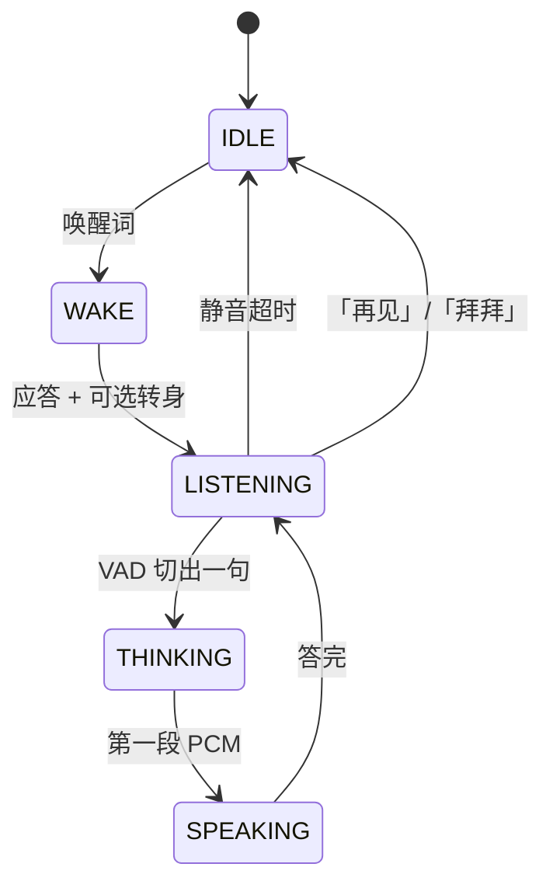
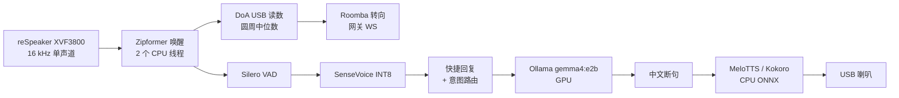

# VoiceButler：在 Jetson Orin NX 16GB 上跑通离线中文语音对话

> **NVIDIA Jetson 2026 开发者征文**
>
> **项目开发周期：2026 年 8 月**（在已经跑着 [Roomba-VLLM](/docs/hackathons/2026/roomba-vllm) 和 [PanoTwin](/docs/projects/2026/panotwin-jetson-x5) 的同一台 Roomba + Orin NX 上，新做的语音栈）
>
> **运行平台：NVIDIA Jetson Orin NX 16GB（reComputer J4012）· JetPack 6.2 · 语音在 CPU，LLM 在 GPU，不依赖云端**

<div class="photo-pair">
  
  
</div>

这是我在给一台已经装着 VLM、深度服务、三个 PyTorch 虚拟环境的 Jetson 接上中文嘴巴之前，希望有人写给我的东西。它是一份 **正在跑着的生产流水线教程**，不是 ASR 论文综述。下面每一级今天都在这块板上工作。

---

## 项目速览

| 字段 | 内容 |
|------|------|
| **项目** | VoiceButler — 家用机器人的离线语音对话 |
| **一句话** | 喊唤醒词，车转向你，听懂普通话，本地回答，还能背课文 |
| **状态** | 2026 年 8 月 28 日仍在 Orin NX 上运行 |
| **硬件** | Jetson Orin NX 16GB + Seeed reSpeaker Flex（XVF3800）+ USB 喇叭 + Roomba 底盘 |
| **语音栈** | [sherpa-onnx](https://github.com/k2-fsa/sherpa-onnx) 1.13：Zipformer 唤醒 + Silero VAD + SenseVoice 识别 + MeloTTS（Kokoro 作音质备选） |
| **大脑** | 同一 SoC 上的 Ollama `gemma4:e2b`。视觉/深度已经占着统一内存时，`gemma4:e4b` 会 OOM |
| **保住这台机器的那条规则** | **语音虚拟环境里不准装 PyTorch。** 只用 CPU 上的 ONNX Runtime |

---

## 模块 1：为什么是这套栈，以及它为什么比「调个云 API」难

### 1.1 我真正要的产品

Butler 已经能**看**。 [Attrax 黑客松](/docs/hackathons/2026/roomba-vllm) 之后它能带着相机巡逻；[PanoTwin](/docs/projects/2026/panotwin-jetson-x5) 之后它在长三维记忆。它在家里、在没有人掏手机的时候，仍然不能**说话**。

标准是廉价智能音箱，再抬一档：

1. 靠唤醒词工作，不靠每一声咳嗽。
2. 在厨房里听懂普通话，而不是只在录音棚里。
3. 用一两句口播回答，不要 Markdown。
4. 底盘转到说话的人那边。
5. 调工具（天气、搜索、开车、音乐、课本），不要编。
6. 数据留在局域网。儿童房不是云产品。

### 1.2 现成配方在这块板上死在哪

| 配方 | 在 Orin NX 16GB 上死在哪 |
|------|--------------------------|
| **云端 ASR + 云端 TTS** | 延迟，加上家里一票否决。WAN 挂了它也挂 |
| **GPU 上跑 Whisper large** | 和 Ollama 抢同一份 16 GB。LLM 首 token 变成「先去泡茶」 |
| **日常驾驶 Hugging Face `speech-to-speech`** | 需要一份 Jetson PyTorch。我已经有 `torch 2.11`（PanoTwin）和 `torch 2.8`（DAP）。第三份是毁掉一个晚上的标准姿势 |
| **全天候开着 ASR** | SenseVoice 便宜，但还没便宜到可以全天解码 16 kHz，同时还驻留一个 VLM |
| **让 LLM 心算、默背古诗** | 小模型会发明算术、拼错对仗。所以才有工具 |

活下来的设计是：**用极小的唤醒模型把门，离线识别，GPU 上思考，CPU 上说话，麦克风旁边永远不要出现 PyTorch。**

### 1.3 VoiceButler 是什么

一个 Python 进程（`butler_voice`）整段会话独占麦克风，走状态机：





只有 IDLE 应该 24/7 常驻。它的成本是 Zipformer INT8 的两个 CPU 线程。更重的东西都在唤醒之后才启动。

---

## 模块 2：硬件、内存，以及「不准碰 PyTorch」

### 2.1 这套件

| 部件 | 角色 | 为什么是它 |
|------|------|------------|
| **Jetson Orin NX 16GB**（Seeed reComputer J4012） | CPU/GPU 统一内存、Ollama、整机其余部分 | 8 GB 塞不下 Gemma + 视觉栈。16 GB 是地板，不是奢侈 |
| **Seeed reSpeaker Flex（XVF3800）** | AEC / 降噪 / 波束成形 + **USB 上的声源方位** | 远场厨房麦。DoA 是 vendor control transfer，不是神经网络 |
| **USB 喇叭** | 播放 | 便宜。痛苦在于 XVF3800 **拿不到**它的 AEC 参考信号 — 见模块 8 |
| **Roomba 底盘** | 转向说话人 | 开环差速，走 `ws://127.0.0.1:8000/ws/control` |


音频设备按 **名字子串** 匹配，永远不要按 ALSA 卡号。USB Hub 重新枚举之后，`hw:2` 就是另一件东西。

```text
BUTLER_INPUT_MATCH=XVF3800
BUTLER_OUTPUT_MATCH=USB2.0 Device
BUTLER_SAMPLE_RATE=16000
BUTLER_BLOCK_MS=32
```

整个进程只开一条采集流。XVF3800 开两次会失败；在 KWS 和 ASR 之间关掉它会丢掉开头约 200 ms — 刚好够吃掉「你好」的第一个字。

### 2.2 16 GB 统一内存上的预算

这块板 **没有独立显存**。Ollama、TensorRT 深度、Python 堆全挤在同一份 16 GB 里。

| 常驻 | 住在哪 | 说明 |
|------|--------|------|
| Ollama `gemma4:e2b` | GPU / 统一内存 | 日常驾驶。热启动首 token 约 1.2 s |
| Ollama `gemma4:e4b` | GPU / 统一内存 | 答得更好。**PanoTwin / DAP 也在时不要加载** — OOM |
| SenseVoice INT8 + Zipformer KWS + Silero + Melo | CPU，ONNX Runtime | 不跟 GPU 抢 |
| PanoTwin / DAP（跑起来时） | GPU | 所以语音不准再占 CUDA |

语音虚拟环境 **不要** `--system-site-packages`，**不要** `pip install torch`。如果某份 README 让你 `pip install sherpa-onnx[gpu]`，在这台机器上忽略它。

我另外留了一个 `hf-s2s-env`，里面是 Jetson PyTorch，专门拿 Hugging Face `speech-to-speech` 做实验。那是实验室，不是生产。它也不能和 VoiceButler 抢麦克风。

### 2.3 磁盘上的模型（约 1.2 GB）

全部来自官方 [sherpa-onnx releases](https://github.com/k2-fsa/sherpa-onnx/releases)：

| 模型 | 干什么 |
|------|--------|
| `sherpa-onnx-kws-zipformer-gigaspeech-3.3M-2024-01-01` | 英文 BPE 关键词检出 |
| `silero_vad.onnx` | 端点检测 |
| `sherpa-onnx-sense-voice-zh-en-ja-ko-yue-2024-07-17` | 多语种识别，我们钉死 `language=zh` |
| `vits-melo-tts-zh_en` | 生产 TTS（这块板上快于实时） |
| `kokoro-multi-lang-v1_1` | 中英音质更好，更慢（6 线程 RTF 约 1.2） |

拉一次，已存在就跳过：

```bash
./scripts/fetch_models.sh
```

---

## 模块 3：一级一级做 — 真正的流水线

按这个顺序做。每一级都可以单独测。不要从 LLM 开始。

### 3.1 唤醒词（KWS）

GigaSpeech Zipformer 是 **英文 BPE** 模型。关键词文件 **不是** 明文。`"HEY BOSS"` 会变成：

```text
▁HE Y ▁BO S S
```

用模型自带的 `bpe.model` 跑 SentencePiece：

```bash
./s2s-env/bin/python scripts/make_keywords.py \
  "HEY BOSS" "HEY BOT" "YO BUTLER" "HEY ROOMIE" "HEY DUSTY" "HEY JARVIS"
```

同一行可以追加每个词的 score（`:`）和 threshold（`#`）。运行时旋钮：

| 环境变量 | 车上的值 | 含义 |
|----------|----------|------|
| `BUTLER_KWS_THRESHOLD` | `0.10`（调过；库默认 0.25） | 越低越好唤醒，也越多误触发 |
| `BUTLER_KWS_SCORE` | `1.5` | 给列表里短语加分 |
| `BUTLER_KWS_THREADS` | `2` | 后面 TTS 还要核 |

命中之后 **重置 KWS 流**，同一句不能立刻再触发。然后离开 KWS。进入对话后，ASR 接着吃麦克风缓冲。

中文唤醒需要中文 KWS 模型。不要把「小爱同学」塞进英文 BPE 然后指望它工作。

现场探测：

```bash
./s2s-env/bin/python scripts/test_wake.py --threshold 0.15 --score 2.0
```

### 3.2 声源方位，然后转身


XVF3800 的方位角是 USB vendor 控制传输（`resid=20`，`cmdid=18`）：状态字节 + `uint16` 角度 + 是否有语音。没有神经网络，不占 GPU。

两个坑：

1. **0/360 环绕。** `[355, 358, 2, 5]` 的线性中位数大约是 180 — 车会背对着你。用 **圆周中位数**：先把圆周均值挪到 180°，再取普通中位数，再挪回来。
2. **安装偏置。** 芯片上的「零」不是底盘上的「正前方」。站在车正前方读方位角，写入 `BUTLER_DOA_OFFSET_DEG`。如果它总往反方向转，设 `BUTLER_DOA_SIGN=-1`。

在唤醒附近开一个窗口（前 0.2 s、后 0.5 s）做估计，然后 **后台线程** 转身，同时播放唤醒应答（`嗯？` / `在呢。`）。用户应该先听到应答，轮子随后转完。

转向是轮距运动学的 **开环**。地毯打滑需要 `BUTLER_ROOMBA_TURN_CAL = 指令角度 / 实测角度`。下发 90°，用直角量一下，再更新。

```bash
./s2s-env/bin/python scripts/test_turn.py --watch
./s2s-env/bin/python scripts/test_turn.py --degrees 90
```

### 3.3 先 VAD，再 SenseVoice（不是流式 ASR）

sherpa-onnx 里的 SenseVoice 是 **离线** 的：你交给它一整句。Silero VAD 负责切端点。

| 旋钮 | 生产值 | 作用 |
|------|--------|------|
| `BUTLER_VAD_THRESHOLD` | `0.5` | 语音概率阈值 |
| `BUTLER_VAD_SILENCE_S` | `0.45` | 句尾静音多久算说完（库默认 0.6 感觉拖沓） |
| `BUTLER_VAD_MIN_SPEECH_S` | `0.25` | 滤掉点击 |
| `BUTLER_VAD_MAX_SPEECH_S` | `15` | 硬上限，免得电视占着不放 |

这块 Orin NX、JetPack 6.2.1 上测到：**SenseVoice RTF 0.058**（4 个 CPU 线程）。两秒的句子远低于 150 ms 就能转写完。这就是 ASR 可以留在 CPU 上的原因。

语言钉在 `zh`，打开逆文本正则。SenseVoice 偶尔仍会吐英文 token；后面整条栈按「普通话优先」来接。

### 3.4 LLM 之前的三扇门

本地 2B 模型是回路里最慢、也最不值得信任的一段。封闭形式的话，绕开它。

**1. 快捷回复。** `你好` / `hi` / `在吗` 映射到 **缓存好的** TTS 片段。第一段音频是毫秒级，不是一次 GPU 往返。启动时预热 `你好`、`好的`、唤醒应答和告别。

**2. 意图路由。** 正则 + 几个解析器，**先于** tool-calling JSON：

| 用户说 | 工具 | 为什么不交给 LLM |
|--------|------|------------------|
| `前进半米` / `左转` | `robot_control` | 开车不能等一个可能只说「好的」然后原地不动的 2B 模型 |
| `我是小学生` | `student_mode` | 会话开关，不是聊天话题 |
| `三点五乘以七` | `calculate` | 小模型会发明算术 |
| `今天天气` / `帮我搜一下…` / `开始巡逻` / `放首歌` | 天气 / 搜索 / 巡逻 / 音乐 | 要有根据 |

ASR 噪声也写进匹配器：`是小学生`（丢了「我」）仍然进学习模式；`木江吟` 仍然能找到《暮江吟》。

**3. 告别。** `再见` / `拜拜` / `退下` 播一句现成的，**清空对话历史**，回到 IDLE。

剩下的才进 Ollama。

### 3.5 LLM：边流边切边说 — 不要等整段段落

Ollama 走 OpenAI 兼容的 `/v1/chat/completions`，再用原生 `/api/chat` 管 `keep_alive`。

Gemma 4 上真正关键的设置：

```text
BUTLER_LLM_MODEL=gemma4:e2b
BUTLER_LLM_REASONING=none
BUTLER_LLM_KEEP_ALIVE=-1
BUTLER_LLM_MAX_TOKENS=256
BUTLER_LLM_HISTORY_TURNS=6
```

- **`reasoning=none`。** Gemma 4 默认先想再答。256 token 的预算会被思考吃光，喇叭一直安静。
- **`keep_alive=-1`。** Ollama 默认 5 分钟驱逐。这块板冷加载大约 **25 秒**。钉住模型，隔几分钟 ping 一次，让它留在内存里。
- **系统提示** 必须禁止列表、Markdown 和表情，并且要求短口语句子。TTS 是一根管子，不是幻灯片。

只开流式还不够。Gemma 经常用 **空格** 而不是 `。` 切开中文。`pop_speakable()` 把这些当作可播边界：

- `。！？!?；;` 和换行是硬切
- **汉字之间** 的逗号或空白也切
- 大约 22 个汉字的硬上限，让 Melo/Kokoro 能开工

三条线程：

1. 把 LLM 块推进文本队列。
2. 把每一段可播文本合成进音频队列。
3. 主线程一旦有第一段 PCM，立刻写到 USB 喇叭。

这就是「1.2 秒开始出声」和「等完整段话再做一次 TTS」的差别。

路由没拦住的工具调用，仍然走同一个客户端上的 OpenAI 风格 `tools=`。允许 2B 模型调 `calculate` / `student_tutor` / `get_weather`；提示词要求必须调的时候，不允许它跳过。

### 3.6 TTS：生产用 Melo，货架上放着 Kokoro

| 引擎 | 这块板上的 RTF | 用途 |
|------|----------------|------|
| **MeloTTS zh_en**（INT8 VITS） | **约 0.88** | 生产。快于实时，普通话够用 |
| **Kokoro multi-lang v1.1** | **约 1.2**（6 线程，24 kHz） | 中英都更好。等得起就设 `BUTLER_TTS_ENGINE=kokoro` |

LLM 热起来之后，TTS 是最慢的一环。把 `BUTLER_TTS_THREADS` 加高 — LLM 占着 GPU，CPU 核是闲的。缓存短于约 24 字的片段（问候、好的）。模型仍会偷偷夹带 `[]《》：`，合成前剥掉，否则喇叭会把标点读出来。

整栈加载（KWS + ASR + TTS）：大约 **11 秒**。开机做一次，不要每次唤醒都做。

---

## 模块 4：工具，以及把 `pypdf` 打崩的课文辅导

### 4.1 工具面

只会聊天的音箱没有用。注册表故意很小：

| 工具 | 根据 |
|------|------|
| `robot_control` | 网关 websocket，和底盘其余部分同一条路 |
| `start_patrol` | 已有巡逻服务 |
| `get_weather` | 真实天气 API，默认城市深圳 |
| `web_search` | 在线搜索，最多 3 条，口播摘要 |
| `music_control` | 本地文件；**TTS 期间暂停**，两条流水线不要抢 USB 喇叭 |
| `calculate` | 解析表达式后 Python 求值，不是 LLM |
| `home_status` | 配了 Home Assistant 就查；否则老实承认还没接上 |
| `student_mode` / `student_tutor` | 会话 + 课本索引 |

### 4.2 背古诗失败是解析问题，不是向量模型问题

我把义务教育小学课本（ChinaTextbook）编进 SQLite FTS。第一次：`pypdf` + 480 字切块。然后机器人把拼音注音和注释当成诗句来背。

这些 PDF 是 **电子版**，不是扫描件。两个地雷：

1. **拼音注音** 在真正的字体里（`HanyuXi-JZ`），ToUnicode 是垃圾（`tWng`、`jKng`）。`pypdf` 把它们倒进正文。
2. **双栏。** 注释在 **右侧**。按页宽一半切开，会偷走标题最后一个字（`九月九日忆山东兄`），或者把注释焊进诗里。

修法是 PyMuPDF 的版面解析：

1. 丢掉拼音字体、脚注标记字号的 span。
2. 在 **注释左边缘** 分栏，不是在页面正中。
3. 把剩下的行收成语义单元：诗 / 注释 / 正文 / 目录。跳过目录和写字表。
4. 索引这些单元。背诵走诗单元，不走滑窗。

把名篇写死在代码里是很诱人的补丁。下一册它就失效。去解析书。

仍然坏着的、需要老实说的： **一年级下册的诗是纯图**（没有文字层），和部分科学扫描件一样。下一步是 OCR，不是假装换一个更强的 embedding。结构干净的 FTS 已经能报出三年级上册 7 首，并且背《山行》时不再混进注释。

口播列表最多六首，再加「还有 N 首」。追问（`第一首`、`还有`、`谁写的`）走会话状态，不是每次从头搜。

---

## 模块 5：在 Jetson 上从零拉起来（照抄）

假定已经是 JetPack 6.2、Python 3.10、Ollama 在提供 `gemma4:e2b`。

```bash
python3 -m venv s2s-env          # 故意不要 --system-site-packages
./s2s-env/bin/pip install -r requirements.txt
# sherpa-onnx、sounddevice、fastapi、httpx、pymupdf……
# 这里不要 pip install torch

./scripts/fetch_models.sh
./s2s-env/bin/python scripts/make_keywords.py \
  "HEY BOSS" "HEY BOT" "YO BUTLER" "HEY ROOMIE" "HEY DUSTY" "HEY JARVIS"

sudo cp deploy/udev/99-respeaker-xvf3800.rules /etc/udev/rules.d/
sudo udevadm control --reload-rules
sudo udevadm trigger --attr-match=idVendor=2886
```

`run.sh` 旁边的 `.env`（我车上的值）：

```bash
BUTLER_KWS_THRESHOLD=0.10
BUTLER_KWS_SCORE=1.5
BUTLER_WAKE_ACK=在呢。
BUTLER_TTS_ENGINE=melo
BUTLER_TTS_SPEED=1.05
BUTLER_VAD_SILENCE_S=0.45
BUTLER_LLM_MODEL=gemma4:e2b
BUTLER_LLM_REASONING=none
```

不说话的自检：

```bash
./s2s-env/bin/python scripts/selftest.py --play
```

日常：

```bash
./run.sh --serve          # 助手 + :8010，给网页 VOICE 页
./run.sh --always-on      # 跳过唤醒（只适合台架 — 全天烧 ASR）
./run.sh --no-roomba --no-doa
```

手机 UI 是现成的 Roomba-VLLM 网页，**VOICE** 页：实时唤醒命中、VAD 滑条、DoA 罗盘、90° 转向标定、TTS 音色选择。旋钮写回 `.env`。

---

## 模块 6：这块 Orin NX 16GB 上的实测（JetPack 6.2.1）

没有测过的数字我不会编。下表来自正在跑的机器。

| 环节 | 开销 |
|------|------|
| SenseVoice 识别 | RTF **0.058**（4 个 CPU 线程） |
| `gemma4:e2b` 首 token | 热 **约 1.2 s**，冷 **约 25 s** |
| MeloTTS | RTF **约 0.88** |
| Kokoro v1.1 `sid=3` | RTF **约 1.2**（6 线程，24 kHz） |
| 进程启动时加载模型 | 合计 **约 11 s** |

首 token 之后如果仍觉得拖，先看 TTS 线程数，不要先换更大的 LLM。更大的 `e4b` 在这块 16 GB 板上、机器人其余部分已经加载时，起不来 — 它会 OOM。

---

## 模块 7：标定实验室（演示前先做这些）

一台没法标定的语音机器人是科幻展板。同一进程托管三种实验室模式，这样就不必再加载一份模型。

1. **KWS 实验室** — 喊唤醒词，看命中，拖阈值。停在「水壶不会唤醒、正常 Hey Boss 会唤醒」。
2. **VAD 实验室** — 说一句话，拖静音毫秒。太低：切开「谢谢」。太高：像客服一样干等那 0.6 秒。
3. **DoA 实验室** — 站在正前方，点「当前方向 = 正前方」，再走四分之一圈看罗盘。
4. **转向实验室** — 下发 90°，实测，写入 `BUTLER_ROOMBA_TURN_CAL`。

在地毯上做，不要在桌上做。运动学在长毛地毯上会撒谎。

---

## 模块 8：已知限制（抄架构之前先读）

**半双工。** XVF3800 从未把 USB 喇叭当作 AEC 参考，所以 Butler 说话时麦克风被忽略。插话需要把这条参考接上，或者做我还没做的 loopback。

**开环转向。** 我们这条路径没有轮速反馈。换地板要重新标定。

**一只 USB 喇叭。** 旧的 GStreamer 音频页和这个进程不能同时播。

**英文唤醒，中文对话。** 唤醒词是 GigaSpeech 英文。对话是普通话。这是模型限制，不是产品偏好。

**纯图课文页。** 索引里还没有 OCR。不要对孩子说扫描页上「没有」咏鹅 — 解析器根本没看见字形。

**没有插话、没有声纹、没有多人分离。** 一次一段对话，静音 12 秒回到 IDLE（`BUTLER_CONV_TIMEOUT_S`）。

---

## 模块 9：我会寄给昨天的自己的教训

**1. 虚拟环境是安全装置，不是品味。** 这台机器人上的语音是 ONNX + numpy。`torch` 一旦进 `s2s-env`，你总有一天会 `pip install` 一个轮子，把深度服务需要的 Jetson PyTorch 盖掉。把 venv 建干净。

**2. 第一段音频胜过最好的音频。** 缓存的「你好」、流式断句、22 字中文上限，对「它活着」的贡献，比把 Melo 换成 Kokoro 更大。

**3. 路由先于工具，工具先于 LLM。** 2B 模型上的 tool-calling 是兜底。开车、算术、「我是小学生」不能指望模型碰巧吐 JSON。

**4. 版面就是检索。** 索引里如果是拼音注音，换 embedding 也救不了背诵。先修 PDF 解析。

**5. 钉住 LLM，否则你就得承认那 25 秒的坑。** `keep_alive` 和预热 ping 是语音体验的一部分。

**6. 给声卡起名字，不要记它的编号。** 未来那个拔掉 Hub 的你会感谢现在的你。

---

## 模块 10：它和 PanoTwin 怎么挤在同一块板上

VoiceButler 是 **耳朵和嘴巴**。PanoTwin 是 **带尺度的记忆**。Roomba-VLLM 是 **眼睛和巡逻**。它们共用一块 Orin NX，这正是语音栈被禁止碰 CUDA 的原因。

下一步我会按这个顺序做，而不是按论文好看的顺序：

1. 把 USB 喇叭的 AEC 参考接到 XVF3800，然后才做插话。
2. 给纯图课文页上 RapidOCR。
3. 可选的中文 KWS，让唤醒词也能是普通话。
4. 这之后才考虑更大的 LLM，而且仅当 PanoTwin 不同时驻留。

插话做通之前，机器人会把话说完。那是硬件接线问题，被打扮成 NLP 问题。我把它标对了。

---

## 参考

- [sherpa-onnx](https://github.com/k2-fsa/sherpa-onnx) — 唤醒、VAD、SenseVoice、Melo、Kokoro，全部 CPU ONNX
- [SenseVoice](https://github.com/FunAudioLLM/SenseVoice) — 多语种识别
- [Silero VAD](https://github.com/snakers4/silero-vad)
- [Ollama](https://ollama.com/) — Jetson 上的本地 Gemma 4
- [Roomba-VLLM](/docs/hackathons/2026/roomba-vllm) — 这张嘴巴拧上去的底盘
- [PanoTwin](/docs/projects/2026/panotwin-jetson-x5) — GPU 为什么已经很忙
