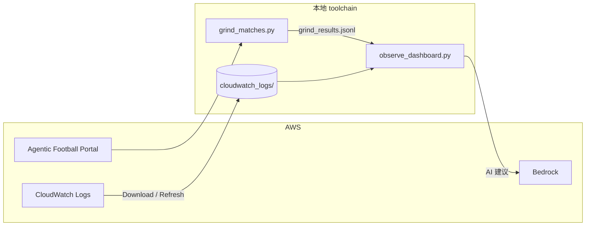

# Agentic Football Cup 72 小时前测 — 从 Harness 到本地可观测 toolchain

**时间**：2026 年 7 月 3 日 16:00 — 7 月 6 日 16:00（72 小时）  
**组织**：亚马逊云中国 User Group 社区  
**目的**：为即将在北京举办的第一届 **Agentic Football Cup 北京 UG Workshop** 提前踩坑、验证流程  
**收尾**：7 月 5 日 20:00 直播分享前测成果  
**开源仓库**：[sample-ai-possibilities / agentic-football-sample-agents](https://github.com/peterpanstechland/sample-ai-possibilities/tree/football-workshop/agentic-football-sample-agents)（分支 `football-workshop`）

---

## 背景：什么是 Agentic Football Cup Workshop？

[Agentic Football Cup](https://catalog.workshops.aws/agentic-football-cup/en-US) 是 AWS 团队开发的 **寓教于乐** 工作坊，帮助用户快速体验 **Amazon Bedrock AgentCore**、**CloudWatch** 等 Agentic AI 相关能力。

在比赛中，你需要为 11 名 AI 球员编写决策逻辑，让他们在 2D 像素风球场上自动对战。Workshop 提供三种创建 Agent 球员的路径：

| 方式 | 适合人群 | 特点 |
|------|----------|------|
| **AgentCore Harness（全图形化）** | 零基础、快速体验 | 浏览器内拖拽配置，无需本地环境 |
| **CloudShell** | 已有 AWS 账号、不想装本地工具 | 云端终端一键部署 |
| **本地部署（Kiro 等 IDE 辅助）** | 想深度定制、扩展玩法 | 本地开发 Agent 代码，上传到 AgentCore Runtime |

本次前测我先后体验了 **Harness** 与 **本地部署**。Harness 适合「先跑通一局」；选定方向后，我转向本地部署——因为它能打开更多可能性：可观测平台、热力分析、AI 改码建议、Override 战术、Playwright 自动刷赛等。

---

## 时间线

```mermaid
timeline
    title 72 小时前测
    7/3 16:00 : Workshop 启动
              : Harness 快速跑通部署
              : 切换本地部署 + Kiro 辅助
    7/4-7/5   : 可观测 Dashboard 开发
              : CloudWatch 日志分析
              : Override 大力抽射 / 提示词调优
              : Playwright 批量刷赛
    7/5 20:00 : 社区直播分享前测成果
    7/6 16:00 : 前测正式结束
```

---

## 第一阶段：Harness 快速验证

先用 **AgentCore Harness** 在浏览器里创建并部署 Agent 球员，确认：

- AgentCore Runtime 能正常接收对战请求
- Portal 能发起比赛并看到 DECISION 日志
- 基本 prompt / fallback 流程可用

这一步大约 1–2 小时即可跑通，为后续本地开发建立心智模型。

---

## 第二阶段：本地部署与游戏机制理解

切换到本地部署后，我们开始认真读 Workshop 代码与对战机制。核心发现：

### 2 秒一个 Tick

比赛以 **每 2 秒一个 tick** 推进。每个 tick 各队 11 名球员依次调用 Agent 做决策（移动、传球、射门等）。理解这个节奏后，调 prompt 和 fallback 才有抓手——不是「一句话定胜负」，而是 **120 tick（约 4 分钟）** 内的持续博弈。

### Override：大力抽射

在 `overrides/` 目录下，我们为前锋增加了 **大力抽射（blast shot）** 逻辑：当球员进入射门区域且角度合适时，提高射门力度与优先级。实测显著增加了进球与胜率。

### 提示词与 Fallback 调优

- **Prompt**：强调前锋压上、中场衔接、后卫盯人，减少无效横传
- **Fallback**：当 LLM 超时或返回非法动作时，用确定性规则兜底（例如后卫清球、门将抱球）
- 多场比赛对比 CloudWatch 日志后，决策稳定性明显提升

### 按位置换模型

尝试为不同角色配置不同 Bedrock 模型，例如：

- **前锋 / 中场**：`amazon.nova-2-lite-v1:0`（推理稍强）
- **后卫 / 门将**：`amazon.nova-micro-v1:0`（延迟更低、成本更省）

在 tick 预算内，门将需要更快响应，这个拆分是有效的经验。

---

## 第三阶段：可观测平台与数据分析

本地部署的最大收益，是能把 **CloudWatch 日志** 和 **Portal 赛果** 拉下来做分析。我们开源了一套 **Agentic Football 可观测 toolchain**（见仓库 `agentic-football-sample-agents/`）。

### 架构概览



### 三个页面

1. **Decisions（决策流）** — 实时或本地缓存的 DECISION 日志，按 tick 浏览  
2. **Analytics（分析）** — 比赛列表、比分、控球、进球时间线、**按角色着色的球员热力图**  
3. **Settings（设置）** — AWS 凭证、一键 **Download CloudWatch data** 到本地

#### Portal 对战与排行榜


#### 可观测 — Live 与 Training 对比


Dashboard 主页按 tick 展示 DECISION 日志，可区分 **Live 对战** 与 **Training 练习** 两种模式的数据。

#### 分析页 — 选择比赛


#### 球员热力图（按角色配色）


热力图基于 CloudWatch 中球员坐标聚合；**GK / DEF / MID / FWD** 用不同颜色区分，一眼看出阵型是否前压、边后卫是否回追。

#### AI 改码建议


Analytics 页会调用 Bedrock，根据当前比赛的 DECISION 样本生成 **Modification suggestions**，辅助下一轮 prompt / override 迭代。

#### 设置页 — 本地 CloudWatch 缓存


默认 **本地优先**：启动 Dashboard 时读 `cloudwatch_logs/`，不每次打 CloudWatch API。需要增量同步时，在 Settings 点 **Download CloudWatch data**，或主页点 **Refresh data**。

### 多场比赛拆分

连续用 Playwright 刷多场时，CloudWatch 里 DECISION 的 `t`（比赛时钟）**不会在局间重置**，早期分析会把多场合成一场「超级长比赛」。我们在 `lib/match_analytics.py` 里用 **`grind_results.jsonl` 的时间窗口** 做切分，Analytics 下拉框才能正确显示 2-1、2-6、3-5 等独立场次。

---

## 第四阶段：Playwright 自动刷赛

[`grind_matches.py`](https://github.com/peterpanstechland/sample-ai-possibilities/blob/football-workshop/agentic-football-sample-agents/grind_matches.py) 用 Playwright 驱动 Portal：**自动发起多场比赛**，把比分、时长写入 `grind_results.jsonl`，供 Analytics 关联日志。


### 教练喊话注入（实验中 ⚠️）

我们还尝试在比赛进行中，用 Playwright **向 Portal 注入「教练喊话」类提示词**，想模拟中场战术调整。目前 **尚未成功**，可能与 Portal 前端交互方式或 tick 窗口有关，需要更多测试。欢迎社区一起 PR。

---

## 安装与使用教程

以下命令在 **Windows PowerShell** 下验证；macOS / Linux 将路径中的 `\.venv\Scripts\` 换成 `bin/` 即可。

### 1. 克隆仓库

```powershell
git clone -b football-workshop https://github.com/peterpanstechland/sample-ai-possibilities.git
cd sample-ai-possibilities/agentic-football-sample-agents
```

### 2. Python 环境与依赖

```powershell
python -m venv .venv
.\.venv\Scripts\Activate.ps1
pip install -r requirements-observability.txt
playwright install chromium
```

### 3. 配置 AWS

复制环境变量模板并填写 Workshop 分配的 **Team Code**：

```powershell
copy .env.example .env
# 编辑 .env：AAFC_TEAM_CODE=你的队伍代码
```

或在 Dashboard **Settings** 页填写 Access Key / Secret Key / Region（会写入 `~/.aws/credentials` 的 `aafc-workshop` profile）。

### 4. 启动可观测 Dashboard

```powershell
$env:AWS_DEFAULT_REGION = "us-east-1"
.\.venv\Scripts\python.exe observe_dashboard.py --prefix agg_ --minutes 180 --port 8777
```

浏览器打开：**http://127.0.0.1:8777/**

| 路径 | 说明 |
|------|------|
| `/` | Decisions 决策流 |
| `/analytics` | 比赛分析 + 热力图 + AI 建议 |
| `/settings` | AWS 凭证 + 下载 CloudWatch |

首次建议在 Settings 点击 **Download CloudWatch data**，之后分析页加载会快很多。

### 5. 批量刷赛（可选）

```powershell
$env:AAFC_TEAM_CODE = "你的队伍代码"
.\.venv\Scripts\python.exe grind_matches.py --count 5
```

刷完后回到 Analytics，下拉框应出现对应场次（需本地已有 DECISION 日志或刚同步过 CloudWatch）。

### 6. 更多细节

仓库内 [`docs/OBSERVABILITY.md`](https://github.com/peterpanstechland/sample-ai-possibilities/blob/football-workshop/agentic-football-sample-agents/docs/OBSERVABILITY.md) 包含架构图、环境变量表、FAQ（VPN / Bedrock 403、多场比赛拆分等）。

---

## 与 2026 AWS 上海 Summit 的渊源

这不是我第一次接触 Agentic Football Cup。在 **2026 AWS 上海 Summit** 上，我用 Harness 方式参加过现场比赛，也有幸与 **游戏作者** 交流并合影——那次更多是「体验一下有多好玩」。


这次 72 小时前测则是 **系统性踩坑**：从 Harness 到本地部署、从单场到批量刷赛、从看日志到热力图与 AI 建议。如果上海 Summit 是「入门体验」，这次就是为 **北京 UG Workshop** 准备的「教练手册 + 工具链」。

---

## 总结

| 收获 | 说明 |
|------|------|
| AgentCore 全流程 | Harness 部署 → 本地 Agent → Runtime 对战 |
| 游戏机制 | 2s/tick、Override、按角色选模型 |
| 可观测性 | CloudWatch DECISION → 本地缓存 → Dashboard |
| 数据驱动调优 | 热力图、控球/进球报告、Bedrock 改码建议 |
| 自动化 | Playwright 刷赛；教练喊话仍待验证 |
| 社区 | 72 小时前测 + 7/5 直播，为北京 Workshop 铺路 |

**玩得很开心，也实实在在学到了 AgentCore 相关业务。** 如果你准备参加北京或线上的 Agentic Football Cup Workshop，欢迎直接使用我们的 [开源 toolchain](https://github.com/peterpanstechland/sample-ai-possibilities/tree/football-workshop/agentic-football-sample-agents)，Issue / PR 都敞开。

---

*亚马逊云中国 UG · Agentic Football Cup 前测小组 · 2026 年 7 月*
