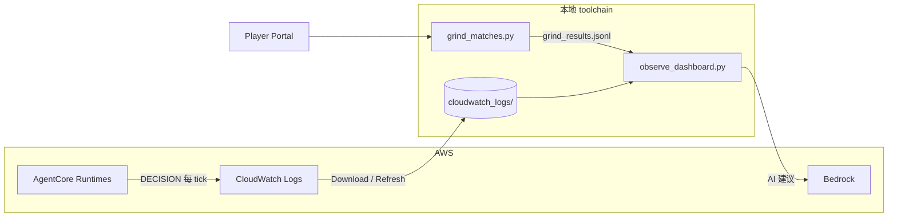

# Agentic Football Cup 72 小时前测 — 从 Harness 到本地可观测 toolchain

**时间**：2026 年 7 月 3 日 16:00 — 7 月 6 日 16:00（72 小时）  
**组织**：亚马逊云中国 User Group 社区  
**目的**：为即将在北京举办的第一届 **Agentic Football Cup 北京 UG Workshop** 提前踩坑、验证流程  
**收尾**：7 月 5 日 20:00 直播分享前测成果  
**开源仓库**：[sample-ai-possibilities / agentic-football-sample-agents](https://github.com/peterpanstechland/sample-ai-possibilities/tree/football-workshop/agentic-football-sample-agents)（分支 `football-workshop`）

---

## 背景：什么是 Agentic Football Cup Workshop？

[Agentic Football Cup](https://catalog.workshops.aws/agentic-football-cup/en-US) 是 AWS 团队开发的 **寓教于乐** 工作坊：通过一场 2D 像素风足球赛，让你快速上手 **Amazon Bedrock AgentCore**、**CloudWatch** 等 Agentic AI 相关服务。

比赛为 **5v5** 制，每队 5 个位置：**GK（门将）/ DEF（后卫）/ MID（中场）/ FWD1、FWD2（双前锋）**。关键在于——**每名球员就是一个独立部署在 AgentCore Runtime 上的 Agent**：它有自己的提示词、自己的模型、自己的 fallback 规则，每个决策 tick 被独立调用。你不是在「玩游戏」，而是在**同时运维 5 个生产环境里的 Agent**。

Portal 还把 AgentCore 的能力做成了游戏化任务：奖杯墙对应 **Runtime、Memory、Code Interpreter、Browser、Identity、Gateway、Observability、Bedrock、Guardrails、Evaluations** 十项能力，做每日任务攒 XP 升级。玩着玩着，AgentCore 的产品版图就摸清了。

Workshop 提供三种创建 Agent 球员的路径：

| 方式 | 适合人群 | 特点 |
|------|----------|------|
| **AgentCore Harness（全图形化）** | 零基础、快速体验 | 浏览器内配置提示词与模型，无需本地环境 |
| **CloudShell** | 已有 AWS 账号、不想装本地工具 | 云端终端一键部署 |
| **本地部署（Kiro 等 IDE 辅助）** | 想深度定制、扩展玩法 | 本地开发 Agent 代码，上传到 AgentCore Runtime |

本次前测我先后体验了 **Harness** 与 **本地部署**。Harness 适合「先跑通一局」；选定方向后，我转向本地部署——因为它能打开更多可能性：可观测平台、热力分析、AI 改码建议、Override 战术、Playwright 自动刷赛等，这些玩法后文逐一展开。

---

## 时间线

```mermaid
timeline
    title 72 小时前测
    7/3 16:00 : Workshop 启动
              : Harness 快速跑通部署
              : 切换本地部署 + Kiro 辅助
    7/4-7/5   : 可观测 Dashboard 开发
              : CloudWatch 日志分析
              : Override 大力抽射 / 提示词调优
              : Playwright 批量刷赛
    7/5 20:00 : 社区直播分享前测成果
    7/6 16:00 : 前测正式结束
```

---

## 第一阶段：Harness 快速验证

先用 **AgentCore Harness** 在浏览器里创建并部署 Agent 球员：填好球员提示词、选好模型，点部署即可生成 Runtime，全程不碰本地环境。用它确认了三件事：

- AgentCore Runtime 能正常接收对战请求
- Portal 能发起比赛并在 CloudWatch 看到 DECISION 日志
- 基本 prompt / fallback 流程可用

这一步大约 1–2 小时即可跑通，为后续本地开发建立心智模型。如果你只想「先感受一下」，Harness 就够了；想继续往下折腾，就切本地。

---

## 第二阶段：本地部署，读懂游戏机制

### 一支球队 = 5 个独立 Agent

本地部署后，「我的球队」页把这套结构展示得很直白：每张球员卡都绑定一个 AgentCore Runtime 的 **Agent ARN**，实时显示调用次数、Token 消耗、响应延迟和赛前体检结果。


几个值得注意的细节：

- **阵型可配**（截图中为 1-2-1）：五个位置各由一套系统提示词定义职责，改阵型就是改提示词组合
- **延迟就是战斗力**：截图里 GK 93ms、DEF 123ms、MID 107ms——延迟太高的球员会错过决策窗口，直接影响比赛表现
- 仓库里有多套风格的队伍模板：`ai-team-strands-balanced`（均衡）、`extremely-aggressive`（激进）、`extremely-defensive`（龟缩）、`gateway`、`memory`，用 `deploy-wsl.sh` 一键部署整队

### 比赛怎么跑：约 2 秒一个 tick

比赛时钟约 **120 秒**，每 ~2 秒推进一个 **tick**。每个 tick，5 名球员各自调用一次自己的 Agent，返回一条指令：

`MOVE_TO`（跑位）/ `PASS`（传球）/ `SHOOT`（射门）/ `MARK`（盯人）/ `SLIDE_TACKLE`（铲球）/ `PRESS_BALL`（逼抢）/ `INTERCEPT`（拦截）/ `GK_DISTRIBUTE`（门将分球）/ `CLEAR`（解围）……

一场比赛全队合计 **300–600 次 Agent 调用**。响应超过 ~900ms 就有超时风险，游戏会转用规则 fallback 兜底——所以「提示词写得好」和「响应回得快」同样重要。


对战画面信息量很足：实时比分与时钟、逐球员名牌、右下角战术小地图，底部还有 AI 生成的实时解说。注意左下角那个 **教练喊话输入框**——比赛进行中可以给全队下达自然语言战术指令，这个入口后文 Playwright 实验还会提到。


### 赛后报告与「幕后故事」

每场比赛结束后，Portal 会给出两层报告。第一层是全场比分页：MVP、最快 Agent、控球率、射门/射正与进球时间线。


第二层是 **幕后故事（Behind the Scenes）**——这是给 Agent 开发者看的复盘报告：AI 生成的比赛摘要与进球叙事、两队 **指令分布对比**（每队 Agent 这场都下了什么指令）、以及**各位置的响应延迟与成功率**。


这份报告非常有用：上图这场 2-6 惨败里，我方 DEF 平均延迟飙到 **1227ms**（对面全队都在 400–700ms），而且我方 947ms 平均响应明显慢于对手的 568ms——**输球先输在延迟**。这直接引出了我们后面的两个动作：换更快的模型、做自己的可观测平台。

### Override：大力抽射

游戏允许在 Agent 代码里做 **确定性 override**——不经过 LLM、由代码直接接管的战术动作。我们给前锋加了 **大力抽射（blast shot）**：进入射门区域且角度合适时，代码直接下 `SHOOT` 并拉满力度，不给 LLM 犹豫的机会。同类 override 还有 `mark-near`（就近盯人）、`tackle`（抢断）、`hold-line`（保持防线）、`no-chase`（不追无效球）、`support`（接应）等，后面分析页里能看到每种 override 的触发次数。

实测大力抽射显著增加了进球与胜率——LLM 负责「读比赛」，代码负责「扣扳机」，分工明确后稳定性大幅提升。

### 提示词与 Fallback 调优

- **Prompt**：强调前锋压上、中场衔接、后卫盯人，减少无效横传
- **输出格式**：LLM 偶尔会在 JSON 外多话，触发解析失败。我们的观测台后来直接把这类问题做成告警：`parse-fallback 34/255: LLM output drifting from pure JSON — tighten the response format section or lower temperature`
- **Fallback**：LLM 超时或返回非法动作时，用确定性规则兜底（后卫清球、门将抱球等）。但 fallback 也是双刃剑——我们在训练场里就抓到过「全队 0% LLM 决策、实际全程跑规则」的乌龙（见下一章）

### 按位置换模型

延迟数据摆在眼前，很自然的下一步是 **给不同位置配不同的 Bedrock 模型**。我们用 `bench_models.py` 对候选模型做了延迟基准，最终拆分：

- **前锋 / 中场**：`amazon.nova-2-lite-v1:0`（推理稍强，进攻决策质量优先）
- **后卫 / 门将**：`amazon.nova-micro-v1:0`（延迟更低，防守反应速度优先）

门将必须在 tick 窗口内快速回应，这个拆分实测有效。

---

## 第三阶段：可观测平台与数据分析

本地部署的最大收益，是能把 **CloudWatch DECISION 日志** 和 **Portal 赛果** 拉下来做自己的分析。我们为此开发并开源了一套 **可观测 toolchain**（仓库 `agentic-football-sample-agents/`），自带中英双语 UI。

### 架构概览



### 观测台主页：5 个位置卡片 + 延迟散点


主页把每个位置做成一张卡片：tick 数、**LLM 决策占比**、p50/p95 延迟、**代码接管（override）次数**、指令分布，以及自动生成的健康提示，例如：

- DEF 卡片：`parse-fallback 34/255 —— LLM 输出漂移出纯 JSON，建议收紧格式段或调低 temperature`
- GK 卡片：`GK 从未使用 GK_DISTRIBUTE —— 分球优先级可能没有生效`

下方是 **LLM 延迟散点图**（按位置着色，虚线是 900ms 超时风险线——哪个位置的点经常越线一目了然）和全队指令分布。

### 训练场模式与实战对比

Dashboard 支持三种数据源：**实战（CloudWatch）**、**训练场（本地日志）**，以及两者 **同屏对比**。


训练场模式立过大功：上图这次本地训练里，五个位置卡片齐刷刷提示 `only 0% decisions from LLM — the team is effectively playing on rule-based fallback`——**我们以为在测提示词，其实全队在跑规则**。没有可观测平台的话，这种问题几乎无法察觉。


对比模式把每个位置的实战/训练差异做成带增量的表格，指令分布画成双色条形图——改完提示词先在训练场验证，再对照实战数据，迭代节奏就出来了。

### 比赛分析：多场拆分


这里有个必踩的坑：CloudWatch DECISION 日志里的比赛时钟 `t` **不会在局间重置**，连续刷赛时朴素的分析会把十几场合成一场「7000 tick 超级比赛」。我们的解法是用 `grind_results.jsonl`（刷赛脚本记录的每场起止时间）做 **时间窗口切分**，Analytics 下拉框才能正确列出 2-5、2-1、4-5 等独立场次；没有本地日志的场次也会标注「无 CloudWatch 日志」保留比分。

### 球员热力图


热力图基于 DECISION 日志里的球员坐标聚合，可按 **ALL / GK / DEF / MID / FWD1 / FWD2** 过滤。右侧单兵面板给出平均站位、距两侧球门距离、**半场分布**（这名 FWD1 只有 40% 时间在进攻半场）、射正率、override 触发明细和指令分布。

上图的发现很典型：FWD1 的 41 次射门大多发生在 **中圈附近**（红色箭头）——离球门太远，命中率自然惨淡。这一条观察直接转化为下一轮提示词修改：「靠近禁区再射门」。

### AI 改码建议


分析页右上角的 **「AI 修改建议」** 按钮会把当前场次的统计与 DECISION 样本发给 Bedrock，20–40 秒后生成针对性的调参建议（提示词怎么改、哪个位置该换模型、哪类 override 值得加）。分析模型本身也可以切换：Nova 2 Lite（推荐）、Nova Lite、Nova Micro（快）、Claude Sonnet 4.6 / 4.5 / 4、Claude Haiku 4.5、Llama 3.1 8B——顺便还能对比一下不同模型给建议的风格差异，也算是彩蛋玩法。

### 设置页：本地优先的数据策略


Dashboard 采用 **本地优先** 策略：启动时读 `cloudwatch_logs/` 本地缓存，不每次打 CloudWatch API（快、省钱、离线可用）。需要新数据时，在 Settings 点 **下载 CloudWatch 数据**（可选前缀与时间窗），或在主页点 **刷新数据** 增量同步。凭证支持 Workshop 的临时 STS（含 Session Token），只写本机 `~/.aws/credentials`。

不想开浏览器的话，`analyze_match.py` 提供同款终端版逐 Agent 统计。

---

## 第四阶段：Playwright 自动化

### 自动刷赛

数据分析要有数据。手动打一场比赛要点五六次鼠标再等 4 分钟，于是我们写了 [`portal_bot.py`](https://github.com/peterpanstechland/sample-ai-possibilities/blob/football-workshop/agentic-football-sample-agents/portal_bot.py) + [`grind_matches.py`](https://github.com/peterpanstechland/sample-ai-possibilities/blob/football-workshop/agentic-football-sample-agents/grind_matches.py)：Playwright 驱动 Player Portal，自动登录 → 约赛 → 观赛 → 记录比分到 `grind_results.jsonl`，循环 N 场。


72 小时里我们刷出了 **19 场正式比赛**（5 胜 1 平 13 负——胜率 26%，联赛第 5，数据不会说谎，但每一场都变成了训练样本）。仓库里还有一个更激进的 `autopilot.py`：**约赛 → 拉日志 → 分析 → 调参 → 重部署** 全自动闭环，感兴趣可以直接看代码。

### 教练喊话注入（实验中 ⚠️）

还记得对战画面左下角的 **教练喊话框** 吗？我们尝试用 Playwright 在比赛进行中自动注入战术指令（比如落后时喊「全员压上」），把「中场调整」也自动化。目前 **尚未成功**——疑似与喊话输入的前端事件绑定或 tick 生效窗口有关，需要更多测试。欢迎社区一起 PR。

---

## 安装与使用教程

以下命令在 **Windows PowerShell** 下验证；macOS / Linux 将路径中的 `\.venv\Scripts\` 换成 `bin/` 即可。

### 0. 前置条件

| 工具 | 要求 | 用途 |
|------|------|------|
| Python | 3.10+ | 运行 Dashboard 与脚本 |
| AWS 凭证 | Workshop 临时 STS 或长期凭证 | 读 CloudWatch、调 Bedrock |
| Team Code | Workshop 分配 | Playwright 约赛需要 |
| 已部署的队伍 | 见仓库 README 1–5 节 | 没有 Agent 就没有 DECISION 日志 |

### 1. 克隆仓库

```powershell
git clone -b football-workshop https://github.com/peterpanstechland/sample-ai-possibilities.git
cd sample-ai-possibilities/agentic-football-sample-agents
```

### 2. Python 环境与依赖

```powershell
python -m venv .venv
.\.venv\Scripts\Activate.ps1
pip install -r requirements-observability.txt
python -m playwright install chromium   # 仅刷赛脚本需要
```

### 3. 配置 AWS

```powershell
copy .env.example .env
# 编辑 .env：填入 Workshop STS 凭证与 AAFC_TEAM_CODE
```

或者启动 Dashboard 后在 **Settings** 页填写（写入本机 `~/.aws/credentials`，支持 Session Token）。

### 4. 启动可观测 Dashboard

```powershell
$env:AWS_DEFAULT_REGION = "us-east-1"
.\.venv\Scripts\python.exe observe_dashboard.py --prefix agg_ --minutes 180 --port 8777
```

`--prefix` 是你的 runtime 日志前缀（log group `/aws/bedrock-agentcore/runtimes/agg_*` 对应 `agg_`）。浏览器打开 **http://127.0.0.1:8777/**，右上角可切换中英文：

| 路径 | 说明 |
|------|------|
| `/` | 观测台：位置卡片、延迟散点、实战/训练对比 |
| `/analytics` | 比赛分析：比分、热力图、AI 修改建议 |
| `/settings` | AWS 凭证 + 下载 CloudWatch 数据 |

首次使用建议先在 Settings 点 **下载 CloudWatch 数据**，之后页面都走本地缓存，加载飞快。

### 5. 批量刷赛（可选）

```powershell
$env:AAFC_TEAM_CODE = "你的队伍代码"
.\.venv\Scripts\python.exe grind_matches.py --count 5
```

刷完回到 `/analytics`，下拉框会按 `grind_results.jsonl` 的时间窗列出每一场。

### 6. 更多细节

- 终端版报告：`analyze_match.py --prefix agg_ --minutes 30`
- 全自动迭代：`autopilot.py`（约赛 → 拉日志 → 调参 → 重部署）
- 完整文档：[`docs/OBSERVABILITY.md`](https://github.com/peterpanstechland/sample-ai-possibilities/blob/football-workshop/agentic-football-sample-agents/docs/OBSERVABILITY.md)（架构、环境变量表、FAQ：Bedrock 403、多场拆分等）

---

## 与 2026 AWS 上海 Summit 的渊源

这不是我第一次接触 Agentic Football Cup。在 **2026 AWS 上海 Summit** 上，我用 Harness 方式参加过现场比赛，也有幸与 **游戏作者** 交流并合影——那次更多是「体验一下有多好玩」。


这次 72 小时前测则是 **系统性踩坑**：从 Harness 到本地部署、从单场到批量刷赛、从看日志到热力图与 AI 建议。如果上海 Summit 是「入门体验」，这次就是为 **北京 UG Workshop** 准备的「教练手册 + 工具链」。

---

## 总结

| 收获 | 说明 |
|------|------|
| AgentCore 全流程 | Harness 部署 → 本地 Agent → Runtime 对战，一队 = 5 个独立 Agent |
| 游戏机制 | ~2s/tick、指令集、900ms 超时、Override、按位置选模型 |
| 可观测性 | CloudWatch DECISION → 本地缓存 → 观测台（曾抓到「全队 0% LLM」乌龙） |
| 数据驱动调优 | 热力图定位「中圈远射」问题、延迟散点定位慢位置、Bedrock 改码建议 |
| 自动化 | Playwright 刷赛 19 场 + autopilot 闭环；教练喊话注入仍待验证 |
| 社区 | 72 小时前测 + 7/5 直播，为北京 Workshop 铺路 |

**玩得很开心，也实实在在学到了 AgentCore 相关业务。** 如果你准备参加北京或线上的 Agentic Football Cup Workshop，欢迎直接使用我们的 [开源 toolchain](https://github.com/peterpanstechland/sample-ai-possibilities/tree/football-workshop/agentic-football-sample-agents)，Issue / PR 都敞开。

---

*亚马逊云中国 UG · Agentic Football Cup 前测小组 · 2026 年 7 月*
