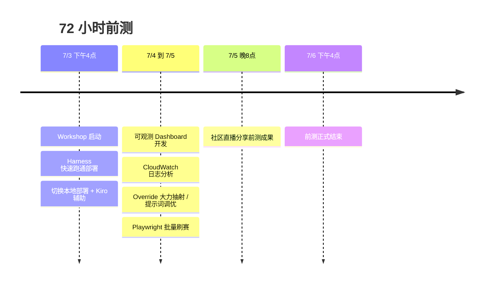
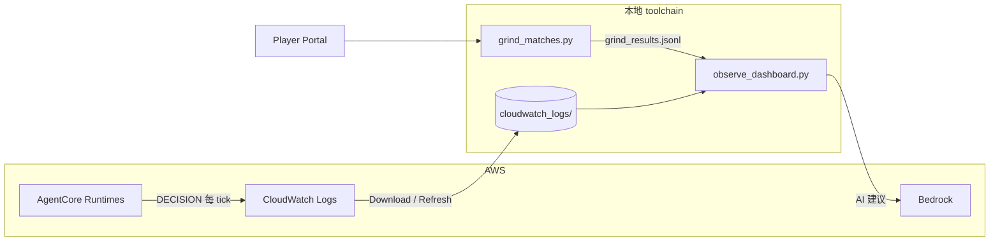
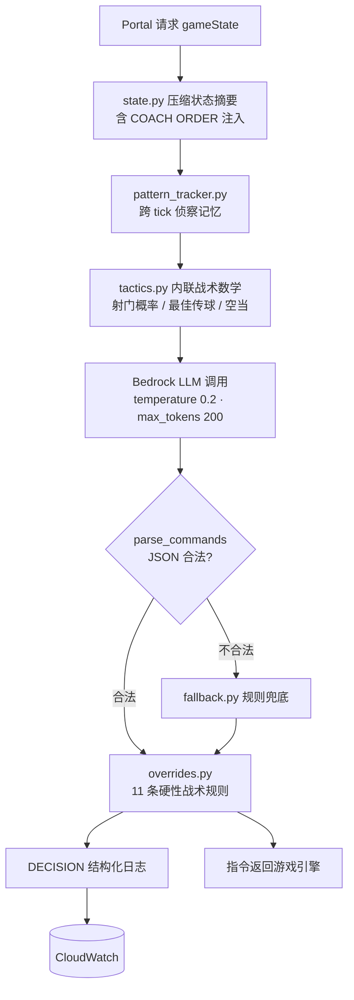
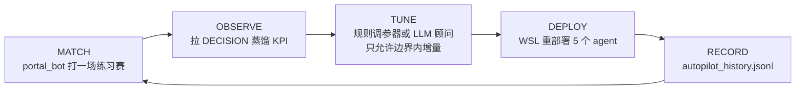

# Agentic Football Cup 72 小时前测 — 从 Harness 到本地可观测 toolchain

**时间**：2026 年 7 月 3 日 16:00 — 7 月 6 日 16:00（72 小时）  
**组织**：亚马逊云中国 User Group 社区  
**目的**：为即将在北京举办的第一届 **Agentic Football Cup 北京 UG Workshop** 提前踩坑、验证流程  
**收尾**：7 月 5 日 20:00 直播分享前测成果  
**开源仓库**：[sample-ai-possibilities / agentic-football-sample-agents](https://github.com/peterpanstechland/sample-ai-possibilities/tree/football-workshop/agentic-football-sample-agents)（分支 `football-workshop`）

---

## 背景：什么是 Agentic Football Cup Workshop？


*图源：[agenticfootballcup.com](https://agenticfootballcup.com/)*

[Agentic Football Cup](https://agenticfootballcup.com/) 是 AWS 打造的 **免费半天工作坊**（约 4 小时），口号很直接——**Build AI Agents. Watch them compete.** 通过一场 2D 像素风足球赛，让你快速上手 **Amazon Bedrock AgentCore**、**CloudWatch** 等 Agentic AI 相关服务：场上每名球员都是自主决策的 AI Agent，无脚本、纯涌现式比赛。

按官方 [Learn More](https://agenticfootballcup.com/learnmore/) 页的说法，「足球只是学习载体」——工作坊里用到的每个模式都直接对应生产级 agentic workload：

| 官方速览 | 内容 |
|------|------|
| 形式 | 免费半天（约 4 小时）；可为组织预约私享场，也可参加公开场 |
| 覆盖 | 全球主要城市巡回（上海、北京都在列表中），支持 EN / JA / KO / ES / PT-BR 五种语言 |
| 你将学到 | 多 Agent 协同与编排、实时状态管理、工具调用与结构化输出、Guardrails 与重试策略、可观测与 Agent 推理调试、自主系统的提示词工程 |
| 技术栈 | Amazon Bedrock、Bedrock AgentCore（托管运行时）、Strands Agents SDK、Kiro IDE、Nova / Claude 等任意 Bedrock 模型，部署在你自己的 AWS 账号 |
| 架构指标 | 每 2 秒并行调用 10 个 Agent，每次决策目标 500ms 内返回 |
| 场边执教 | 比赛中可从场边输入指令，看 Agent 自主推理是否听从——就像真教练在边线喊话 |
| 通往 Vegas | 完成工作坊即获全球联赛资格；小组冠军将站上 **AWS re:Invent 2026 拉斯维加斯** 的舞台现场争夺大奖 |

报名（个人公开场 / 组织私享场）都在 [官网](https://agenticfootballcup.com/) 一分钟搞定。

### From your laptop to Las Vegas：晋级路线

这条信息值得单独划重点——**完成工作坊不是终点，而是全球联赛的起点**：


*图源：[agenticfootballcup.com/learnmore](https://agenticfootballcup.com/learnmore/)*

1. **完成一场 Workshop** —— 私享场 / 公开场均可，构建并部署你的 Agent 球队
2. **参加当日锦标赛** —— 工作坊收尾时，你的 Agent 与其他参与者现场对战
3. **进入全球联赛资格赛** —— 所有完成者都有资格参加线上资格赛，持续改进 Agent、全球竞技
4. 🏆 **AWS re:Invent 2026 · 拉斯维加斯** —— 小组冠军在全球最大云计算大会的舞台上，现场争夺大奖

官方原话：「The path is real — build something great in the morning, qualify in the afternoon, and there's a route from your laptop to Vegas.」早上写代码，下午拿资格，从你的笔记本直通 Vegas。

比赛为 **5v5** 制，每队 5 个位置：**GK（门将）/ DEF（后卫）/ MID（中场）/ FWD1、FWD2（双前锋）**。关键在于——**每名球员就是一个独立部署在 AgentCore Runtime 上的 Agent**：它有自己的提示词、自己的模型、自己的 fallback 规则，每个决策 tick 被独立调用。你不是在「玩游戏」，而是在**同时运维 5 个生产环境里的 Agent**。

Portal 还把 AgentCore 的能力做成了游戏化任务：奖杯墙对应 **Runtime、Memory、Code Interpreter、Browser、Identity、Gateway、Observability、Bedrock、Guardrails、Evaluations** 十项能力，做每日任务攒 XP 升级。玩着玩着，AgentCore 的产品版图就摸清了。

Workshop 提供三种创建 Agent 球员的路径：

| 方式 | 适合人群 | 特点 |
|------|----------|------|
| **AgentCore Harness（全图形化）** | 零基础、快速体验 | 浏览器内配置提示词与模型，无需本地环境 |
| **CloudShell** | 已有 AWS 账号、不想装本地工具 | 云端终端一键部署 |
| **本地部署（Kiro 等 IDE 辅助）** | 想深度定制、扩展玩法 | 本地开发 Agent 代码，上传到 AgentCore Runtime |

本次前测我先后体验了 **Harness** 与 **本地部署**。Harness 适合「先跑通一局」；选定方向后，我转向本地部署——因为它能打开更多可能性：可观测平台、热力分析、AI 改码建议、Override 战术、Playwright 自动刷赛等，这些玩法后文逐一展开。

---

## 时间线



---

## 第一阶段：Harness 快速验证

先用 **AgentCore Harness** 在浏览器里创建并部署 Agent 球员：填好球员提示词、选好模型，点部署即可生成 Runtime，全程不碰本地环境。用它确认了三件事：

- AgentCore Runtime 能正常接收对战请求
- Portal 能发起比赛并在 CloudWatch 看到 DECISION 日志
- 基本 prompt / fallback 流程可用

这一步大约 1–2 小时即可跑通，为后续本地开发建立心智模型。如果你只想「先感受一下」，Harness 就够了；想继续往下折腾，就切本地。

---

## 第二阶段：本地部署，读懂游戏机制

### 一支球队 = 5 个独立 Agent

本地部署后，「我的球队」页把这套结构展示得很直白：每张球员卡都绑定一个 AgentCore Runtime 的 **Agent ARN**，实时显示调用次数、Token 消耗、响应延迟和赛前体检结果。


几个值得注意的细节：

- **阵型可配**（截图中为 1-2-1）：五个位置各由一套系统提示词定义职责，改阵型就是改提示词组合
- **延迟就是战斗力**：截图里 GK 93ms、DEF 123ms、MID 107ms——延迟太高的球员会错过决策窗口，直接影响比赛表现
- 仓库里有多套风格的队伍模板：`ai-team-strands-balanced`（均衡）、`extremely-aggressive`（激进）、`extremely-defensive`（龟缩）、`gateway`、`memory`，用 `deploy-wsl.sh` 一键部署整队

### 比赛怎么跑：约 2 秒一个 tick

比赛时钟约 **120 秒**，每 ~2 秒推进一个 **tick**。每个 tick，5 名球员各自调用一次自己的 Agent，返回一条指令：

`MOVE_TO`（跑位）/ `PASS`（传球）/ `SHOOT`（射门）/ `MARK`（盯人）/ `SLIDE_TACKLE`（铲球）/ `PRESS_BALL`（逼抢）/ `INTERCEPT`（拦截）/ `GK_DISTRIBUTE`（门将分球）/ `CLEAR`（解围）……

一场比赛全队合计 **300–600 次 Agent 调用**。响应超过 ~900ms 就有超时风险，游戏会转用规则 fallback 兜底——所以「提示词写得好」和「响应回得快」同样重要。


对战画面信息量很足：实时比分与时钟、逐球员名牌、右下角战术小地图，底部还有 AI 生成的实时解说。注意左下角那个 **教练喊话输入框**——比赛进行中可以给全队下达自然语言战术指令，这个入口后文 Playwright 实验还会提到。


### 赛后报告与「幕后故事」

每场比赛结束后，Portal 会给出两层报告。第一层是全场比分页：MVP、最快 Agent、控球率、射门/射正与进球时间线。


第二层是 **幕后故事（Behind the Scenes）**——这是给 Agent 开发者看的复盘报告：AI 生成的比赛摘要与进球叙事、两队 **指令分布对比**（每队 Agent 这场都下了什么指令）、以及**各位置的响应延迟与成功率**。


这份报告非常有用：上图这场 2-6 惨败里，我方 DEF 平均延迟飙到 **1227ms**（对面全队都在 400–700ms），而且我方 947ms 平均响应明显慢于对手的 568ms——**输球先输在延迟**。这直接引出了我们后面的两个动作：换更快的模型、做自己的可观测平台。

### Override：大力抽射

游戏允许在 Agent 代码里做 **确定性 override**——不经过 LLM、由代码直接接管的战术动作。我们给前锋加了 **大力抽射（blast shot）**：进入射门区域且角度合适时，代码直接下 `SHOOT` 并拉满力度，不给 LLM 犹豫的机会。同类 override 还有 `mark-near`（就近盯人）、`tackle`（抢断）、`hold-line`（保持防线）、`no-chase`（不追无效球）、`support`（接应）等，后面分析页里能看到每种 override 的触发次数。

实测大力抽射显著增加了进球与胜率——LLM 负责「读比赛」，代码负责「扣扳机」，分工明确后稳定性大幅提升。

### 提示词与 Fallback 调优

- **Prompt**：强调前锋压上、中场衔接、后卫盯人，减少无效横传
- **输出格式**：LLM 偶尔会在 JSON 外多话，触发解析失败。我们的观测台后来直接把这类问题做成告警：`parse-fallback 34/255: LLM output drifting from pure JSON — tighten the response format section or lower temperature`
- **Fallback**：LLM 超时或返回非法动作时，用确定性规则兜底（后卫清球、门将抱球等）。但 fallback 也是双刃剑——我们在训练场里就抓到过「全队 0% LLM 决策、实际全程跑规则」的乌龙（见下一章）

### 按位置换模型

延迟数据摆在眼前，很自然的下一步是 **给不同位置配不同的 Bedrock 模型**。我们用 `bench_models.py` 对候选模型做了延迟基准，最终拆分：

- **前锋 / 中场**：`amazon.nova-2-lite-v1:0`（推理稍强，进攻决策质量优先）
- **后卫 / 门将**：`amazon.nova-micro-v1:0`（延迟更低，防守反应速度优先）

门将必须在 tick 窗口内快速回应，这个拆分实测有效。

---

## 第三阶段：可观测平台与数据分析

本地部署的最大收益，是能把 **CloudWatch DECISION 日志** 和 **Portal 赛果** 拉下来做自己的分析。我们为此开发并开源了一套 **可观测 toolchain**（仓库 `agentic-football-sample-agents/`），自带中英双语 UI。

### 架构概览



### 观测台主页：5 个位置卡片 + 延迟散点


主页把每个位置做成一张卡片：tick 数、**LLM 决策占比**、p50/p95 延迟、**代码接管（override）次数**、指令分布，以及自动生成的健康提示，例如：

- DEF 卡片：`parse-fallback 34/255 —— LLM 输出漂移出纯 JSON，建议收紧格式段或调低 temperature`
- GK 卡片：`GK 从未使用 GK_DISTRIBUTE —— 分球优先级可能没有生效`

下方是 **LLM 延迟散点图**（按位置着色，虚线是 900ms 超时风险线——哪个位置的点经常越线一目了然）和全队指令分布。

### 训练场模式与实战对比

Dashboard 支持三种数据源：**实战（CloudWatch）**、**训练场（本地日志）**，以及两者 **同屏对比**。


训练场模式立过大功：上图这次本地训练里，五个位置卡片齐刷刷提示 `only 0% decisions from LLM — the team is effectively playing on rule-based fallback`——**我们以为在测提示词，其实全队在跑规则**。没有可观测平台的话，这种问题几乎无法察觉。


对比模式把每个位置的实战/训练差异做成带增量的表格，指令分布画成双色条形图——改完提示词先在训练场验证，再对照实战数据，迭代节奏就出来了。

### 比赛分析：多场拆分


这里有个必踩的坑：CloudWatch DECISION 日志里的比赛时钟 `t` **不会在局间重置**，连续刷赛时朴素的分析会把十几场合成一场「7000 tick 超级比赛」。我们的解法是用 `grind_results.jsonl`（刷赛脚本记录的每场起止时间）做 **时间窗口切分**，Analytics 下拉框才能正确列出 2-5、2-1、4-5 等独立场次；没有本地日志的场次也会标注「无 CloudWatch 日志」保留比分。

### 球员热力图


热力图基于 DECISION 日志里的球员坐标聚合，可按 **ALL / GK / DEF / MID / FWD1 / FWD2** 过滤。右侧单兵面板给出平均站位、距两侧球门距离、**半场分布**（这名 FWD1 只有 40% 时间在进攻半场）、射正率、override 触发明细和指令分布。

上图的发现很典型：FWD1 的 41 次射门大多发生在 **中圈附近**（红色箭头）——离球门太远，命中率自然惨淡。这一条观察直接转化为下一轮提示词修改：「靠近禁区再射门」。

### AI 改码建议


分析页右上角的 **「AI 修改建议」** 按钮会把当前场次的统计与 DECISION 样本发给 Bedrock，20–40 秒后生成针对性的调参建议（提示词怎么改、哪个位置该换模型、哪类 override 值得加）。分析模型本身也可以切换：Nova 2 Lite（推荐）、Nova Lite、Nova Micro（快）、Claude Sonnet 4.6 / 4.5 / 4、Claude Haiku 4.5、Llama 3.1 8B——顺便还能对比一下不同模型给建议的风格差异，也算是彩蛋玩法。

### 设置页：本地优先的数据策略


Dashboard 采用 **本地优先** 策略：启动时读 `cloudwatch_logs/` 本地缓存，不每次打 CloudWatch API（快、省钱、离线可用）。需要新数据时，在 Settings 点 **下载 CloudWatch 数据**（可选前缀与时间窗），或在主页点 **刷新数据** 增量同步。凭证支持 Workshop 的临时 STS（含 Session Token），只写本机 `~/.aws/credentials`。

不想开浏览器的话，`analyze_match.py` 提供同款终端版逐 Agent 统计。

---

## 第四阶段：Playwright 自动化

### 自动刷赛

数据分析要有数据。手动打一场比赛要点五六次鼠标再等 4 分钟，于是我们写了 [`portal_bot.py`](https://github.com/peterpanstechland/sample-ai-possibilities/blob/football-workshop/agentic-football-sample-agents/portal_bot.py) + [`grind_matches.py`](https://github.com/peterpanstechland/sample-ai-possibilities/blob/football-workshop/agentic-football-sample-agents/grind_matches.py)：Playwright 驱动 Player Portal，自动登录 → 约赛 → 观赛 → 记录比分到 `grind_results.jsonl`，循环 N 场。


72 小时里我们刷出了 **19 场正式比赛**（5 胜 1 平 13 负——胜率 26%，联赛第 5，数据不会说谎，但每一场都变成了训练样本）。仓库里还有一个更激进的 `autopilot.py`：**约赛 → 拉日志 → 分析 → 调参 → 重部署** 全自动闭环，感兴趣可以直接看代码。

### 教练喊话注入（实验中 ⚠️）

还记得对战画面左下角的 **教练喊话框** 吗？我们尝试用 Playwright 在比赛进行中自动注入战术指令（比如落后时喊「全员压上」），把「中场调整」也自动化。这条路比想象的曲折，踩出了三个发现：

1. **自由文本会被门户 400 拒绝**——喊话通道只接受 6 个预设指令（press_high、shoot_on_sight、slow_the_tempo、go_all_out_attack 等）
2. **进球瞬间发的指令会被吞**——进球回放和开球过场动画期间注入的指令石沉大海，必须排队等比赛时钟恢复再发
3. **「有没有送达」可以被证明**——我们在 DECISION 日志里加了 `co:1` 字段，指令真正进入 LLM 提示词时会留下痕迹

基于这三点我们写了 `LiveCoach`（详见下一章），但从比赛结果看效果仍不明显，**还需要更多对局验证**。欢迎社区一起 PR。

---

## 代码解读：这套 Agent 到底是怎么写的

> 本章建议对照 [仓库代码](https://github.com/peterpanstechland/sample-ai-possibilities/tree/football-workshop/agentic-football-sample-agents) 阅读，文中路径均相对于 `agentic-football-sample-agents/`。

### 仓库地图

```text
agentic-football-sample-agents/
├── ai-team-strands-extremely-aggressive/   # 主力队：5 个位置各一个 agent
│   ├── ai-gk/ ai-def/ ai-mid/ ai-fwd1/ ai-fwd2/
│   │   └── src/main.py          # 每个位置约 80 行：提示词 + 三种配置
│   ├── bench_latency.py         # 位置级延迟基准
│   └── deploy-all.sh            # 整队一键部署
├── lib/                         # 全队共享的核心库（重点）
│   ├── agent_base.py            # 决策管线：LLM → 解析 → override → DECISION 日志
│   ├── state.py                 # 游戏状态压缩成提示词（含 COACH ORDER 注入）
│   ├── tactics.py               # 内联战术数学：射门概率 / 最佳传球 / 空当
│   ├── pattern_tracker.py       # 跨 tick 侦察记忆（对手主威胁、惯用边路）
│   ├── overrides.py             # 11 条确定性战术规则（本章主角）
│   ├── fallback.py              # 每个位置的规则兜底
│   ├── parsing.py               # 解析 LLM JSON（能吃掉 Nova 写的算术表达式）
│   ├── tuning.py / tuning.json  # autopilot 的调参面板
│   └── match_analytics.py       # 热力图 / 多场切分 / 战报聚合
├── observe_dashboard.py         # 观测台（+ analytics / settings / i18n 模块）
├── portal_bot.py                # Playwright 门户自动化 + LiveCoach
├── grind_matches.py             # 批量刷赛
├── autopilot.py                 # 全自动迭代闭环
└── analyze_match.py             # 终端版报告
```

设计原则只有一条：**位置入口极薄，公共逻辑全部收敛进 `lib/`**。五个位置跑同一条管线，改一处全队生效，不为任何球员复制粘贴功能。

### 一名球员 = 约 80 行 main.py

以 FWD1（左边锋）为例，入口文件只做四件事——写提示词、配兜底、配 override、选模型（节选）：

```python
SYSTEM_PROMPT = f"""Ultra-aggressive left striker AI. You control ONLY player {MY_PLAYER_ID}
(FWD1) in 5v5 soccer. Each tick: read state, reply ONE command.

RULE #1 — SHOOT CENTER. Read TACTICS Shot line:
- "LANE CLEAR" / "POINT-BLANK" / "LANE BLOCKED": SHOOT CENTER power 1.0.
- Never dribble for a better angle inside 45m — shoot immediately.
...
Reply ONLY the JSON array, no other text:
[{{"commandType":"SHOOT","playerId":3,"parameters":{{"aim_location":"CENTER","power":1.0}},"duration":0}}]"""

# 规则兜底：只有被指派的球员去逼抢（防止 5 人围抢一球），前锋沿左边路活动
AGG_FWD1_CONFIG = replace(FWD1_CONFIG, press_only_if_designated=True,
                          advance_y=-14.0, default_y=-14.0)

# 硬性战术规则：提示词单独存在时约 40% 的 tick 被无视
OVERRIDE_CONFIG = OverrideConfig(wing_y=-14.0)

# Nova 2 Lite：bench_models.py 实测赢家（100% JSON 解析率、p95 更紧）
agent = create_agent(SYSTEM_PROMPT, model_id="us.amazon.nova-2-lite-v1:0")
create_invoke_handler(app, agent, MY_PLAYER_ID, POSITION_LABEL, fallback_commands,
                      fallback_cfg=AGG_FWD1_CONFIG, override_cfg=OVERRIDE_CONFIG)
```

提示词有两个值得抄的细节：**用求解后的战术结论喂 LLM**（提示词里的 `TACTICS Shot line` 由 `tactics.py` 每 tick 现算：射门线路是否干净、最佳传球对象——LLM 只做「读结论 → 选动作」），以及**结尾给出一条完整的 JSON 示例**锚定输出格式。

### 每个 tick 内部发生了什么（agent_base.py）



三个工程细节：

- **四层降级**：`llm → parse-fallback → error-fallback → last-resort`，无论哪层出问题球员都不会「罚站」；DECISION 日志的 `source` 字段记录本 tick 走到了哪层
- **延迟是省出来的**：`max_tokens=200` 封顶（输出只是一条 JSON 指令，砍掉长尾生成）；无记忆 agent 每个 tick 清空 `agent.messages`——热 runtime 里对话历史会越滚越长拖慢 prefill。这两招把决策延迟从 ~1.5s 压到 ~0.7s（commit `8a4e3a5`）
- **记忆不等于塞历史**：`pattern_tracker.py` 用进程内计数器把对手行为蒸馏成几行侦察报告（「对手 7 号是主威胁、惯走左路、GK 喜欢短传出球」），上下文不膨胀也能跨 tick 记仇

### DECISION 日志：一行 JSON 撑起整个可观测体系

`agent_base.py` 每个 tick 输出一行结构化日志，这是全部下游工具的数据源：

```json
{"pos":"FWD1","tick":57,"t":93,"source":"llm","cmd":"SHOOT","latency_ms":612,
 "hb":1,"dg":38.2,"mx":22.5,"my":-9.1,"hs":1,"as":1,
 "want":"MOVE_TO","fix":1,"ov":"shot","aim":"CENTER","co":1}
```

| 字段 | 含义 | 谁在消费 |
|------|------|----------|
| `source` | 决策来自哪层（llm / parse-fallback / …） | 观测台「LLM 决策占比」、0% LLM 告警 |
| `hb` / `dg` | 是否持球 / 距对方球门距离 | 射门纪律分析（真机会 vs 瞎开炮） |
| `want` vs `cmd` + `fix` | LLM 原意 vs 实际执行；`fix:1` = override 纠正了 LLM | override 有效性统计 |
| `ov` | 本 tick 触发的 override 标签 | 分析页 override 明细 |
| `mx` / `my` | 球员坐标 | 热力图 |
| `hs` / `as` | 实时比分 | 战报、进球时间线、多场切分 |
| `co` | 教练指令已注入提示词 | LiveCoach 送达验证 |

先定义好这一行的 schema，观测台、热力图、autopilot KPI、AI 建议才有共同语言——**可观测不是事后加的，是管线的一等公民**。

### overrides.py：提示词建议，代码执行

这个 40KB 的文件源自一次数据打脸。模块 docstring 里保留着证据：某场比赛 370 条指令里 **207 条 MOVE_TO、0 条 MARK**——尽管提示词明确要求「队友逼抢时你去 MARK」。LLM 100% 应答（fallback 一次没触发），所以**只写在提示词里的规则等于可选项**。iter-8 起，决定比赛的规则全部改为确定性代码：

| override 标签 | 规则 | 数据依据 |
|---|---|---|
| `blast` | GK/DEF 拿球即全力射向门框最空处，解围+射门二合一 | iter-9 |
| `build` / `launch` / `carry` | 有干净线路时改地面出球 / 长传找最前锋 / 沿边带球，blast 降级为兜底 | 六场 KPI：92–98% 的射门是 45m+ 开大脚，全在送球权 |
| `shot` | MID/FWD 射程内线路干净必须射门；射向被封角会被重新瞄准空角 | |
| `counter` | 对方 3+ 人压入我方半场时，一脚 THROUGH 直塞最前点反击 | |
| `phantom` | 没球时下 SHOOT/PASS 是浪费 tick，改写成真实防守动作 | |
| `no-chase` / `anchor` | 非指派球员不追球；防守跑位偏离锚点线太远会被钳回 | |
| `cutback` / 带球封顶 | 射门线路全封时回敲空位队友；带球目标钳在禁区沿 | 1-5 / 0-4 两场败局复盘 |
| `tackle` / `gk-smother` | 指派逼抢者进铲球距离就出脚；GK 扑禁区内无主球 | 「防守光盯人不出脚」观察 |
| `route-one` | 被压死且地面出球全封时，直接长传最前锋 | 验证局 far_shot_ratio 1.0、前锋 0 射门 |

每条规则触发都会在 DECISION 里留下 `ov` 标签，分析页统计触发次数——**规则是否生效不靠感觉，靠日志**。`blast → build → route-one` 的演化（iter-9 → 11 → 12b）就是被自己的 KPI 逼出来的：先学会开大脚，再学会不乱开大脚。

### tuning.json + autopilot：让机器自己调参

Override 的阈值（射门距离、盯人半径、逼抢人数……）不该靠手改。`lib/tuning.json` 是随每次部署下发的参数覆盖层，`autopilot.py` 围着它跑闭环：



KPI 包括远射浪费率、控球高度、围攻指标、override 触发数；调参器默认是有界规则，`--llm-advisor` 可换成 Nova 读 KPI 提增量。连败强制探索，赢球冻结配置。这个闭环第一次跑通，就拿下了对 aggressive bot 的**首胜 3-2**（commit `fffd0fa`）。

### LiveCoach：把「教练」也变成代码

`portal_bot.py` 里的 `LiveCoach` 类订阅比赛解说流（narration feed），把局势映射到 6 个预设喊话：

```python
if conceded:               return ("conceded",  "press_high")        # 丢球：立刻反抢
if scored and diff > 0:    return ("scored",    "slow_the_tempo")    # 领先：稳住节奏
if diff < 0 and late:      return ("chase-late","go_all_out_attack") # 落后+尾声：梭哈
if diff < 0:               return ("chase",     "shoot_on_sight")    # 落后：多射门
if diff > 0 and late:      return ("protect",   "slow_the_tempo")    # 守住胜果
```

工程上的坑都写在注释里：进球触发的指令要**排队**到比赛时钟恢复再发（否则被回放动画吞掉）、45 秒冷却 + 同局势去重防刷屏。指令经 `state.py` 以 `COACH ORDER (obey immediately)` 置顶注入全队提示词，DECISION 的 `co:1` 负责证明送达。一条喊话同时转向五个 LLM——虽然胜率影响还有待验证，这个「用一句话操控整支球队」的机制本身就值得玩。

### git 历史里的迭代故事

40+ commits 按 iteration 编号，直接讲了一条数据驱动的进化线：

| Commit | 里程碑 |
|---|---|
| `8a4e3a5` | 决策延迟 ~1.5s → ~0.7s（清历史 + 缩 max_tokens） |
| `8758e20` iter-4 | 网页版可观测 dashboard 初版 + shoot-first 策略 |
| `5814a00` iter-5 | 本地训练场 + 实战/训练对比视图 |
| `d17a3d3` iter-8 | **overrides 诞生**：prompts suggest, code enforces |
| `bd30b57` iter-9 | 反击系统 + GK/DEF 无限开大脚 |
| `276e4e2` iter-10 | **autopilot 闭环** + Playwright 门户机器人 |
| `fffd0fa` iter-10 | 数据驱动调参后**首胜 3-2** |
| `3d035bc` iter-11 | build-from-back：修复「95% 远射浪费」 |
| `9880ce6` iter-11d | 进攻三人组换 Nova 2 Lite（真实 bake-off 选出） |
| `5030547` | 解析器学会吃 Nova 写的 `55*0.75` 算术表达式 |
| `055fbd8` iter-12 | 终结能力 + 抢球包（源自 1-5 / 0-4 败局证据） |
| `8acd3ce` iter-12b | route-one 长传破高位逼抢 |
| `3f0b8b4` / `cc2dbac` | 比赛分析、多场切分、部署文档开源 |

每个 iter 的 commit message 都写明了「哪场比赛的哪个数据」促成了这次修改——这可能是这个仓库最值得学的习惯。

---

## 安装与使用教程

以下命令在 **Windows PowerShell** 下验证；macOS / Linux 将路径中的 `\.venv\Scripts\` 换成 `bin/` 即可。

### 0. 前置条件

| 工具 | 要求 | 用途 |
|------|------|------|
| Python | 3.10+ | 运行 Dashboard 与脚本 |
| AWS 凭证 | Workshop 临时 STS 或长期凭证 | 读 CloudWatch、调 Bedrock |
| Team Code | Workshop 分配 | Playwright 约赛需要 |
| 已部署的队伍 | 见仓库 README 1–5 节 | 没有 Agent 就没有 DECISION 日志 |

### 1. 克隆仓库

```powershell
git clone -b football-workshop https://github.com/peterpanstechland/sample-ai-possibilities.git
cd sample-ai-possibilities/agentic-football-sample-agents
```

### 2. Python 环境与依赖

```powershell
python -m venv .venv
.\.venv\Scripts\Activate.ps1
pip install -r requirements-observability.txt
python -m playwright install chromium   # 仅刷赛脚本需要
```

### 3. 配置 AWS

```powershell
copy .env.example .env
# 编辑 .env：填入 Workshop STS 凭证与 AAFC_TEAM_CODE
```

或者启动 Dashboard 后在 **Settings** 页填写（写入本机 `~/.aws/credentials`，支持 Session Token）。

### 4. 启动可观测 Dashboard

```powershell
$env:AWS_DEFAULT_REGION = "us-east-1"
.\.venv\Scripts\python.exe observe_dashboard.py --prefix agg_ --minutes 180 --port 8777
```

`--prefix` 是你的 runtime 日志前缀（log group `/aws/bedrock-agentcore/runtimes/agg_*` 对应 `agg_`）。浏览器打开 **http://127.0.0.1:8777/**，右上角可切换中英文：

| 路径 | 说明 |
|------|------|
| `/` | 观测台：位置卡片、延迟散点、实战/训练对比 |
| `/analytics` | 比赛分析：比分、热力图、AI 修改建议 |
| `/settings` | AWS 凭证 + 下载 CloudWatch 数据 |

首次使用建议先在 Settings 点 **下载 CloudWatch 数据**，之后页面都走本地缓存，加载飞快。

### 5. 批量刷赛（可选）

```powershell
$env:AAFC_TEAM_CODE = "你的队伍代码"
.\.venv\Scripts\python.exe grind_matches.py --count 5
```

刷完回到 `/analytics`，下拉框会按 `grind_results.jsonl` 的时间窗列出每一场。

### 6. 更多细节

- 终端版报告：`analyze_match.py --prefix agg_ --minutes 30`
- 全自动迭代：`autopilot.py`（约赛 → 拉日志 → 调参 → 重部署）
- 完整文档：[`docs/OBSERVABILITY.md`](https://github.com/peterpanstechland/sample-ai-possibilities/blob/football-workshop/agentic-football-sample-agents/docs/OBSERVABILITY.md)（架构、环境变量表、FAQ：Bedrock 403、多场拆分等）

---

## 与 2026 AWS 上海 Summit 的渊源

这不是我第一次接触 Agentic Football Cup。在 **2026 AWS 上海 Summit** 上，我用 Harness 方式参加过现场比赛——官方给那天的注脚是「**120+ builders, one unforgettable match day**」。


*以上两张现场照片图源：[agenticfootballcup.com](https://agenticfootballcup.com/)*

那天我也有幸与 **游戏作者** 交流并合影——那次更多是「体验一下有多好玩」。


这次 72 小时前测则是 **系统性踩坑**：从 Harness 到本地部署、从单场到批量刷赛、从看日志到热力图与 AI 建议。如果上海 Summit 是「入门体验」，这次就是为 **北京 UG Workshop** 准备的「教练手册 + 工具链」。

---

## 总结

| 收获 | 说明 |
|------|------|
| AgentCore 全流程 | Harness 部署 → 本地 Agent → Runtime 对战，一队 = 5 个独立 Agent |
| 游戏机制 | ~2s/tick、指令集、900ms 超时、Override、按位置选模型 |
| 可观测性 | CloudWatch DECISION → 本地缓存 → 观测台（曾抓到「全队 0% LLM」乌龙） |
| 数据驱动调优 | 热力图定位「中圈远射」问题、延迟散点定位慢位置、Bedrock 改码建议 |
| 自动化 | Playwright 刷赛 19 场 + autopilot 闭环；教练喊话注入仍待验证 |
| 社区 | 72 小时前测 + 7/5 直播，为北京 Workshop 铺路 |

**玩得很开心，也实实在在学到了 AgentCore 相关业务。** 如果你准备参加北京或线上的 Agentic Football Cup Workshop（报名见 [agenticfootballcup.com](https://agenticfootballcup.com/)），欢迎直接使用我们的 [开源 toolchain](https://github.com/peterpanstechland/sample-ai-possibilities/tree/football-workshop/agentic-football-sample-agents)，Issue / PR 都敞开。别忘了：完成工作坊就有全球联赛资格，小组冠军直通 **AWS re:Invent 2026 拉斯维加斯** 决赛舞台。

最后说点期待：希望 Agentic Football Cup 的国内赛事越办越多、越办越大，也期待有中国选手一路杀进 re:Invent 2026 决赛，代表中国出征拉斯维加斯。虽然中国男足很拉跨，但相信我们的 Agent **不需要补海参**就能赢下比赛。⚽

---

*亚马逊云中国 UG · Agentic Football Cup 前测小组 · 2026 年 7 月*
