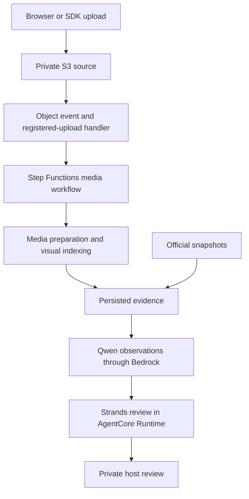
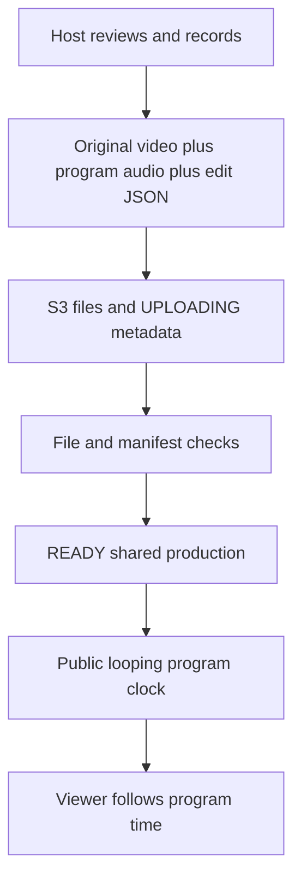

# Building Courtside IQ on AWS: keeping basketball commentary tied to evidence

Our TEAM7 project, Courtside IQ, did not reach the finals, but its approach to evidence, human review and reusable production artifacts is worth sharing. I am PeterPan; this is our team's implementation experience, not an AWS-authored or AWS-endorsed article.

Courtside IQ helps a human commentator understand an uploaded basketball clip, pause at a meaningful frame, inspect the evidence and decide what enters the program. The interesting engineering problem was connecting four things correctly: **the person, the image, the data and the moment**. A fluent explanation is useful only when those connections hold.

## Start with a claim the host can check

A model can describe a white jersey, a player near the basket and an apparent passing lane. That does not establish an NBA identity, possession of the ball or the player's intention. An official scoring record answers another question: who was credited with an event. It does not identify every body in the image.

We therefore separate official records, visual observations and tactical hypotheses. A cue should lead back to the relevant frame, track, source and time. Unknown identities remain unknown; an attractive narrative does not earn permission to fill them in. The host receives private assistance and chooses what to approve for public commentary or an overlay.

xFG illustrates the distinction. We use an official historical shot-quality value associated with a matched shot. It is not a guarantee that the ball goes in, and it must not reveal the eventual shooter or result before that event is available. We also do not manufacture a gravity metric, scoring probability or steal probability from a frame. Such claims would require definitions, measurements and separate validation.

The [official-evidence implementation](https://github.com/peterpanstechland/NBAHackathon/blob/f43f4e0b0b1424b2aa36cd09301ac2ac047cc32c/services/shared/src/nba_copilot/official_evidence.py) makes these distinctions explicit.

## Separate the paths before adding services

The application has three paths with different latency needs. CloudFront, HTTP and WebSocket APIs, Lambda and DynamoDB support the workspace and control state. An asynchronous media workflow handles uploaded video. Model inference consumes persisted evidence rather than moving entire videos through an interactive connection.

This diagram describes application flow, not a private network boundary. The configured AgentCore runtimes use PUBLIC networking. Claude uses a global inference profile; CloudFront is global, WebSockets have a separate endpoint and presigned uploads go directly to S3. Drawing all of this inside a single regional VPC would misrepresent the implementation.

Roboflow is an optional runtime diagnostic path that can cross a third-party boundary. Tripo was a creation-time dependency for the mascot asset; ordinary analysis requests do not generate a new mascot. Neither belongs on the mandatory inference path.

See the [AgentCore resource configuration](https://github.com/peterpanstechland/NBAHackathon/blob/f43f4e0b0b1424b2aa36cd09301ac2ac047cc32c/infra/lib/constructs/agents.ts) and [optional Roboflow path](https://github.com/peterpanstechland/NBAHackathon/blob/f43f4e0b0b1424b2aa36cd09301ac2ac047cc32c/services/pipeline/roboflow.py).

## Make uploaded video a durable task

The upload API registers a source and returns a presigned S3 URL. Browser, CLI and Python SDK clients share the application API, so a reviewer does not need the team's AWS credentials. The object-created handler accepts registered MP4 paths and starts analysis; it does not treat every object in the bucket as a new task.

Step Functions coordinates MediaConvert, scoreboard OCR, official matching and visual analysis. MediaConvert preserves source dimensions when preparing video and captures source-resolution images for small jersey details. Tracking can use a smaller processing canvas. S3 stores media and larger JSON artifacts; DynamoDB stores status and associations.

Persisting stages matters when inference fails. A usable official cue or visual record should survive a failed reasoning call. Explicit recovery entry points exist for jersey, foundation and reasoning work, rather than a promise that every failure resumes automatically from the last frame. The current analysis samples at four frames per second and covers at most the first ten minutes; longer games need segmentation.

These behaviors are visible in the [upload-event handler](https://github.com/peterpanstechland/NBAHackathon/blob/f43f4e0b0b1424b2aa36cd09301ac2ac047cc32c/services/pipeline/upload_completed.py), [media stages](https://github.com/peterpanstechland/NBAHackathon/blob/f43f4e0b0b1424b2aa36cd09301ac2ac047cc32c/services/pipeline/workflow.py) and [index limits](https://github.com/peterpanstechland/NBAHackathon/blob/f43f4e0b0b1424b2aa36cd09301ac2ac047cc32c/services/shared/src/nba_copilot/video_index.py).

## Align clocks without turning estimates into truth

Video time advances; the game clock counts down and can stop. Cuts and replays complicate their relationship further. We fit scoreboard readings to a clock map, rank games against the official snapshots we hold and join play-by-play events with shot records. Filename hints can contribute to candidate selection, so this is a bounded heuristic, not universal recognition.

An event match is not a verified ball-release frame. The evidence contract labels its approximate position and tolerance. Live questions receive only evidence whose availability time has been reached; outcome disclosure is delayed beyond the alignment tolerance. Missing official coverage leaves names and statistics unresolved while visual analysis can continue.

Likewise, a track ID describes a local visual object, not a permanent person. Jersey readings, roster context and multiple frames can support identity recovery, but crossings and camera changes require boundaries. A later clear number can help retrospective identification without proving earlier ball possession. This distinction is essential when the host asks what was knowable at a paused moment.

Consider a frame before a shot. The host may legitimately ask which passing option appears open. The answer can use visible positioning and statistics available by that clock. It cannot choose the eventual scorer because a later play-by-play event names that person. During retrospective review, the host can deliberately reveal the outcome, but the system should still explain which conclusion came from the image and which came from the official event. That separation makes the same clip useful for both analysis and storytelling.

The [game resolver](https://github.com/peterpanstechland/NBAHackathon/blob/f43f4e0b0b1424b2aa36cd09301ac2ac047cc32c/services/shared/src/nba_copilot/truth/resolver.py) exposes matching assumptions instead of hiding them in narration.

## Give agents different jobs and a bounded repair budget

Strands Agents SDK supplies application-level agents, tools and graph orchestration. AgentCore Runtime hosts the application. Amazon Bedrock supplies model inference. Keeping those responsibilities separate makes the architecture easier to explain and debug; the [Runtime documentation](https://docs.aws.amazon.com/bedrock-agentcore/latest/devguide/agents-tools-runtime.html) and [Strands graph guide](https://strandsagents.com/docs/user-guide/sdk/multi-agent/graph/) describe the respective platform interfaces.

Qwen receives selected images and structured basketball context through Bedrock Converse. Its normalized response must reference supplied timestamps and allowed tracks. A static keyframe request cannot reconstruct a completed pass from sparse context; its action drafts are discarded. Conflicting ball-control evidence leaves ownership unresolved while usable positioning observations remain available.

The whole-clip route uses an actual GraphBuilder sequence: evidence planner, tactical analyst, evidence editor. The planner identifies gaps, the analyst proposes a basketball interpretation and the editor checks it against the input. Programmatic validation then checks citations, identity bindings, event ranges and prohibited generated claims. A rejected report gets one editor repair attempt; unsupported items can be removed rather than relabeled as valid.

The pipeline can request denser evidence for at most three windows in one supplementary round. Another model opinion is not new visual evidence. Trace, execution time and unresolved issues remain inspectable; agreement between agents is not an accuracy certificate.

See [Qwen normalization](https://github.com/peterpanstechland/NBAHackathon/blob/f43f4e0b0b1424b2aa36cd09301ac2ac047cc32c/services/shared/src/nba_copilot/scene_model.py), the [three-node graph](https://github.com/peterpanstechland/NBAHackathon/blob/f43f4e0b0b1424b2aa36cd09301ac2ac047cc32c/agent/src/copilot_agent/game_analysis.py) and [bounded supplementary workflow](https://github.com/peterpanstechland/NBAHackathon/blob/f43f4e0b0b1424b2aa36cd09301ac2ac047cc32c/services/pipeline/game_analysis.py).

## Cache reviewable work, not just model text

A saved keyframe includes its image, source time, annotation revision and analysis. The host can correct boxes, identities and roles, rerun selected analysis and restore prior revisions. Optimistic checks reject edits made against an outdated version. Changing evidence invalidates the associated analysis instead of silently reusing it.

Narration has its own version. An AI draft can seed a script, but rerunning analysis cannot overwrite a script the host has reviewed. Evidence changes mark that script stale. Polly assets are reusable when their synthesis settings match; signed playback URLs are generated on read rather than persisted as permanent media identifiers.

This makes caching part of the review model. A useful cache entry answers which evidence and language produced this script, whether someone edited it and whether it is still applicable. Simply retaining the last answer would lose those relationships.

The [keyframe store](https://github.com/peterpanstechland/NBAHackathon/blob/f43f4e0b0b1424b2aa36cd09301ac2ac047cc32c/services/shared/src/nba_copilot/keyframes.py) and [editable narration cache](https://github.com/peterpanstechland/NBAHackathon/blob/f43f4e0b0b1424b2aa36cd09301ac2ac047cc32c/services/shared/src/nba_copilot/keyframe_narration.py) implement the revision boundary.

## Preserve two timelines when making a program

Source time and program time diverge when the host pauses, seeks or slows playback. Our default recording mode retains the original video, records a separate program audio mix and stores overlay and control state in versioned JSON. A recorded pause advances commentary time without advancing source time. Playback reconstructs that relationship.

We call the structure an edit decision list, but it is our own schema, not a claim of standard EDL interoperability. Retaining the source avoids re-encoding it during this recording mode. A flattened export still requires encoding and is not a lossless-output promise. The separate compatibility path composites a WebM in the browser; MediaConvert can transcode that recording to MP4. It does not directly interpret our edit JSON.

See the [project timeline](https://github.com/peterpanstechland/NBAHackathon/blob/f43f4e0b0b1424b2aa36cd09301ac2ac047cc32c/web/src/engine/productionProject.ts) and [recording implementation](https://github.com/peterpanstechland/NBAHackathon/blob/f43f4e0b0b1424b2aa36cd09301ac2ac047cc32c/web/src/engine/ProgramRecorder.tsx).

## Treat sharing and watching as separate contracts

A production becomes READY only after uploaded file sizes, content types and manifest structure pass checks. Publishing requires an owner capability; public playback links carry a production identifier without the host's session token. The shared production is durable independently of the working session.

The public broadcast stores one program position and update time. While playing in loop mode, elapsed program time is reduced modulo duration. Viewers join the current position rather than each starting a private copy. This is synchronized uploaded-program playback, not a live ingest service or a frame-accurate synchronization guarantee.

Media URLs expire. The viewer periodically renews signed URLs while preserving the immutable manifest and playhead, and retries media failures. Browser autoplay policy remains a real boundary: muted playback and an explicit sound/join control are part of the experience. Server state cannot force a browser to play audible media.

See [READY validation](https://github.com/peterpanstechland/NBAHackathon/blob/f43f4e0b0b1424b2aa36cd09301ac2ac047cc32c/services/shared/src/nba_copilot/productions.py), the [public clock](https://github.com/peterpanstechland/NBAHackathon/blob/f43f4e0b0b1424b2aa36cd09301ac2ac047cc32c/services/shared/src/nba_copilot/public_broadcast.py) and [viewer renewal logic](https://github.com/peterpanstechland/NBAHackathon/blob/f43f4e0b0b1424b2aa36cd09301ac2ac047cc32c/web/src/surfaces/broadcast/PublicProductionPlayback.tsx).

## Measure the remaining risk and cost

This remains a prototype. Development clips exercised the workflow, but that is not a blind accuracy study. Reports explicitly allow partial analysis. Identity switches, missing ball evidence, camera cuts and incomplete official snapshots still matter. The prep analysis path explicitly checks report output with Bedrock Guardrails; this does not establish coverage of every live or voice path. Application validation and human review handle different responsibilities.

The AgentWorker's SQS failure destination receives records of failed asynchronous invocations. It is not the normal task queue, and automatic replay from it is not configured. A visible queue or alarm should not be advertised as an operational recovery loop. The provisional contest-contract file also lacks a runtime adapter, so interface compatibility remains unproven. These limits are documented in the [README](https://github.com/peterpanstechland/NBAHackathon/blob/f43f4e0b0b1424b2aa36cd09301ac2ac047cc32c/README.md), [worker infrastructure](https://github.com/peterpanstechland/NBAHackathon/blob/f43f4e0b0b1424b2aa36cd09301ac2ac047cc32c/infra/lib/constructs/realtime.ts) and [contract notes](https://github.com/peterpanstechland/NBAHackathon/blob/f43f4e0b0b1424b2aa36cd09301ac2ac047cc32c/config/contest-contract.json).

We do not have a measured bill to publish. A useful experiment would tag a representative clip cohort and separately measure GPU endpoint uptime and utilization, image-model tokens, reasoning tokens, MediaConvert work, storage, transfer and retries. Compare cold analysis with cached replay and targeted corrections. Report latency distributions, failure rate and host correction effort alongside cost per analyzed minute and per approved program. Idle GPU time must remain visible; caching is valuable only when its evidence stays valid. None of these proposed measurements is an achieved benchmark.

For quality, keep manually labeled test clips separate from development examples. Review identity, event timing and unsupported assertions independently, and retain the rejected cases. A cheaper run that transfers more correction work to the host is not automatically the better design.

## Reuse the contracts and explain the boundaries

For another domain, start with one source artifact, one time-scoped evidence packet, one editable review surface and one publishable output. Define what remains unknown before selecting models. Separate observed state from official facts; make revisions invalidate dependent work; bound repair; keep publication authority explicit. Evaluate unfamiliar inputs before expanding the architecture.

Our interactive architecture view helps readers inspect those relationships without a wall of service icons. It uses the [AWS architecture icons](https://aws.amazon.com/architecture/icons/) as visual labels, while explanations carry the deployment caveats. We extracted the method into [a reusable interactive architecture skill](https://peterpanstechland.github.io/docs/hackathons/2026/courtside-iq/interactive-architecture-skill).

[Open the offline interactive architecture](https://peterpanstechland.github.io/labs/courtside-iq-architecture.html)

The reusable result is a set of contracts that lets a person inspect, correct, approve and replay an AI-assisted judgment. Those contracts give us a concrete foundation for the next evaluation.
